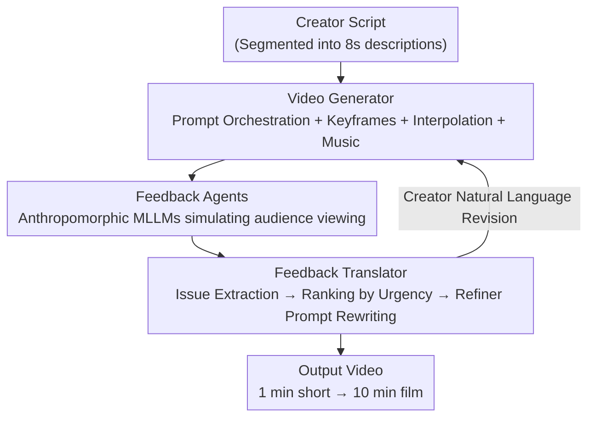

# Bridging Creative Intent and Visual Quality: Creator-Driven Recurrent Video Generation with Agentic Feedback Loops

**Conference**: ICML 2026 (Workshop on Human-AI Co-Creativity)  
**arXiv**: [2606.18591](https://arxiv.org/abs/2606.18591)  
**Code**: To be confirmed  
**Area**: Video Generation  
**Keywords**: Human-AI Collaboration, Video Generation, Multi-Agent Feedback, Anthropomorphic Simulation, Iterative Refinement  

## TL;DR
CHIEF places the creator at the center of the video generation iterative loop. It utilizes "anthropomorphic multi-modal LLM audience agents" to automatically generate subjective film reviews for generated videos, which are then structured into actionable prompt modifications by a translator. This allows even middle school students without filming experience to scale from 1-minute clips to 10-minute short films with complete narratives.

## Background & Motivation
**Background**: Generative AI enables anyone to generate text, images, and video using natural language. AI-generated videos already account for 21% of what new YouTube users see.

**Limitations of Prior Work**: While these videos often have high visual quality, they **lack narrative coherence and creative direction**, a problem that worsens drastically with increased duration. Adapting the "closed-loop self-refinement" framework from code generation to video generation—relying on human-aligned reward models or multiple LLM judges as proxies for automated signals—yields narrow feedback that provides only aggregated preferences or generic criticism, **failing to capture the emotions of real audiences**.

**Key Challenge**: Existing frameworks **inherit the "autonomous closed-loop" assumption** from code generation. Code has objective automated signals like unit tests for unattended iteration. However, video generation is a **subjective creative task**. Judgments on plot, scene, and narrative are inherently subjective, and creators should express their own intent rather than being replaced by an autonomous system.

**Goal**: (1) Replace "autonomous self-refinement" with "human-in-the-loop refinement" led by the creator; (2) Provide diverse automated feedback that captures real audience emotions; (3) Enable scalability from 1-minute to 10-minute durations.

**Key Insight**: The authors leverage recent LLM human simulation capabilities to let LLMs play the role of real audiences from diverse backgrounds to "watch" videos and write subjective critiques—filling the gap left by self-evaluation.

**Core Idea**: A **creator-driven hybrid iterative evaluation framework, CHIEF**: The system generates video $\rightarrow$ anthropomorphic agents simulate audience feedback $\rightarrow$ the creator provides revisions based on this feedback in a recurring loop. Feedback is not presented as cold scores but as subjective reviews in an "audience tone."

## Method

### Overall Architecture
CHIEF is a modular agentic video generation framework consisting of three iterative modules: **Video Generator**, **Feedback Agents**, and **Feedback Translator**. A single loop proceeds as follows: the creator writes a script $\rightarrow$ the Video Generator segments the script into 8-second clips, generates keyframes per segment, interpolates them into clips, and assembles the full video $\rightarrow$ anthropomorphic Feedback Agents "watch" the video and write subjective critiques from diverse audience perspectives $\rightarrow$ the Feedback Translator extracts structured issues from the raw feedback, ranks them, and presents them to the creator $\rightarrow$ the creator provides revision opinions in natural language $\rightarrow$ the translator converts these opinions into prompt modifications for the next round. The creator remains in control, while the Feedback Agents provide "external critiques" from an audience perspective.

### Key Designs

**1. Video Generator: Divide-and-conquer "Keyframe + Interpolation" pipeline with prompt orchestration for consistency**

To address inconsistencies across long video segments, the Video Generator uses a **divide-and-conquer** strategy: the script is segmented into 8-second descriptions, generated individually, and then concatenated. The core is the **Prompt Orchestrator**, which anchors the "same environment and character descriptions" into all segment prompts to ensure cross-segment consistency. For each segment, it constructs keyframe prompts (for text-to-image), segment prompts (for video interpolation), and optional music prompts. The generation is a two-stage process: first, a text-to-image model generates keyframes, then a video model **interpolates between adjacent keyframe pairs** to produce segments. Interpolation naturally promotes cross-clip coherence—each boundary keyframe serves as both the end of one clip and the start of the next. Since segments are generated independently, **any single segment can be regenerated** without affecting the rest. Music is generated by a text-to-audio model providing multiple style options for the creator to select and align (enabled only in the short film case).

**2. Feedback Agents: Anthropomorphic MLLMs simulating real audiences, categorized into "General Audience / Film Critics"**

To solve the issue of reward models/LLM judges being too narrow to capture audience emotion, Feedback Agents use multi-modal LLMs to **watch videos as persona-driven audiences**. Personas are not mere copies of comments; rather, a user's comment history (30 comments per persona) is fed into an LLM to generate a persona, which is then critiqued and iteratively improved by another LLM (inspired by Self-Refine). This captures the user's "tone and style" rather than verbatim sentences. Feedback is provided across two complementary categories: **Audience Persona Agents** (data from YouTube API) focus on local issues and emotions; **Film Critic Agents** (data from Rotten Tomatoes, The Guardian, etc.) focus on narrative structure and cinematic quality. Feedback is generated at both **keyframe and segment granularities**. Since agents run independently, feedback generation can be parallelized across numerous personas. For example, a critic might critique a subway scene as "overly dramatic and lacking the struggle of real crowding," while a general audience member might question "who would use a phone flashlight to read a map in a brightly lit station?"

**3. Feedback Translator: Extracting issues into tuples, ranking, and using a Natural Language Refiner for prompts**

Feeding massive subjective feedback directly into the system would overwhelm it. Thus, the Feedback Translator first performs **Issue Extraction**: an LLM decomposes raw feedback into structured issue tuples containing "description + high-level category (narrative/pacing/character/visual/technical) + urgency (low/medium/high)." The **Aggregation & Ranking** step summarizes issues by category, using the most frequent issues as representatives. Each summary provides one overview sentence + three representative complaints + support count. Feedback is aggregated at both keyframe and segment levels. Finally, the **Refiner** is a natural language prompt rewriting interface that takes the current prompt + feedback to produce a new prompt. This process is entirely in natural language, requiring no prompt engineering knowledge from the creator.

**4. Two Modes: Autonomous Refinement (with Planner) vs. Creator-Gated Film Generation**

CHIEF offers two configurations based on creator involvement. **Autonomous Refinement + Creator Supervision**: Suitable for ~1-minute shorts, where the system automatically handles local issues (physical artifacts, prompt adherence failure) in a closed loop, using the original script as a semantic anchor to prevent drift. A **Planner** (enabled only in this mode) acts like a creator by receiving summary feedback and directing the Refiner via a **two-stage plan**: fix structural issues first (e.g., character positioning), then fix stylistic issues (e.g., lighting consistency), ensuring "structure before style." **Creator-Driven Film Generation**: Suitable for longer, complex videos (e.g., 10-minute films), using **creator-gated refinement**. Every refinement and regeneration requires approval. The consistency anchor shifts from the "script" to the "creator-selected previous keyframe" (fed as a visual reference to the keyframe generator), ensuring character consistency across long arcs. Since regenerating a keyframe could cascade into subsequent scenes, the creator gates this step to prevent unintended chain reactions.

## Key Experimental Results

### Evaluation Setup
The authors **deliberately avoid** standard benchmarks like VBench or VideoReward. These benchmarks evaluate single clips along preset dimensions and reward visual fidelity or aggregated preferences, but **cannot measure whether a video delivers on its narrative intent**. Success criteria for CHIEF are more subjective, focusing on qualitative observations across both configurations.

| Configuration | Scenario | Evaluation Method | Key Findings |
|------|------|----------|----------|
| Autonomous + Supervision | 1-min shorts (Interview / Sausage Heist) | 20 Critics + 30 Audience Agents, 5 rounds | Local visual artifacts were iteratively fixed and refined |
| Creator-Driven Film | 10-min narrative film (by middle schoolers) | Live human audience scoring | CHIEF version **4.1/5** vs Baseline **2.4/5** |

### Qualitative Findings (Keyframe Evolution)

| Case | Baseline Issues | After Refinement |
|------|-----------------|------------------|
| Interview·Keyframe 1 | Empty platform, single subject | Dense commuter crowd + motion blur for rush hour atmosphere |
| Interview·Keyframe 2 | Erroneous phone flashlight effect | Flashlight removed, crowd density increased |
| Interview·Keyframe 3 | Floating bag artifact | Removed in subsequent iterations |
| Film·Core | Generic lab, passive bystander | Tense infiltration, active intervention + danger cues |

### Key Findings
- **Complementary Feedback**: Critics identify script-level/structural predictability issues, while audience personas highlight pragmatic visual coherence issues.
- **Structure Before Style**: The Planner's two-stage strategy ensures structural relations (character positions, object relationships) are corrected before lighting and tone adjustments.
- **HITL is Critical for Long Content**: While autonomous feedback works for short-scale improvements, the narrative arc and emotional progression of a 10-minute film require creator oversight. This justifies the use of creator-gating for long films and autonomous refinement for shorts.

## Highlights & Insights
- **Accurate Diagnosis**: The paper correctly identifies that video generation frameworks have "erroneously inherited the autonomous closed-loop assumption from code generation" despite video being a subjective task.
- **Anthropomorphic Audience Agents**: Using comment histories + Self-Refine to create virtual audiences with a "tone" provides an emotional, real-world perspective rather than a cold score. This approach is transferable to advertising, UX, and content moderation.
- **Structured Issue Tuples + Urgency Ranking**: Converting massive subjective feedback into rankable, filterable, and actionable items is a practical engineering paradigm for automated pipelines.
- **Mode-Dependent Consistency Anchors** (Script-anchored for shorts, keyframe-anchored for long films): Provides a lightweight yet effective solution for the persistent problem of character drift in long videos.

## Limitations & Future Work
- **Heavily Qualitative Evaluation**: Relies on a single live human scoring session (4.1 vs 2.4) with a small sample size. Lack of reproducible quantitative metrics makes cross-comparison difficult.
- As a **workshop paper**, it serves more as a system/case study showcase than a rigorous benchmark study with limited scale.
- High dependency on closed-source APIs (Imagen 4.0, Veo 3.1, Gemini 2.5 Flash), which constrains reproducibility and cost.
- Personas generated from 30 comments may not truly represent "real audiences" and could introduce biases inherent to comment platforms.
- Creator gating improves quality but **increases human labor**, creating tension with the goal of "democratizing creation." Future work could explore automated strategies for on-demand feedback triggering.

## Related Work & Insights
- **vs. Code-style Closed-loop Self-Refine**: Code generation relies on objective signals (unit tests). CHIEF argues video lacks such signals and replaces them with anthropomorphic subjective feedback and HITL.
- **vs. Human-aligned Reward Models (e.g., VideoReward)**: Those frameworks provide narrow aggregated preferences. CHIEF uses multi-perspective critiques simulating audience emotion and structures them into actionable changes.
- **vs. Standard Benchmarks (VBench / VBench 2.0)**: Standard benchmarks evaluate visual fidelity of single clips. CHIEF focuses on creator-led long-video collaboration, arguing benchmarks miss the "narrative intent."

## Rating
- Novelty: ⭐⭐⭐⭐☆ The combination of anthropomorphic audience agents and creator-driven loops is novel, though individual modules utilize existing technologies.
- Experimental Thoroughness: ⭐⭐☆☆☆ Mainly qualitative cases; lacks quantitative and reproducible benchmarks.
- Writing Quality: ⭐⭐⭐⭐☆ Clear motivation, specific module descriptions, and vivid feedback examples.
- Value: ⭐⭐⭐⭐☆ An inspiring framework for Human-AI co-creation in video; implementation and evaluation still require refinement.

<!-- RELATED:START -->

## Related Papers

- [\[ICML 2025\] Data-Juicer Sandbox: A Feedback-Driven Suite for Multimodal Data-Model Co-development](../../ICML2025/video_generation/data-juicer_sandbox_a_feedback-driven_suite_for_multimodal_data-model_co-develop.md)
- [\[ICML 2026\] MotiMotion: Motion-Controlled Video Generation with Visual Reasoning](motimotion_motion-controlled_video_generation_with_visual_reasoning.md)
- [\[CVPR 2026\] ReHyAt: Recurrent Hybrid Attention for Video Diffusion Transformers](../../CVPR2026/video_generation/rehyat_recurrent_hybrid_attention_for_video_diffusion_transformers.md)
- [\[ICLR 2026\] Anchor Frame Bridging for Coherent First-Last Frame Video Generation](../../ICLR2026/video_generation/anchor_frame_bridging_for_coherent_first-last_frame_video_generation.md)
- [\[ICLR 2026\] FilMaster: Bridging Cinematic Principles and Generative AI for Automated Film Generation](../../ICLR2026/video_generation/filmaster_bridging_cinematic_principles_and_generative_ai_for_automated_film_gen.md)

<!-- RELATED:END -->
