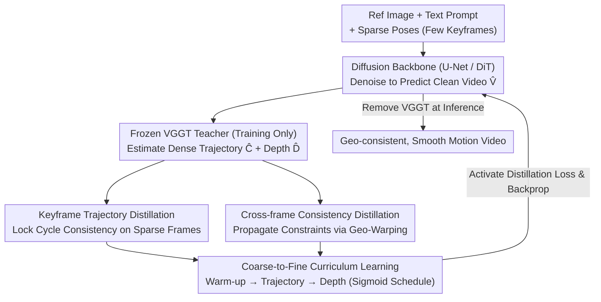

# CamGeo: Sparse Camera-Conditioned Image-to-Video Generation with 3D Geometry Prior

**Conference**: ICML 2026  
**arXiv**: [2605.30895](https://arxiv.org/abs/2605.30895)  
**Code**: TBD  
**Area**: Video Generation / 3D Vision / Knowledge Distillation  
**Keywords**: Image-to-Video Generation, Sparse Camera Conditioning, 3D Geometry Prior, Training-Only Distillation

## TL;DR
CamGeo distills 3D geometric knowledge from a pre-trained 3D video model (VGGT) through **training-only distillation**. By providing supervision signals only during the training phase, the diffusion model generates high-quality videos with geometric consistency and smooth motion under **sparse camera inputs**, while the VGGT is completely removed during inference to maintain efficiency.

## Background & Motivation

**Background**: Controllable image-to-video (I2V) generation under camera conditions has become a significant research direction. Existing methods (CameraCtrl, CamI2V, CPA, etc.) have achieved impressive results in video generation and camera alignment, but they all rely on **dense per-frame camera pose annotations**.

**Limitations of Prior Work**: Obtaining dense camera pose annotations is extremely difficult in practice. Traditional 3D reconstruction pipelines (e.g., COLMAP) tend to produce temporally inconsistent poses when handling rapid motion or complex non-rigid dynamics. Can a model be trained to operate directly under **sparse camera conditions**?

**Key Challenge**: Simple interpolation from sparse inputs faces two fundamental problems. First, models are prone to **pose drift** at frames lacking explicit constraints, producing content that violates physical laws. Second, rigid mathematical interpolation (SLERP) fails to capture the non-linear dynamics of real camera movement (e.g., hand-shake), resulting in stiff and unnatural motion. The root cause is that the model is forced to "hallucinate" 3D geometry while **lacking feedback**.

**Goal**: Achieve high-quality, geometrically consistent image-to-video generation under sparse camera conditions.

**Key Insight**: Distill **geometric priors** from an existing powerful 3D understanding model (VGGT) into the diffusion model.

**Core Idea**: **Training-only distillation**—leveraging VGGT to provide supervision only during the training phase and removing it entirely during inference, thus gaining the benefits of geometric constraints while preserving operational efficiency.

## Method

### Overall Architecture
The method is built upon a pre-trained text-guided image-to-video diffusion model. Given a reference image, a text prompt, and **sparse camera poses** (provided only at a few keyframes), the model synthesizes a high-fidelity video $V = \{I_f\}_{f=1}^F$, where the sparse set $\mathcal{S} \subset \{1, \ldots, F\}$ satisfies $|\mathcal{S}| \ll F$. During training, a frozen VGGT teacher processes the predicted generated video $\hat{V}$ to extract **dense camera trajectories** $\hat{C}$ and depth maps $\hat{D}$. It provides multi-level geometric supervision via two distillation mechanisms, controlled by a coarse-to-fine curriculum learning strategy to determine when these supervisions intervene. During inference, the VGGT is completely removed, allowing the student to generate independently with zero additional overhead.

### Key Designs

**1. Keyframe Trajectory Distillation: Locking cycle consistency on annotated sparse frames**

Under sparse camera conditions, the model is most vulnerable to pose drift and unphysical content at frames without explicit constraints. CamGeo first establishes a self-supervised closed loop at annotated keyframes: for each $s \in \mathcal{S}$, the camera parameters $(\hat{R}_s, \hat{T}_s, \hat{K}_s)$ estimated by VGGT from the generated video are compared with the ground truth. They are aligned using an L1 distillation loss $\mathcal{L}_{\text{traj}} = \sum_{s \in \mathcal{S}}(\|\phi(\hat{R}_s) - \phi(R_s)\|_1 + \|\hat{T}_s - T_s\|_1 + \|\hat{K}_s - K_s\|_1)$, where rotation is represented by quaternions $\phi(\cdot)$ to avoid singularities in matrix parameterization. This constraint ensures that the generated video strictly aligns with user inputs at conditioned frames and prevents catastrophic drift, while the L1 norm provides a more robust optimization landscape, mitigating the impact of estimation errors from the VGGT teacher itself.

**2. Cross-frame Consistency Distillation: Propagating geometric constraints to unannotated intermediate frames**

Anchoring keyframes is insufficient; unannotated intermediate frames must also maintain geometric coherence. CamGeo employs geometry-aware warping for unannotated frames: the depth of frame $f$ is projected onto reference frame $f+k$ via perspective transformation based on relative poses. Simultaneously, a scale-invariant depth transformation is applied to handle the inherent ambiguity of monocular depth. The loss constrains both depth consistency and trajectory smoothness: $\mathcal{L}_{\text{geo}} = \sum_{f, k} \lambda^{(k)} w_{f, f+k}(\|\hat{D}_{f+k} - \mathcal{W}(\hat{D}_f, \Delta\hat{E}_{f, f+k}, \hat{K})\|_1 + \|\Delta(\hat{C}_{f+k}, \hat{C}_f)\|_1)$. Two designs are critical: the span selector $\lambda^{(k)}$ prioritizes larger time intervals to propagate keyframe anchors further and prevent trajectory drift; the dynamic weight $w_{f, f+k} = \exp(\gamma \cdot k) \cdot \exp(-\eta \|\nabla \hat{I}_f\|_1)$ includes a content-adaptive term that reduces penalties in high-gradient or occluded areas, alleviating warping artifacts and balancing constraints with visual quality.

**3. Coarse-to-Fine Curriculum Learning: Gradual introduction of geometric constraints**

Imposing geometric constraints too early can be problematic, as initial generation quality is low, leading to unreliable estimates from VGGT that disrupt optimization. CamGeo introduces constraints gradually through a three-stage curriculum: Stage 1 involves a warm-up, where distillation losses are disabled to allow the model to learn basic visual coherence and temporal continuity using standard diffusion losses. Stage 2 is coarse-grained, activating trajectory distillation to align global structures with camera motion constraints. Stage 3 is fine-grained, progressively introducing depth-based warping consistency losses. The activation timing and the transition from "trajectory to depth" are controlled by smooth sigmoid schedules $\alpha$ and $\beta$. This progression stabilizes convergence and aligns with the diffusion model's nature of generating from global structure to fine details. In ablation studies, the sigmoid schedule reduced RotError from 1.33 to 1.27 compared to a linear schedule.

### Loss & Training
$$\mathcal{L}_{\text{total}} = \mathcal{L}_{\text{diff}} + \alpha \cdot [(1 - \beta) \mathcal{L}_{\text{traj}} + \mathcal{L}_{\text{geo}}]$$
The key innovation lies in **training-only distillation**—the VGGT teacher and auxiliary losses are used only during training and are completely removed during inference.

## Key Experimental Results

### Main Results (RealEstate10K)

| Sparse Ratio | Method | Architecture | RotError ↓ | TransError ↓ | CamMC ↓ | FVD-StyleGAN ↓ | FVD-VideoGPT ↓ |
|-------------|--------|--------------|------------|--------------|---------|----------------|-----------------|
| 1/2 | SVD-Full | U-Net | 1.46 | 6.26 | 6.83 | 122.5 | 131.9 |
| 1/2 | **SVD-CamGeo** | U-Net | **1.34** | **4.89** | **5.49** | **95.9** | **111.0** |
| 1/2 | CogVideoX-Full | DiT | 1.39 | 5.12 | 5.76 | 94.6 | 102.8 |
| 1/2 | **CogVideoX-CamGeo** | DiT | **1.27** | **4.72** | **5.38** | **83.4** | **97.6** |
| 1/4 | SVD-Full | U-Net | 1.55 | 5.82 | 6.47 | 108.8 | 125.9 |
| 1/4 | **SVD-CamGeo** | U-Net | **1.38** | **4.57** | **5.23** | **94.3** | **106.1** |

Linear interpolation methods sometimes perform worse than direct inference from sparse inputs, as rigid geometric interpolation conflicts with the learned diffusion priors.

### Ablation Study

| Component | Configuration | RotError ↓ | CamMC ↓ | Description |
|-----------|---------------|------------|---------|-------------|
| Cross-frame Smoothness | w/o Smoothness | 1.45 | 5.71 | 1/2 Sparsity |
| | Ours | **1.34** | **5.49** | |
| Warm-up | w/o Warm-up | 1.48 | 5.83 | 1/3 Sparsity |
| | Ours | **1.35** | **5.40** | |
| Curriculum Schedule | Linear | 1.33 | 5.53 | 1/2 Sparsity |
| | Ours (Sigmoid) | **1.27** | **5.38** | |

### Key Findings
- The cross-frame smoothness mechanism is essential; its removal leads to a significant decline in all camera metrics.
- Warm-up plays a stabilizing role; its absence causes overall degradation.
- User studies (73 participants × 50 comparison groups) verify a 71.2% preference rate for CamGeo.
- Architecture agnostic—CamGeo consistently improves performance across both U-Net and DiT backbones.

## Highlights & Insights
- **Innovation in Training-Only Distillation**: Breaks the conventional trade-off where using a teacher model necessitates inference costs. By borrowing VGGT for geometric supervision only during training, it achieves zero overhead at inference—a widely applicable paradigm.
- **Deep Insight into Rigid Interpolation**: Reveals a counter-intuitive phenomenon where linearly interpolating camera trajectories can be worse than sparse conditioning, as rigid constraints conflict with the model's learned natural motion priors.
- **Integration of Coarse-to-Fine Curriculum and Diffusion Characteristics**: The progressive optimization serves as an elegant solution to multi-objective optimization problems.
- **Weight Design of Geo-aware Warping**: Dynamic weights balance long-distance anchoring (preventing drift) and content adaptivity (mitigating artifacts), finding a clever equilibrium between constraints and visual quality.

## Limitations & Future Work
- Estimation errors from VGGT as a teacher model can propagate to the student, particularly in complex scenes with inaccurate depth and trajectory estimates.
- There is still an upper limit to the model's extrapolation capability when the sparse ratio is extremely low.
- Performance depends on the quality of the initial reference image and the clarity of text prompts.
- Improvements: Explore more lightweight geometric teacher models or hierarchical distillation to accelerate training; investigate model sensitivity to keyframe positions; extend to more complex geometric transformations (non-rigid motion).

## Related Work & Insights
- **vs CameraCtrl / CamI2V**: These rely on dense camera supervision or simple interpolation, and their performance drops significantly in sparse settings. Ours trains directly under sparse conditions via geometric prior distillation.
- **vs SparseCtrl**: While it handles sparse structural cues (sketches, depth), it does not support explicit camera control. Ours is the first to systematically address the I2V problem under sparse camera conditions.
- **vs Other Distillation Methods**: Standard knowledge distillation is often used for model compression or precision enhancement. Ours pioneers the "training-only distillation" paradigm, where the teacher provides signals only during training, suitable for scenarios requiring external knowledge enhancement without tolerating inference overhead.

## Rating
- Novelty: ⭐⭐⭐⭐⭐  The combination of training-only distillation strategy and coarse-to-fine curriculum is innovative for 3D conditional generation.
- Experimental Thoroughness: ⭐⭐⭐⭐⭐  Includes main dataset + 3 out-of-domain datasets + two architectures + three sparse ratios + detailed ablations + user study.
- Writing Quality: ⭐⭐⭐⭐  Clear logic, precise problem formulation, and detailed methodological explanation.
- Value: ⭐⭐⭐⭐⭐  Addressing I2V under sparse camera conditions is a common real-world requirement; the training-only distillation paradigm has broad potential for transfer.

<!-- RELATED:START -->

## Related Papers

- [\[CVPR 2026\] Geometry-as-context: Modulating Explicit 3D in Scene-consistent Video Generation to Geometry Context](../../CVPR2026/video_generation/geometry-as-context_modulating_explicit_3d_in_scene-consistent_video_generation_.md)
- [\[ICML 2026\] DFSAttn: Dynamic Fine-Grained Sparse Attention for Efficient Video Generation](dfsattn_dynamic_fine-grained_sparse_attention_for_efficient_video_generation.md)
- [\[ICCV 2025\] STiV: Scalable Text and Image Conditioned Video Generation](../../ICCV2025/video_generation/stiv_scalable_text_and_image_conditioned_video_generation.md)
- [\[ICML 2026\] VEDA: Scalable Video Diffusion via Distilled Sparse Attention](veda_scalable_video_diffusion_via_distilled_sparse_attention.md)
- [\[ICML 2026\] Light Forcing: Accelerating Autoregressive Video Diffusion via Sparse Attention](light_forcing_accelerating_autoregressive_video_diffusion_via_sparse_attention.md)

<!-- RELATED:END -->
