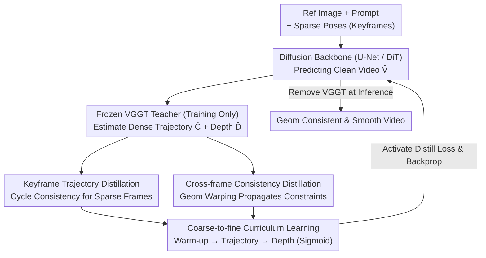

# CamGeo: Sparse Camera-Conditioned Image-to-Video Generation with 3D Geometry Prior

**Conference**: ICML 2026  
**arXiv**: [2605.30895](https://arxiv.org/abs/2605.30895)  
**Code**: To be confirmed  
**Area**: Video Generation / 3D Vision / Knowledge Distillation  
**Keywords**: Image-to-Video Generation, Sparse Camera Conditioning, 3D Geometry Prior, Training-Only Distillation

## TL;DR
CamGeo distills 3D geometric knowledge from a pre-trained 3D video model (VGGT) through **training-only distillation**. By providing supervision signals only during the training phase, the diffusion model generates high-quality videos with geometric consistency and smooth motion under **sparse camera inputs**, while VGGT is completely removed during inference to maintain efficiency.

## Background & Motivation

**Background**: Controllable image-to-video (I2V) generation conditioned on camera parameters has become a significant research direction. Existing methods (CameraCtrl, CamI2V, CPA, etc.) achieve good results in video generation and camera alignment but rely on **dense frame-wise camera pose annotations**.

**Limitations of Prior Work**: Obtaining dense camera pose annotations is extremely difficult in practice. Traditional 3D reconstruction pipelines (such as COLMAP) tend to produce temporally inconsistent poses when handling fast motion or complex non-rigid dynamics. Can models be trained to work directly under **sparse camera conditions**?

**Key Challenge**: Simple interpolation from sparse inputs faces two fundamental problems: first, the model is prone to **pose drift** at frames lacking explicit constraints, producing physically implausible content; second, rigid mathematical interpolation (SLERP) cannot capture the non-linear dynamics (e.g., hand shake) of real camera movement, leading to stiff and incoherent motion. The root cause is that the model is forced to "hallucinate" 3D geometry while **lacking feedback**.

**Goal**: Achieve high-quality, geometrically consistent I2V generation under sparse camera conditions.

**Key Insight**: **Distill geometric priors** from a powerful existing 3D understanding model (VGGT) into the diffusion model.

**Core Idea**: **Training-only distillation**—utilizing VGGT to provide supervision only during the training phase and completely removing it during inference, thus gaining the benefits of geometric constraints while maintaining operational efficiency.

## Method

### Overall Architecture
The system is built upon a pre-trained text-guided image-to-video diffusion model. Given a reference image, text prompt, and **sparse camera poses** (provided only for a few keyframes), the model synthesizes a high-fidelity video $V = \{I_f\}_{f=1}^F$, where the sparse set $\mathcal{S} \subset \{1, \ldots, F\}$ satisfies $|\mathcal{S}| \ll F$. During training, a frozen VGGT teacher processes the predicted generated video $\hat{V}$ to extract **dense camera trajectories** $\hat{C}$ and depth maps $\hat{D}$. Multi-level geometric supervision is provided to the student through two distillation mechanisms, controlled by a coarse-to-fine curriculum learning strategy to determine when each supervision intervenes. During inference, VGGT is entirely removed, and the student generates independently with zero additional overhead.

### Key Designs

**1. Keyframe Trajectory Distillation: Enforcing Cycle Consistency on Labeled Sparse Frames**

Under sparse camera conditions, the model is most prone to pose drift and generating physically inconsistent content at frames without explicit constraints. CamGeo first establishes a self-supervised closed loop at labeled keyframes: for each $s \in \mathcal{S}$, the camera parameters $(\hat{R}_s, \hat{T}_s, \hat{K}_s)$ estimated by VGGT from the generated video are compared with the ground truth. An L1 distillation loss $\mathcal{L}_{\text{traj}} = \sum_{s \in \mathcal{S}}(\|\phi(\hat{R}_s) - \phi(R_s)\|_1 + \|\hat{T}_s - T_s\|_1 + \|\hat{K}_s - K_s\|_1)$ is used for alignment, where rotations are represented by quaternions $\phi(\cdot)$ to avoid singularities in matrix parameterization. This constraint ensures the generated video strictly aligns with user input at conditioned frames and prevents catastrophic drift, while the L1 norm provides a more robust optimization landscape, mitigating the impact of estimation errors from the VGGT teacher.

**2. Cross-frame Consistency Distillation: Propagating Geometric Constraints to Unlabeled Intermediate Frames**

Constraining only keyframes is insufficient; intermediate unlabeled frames must also maintain geometric coherence. CamGeo employs geometry-aware warping for unlabeled frames: the depth of frame $f$ is projected to reference frame $f+k$ via perspective transformation based on relative poses, combined with a scale-invariant depth transform to handle inherent ambiguities in monocular depth. The loss constrains both depth consistency and trajectory smoothness: $\mathcal{L}_{\text{geo}} = \sum_{f, k} \lambda^{(k)} w_{f, f+k}(\|\hat{D}_{f+k} - \mathcal{W}(\hat{D}_f, \Delta\hat{E}_{f, f+k}, \hat{K})\|_1 + \|\Delta(\hat{C}_{f+k}, \hat{C}_f)\|_1)$. Two designs are critical: the span selector $\lambda^{(k)}$ prioritizes larger time intervals to propagate keyframe anchors further and prevent trajectory drift; the dynamic weight $w_{f, f+k} = \exp(\gamma \cdot k) \cdot \exp(-\eta \|\nabla \hat{I}_f\|_1)$ involves a content-adaptive term that reduces penalties in high-gradient or occluded areas, alleviating warping artifacts and balancing constraints with visual quality.

**3. Coarse-to-fine Curriculum Learning: Phased Introduction of Geometric Constraints**

Introducing geometric constraints too early can be problematic, as the initial generation quality is low, making VGGT estimates unreliable and disruptive to optimization. CamGeo introduces constraints via a three-stage curriculum: Stage 1 involves a warm-up, where distillation losses are disabled to learn basic visual and temporal coherence using standard diffusion loss; Stage 2 is coarse-grained, activating trajectory distillation to align global structure with camera motion; Stage 3 is fine-grained, gradually introducing depth-based warping consistency loss. The activation timing and the transition from "trajectory to depth" are controlled by smooth sigmoid schedules $\alpha$ and $\beta$. This progression stabilizes convergence and aligns with the global-to-detail generation nature of diffusion models. Ablations show that sigmoid scheduling reduces RotError from 1.33 to 1.27 compared to linear scheduling.

### Loss & Training
$\mathcal{L}_{\text{total}} = \mathcal{L}_{\text{diff}} + \alpha \cdot [(1 - \beta) \mathcal{L}_{\text{traj}} + \mathcal{L}_{\text{geo}}]$. The key innovation lies in **training-only distillation**, where the VGGT teacher and auxiliary losses are used only during training and removed during inference.

## Key Experimental Results

### Main Results (RealEstate10K)

| Sparse Ratio | Method | Architecture | RotError ↓ | TransError ↓ | CamMC ↓ | FVD-StyleGAN ↓ | FVD-VideoGPT ↓ |
| :--- | :--- | :--- | :--- | :--- | :--- | :--- | :--- |
| 1/2 | SVD-Full | U-Net | 1.46 | 6.26 | 6.83 | 122.5 | 131.9 |
| 1/2 | **SVD-CamGeo** | U-Net | **1.34** | **4.89** | **5.49** | **95.9** | **111.0** |
| 1/2 | CogVideoX-Full | DiT | 1.39 | 5.12 | 5.76 | 94.6 | 102.8 |
| 1/2 | **CogVideoX-CamGeo** | DiT | **1.27** | **4.72** | **5.38** | **83.4** | **97.6** |
| 1/4 | SVD-Full | U-Net | 1.55 | 5.82 | 6.47 | 108.8 | 125.9 |
| 1/4 | **SVD-CamGeo** | U-Net | **1.38** | **4.57** | **5.23** | **94.3** | **106.1** |

Linear interpolation methods perform worse than direct inference from sparse inputs, as rigid geometric interpolation conflicts with learned diffusion priors.

### Ablation Study

| Component | Configuration | RotError ↓ | CamMC ↓ | Description |
| :--- | :--- | :--- | :--- | :--- |
| Cross-frame Smoothness | w/o Smoothness | 1.45 | 5.71 | 1/2 Sparsity |
| | Ours | **1.34** | **5.49** | |
| Warm-up | w/o Warm-up | 1.48 | 5.83 | 1/3 Sparsity |
| | Ours | **1.35** | **5.40** | |
| Curriculum Schedule | Linear | 1.33 | 5.53 | 1/2 Sparsity |
| | Ours (Sigmoid) | **1.27** | **5.38** | |

### Key Findings
- The cross-frame smoothness mechanism is essential; its removal significantly degrades all camera metrics.
- Warm-up provides stability; its absence leads to overall performance deterioration.
- User studies (73 participants × 50 comparison groups) verify a 71.2% preference rate for CamGeo.
- Architecture-agnostic improvement—consistent gains on both U-Net and DiT backbones.

## Highlights & Insights
- **Innovation in Training-Only Distillation**: Challenges the assumption that using a teacher model necessitates inference costs. Borrowing geometric supervision from VGGT only during training yields zero-overhead inference—a paradigm applicable to many fields.
- **Deep Insights into Rigid Interpolation**: Reveals the counter-intuitive phenomenon where linear interpolation of camera trajectories performs worse than sparse conditioning, because rigid constraints conflict with the model's learned natural motion priors.
- **Coupling Curriculum with Diffusion Characteristics**: Progressive optimization elegantly addresses multi-objective optimization problems.
- **Weight Design for Geometry-Aware Warping**: Dynamic weights balance long-distance anchoring (preventing drift) with content adaptivity (mitigating artifacts), finding a clever balance between constraints and visual quality.

## Limitations & Future Work
- Estimation errors from the VGGT teacher propagate to the student, potentially leading to inaccurate depth and trajectory estimates in complex scenes.
- Model extrapolation capability has an upper limit when the sparse ratio is extremely low.
- Methods rely on the quality of initial reference images and the clarity of text prompts.
- Future work: Explore lighter geometric teachers or hierarchical distillation to speed up training; investigate sensitivity to keyframe positioning; extend to more complex geometric transforms (non-rigid motion).

## Related Work & Insights
- **vs. CameraCtrl / CamI2V**: These rely on dense supervision or simple interpolation, with performance dropping significantly in sparse settings; Ours trains directly under sparse conditions via geometric prior distillation.
- **vs. SparseCtrl**: Handles sparse structural cues (sketches, depth) but lacks explicit camera control; Ours is the first to systematically solve I2V under sparse camera conditions.
- **vs. Other Distillation Methods**: Common KD is used for compression or accuracy; This work pioneers the "Training-Only Distillation" paradigm—teachers only provide signals during training and are removed during inference, which is highly portable to scenarios requiring external knowledge without inference overhead.

## Rating
- Novelty: ⭐⭐⭐⭐⭐  The combination of training-only distillation and coarse-to-fine curriculum in 3D conditional generation is innovative.
- Experimental Thoroughness: ⭐⭐⭐⭐⭐  Main dataset + 3 out-of-domain datasets + 2 architectures + 3 sparse ratios + detailed ablations + user study.
- Writing Quality: ⭐⭐⭐⭐  Clear logic, precise problem formulation, and detailed methodological explanation.
- Value: ⭐⭐⭐⭐⭐  Solving sparse camera condition I2V meets a common practical need; the training-only distillation paradigm has broad transfer potential.

<!-- RELATED:START -->

## Related Papers

- [\[ICML 2026\] VideoGPA: Distilling Geometry Priors for 3D-Consistent Video Generation](videogpa_distilling_geometry_priors_for_3d-consistent_video_generation.md)
- [\[CVPR 2026\] Geometry-as-context: Modulating Explicit 3D in Scene-consistent Video Generation to Geometry Context](../../CVPR2026/video_generation/geometry-as-context_modulating_explicit_3d_in_scene-consistent_video_generation_.md)
- [\[ICCV 2025\] STiV: Scalable Text and Image Conditioned Video Generation](../../ICCV2025/video_generation/stiv_scalable_text_and_image_conditioned_video_generation.md)
- [\[ICML 2026\] DFSAttn: Dynamic Fine-Grained Sparse Attention for Efficient Video Generation](dfsattn_dynamic_fine-grained_sparse_attention_for_efficient_video_generation.md)
- [\[ICML 2026\] VEDA: Scalable Video Diffusion via Distilled Sparse Attention](veda_scalable_video_diffusion_via_distilled_sparse_attention.md)

<!-- RELATED:END -->
