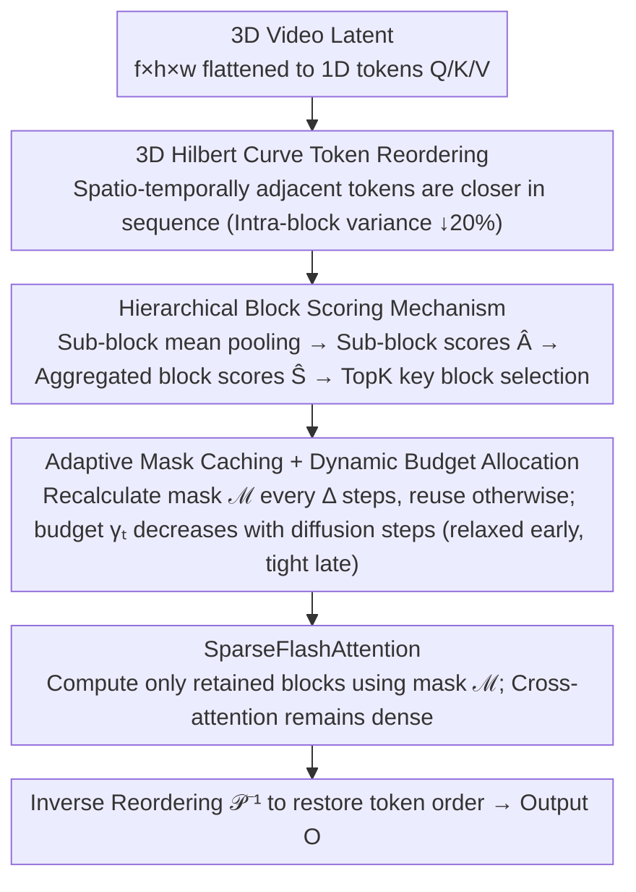

# DFSAttn: Dynamic Fine-Grained Sparse Attention for Efficient Video Generation

**Conference**: ICML 2026  
**arXiv**: [2605.23445](https://arxiv.org/abs/2605.23445)  
**Code**: To be confirmed  
**Area**: Video Generation / Diffusion Models / Model Compression  
**Keywords**: Sparse Attention, Video Generation, Hilbert Curve, Dynamic Masking

## TL;DR
DFSAttn achieves **2.1× end-to-end acceleration** with quality comparable to full attention through **3D Hilbert curve reordering** + **hierarchical block scoring** + **adaptive mask caching**. It addresses the core issue of quality degradation in block-sparse attention at high sparsity ratios (>80%).

## Background & Motivation

**Background**: Video Diffusion Transformers (DiT) achieve high-fidelity video generation via 3D full attention, but quadratic complexity creates a severe computational bottleneck—HunyuanVideo requires approximately 30 minutes on an H100 GPU to generate a 129-frame 720p video. Block-sparse attention is a common direction for reducing complexity as it naturally fits GPU-efficient kernels like FlashAttention.

**Limitations of Prior Work**: Current block-sparse attention methods (static such as radial sparsity, dynamic such as XAttention) suffer from severe quality degradation at high sparsity (80%), failing to maintain generation quality while providing significant acceleration. The root cause is that the **coarse-grained block-level representation** used by existing methods **does not match the dynamic, fine-grained attention sparsity patterns** present in DiT.

**Key Challenge**: There is a conflict between the requirement for block-level sparsity for GPU efficient computation (to align with FlashAttention) and the dynamic, fine-grained sparse features of DiT attention patterns, where numerous local important interactions are scattered throughout the attention map. Applying coarse-grained block operations directly to fine-grained sparsity patterns inevitably loses critical dependencies.

**Goal**: To capture and utilize the fine-grained, dynamic sparsity patterns in DiT while maintaining the efficiency of GPU block-level execution.

**Key Insight**: Two key observations are made: (1) The sparsity patterns of attention maps in DiT exhibit strong heterogeneity across layers and heads; thus, static or fixed sparsity patterns are bound to fail. (2) The effectiveness of block-sparse attention increases monotonically as the diffusion steps evolve (noise dominates early stages, while structure emerges in later stages), suggesting that different sparsity budgets should be adopted at different steps.

**Core Idea**: Through a three-layer progressive design—**Global Hilbert Reordering to amplify inter-block similarity differences** + **Hierarchical Block Scoring to refine semantic heterogeneity** + **Adaptive Mask Caching to dynamically adapt to the diffusion process**—Ours preserves block-level execution efficiency while implicitly inducing fine-grained sparsity.

## Method

### Overall Architecture
DFSAttn seeks to "maintain the GPU efficiency of block-level execution while closely matching the dynamic, fine-grained sparsity patterns in DiT." After encoding the video 3D latent representation into a 1D token sequence, instead of performing block sparsity directly, it first uses a 3D Hilbert curve to reorder spatio-temporally adjacent tokens closer to each other in the sequence. Then, it utilizes hierarchical block scoring to calculate the importance of each block and obtain a sparse mask (updated at fixed intervals and reused in other steps). Finally, the mask is fed into SparseFlashAttention to compute sparse attention before reverting to the original order. The three designs are progressive: reordering amplifies inter-block differences, hierarchical scoring refines intra-block heterogeneity, and caching/budgeting adapts to the diffusion process.

### Key Designs

**1. 3D Hilbert Curve Token Reordering: Making Block Sparsity "Coarse in Appearance, Fine in Essence"**

Standard row-major flattening breaks 3D locality—spatially or temporally adjacent tokens may be far apart in a 1D sequence, filling blocks with cluttered tokens from different regions, which makes block-level representations unreliable. DFSAttn leverages the locality-preserving properties of the Hilbert space-filling curve to map $(f, h, w)$ tokens to 1D via mapping $\mathcal{P}$. Tokens near each other in the original 3D space remain close in the sequence after reordering. Consequently, tokens within the same block mostly originate from a coherent region, while different blocks correspond to different video regions, significantly improving the consistency of block-level representations (intra-block variance is reduced by about 20% in practice). Furthermore, block-level sparsity applied to the reordered sequence results in interconnected fine-grained sparsity patterns when mapped back to the original space—coarse-grained block operations implicitly induce fine-grained sparsity. The reordering overhead is minimal, accounting for only 2% of the runtime for approximately 120K tokens.

**2. Hierarchical Block Scoring Mechanism: Refinement of Semantic Heterogeneity**

Coarse-grained methods average entire block features into a single score, assuming "intra-block semantic uniformity." However, DiT blocks often mix multiple semantic clusters, and averaging dilutes key information. DFSAttn further partitions blocks into smaller sub-blocks (size $B_s$), calculates an attention score matrix $\hat{A}$ at the sub-block level, and aggregates them back into block-level scores $\hat{S}_{uv} = \sum_{i' \in \mathcal{B}_u} \sum_{j' \in \mathcal{B}_v} \hat{A}_{i' j'}$. Thus, each block score reflects both average features and the contributions of multiple semantic centers within the block. Subsequently, the $\gamma M$ key blocks with the highest scores are selected for each query block $\mathcal{B}_u$ to form the mask $\mathcal{M}$. A sub-block size of 16 yields optimal quality (PSNR 29.378) without increasing computational overhead. This finer perspective for estimating block importance bypasses the bottleneck of single-block representations.

**3. Adaptive Sparse Mask Caching + Dynamic Budget Allocation: Adjusting Sparsity with the Diffusion Process**

Recalculating masks at every step is too expensive, yet a fixed mask cannot keep up with the changes in the diffusion process. The observation in this paper is that the effectiveness of block-sparse attention increases monotonically with diffusion steps—noise dominates early with scattered attention, while late stages approach the data manifold with concentrated attention. Accordingly, the sparsity budget is made dynamic: starting at $\gamma_0 = 0.3$, it decreases by 0.1 every 25% of the steps, resulting in an average sparsity rate of about 80% during the final 75% of steps. The mask is recalculated every 25% of the steps and reused in between to save costs, while sparse attention outputs are still recalculated step-by-step to ensure token representations evolve continuously. Compared to fixed schemes, this "relax early, tighten late" budget allocation improves PSNR by 3-4 points at the same latency.

## Key Experimental Results

### Main Results

| Dataset | Metric | Standard | RadialAttention | SVG | SVG2 | **DFSAttn** |
|--------|------|------|----------|------|------|----------|
| Wan2.1 | PSNR ↑ | — | 17.405 | 17.393 | 18.034 | **22.370** |
| Wan2.1 | SSIM ↑ | — | 0.624 | 0.612 | 0.640 | **0.764** |
| Wan2.1 | LPIPS ↓ | — | 0.357 | 0.362 | 0.338 | **0.183** |
| Wan2.1 | Sparsity | 0% | 73.78% | 65.71% | 68.19% | **78.51%** |
| Wan2.1 | Gain ↑ | 1.00× | 1.72× | 1.75× | 1.90× | **1.79×** |
| HunyuanVideo | PSNR ↑ | — | 20.897 | 26.825 | 28.577 | **29.381** |
| HunyuanVideo | SSIM ↑ | — | 0.750 | 0.853 | 0.864 | **0.898** |
| HunyuanVideo | Gain ↑ | 1.00× | 1.74× | 1.92× | 2.20× | **2.10×** |

On Wan2.1, Ours outperforms SVG by 29% (PSNR 22.37 vs 17.39), and on HunyuanVideo, it outperforms SVG2 by 3% (PSNR 29.38 vs 28.58).

### Ablation Study

| Configuration | PSNR ↑ | SSIM ↑ | LPIPS ↓ | Description |
|------|--------|--------|--------|------|
| Raster Scan | 27.794 | 0.874 | 0.124 | Baseline |
| 2D Hilbert (per frame) | 29.265 | 0.893 | 0.090 | Ignores inter-frame coherence |
| 3D Block (Block3D) | 29.156 | 0.897 | 0.090 | Block recursion, destroys global locality |
| **3D Hilbert (Ours)** | **29.378** | **0.901** | **0.087** | Global spatio-temporal preservation, optimal |

### Key Findings
- Global 3D Hilbert reordering surpasses other strategies, demonstrating the necessity of maintaining both spatial and temporal locality.
- DFSAttn significantly outperforms baselines in PSNR / SSIM / LPIPS at high sparsity (> 80%), achieving 1.79× / 2.10× acceleration while maintaining quality.
- VBench composite scores are close to full attention, indicating the overall video quality is fully preserved.

## Highlights & Insights
- **Integration of Theory and Practice**: A theoretical lower bound for the effectiveness of block-sparse attention is derived (Theorem 4.4), explicitly linking block-level selection accuracy to inter-block similarity differences and semantic heterogeneity, which guides the specific forms of the three core designs.
- **Clever Spatial Transformation**: Utilizing the locality-preserving property of the Hilbert curve for global reordering not only amplifies inter-block differences and refines block-level representations but also implicitly induces fine-grained sparsity in the original space—block-level sparsity applied on the reordered sequence manifests as interconnected fine-grained patterns in the original 2D/3D space.
- **Dynamic Adaptation Across Timesteps**: Observing and exploiting the gradual evolution of attention structures during the diffusion process to design an adaptive sparsity budget provides a universal reference for other works using block sparsity to accelerate diffusion models.

## Limitations & Future Work
- The block size is fixed (128) and does not adapt to different video resolutions or frame counts; exploration of dynamic adjustment based on content or resolution is possible.
- Although cross-head heterogeneity is mentioned, masks are shared across all attention heads, potentially losing sparsity characteristics unique to certain heads.
- Synergy with other acceleration techniques (such as the coordination ratio with AdaCache) is not detailed and warrants deeper exploration.

## Related Work & Insights
- **vs. Static Sparsity (RadialAttention)**: Fixed patterns struggle to adapt to dynamic attention; DFSAttn dynamically constructs masks, resulting in a 4.5 point higher PSNR.
- **vs. Coarse-grained Dynamic Methods (SVG2)**: Coarse-grained block averaging is affected by intra-block semantic mixing; DFSAttn hierarchical aggregation refines the estimation, achieving a 1.2 point higher PSNR, further enhanced by Hilbert reordering.
- **vs. Fine-grained Sparse Kernels (FG-Attn)**: FG-Attn designs fine-grained sparse CUDA kernels; DFSAttn employs a kernel-free approach, offering better portability and fewer dependencies.

## Rating
- Novelty: ⭐⭐⭐⭐⭐  Derived from a theoretical lower bound to guide a three-layer progressive design; the combination of Hilbert reordering and hierarchical aggregation is both innovative and practical.
- Experimental Thoroughness: ⭐⭐⭐⭐⭐  Two SOTA models + multi-dimensional metrics + detailed ablations + comparison with three strong baselines; the experiments are rigorous and comprehensive.
- Writing Quality: ⭐⭐⭐⭐⭐  Clear logic, tight integration between theory and method, and highly informative figures.
- Value: ⭐⭐⭐⭐⭐  Addresses practical bottlenecks in video generation; 2.1× acceleration while maintaining quality has direct engineering value, and the theoretical lower bound is highly relevant for other diffusion model acceleration works.

<!-- RELATED:START -->

## Related Papers

- [\[ICML 2026\] VEDA: Scalable Video Diffusion via Distilled Sparse Attention](veda_scalable_video_diffusion_via_distilled_sparse_attention.md)
- [\[ICML 2026\] Light Forcing: Accelerating Autoregressive Video Diffusion via Sparse Attention](light_forcing_accelerating_autoregressive_video_diffusion_via_sparse_attention.md)
- [\[ICML 2026\] Lightning Unified Video Editing via In-Context Sparse Attention](lightning_unified_video_editing_via_in-context_sparse_attention.md)
- [\[ICLR 2026\] DSA: Efficient Inference For Video Generation Models via Distributed Sparse Attention](../../ICLR2026/video_generation/dsa_efficient_inference_for_video_generation_models_via_distributed_sparse_atten.md)
- [\[ICML 2026\] Attention Sparsity is Input-Stable: Training-Free Sparse Attention for Video Generation via Offline Sparsity Profiling and Online QK Co-Clustering](attention_sparsity_is_input-stable_training-free_sparse_attention_for_video_gene.md)

<!-- RELATED:END -->
