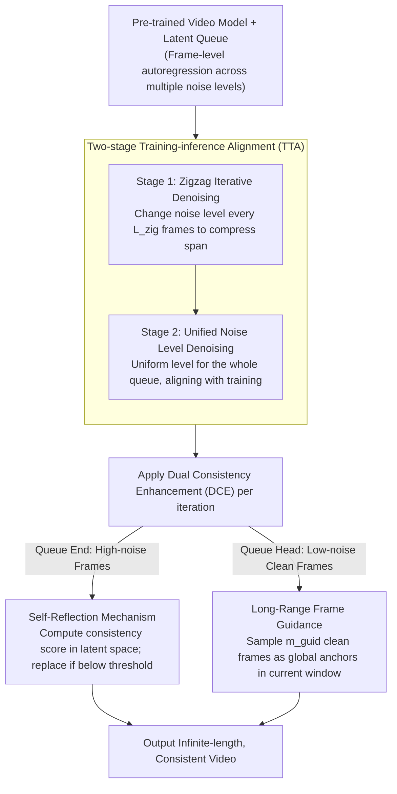

# Enhancing Train-Free Infinite-Frame Generation for Consistent Long Videos

**Conference**: ICML 2026  
**arXiv**: [2605.18233](https://arxiv.org/abs/2605.18233)  
**Code**: TBD  
**Area**: Video Generation / Long Video  
**Keywords**: Long video generation, training-free extension, temporal consistency, autoregressive generation

## TL;DR
MIGA enables base video models to generate **infinite-length** and **highly temporally consistent** videos without training through two core mechanisms: **Two-stage Training-inference Alignment** (TTA) and **Dual Consistency Enhancement** (DCE: self-reflection + long-range frame guidance). Its VBench comprehensive score improves by 2.8% compared to FIFO-Diffusion (97.82 vs 95.02).

## Background & Motivation

**Background**: Current video generation models perform excellently on short videos but are constrained by training length. To meet the demands of long videos in film production and game development, researchers explore two directions: training specialized long video models (Self-Forcing), which requires massive computation; or training-free extension (FreeNoise, FreeLong, FreePCA, FIFO-Diffusion), which operates directly on pre-trained base models.

**Limitations of Prior Work**: (1) The memory consumption of fixed-length extension methods grows linearly with the number of generated frames, making minute-level videos difficult to achieve. (2) FIFO-Diffusion achieves fixed memory consumption and infinite frame generation through frame-level autoregression. However, while the model is trained on latent variables at a single noise level, it must process multiple different noise levels during inference—this **training-inference mismatch** leads to content drift and visual artifacts, lacking explicit modeling for long-term temporal consistency.

**Key Challenge**: How to retain the advantages of the autoregressive framework (fixed memory, infinite frames) while narrowing the noise space discrepancy between training and inference and explicitly enhancing temporal consistency throughout the generation process?

**Goal**: (1) Actively reduce the noise span during inference in a lightweight manner to closer resemble training conditions. (2) Efficiently detect and correct consistency anomalies in early high-noise frames without external evaluators. (3) Enable interaction between distant frames to improve global temporal consistency.

**Key Insight**: (1) The noise queue maintained in the autoregressive framework inevitably covers multiple noise levels, but the span can be narrowed by reducing the rate of noise change. (2) Similarity in the VAE latent space can directly reflect inter-frame differences without external models. (3) The queue structure naturally distinguishes between early and late frames, allowing for targeted application of different consistency enhancement strategies.

**Core Idea**: A two-stage design addresses two major issues—Stage 1 uses a zigzag queue structure to mitigate the rate of noise change (reducing training-inference mismatch), and Stage 2 performs standard denoising at a unified noise level. This is combined with Dual Consistency Enhancement (self-reflection for anomaly detection/correction and long-range frame guidance using generated clean frames).

## Method

### Overall Architecture
MIGA is built upon frame-level autoregressive generation: the standard process maintains a latent variable queue of length $L$, containing frames corresponding to $T$ denoising timesteps, thus achieving fixed memory and infinite frames. However, methods like FIFO-Diffusion suffer from a fundamental flaw—during training, the model only processes latent variables of a single noise level, whereas the inference queue contains multiple noise levels simultaneously. This mismatch causes content drift and artifacts, and there is no explicit long-term consistency modeling. MIGA layers two mechanisms without retraining: Two-stage Training-inference Alignment (TTA) compresses the noise span during inference to approach training conditions, while Dual Consistency Enhancement (Self-Reflection + Long-Range Frame Guidance) handles timely correction of early anomalies and global temporal flow.

### Key Designs

**1. Two-stage Training-inference Alignment (TTA): Flattening diverse noise levels**

The noise queue in an autoregressive framework inevitably spans multiple noise levels, while the model is trained on a single level; this misalignment causes drift. MIGA uses a progressive smoothing approach. Stage 1 adopts a zigzag structure—the noise level changes every $L_{\text{zig}}$ frames rather than every frame. Consequently, the noise span in the $f_0$ frames input to the model reduces from $f_0$ levels to approximately $\lceil f_0 / L_{\text{zig}} \rceil$ levels. After $n$ iterations, $n L_{\text{zig}}$ frames fall into the same noise level $\tau_{e-1}$. Stage 2 then performs standard denoising under this unified level, matching training conditions. This structure does not change the total denoising steps but reduces the noise diversity seen by the model. With almost zero computational cost, it mitigates the primary bottleneck—contributing a 2% overall improvement in ablation studies.

**2. Self-Reflection Mechanism: Early anomaly detection and remediation**

The earlier an anomalous frame is discovered, the less it pollutes subsequent generation. MIGA avoids external evaluators by calculating a consistency score in the latent space: $C_{\text{score}} = \text{mean}_1(\text{mean}_2(q'_{\text{eval}} (q'_{\text{ref}})^\top))$, representing the mean of the cosine similarity matrix between the evaluated and reference frames. A key observation is that the consistency between high-noise frames and final clean frames remains correlated. Thus, detection occurs at the high-noise stage at the end of the queue: if the score drop exceeds a threshold $\delta_{\text{adju}}$, an expanded search is triggered—sampling $n_{\text{samp}}$ Gaussian candidate frames and denoising them using validated leading frames as guidance, finally selecting the most consistent candidate. All judgment and correction happen in the latent space, avoiding the overhead of external models like DINO or repeated VAE decoding.

**3. Long-Range Frame Guidance: Distant frame constraints**

A standard sliding window $q_{\text{input}} = [z^l, \ldots, z^{l + f_0 - 1}]$ only considers local neighbors, saving memory but risking quality drift because temporal consistency requires global information. MIGA uniformly samples $m_{\text{guid}}$ frames from the queue head (generated low-noise clean frames) and prepends them to the current window: $q_{\text{input}} = [z^1, \ldots, z^{m_{\text{guid}}}, z^l, \ldots, z^{l + f_0 - m_{\text{guid}} - 1}]$ (when $l > m_{\text{guid}}$). These clean prefixes act as global anchors for every window denoising, maintaining fixed memory while imposing global constraints. It complements Self-Reflection—one handles local early correction, and the other ensures global continuity.

## Key Experimental Results

### Main Results (VBench Benchmark)

| Method | Infinite | Subject Consistency | Background Consistency | Motion Smoothness | Temporal Flickering | Overall Score |
|------|--------|--------|--------|--------|--------|--------|
| VideoCrafter2-FreePCA | ✗ | 93.57 | 95.24 | 93.73 | 91.27 | 93.45 |
| VideoCrafter2-FreeLong | ✗ | 95.72 | 96.42 | 98.38 | 97.28 | 96.95 |
| VideoCrafter2-FIFO-Diffusion | ✓ | 92.92 | 95.01 | 97.19 | 94.94 | 95.02 |
| VideoCrafter2-ScalingNoise | ✓ | 94.29 | 95.52 | 97.86 | 96.12 | 95.95 |
| **VideoCrafter2-MIGA (Ours)** | ✓ | **97.66** | **96.99** | **98.60** | **98.03** | **97.82** |
| Wan2.1-FIFO-Diffusion | ✓ | 92.67 | 93.37 | 98.03 | 97.09 | 95.29 |
| **Wan2.1-MIGA (Ours)** | ✓ | **96.46** | **95.50** | **98.85** | **98.14** | **97.24** |

Compared to FIFO-Diffusion, MIGA achieves a +4.74% gain in subject consistency on VideoCrafter2.

### Ablation Study

| TTA | DCE | S.C. | B.C. | M.S. | T.F. | O.S. |
|:---:|:---:|:---:|:---:|:---:|:---:|:---:|
| ✗ | ✗ | 92.92 | 95.01 | 97.19 | 94.94 | 95.02 |
| ✓ | ✗ | 96.74 | 96.75 | 97.57 | 97.12 | 97.05 |
| ✗ | ✓ | 96.10 | 96.47 | 97.88 | 96.56 | 96.75 |
| ✓ | ✓ | 97.66 | 96.99 | 98.60 | 98.03 | 97.82 |

The two core mechanisms independently contribute approximately a 2% gain in the overall score (TTA +2.03%, DCE +1.73%).

### Key Findings
- TTA provides the largest individual benefit—the two-stage alignment mechanism is the most significant contribution, improving the baseline by 2% alone, indicating that training-inference mismatch is indeed the main bottleneck of the autoregressive framework.
- DCE is highly complementary—its combination with TTA produces a synergistic effect, with the total gain exceeding the sum of parts (4.8% > 2.0% + 1.7%).
- Consistency across models—MIGA benefits two different base models (animation vs. realistic).
- Significant performance advantage on NarrLV—in complex narrative tasks (scene changes, object attribute transitions), MIGA shows a larger advantage over FIFO-Diffusion (+2.3-12.5%).

## Highlights & Insights
- **Progressive smoothing of the noise space is clever**: Without changing the compute graph or requiring retraining, it mitigates training-inference mismatch simply by altering the input queue structure. This "lightweight adaptation" could inspire other autoregressive generation tasks.
- **Self-consistency score design avoids computational traps**: Utilizing the correlation between high-noise and clean frames in the latent space avoids frequent VAE decoding and external evaluator calls, a reusable engineering trick.
- **Complementary dual-mechanism design**: Self-reflection focuses on timely correction of early anomalies (local constraint), while long-range guidance ensures global temporal flow (global constraint)—this local-global combination is transferable to other tasks requiring long-term dependency (multimodal generation, long text translation).

## Limitations & Future Work
- Different hyper-parameters are used for the two models; general hyper-parameter rules remain to be explored.
- The Self-Reflection mechanism detects consistency by comparing adjacent frames, which may be less sensitive to fast content changes (intense motion or scene cuts).
- The choice of $m_{\text{guid}}$ in long-range guidance lacks a principled design and resides as an empirical value.
- Improvements: Adaptive hyper-parameter strategies; extending Self-Reflection to multi-scale anomaly detection; researching mechanisms to dynamically determine $m_{\text{guid}}$.

## Related Work & Insights
- **vs. FIFO-Diffusion**: Both use frame-level autoregression + fixed memory, but MIGA improves in two key areas—actively narrowing the noise span for training-inference alignment and introducing explicit temporal consistency modeling.
- **vs. ScalingNoise**: Both attempt search-based optimization at inference, but ScalingNoise performs consistency evaluation and search for every timestep, incurring high overhead; MIGA's Self-Reflection is triggered only upon anomaly detection, and ScalingNoise relies on external DINO models while MIGA works entirely within the latent space.
- **vs. FreeLong / FreePCA**: These are finite-frame extensions that cannot generate minute-level videos; MIGA's advantage as an infinite-frame method is its constant memory and no upper limit on frame count.

## Rating
- Novelty: ⭐⭐⭐⭐ 
- Experimental Thoroughness: ⭐⭐⭐⭐⭐ 
- Writing Quality: ⭐⭐⭐⭐ 
- Value: ⭐⭐⭐⭐⭐ 

<!-- RELATED:START -->

## Related Papers

- [\[ICML 2026\] Explainable Forensics of Manipulated Segments in Untrimmed Long Videos](explainable_forensics_of_manipulated_segments_in_untrimmed_long_videos.md)
- [\[CVPR 2026\] TempoMaster: Efficient Long Video Generation via Next-Frame-Rate Prediction](../../CVPR2026/video_generation/tempomaster_efficient_long_video_generation_via_next-frame-rate_prediction.md)
- [\[CVPR 2026\] Free-Lunch Long Video Generation via Layer-Adaptive O.O.D Correction](../../CVPR2026/video_generation/free-lunch_long_video_generation_via_layer-adaptive_ood_correction.md)
- [\[AAAI 2026\] FilmWeaver: Weaving Consistent Multi-Shot Videos with Cache-Guided Autoregressive Diffusion](../../AAAI2026/video_generation/filmweaver_weaving_consistent_multi-shot_videos_with_cache-guided_autoregressive.md)
- [\[CVPR 2025\] StreamingT2V: Consistent, Dynamic, and Extendable Long Video Generation from Text](../../CVPR2025/video_generation/streamingt2v_consistent_dynamic_and_extendable_long_video_generation_from_text.md)

<!-- RELATED:END -->
