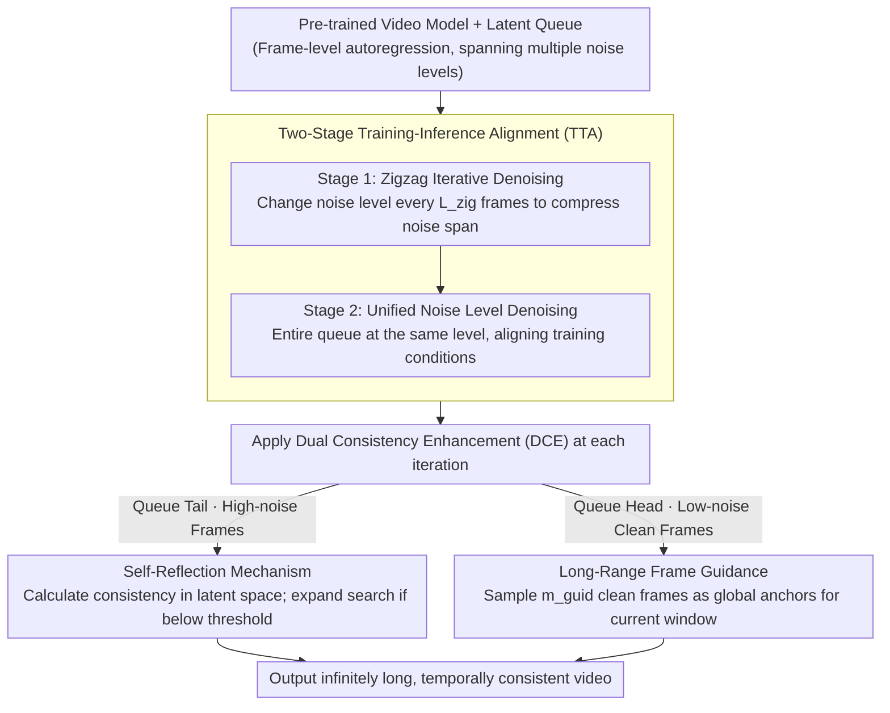

# Enhancing Train-Free Infinite-Frame Generation for Consistent Long Videos

**Conference**: ICML 2026  
**arXiv**: [2605.18233](https://arxiv.org/abs/2605.18233)  
**Code**: To be confirmed  
**Area**: Video Generation / Long Video  
**Keywords**: Long Video Generation, Training-free Extension, Temporal Consistency, Autoregressive Generation

## TL;DR
MIGA enables base video models to generate **infinitely long** and **highly temporally consistent** videos without training through two core mechanisms: **Two-Stage Training-Inference Alignment** (TTA) and **Dual Consistency Enhancement** (DCE: Self-Reflection + Long-Range Frame Guidance). It achieves a 2.8% improvement in VBench composite score compared to FIFO-Diffusion (97.82 vs 95.02).

## Background & Motivation

**Background**: Current video generation models perform excellently on short videos but are constrained by training length. To meet the demand for long videos in film production and game development, researchers explore two directions: training specialized long-video models (Self-Forcing), which requires massive computation, and training-free extension (FreeNoise, FreeLong, FreePCA, FIFO-Diffusion), which operates directly on pre-trained base models.

**Limitations of Prior Work**: (1) Memory consumption of fixed-length extension methods grows linearly with the number of generated frames, making minute-level videos difficult to achieve; (2) FIFO-Diffusion achieves fixed memory consumption and infinite frame generation through frame-level autoregression, but it suffers from **training-inference mismatch**. While the model handles latents at a single noise level during training, it must process multiple different noise levels during inference, leading to content drift, visual artifacts, and a lack of explicit long-term temporal consistency modeling.

**Key Challenge**: How to narrow the discrepancy in noise space between training and inference while explicitly enhancing temporal consistency throughout the generation process, all while retaining the advantages of an autoregressive framework (fixed memory, infinite frames)?

**Goal**: (1) Proactively reduce the noise span during inference to closer match training conditions in a lightweight manner; (2) Efficiently detect and correct consistency anomalies in early high-noise frames without external evaluators; (3) Facilitate interaction between distant frames to improve global temporal consistency.

**Key Insight**: (1) The noise queue maintained in the autoregressive framework necessarily covers multiple noise levels, which can be narrowed by reducing the rate of noise change; (2) Similarity in the VAE latent space can directly reflect inter-frame differences without external models; (3) The queue structure naturally distinguishes between early and late frames, allowing for targeted consistency enhancement strategies.

**Core Idea**: A two-stage design addresses both major issues. Stage 1 uses a zigzag queue structure to slow the noise change rate (reducing training-inference mismatch), and Stage 2 unifies noise levels for standard denoising. This is combined with Dual Consistency Enhancement (Self-Reflection for anomaly detection/correction and Long-Range Frame Guidance using generated clean frames).

## Method

### Overall Architecture
MIGA is built upon frame-level autoregressive generation. The standard process maintains a latent variable queue of length $L$ containing frames at $T$ different denoising timesteps, ensuring fixed memory and infinite frames. However, methods like FIFO-Diffusion suffer from training-inference mismatch. MIGA layers two mechanisms without retraining: Two-Stage Training-Inference Alignment (TTA) compresses the noise span during inference to approach training conditions, while Dual Consistency Enhancement (DCE: Self-Reflection + Long-Range Guidance) handles both early anomaly correction and global temporal smoothness.

### Key Designs

**1. Two-Stage Training-Inference Alignment (TTA): Flattening diverse noise levels in the queue**

The noise queue in autoregressive frameworks inevitably spans multiple noise levels, causing drift when the model is only trained on single levels. MIGA addresses this through a progressive smoothing strategy. Stage 1 adopts a zigzag structure: instead of changing the noise level every frame, it changes every $L_{\text{zig}}$ frames. This reduces the noise span in the input $f_0$ frames from $f_0$ levels to approximately $\lceil f_0 / L_{\text{zig}} \rceil$. After $n$ iterations, $n L_{\text{zig}}$ frames will reach the same noise level $\tau_{e-1}$. Stage 2 then performs standard denoising under this unified level, aligning with training conditions. This structure does not change the total denoising steps and carries nearly zero computational cost, yet it significantly mitigates the mismatch bottleneck—contributing a ~2% overall improvement.

**2. Self-Reflection: Early anomaly detection and remediation in high-noise stages**

The earlier an anomalous frame is discovered, the less it contaminates subsequent generation. MIGA avoids external evaluators by calculating a consistency score $C_{\text{score}} = \text{mean}_1(\text{mean}_2(q'_{\text{eval}} (q'_{\text{ref}})^\top))$ in the latent space, representing the mean cosine similarity between evaluation and reference frames. Since consistency scores of high-noise frames correlate with final clean frames, detection occurs at the queue tail: if the score drop exceeds a threshold $\delta_{\text{adju}}$, an extended search is triggered. This samples $n_{\text{samp}}$ Gaussian-initialized candidates, denoises them using valid preceding frames as guidance, and replaces the original frame with the most consistent candidate. All processing occurs in the latent space, avoiding the overhead of external models like DINO or repeated VAE decoding.

**3. Long-Range Frame Guidance: Enabling mutual constraints between distant frames**

Standard sliding windows $q_{\text{input}} = [z^l, \ldots, z^{l + f_0 - 1}]$ only consider local neighbors, which saves memory but risks quality drift as temporal consistency requires global information. During each denoising step, MIGA uniformly samples $m_{\text{guid}}$ frames from the queue head (already generated low-noise clean frames) and prepends them to the current window: $q_{\text{input}} = [z^1, \ldots, z^{m_{\text{guid}}}, z^l, \ldots, z^{l + f_0 - m_{\text{guid}} - 1}]$ (when $l > m_{\text{guid}}$). These clean prefixes serve as global anchors, maintaining fixed memory while providing global constraints. This complements Self-Reflection—one for local early correction and the other for global temporal coherence—resulting in a gain exceeding the sum of individual components.

## Key Experimental Results

### Main Results (VBench Benchmark)

| Method | Infinite | Subject Consist. | Background Consist. | Motion Smooth. | Temp. Flickering | Total Score |
|------|--------|--------|--------|--------|--------|--------|
| VideoCrafter2-FreePCA | ✗ | 93.57 | 95.24 | 93.73 | 91.27 | 93.45 |
| VideoCrafter2-FreeLong | ✗ | 95.72 | 96.42 | 98.38 | 97.28 | 96.95 |
| VideoCrafter2-FIFO-Diffusion | ✓ | 92.92 | 95.01 | 97.19 | 94.94 | 95.02 |
| VideoCrafter2-ScalingNoise | ✓ | 94.29 | 95.52 | 97.86 | 96.12 | 95.95 |
| **VideoCrafter2-MIGA** | ✓ | **97.66** | **96.99** | **98.60** | **98.03** | **97.82** |
| Wan2.1-FIFO-Diffusion | ✓ | 92.67 | 93.37 | 98.03 | 97.09 | 95.29 |
| **Wan2.1-MIGA** | ✓ | **96.46** | **95.50** | **98.85** | **98.14** | **97.24** |

Compared to FIFO-Diffusion, MIGA achieves a Gain of +4.74% in Subject Consistency on VideoCrafter2.

### Ablation Study

| TTA | DCE | S.C. | B.C. | M.S. | T.F. | O.S. |
|---------|---------|-------|-------|-------|-------|-------|
| ✗ | ✗ | 92.92 | 95.01 | 97.19 | 94.94 | 95.02 |
| ✓ | ✗ | 96.74 | 96.75 | 97.57 | 97.12 | 97.05 |
| ✗ | ✓ | 96.10 | 96.47 | 97.88 | 96.56 | 96.75 |
| ✓ | ✓ | 97.66 | 96.99 | 98.60 | 98.03 | 97.82 |

The two core mechanisms contribute independently to a ~2% improvement in total score (TTA +2.03%, DCE +1.73%).

### Key Findings
- TTA provides the largest individual benefit, identifying training-inference mismatch as the primary bottleneck of the autoregressive framework.
- DCE shows strong complementarity; combined with TTA, it produces a synergistic effect where the total Gain exceeds the sum of parts (4.8% > 2.0% + 1.7%).
- Consistency across models is demonstrated as both animation and realistic base models benefit from MIGA.
- Significant performance advantages are found in the NarrLV benchmark for complex narrative tasks (scene changes, attribute transitions), where MIGA outperforms FIFO-Diffusion by +2.3-12.5%.

## Highlights & Insights
- **Progressive smoothing of noise space**: Aligning conditions by simply modifying the input queue structure without retraining or changing the computation graph is an elegant "lightweight adaptation" that may inspire other autoregressive tasks.
- **Self-consistency scoring avoids computational traps**: Leveraging the correlation between high-noise and clean frames in the latent space avoids frequent VAE decoding and external evaluator calls, a reusable engineering trick.
- **Complementary local-global design**: Self-reflection focuses on early local correction, while long-range guidance ensures global temporal flow. This pairing is transferable to other tasks requiring long-term dependency (multimodal generation, long text translation).

## Limitations & Future Work
- Different base models require different hyperparameters; universal rules for hyperparameter selection remain to be explored.
- Self-reflection relies on adjacent frame comparisons, which may be less sensitive to rapid content changes like intense action or abrupt scene cuts.
- The choice of $m_{\text{guid}}$ in long-range guidance lacks a principled design and currently relies on empirical values.
- Future work: Adaptive hyperparameter strategies; extending self-reflection to multi-scale anomaly detection; mechanisms for dynamically determining $m_{\text{guid}}$.

## Related Work & Insights
- **vs FIFO-Diffusion**: Both use frame-level autoregression and fixed memory, but MIGA improves by actively narrowing the noise span and introducing explicit temporal consistency modeling.
- **vs ScalingNoise**: Both use search-based optimization during inference, but ScalingNoise involves high computational costs for every timestep; MIGA's self-reflection triggers search only when anomalies are detected and works entirely in the latent space.
- **vs FreeLong / FreePCA**: These are fixed-frame extension methods incapable of minute-level video generation; MIGA's advantage as an infinite-frame method lies in constant memory and no upper limit on frame count.

## Rating
- Novelty: ⭐⭐⭐⭐
- Experimental Thoroughness: ⭐⭐⭐⭐⭐
- Writing Quality: ⭐⭐⭐⭐
- Value: ⭐⭐⭐⭐⭐

<!-- RELATED:START -->

## Related Papers

- [\[ICML 2026\] Explainable Forensics of Manipulated Segments in Untrimmed Long Videos](explainable_forensics_of_manipulated_segments_in_untrimmed_long_videos.md)
- [\[CVPR 2025\] StreamingT2V: Consistent, Dynamic, and Extendable Long Video Generation from Text](../../CVPR2025/video_generation/streamingt2v_consistent_dynamic_and_extendable_long_video_generation_from_text.md)
- [\[CVPR 2026\] TempoMaster: Efficient Long Video Generation via Next-Frame-Rate Prediction](../../CVPR2026/video_generation/tempomaster_efficient_long_video_generation_via_next-frame-rate_prediction.md)
- [\[CVPR 2026\] Free-Lunch Long Video Generation via Layer-Adaptive O.O.D Correction](../../CVPR2026/video_generation/free-lunch_long_video_generation_via_layer-adaptive_ood_correction.md)
- [\[ICLR 2026\] Stable Video Infinity: Achieving Infinite-Length Video Generation via "Error Recycling"](../../ICLR2026/video_generation/stable_video_infinity_infinite-length_video_generation_with_error_recycling.md)

<!-- RELATED:END -->
