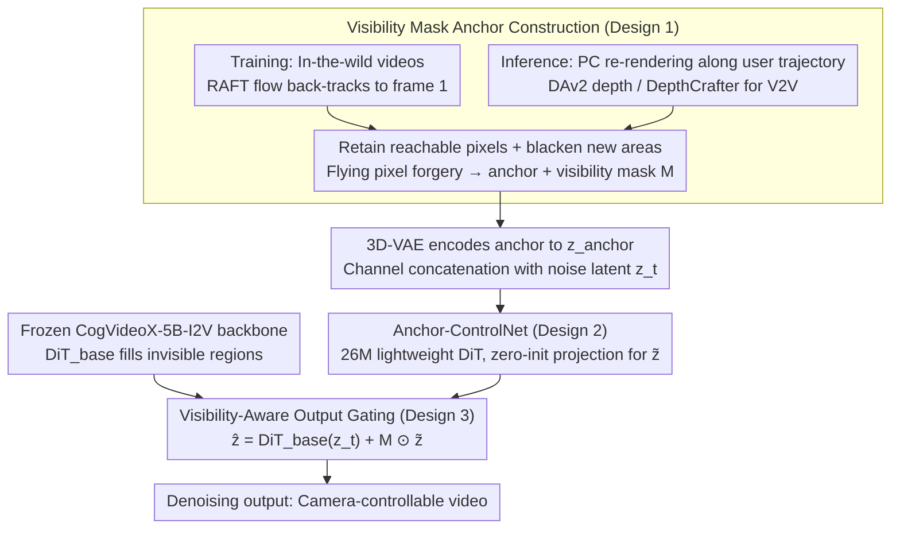

# EPiC: Efficient Video Camera Control Learning with Precise Anchor-Video Guidance

**Conference**: ICML 2026  
**arXiv**: [2505.21876](https://arxiv.org/abs/2505.21876)  
**Code**: https://zunwang1.github.io/Epic (Project Page)  
**Area**: Video Generation  
**Keywords**: anchor video, visibility mask, Anchor-ControlNet, I2V/V2V camera control, lightweight adaptation

## TL;DR
EPiC utilizes a "first-frame visibility mask" approach to construct pixel-aligned anchor videos directly from arbitrary in-the-wild videos. By pairing this with Anchor-ControlNet—comprising only 26M parameters (<1% of the backbone) and operating exclusively on visible regions—Ours achieves SOTA I2V camera control precision and zero-shot generalization to V2V. This is accomplished while freezing the CogVideoX-5B-I2V backbone, using only 5K videos and 500 training steps.

## Background & Motivation
**Background**: Mainstream camera control for controllable video generation follows two paths: one feeds camera parameters (Plücker embedding, extrinsic matrices) directly into the VDM as conditions (CameraCtrl, AC3D); the other lifts a single image to a point cloud, re-renders an "anchor video" according to target trajectories, and feeds it as a structural prior to the diffusion model (ViewCrafter, Gen3C, TrajectoryCrafter, Uni3C). The latter typically offers better camera precision due to explicit geometric guidance.

**Limitations of Prior Work**: The anchor video approach faces two major bottlenecks. First, anchors are rendered from estimated point clouds (DAv2, MoGe) and estimated camera trajectories (COLMAP), leading to pixel-level misalignment between the anchor and the source video in visible regions (empirical PSNR is only 16 dB). The model must simultaneously fix misalignment and fill invisible regions, confounding the learning objective. Second, to align these errors, existing methods often require extensive backbone modifications (full fine-tuning or heavyweight modules) and are restricted to static multi-view data with precise camera annotations (e.g., RealEstate10K), resulting in poor generalization to dynamic in-the-wild videos.

**Key Challenge**: A trade-off exists between the "3D information richness" of the anchor video and its "pixel alignment with the source video." Attempting to include complete point cloud re-rendering information exacerbates misalignment; seeking perfect alignment often requires abandoning explicit 3D. Prior methods favor the former, leaving the burden on the model.

**Goal**: (1) Achieve pixel-level alignment between training anchors and source videos in visible regions without relying on camera/point cloud estimation. (2) Inject anchor signals into a frozen VDM using minimal learnable parameters. (3) Retain precise 3D point cloud trajectory control during inference.

**Key Insight**: The "geometric properties" of an anchor video only require information regarding "which pixels remain visible relative to the first frame and which are occluded or moved out of view." Actual 3D reconstruction is not strictly necessary for training. By using dense optical flow to back-track pixels from each frame to the first frame—preserving reachable pixels and blacking out unreachable ones—one can synthesize an anchor that is geometrically equivalent to point cloud rendering but perfectly aligned with the source video.

**Core Idea**: Replace "hard-to-align 3D re-rendering" with "easy-to-align visibility masks" during anchor construction. The ControlNet is tasked solely with copying visible regions, while invisible regions are handled by the frozen base model. This compresses the ControlNet's task from "fix misalignment + fill occlusion" to purely "copy."

## Method

### Overall Architecture
EPiC is based on CogVideoX-5B-I2V (DiT-style, 3D full self-attention). The training pipeline consists of two stages: (1) Synthesizing training anchors from arbitrary in-the-wild videos using visibility masks (no camera/PC required). (2) Encoding the anchor via 3D-VAE, concatenating it with noise latents along the channel dimension, and feeding it into a 26M Anchor-ControlNet. The output is spatially gated by the visibility mask $M$ and added to the corresponding base DiT layers, while the backbone remains frozen. During inference, the process is reversed: anchors are rendered from real point clouds along user-defined trajectories. The Anchor-ControlNet's visibility gating isolates 3D reconstruction misalignments and flying pixels. Point cloud masking of the foreground allows switching between "static camera control" and "dynamic foreground" modes. V2V mode utilizes dynamic point clouds estimated by DepthCrafter.

### Key Designs

**1. Visibility Mask Anchor Construction: Synthesizing pixel-aligned anchors via optical flow visibility**

The primary bottleneck of the anchor video route is the pixel-level misalignment (PSNR $\approx$ 16 dB) caused by estimation errors in point clouds and trajectories. EPiC resolves this by recognizing that the essential geometric information needed for an anchor is identifying visible vs. occluded/out-of-view pixels. Using RAFT for dense optical flow, each pixel at frame $t$ is back-tracked to frame 1. Only stable pixels are preserved; others are blackened to generate a binary visibility mask $M_t$. The resulting anchor is pixel-consistent with the source in visible regions (PSNR improves from 16.01 to 40.12 dB). During training, "flying pixel forgery" is used—randomly drawing light-colored dashed rays in visible regions with colors sampled from the first frame—to simulate point cloud artifacts and narrow the training-inference gap. This eliminates the misalignment burden and allows training on datasets like Panda-70M without camera annotations.

**2. Anchor-ControlNet: Downsizing the adapter as anchors align**

To inject anchor signals, EPiC utilizes a lightweight 26M DiT adapter (<1% of the backbone). It consists of a single DiT block with hidden dimensions reduced from 3072 to 256 (~8%), connected only to the first 25% of the layers. The anchor video $\mathbf{A}$ is encoded into $\mathbf{z}_{\text{anchor}}$ via 3D-VAE, concatenated with noise latent $\mathbf{z}_t$, and patchified before entering the DiT-ctrl. The output is zero-initialized and projected back to 3072 dimensions: $\tilde{\mathbf{z}} = \text{Proj}(\text{DiT}_{\text{ctrl}}([\mathbf{z}_t, \mathbf{z}_{\text{anchor}}]))$. Only these 26M parameters are updated. This "light, shallow, and narrow" configuration is feasible because the alignment task was simplified in the previous step; higher anchor alignment reduces the required capacity of the ControlNet.

**3. Visibility-Aware Output Gating: Decoupling copying and filling**

To strictly separate responsibilities, EPiC downsamples the visibility mask $M \in \{0,1\}^{T'\times h\times w}$ to latent resolution and applies hard gating: $\hat{\mathbf{z}} = \text{DiT}_{\text{base}}(\mathbf{z}_t) + M \odot \tilde{\mathbf{z}}$. The ControlNet handles copying visible content, while the base model fills invisible regions. This has three benefits: point cloud artifacts (flying pixels/tearing) in invisible regions are gated out; the training objective is simplified to pure "replication," accelerating convergence; and during inference, masking out foreground objects (using GroundedSAM) allows them to move freely while the rest of the scene follows the camera trajectory.

### Loss & Training
Standard latent diffusion denoising loss is used: $\mathcal{L}_{\text{denoise}} = \mathbb{E}_{\mathbf{z}_0, t, \boldsymbol{\epsilon}, c}[\|\boldsymbol{\epsilon}_\theta(\mathbf{z}_t, t, c) - \boldsymbol{\epsilon}\|_2^2]$, where condition $c$ includes text and anchors. Only the 26M Anchor-ControlNet is updated. Using 5,000 video segments from Panda-70M, batch size 16, 8×A100-40G, 500 steps (~15 GPU hours). AdamW optimizer, lr=$2\times 10^{-4}$. Inference uses CFG 6.0. I2V inference utilizes DAv2 for depth; V2V uses DepthCrafter for dynamic point clouds per frame.

## Key Experimental Results

### Main Results
Evaluated on the RealCam-Vid test set (500 videos each from RealEstate10K and MiraData). Metrics include RotErr, TransErr, and CamMC (lower is better, $10^{-2}$ scale), and VBench Total Quality.

| Dataset | Method | RotErr ↓ | TransErr ↓ | CamMC ↓ | Total Quality ↑ |
|--------|------|----------|------------|---------|-----------------|
| RE10K | CameraCtrl | 1.12±0.44 | 1.78±0.93 | 2.36±1.01 | 78.35 |
| RE10K | AC3D† | 0.86±0.37 | 1.50±0.82 | 1.97±0.86 | 82.63 |
| RE10K | ViewCrafter | 0.50±0.16 | 1.05±0.32 | 1.35±0.40 | 81.18 |
| RE10K | Gen3C | 0.45±0.13 | 0.99±0.22 | 1.35±0.30 | 82.27 |
| RE10K | **EPiC (Ours)** | **0.40±0.11** | **0.86±0.18** | **1.17±0.23** | **82.63** |
| MIRA | ViewCrafter | 1.16±0.34 | 2.95±0.98 | 3.42±1.04 | 79.87 |
| MIRA | Gen3C | 0.81±0.24 | 2.05±0.77 | 2.75±0.72 | 80.50 |
| MIRA | **EPiC (Ours)** | **0.66±0.22** | **1.78±0.67** | **2.10±0.60** | **82.89** |

Ours ranks first across all 6 camera/quality metrics with the lowest standard deviation. Zero-shot V2V evaluation on Kubric-4D achieves PSNR 19.65 / SSIM 0.60, comparable to methods specifically trained for V2V like GCD (19.72/0.59) and Gen3C (19.69/0.61), despite using an order of magnitude less data and compute.

### Ablation Study

| Configuration | Anchor PSNR ↑ | RotErr ↓ | TransErr ↓ | CamMC ↓ |
|------|---------------|----------|------------|---------|
| PC anchor (1500 iters) | 16.01 | 0.60±0.20 | 1.07±0.39 | 1.45±0.62 |
| 50% PC + 50% Mask (1000 iters) | 28.07 | 0.48±0.15 | 0.95±0.28 | 1.29±0.40 |
| **Masking anchor (500 iters)** | **40.12** | **0.40±0.11** | **0.86±0.18** | **1.17±0.23** |

### Key Findings
- **Anchor alignment correlates with precision**: Anchor PSNR (16→28→40 dB) correlates positively with camera metrics, establishing anchor alignment as the ceiling for camera control rather than 3D information itself.
- **Forgery and Gating are essential**: Removing flying pixel forgery leads the model to replicate point cloud artifacts. Removing visibility gating (ViewCrafter setting) causes blurring and corrupted content in invisible regions due to point cloud tearing.
- **Zero-shot V2V potential**: Training purely on I2V data while maintaining clean alignment allows generalization to V2V tasks.
- **Foreground Controllability**: Masking foreground objects during I2V inference (mode c) allows camera movement without pinning moving subjects to the 3D trajectory constraint.

## Highlights & Insights
- **Task Redefinition**: Success stems from decoupling "copying visible" from "filling invisible" and enforcing this separation through masks. This simplifies the training objective rather than just adding architectural complexity.
- **Data-Architecture Synergy**: While ControlNets usually require data to scale, EPiC proves that better upstream alignment (anchor quality) allows for downstream parameter reduction and data efficiency.
- **Flow as a Geometric Signal**: Using optical flow for "first-frame visibility" serves as a cheap, effective proxy for point cloud rendering when the goal is identifying *where* to render rather than precise depth values.
- **Controllability Dividends**: The visibility mask, initially introduced for alignment, naturally acts as a toggle for dynamic foregrounds during inference, providing multi-modal control at zero extra cost.

## Limitations & Future Work
- **First-frame Dependence**: Large camera rotations reduce the visible area significantly, causing the mask to freeze and decreasing anchor signal strength, which may lead to reduced long-term consistency.
- **Flow Reliability**: EPiC assumes reliable optical flow; RAFT errors in scenes with heavy occlusion, rapid deformation, or sparse texture may contaminate masks and lead to poor supervision.
- **Relative Trajectory Interpretation**: V2V inference interprets user trajectories as relative transformations, which may be less intuitive for global coordinate storytelling.
- **Base Model Dependency**: The framework relies on the base VDM to fill invisible regions. Content may degrade if the domain is Out-of-Distribution (e.g., medical or thermal imagery) for the base model.

## Related Work & Insights
- **vs ViewCrafter / Gen3C / TrajectoryCrafter**: These use point cloud rendered anchors, forcing the model to learn error correction alongside generation, requiring full fine-tuning. EPiC eliminates misalignment at the source.
- **vs CameraCtrl / AC3D**: These rely on Plücker embeddings without explicit 3D guidance, leading to inferior OOD camera precision compared to Ours.
- **vs FloVD**: FloVD uses optical flow as a direct condition, which is less precise than pixel-aligned anchor videos.
- **vs ReCamMaster / SynCamMaster**: These require large-scale 4D simulation data. EPiC achieves comparable V2V results using only I2V data.

## Rating
- **Novelty**: ⭐⭐⭐⭐ The combination of flow-based visibility masks and spatial gating for anchor videos is a clever structural simplification of the task.
- **Experimental Thoroughness**: ⭐⭐⭐⭐ SOTA across multiple datasets and metrics with clean ablations; zero-shot V2V validation adds significant weight.
- **Writing Quality**: ⭐⭐⭐⭐ Clear motivation, high-quality figures, and intuitive explanations.
- **Value**: ⭐⭐⭐⭐⭐ Extremely attractive for industrial deployment due to 15 GPU hour training, frozen backbone, and high efficiency.

<!-- RELATED:START -->

## Related Papers

- [\[ICML 2026\] Rays as Pixels: Learning A Joint Distribution of Videos and Camera Trajectories](rays_as_pixels_learning_a_joint_distribution_of_videos_and_camera_trajectories.md)
- [\[CVPR 2025\] GEN3C: 3D-Informed World-Consistent Video Generation with Precise Camera Control](../../CVPR2025/video_generation/gen3c_3d-informed_world-consistent_video_generation_with_precise_camera_control.md)
- [\[ICLR 2026\] Frame Guidance: Training-Free Guidance for Frame-Level Control in Video Diffusion Models](../../ICLR2026/video_generation/frame_guidance_training-free_guidance_for_frame-level_control_in_video_diffusion.md)
- [\[ICML 2026\] iTryOn: Mastering Interactive Video Virtual Try-On with Spatial-Semantic Guidance](itryon_mastering_interactive_video_virtual_try-on_with_spatial-semantic_guidance.md)
- [\[ICLR 2026\] PreciseCache: Precise Feature Caching for Efficient and High-fidelity Video Generation](../../ICLR2026/video_generation/precisecache_precise_feature_caching_for_efficient_and_high-fidelity_video_gener.md)

<!-- RELATED:END -->
