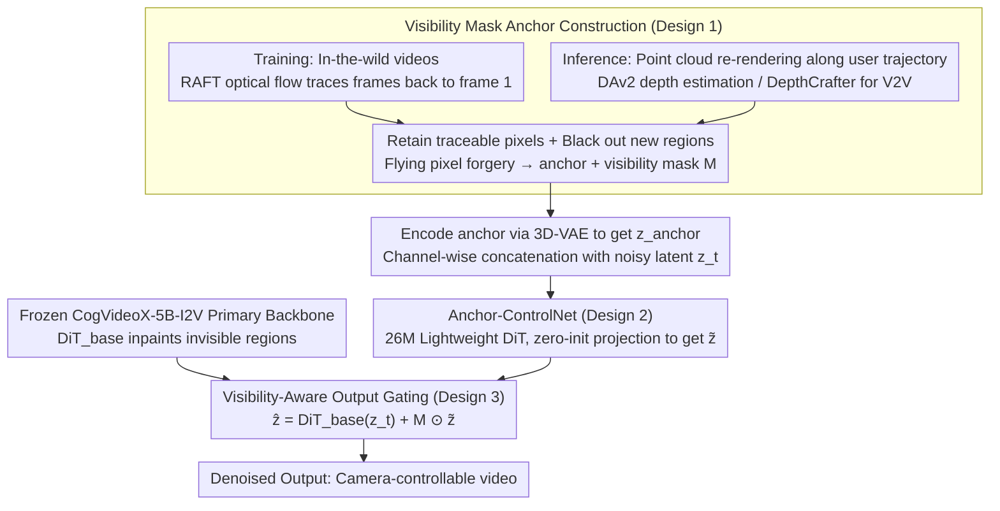

# EPiC: Efficient Video Camera Control Learning with Precise Anchor-Video Guidance

**Conference**: ICML 2026  
**arXiv**: [2505.21876](https://arxiv.org/abs/2505.21876)  
**Code**: https://zunwang1.github.io/Epic (Project Homepage)  
**Area**: Video Generation  
**Keywords**: anchor video, visibility mask, Anchor-ControlNet, I2V/V2V camera control, lightweight adaptation

## TL;DR
EPiC utilizes a "first-frame visibility mask-based" approach to directly construct pixel-aligned anchor videos from arbitrary in-the-wild videos. By pairing this with Anchor-ControlNet—comprising only 26M parameters (<1% of the backbone) and operating exclusively on visible regions—it achieves SOTA I2V camera control and zero-shot generalization to V2V while freezing the CogVideoX-5B-I2V backbone and training on only 5K videos for 500 steps.

## Background & Motivation
**Background**: Dominant camera control methods in controllable video generation follow two main paths: directly feeding camera parameters (Plücker embedding, extrinsic matrices) as conditions to the VDM (CameraCtrl, AC3D), or lifting a single image to a point cloud to re-render an "anchor video" based on a target trajectory, which serves as a structural prior (ViewCrafter, Gen3C, TrajectoryCrafter, Uni3C). The latter typically achieves better camera accuracy due to explicit geometric guidance.

**Limitations of Prior Work**: The anchor video approach faces two major challenges. First, anchors rendered from estimated point clouds (DAv2, MoGe) and estimated camera trajectories (COLMAP) suffer from pixel-level misalignment with the source video in visible regions (the paper measures anchor-source PSNR at only 16 dB). This forces the model to simultaneously correct misalignment and inpaint invisible regions, confounding the learning objective. Second, to reconcile these errors, existing methods often require extensive backbone modifications (full fine-tuning or heavy modules) and are restricted to static multi-view datasets with precise camera annotations like RealEstate10K, leading to poor generalization on dynamic in-the-wild videos.

**Key Challenge**: There is a trade-off between the "3D information richness" of the anchor video and its "pixel alignment with the source video"—the more 3D re-rendering information an anchor carries, the more severe the misalignment becomes. Achieving alignment typically requires sacrificing explicit 3D information. Prior methods favor the former, offloading the resulting costs to the model.

**Goal**: (1) Enable training anchors to achieve pixel-level alignment with source videos in visible regions without relying on camera or point cloud estimation; (2) inject anchor signals into a frozen VDM with minimal learnable parameters; (3) maintain precise trajectory control through 3D point clouds during inference.

**Key Insight**: The authors observe that the "geometric properties" of an anchor video only require information regarding "which pixels remain visible relative to the first frame and which have been occluded or moved out of view," rather than a full 3D reconstruction. By using dense optical flow to trace pixels in each frame back to the first frame—retaining traceable pixels and masking others—one can forge an anchor that is geometrically equivalent to a point cloud rendering but perfectly aligned with the source video.

**Core Idea**: Shift anchor construction from "difficult-to-align 3D re-rendering" to "easy-to-align visibility masking." The ControlNet is tasked only with copying visible regions, while the frozen base model handles inpainting invisible regions—compressing the ControlNet's task from "correct alignment + inpaint" to merely "copy."

## Method

### Overall Architecture
EPiC is built upon CogVideoX-5B-I2V (DiT-style, 3D full self-attention). The training pipeline consists of two steps: (1) synthesizing training anchors from arbitrary in-the-wild videos using visibility masks (no camera/point cloud required); (2) encoding the anchor via a 3D-VAE, concatenating it with noisy latents along the channel dimension, and feeding it into a 26M Anchor-ControlNet. The output is spatially gated by a visibility mask $M$ and added to the corresponding layers of the frozen base DiT. During inference, anchors are rendered from real point clouds along user-defined trajectories. The visibility gating in Anchor-ControlNet isolates misalignments and "flying pixels" from 3D reconstruction. Furthermore, masking foreground point clouds allows switching between "static camera control" and "dynamic foreground" modes, with V2V mode utilizing dynamic point clouds estimated by DepthCrafter.

### Key Designs

**1. Visibility Mask Anchor Construction: Forging pixel-aligned anchors via optical flow**

The primary pain point of anchor-based methods is that anchors rendered from estimated geometry suffer from visible-region pixel misalignment (PSNR $\approx$ 16 dB). EPiC resolves this by recognizing that the essential geometric information is simply which pixels are visible relative to the first frame. Using RAFT for dense optical flow, each pixel in frame $t$ is traced back to frame 1; only successfully traced pixels are retained, while others are blacked out to create a binary visibility mask $M_t$. This synthetic anchor achieves pixel-perfect alignment in visible regions (PSNR improved from 16.01 to 40.12 dB), while its "blackened new regions" property remains equivalent to point cloud rendering. To bridge the training-inference gap, "flying pixel forgery" is used—randomly drawing light-colored dashed rays in visible regions during training to simulate point cloud artifacts. This removes the misalignment burden and allows training on dynamic videos like Panda-70M without camera labels.

**2. Anchor-ControlNet: Downsizing the adapter via aligned anchors**

To inject anchor signals, EPiC utilizes a lightweight 26M DiT adapter (<1% of the backbone): a single DiT block with hidden dimensions reduced from 3072 to 256 (~8%), connected only to the first 25% of layers. The anchor video $\mathbf{A}$ is encoded into $\mathbf{z}_{\text{anchor}}$, concatenated with latent $\mathbf{z}_t$, patchified, and processed by the DiT-ctrl. The output is projected back to 3072 dimensions via zero-initialization: $\tilde{\mathbf{z}} = \text{Proj}(\text{DiT}_{\text{ctrl}}([\mathbf{z}_t, \mathbf{z}_{\text{anchor}}]))$. Only these 26M parameters are updated. This "light, shallow, and narrow" configuration is viable precisely because the upstream anchor is perfectly aligned—the more aligned the anchor, the less capacity the ControlNet requires.

**3. Visibility-Aware Output Gating: Delegating copying to ControlNet and inpainting to the frozen backbone**

EPiC extremeizes responsibility separation by downsampling the visibility mask $M \in \{0,1\}^{T'\times h\times w}$ to latent resolution and applying a hard gating fusion: $\hat{\mathbf{z}} = \text{DiT}_{\text{base}}(\mathbf{z}_t) + M \odot \tilde{\mathbf{z}}$. Unlike prior methods that require ControlNet to handle both alignment and inpainting, EPiC lets the ControlNet copy visible content and the base model fill in the rest. This provides three benefits: point cloud artifacts in invisible regions are gated out; the training objective simplifies to "pure replication," enabling fast convergence; and inference allows excluding specific foreground regions from trajectory constraints (using GroundedSAM), enabling "camera motion + foreground action" without further training.

### Loss & Training
The standard latent diffusion denoising loss is used: $\mathcal{L}_{\text{denoise}} = \mathbb{E}_{\mathbf{z}_0, t, \boldsymbol{\epsilon}, c}[\|\boldsymbol{\epsilon}_\theta(\mathbf{z}_t, t, c) - \boldsymbol{\epsilon}\|_2^2]$, where $c$ includes text and anchors. Only the 26M Anchor-ControlNet is updated. For training, 5,000 video segments from Panda-70M are used with a batch size of 16 on 8×A100-40G GPUs for 500 steps (~15 GPU hours total); AdamW optimizer with $lr=2\times 10^{-4}$. Inference CFG scale is 6.0; I2V inference uses DAv2 for point clouds (optionally using GroundedSAM for dynamic foregrounds), while V2V uses DepthCrafter for per-frame dynamic point clouds.

## Key Experimental Results

### Main Results
Evaluated on the RealCam-Vid test set (500 segments each from RealEstate10K and MiraData, 5 seeds per sample). Metrics include RotErr, TransErr, CamMC (lower is better, $10^{-2}$ scale), and Total Quality (VBench average).

| Dataset | Method | RotErr ↓ | TransErr ↓ | CamMC ↓ | Total Quality ↑ |
|--------|------|----------|------------|---------|-----------------|
| RE10K | CameraCtrl | 1.12±0.44 | 1.78±0.93 | 2.36±1.01 | 78.35 |
| RE10K | AC3D† | 0.86±0.37 | 1.50±0.82 | 1.97±0.86 | 82.63 |
| RE10K | ViewCrafter | 0.50±0.16 | 1.05±0.32 | 1.35±0.40 | 81.18 |
| RE10K | Gen3C | 0.45±0.13 | 0.99±0.22 | 1.35±0.30 | 82.27 |
| RE10K | **Ours** | **0.40±0.11** | **0.86±0.18** | **1.17±0.23** | **82.63** |
| MIRA | ViewCrafter | 1.16±0.34 | 2.95±0.98 | 3.42±1.04 | 79.87 |
| MIRA | Gen3C | 0.81±0.24 | 2.05±0.77 | 2.75±0.72 | 80.50 |
| MIRA | **Ours** | **0.66±0.22** | **1.78±0.67** | **2.10±0.60** | **82.89** |

EPiC ranks first across all 6 camera/quality metrics with the lowest standard deviation. Zero-shot V2V evaluation on Kubric-4D yields PSNR 19.65 / SSIM 0.60, comparable to methods specifically trained for V2V like GCD (19.72/0.59) or TrajCrafter (19.61/0.62). Training efficiency is significantly improved, using an order of magnitude less data and compute than ViewCrafter or Gen3C.

### Ablation Study

| Configuration | Anchor PSNR ↑ | RotErr ↓ | TransErr ↓ | CamMC ↓ |
|------|---------------|----------|------------|---------|
| Point cloud anchor (1500 iters) | 16.01 | 0.60±0.20 | 1.07±0.39 | 1.45±0.62 |
| 50% PC + 50% Mask (1000 iters) | 28.07 | 0.48±0.15 | 0.95±0.28 | 1.29±0.40 |
| **Masking anchor (500 iters)** | **40.12** | **0.40±0.11** | **0.86±0.18** | **1.17±0.23** |

### Key Findings
- Anchor-source PSNR correlates strongly with downstream camera accuracy: as PSNR increases (16→28→40 dB), all metrics monotonic improve. Therefore, anchor alignment quality, rather than 3D information itself, determines the upper bound.
- Removing flying pixel forgery results in the model reproducing point cloud artifacts at edges. Removing visibility gating leads to blurry or nonsensical outputs in invisible regions due to point cloud tearing artifacts.
- Zero-shot performance on V2V tasks demonstrates that the uncoupled "copy + inpaint" abstraction generalizes whenever visibility can be calculated.
- Inference-time masking allows for "dynamic foreground + camera motion"—a benefit resulting directly from the visibility-gated design.

## Highlights & Insights
- **Task Redefinition**: Decoupling camera control into "copy visible" and "inpaint invisible" sub-tasks and enforcing this separation via masks is a sophisticated structural simplification.
- **Data-Architecture Synergy**: Unlike typical ControlNets where smaller architectures require more data, EPiC shows that better alignment allows for smaller architectures and less training—a successful trade-off between upstream data quality and downstream model capacity.
- **Optical Flow as Geometry**: Using optical flow traceability as a proxy for first-frame visibility is a cost-effective alternative to 3D reconstruction, provided the task requires knowing *where* things are visible rather than the exact depth values.
- **Bonus Controllability**: The visibility masks introduced for alignment naturally become a switch for dynamic foregrounds at inference time.

## Limitations & Future Work
- Dependency on first-frame visibility means that large camera rotations or orbits significantly reduce the visible area, potentially weakening the anchor signal and increasing reliance on the base model's long-range consistency.
- Reliance on optical flow assumes RAFT is reliable; errors in high-occlusion or textureless scenes may lead to incorrect supervision.
- Current V2V inference interprets user trajectories as relative transforms based on DepthCrafter's per-frame depth, which can be awkward for global world-coordinate storytelling.
- The framework depends heavily on the base model's ability to inpaint; performance may degrade on OOD domains (e.g., medical or thermal imaging).

## Related Work & Insights
- **vs ViewCrafter / Gen3C**: These require full backbone tuning because they force the model to solve misalignment and inpainting simultaneously. EPiC eliminates misalignment upfront.
- **vs CameraCtrl / AC3D**: These lack explicit 3D guidance and perform poorly on OOD camera trajectories. EPiC maintains explicit 3D guidance during inference while ensuring ease of training.
- **vs FloVD**: FloVD uses optical flow as a direct condition, which is less precise than a pixel-aligned anchor video.
- **vs ReCamMaster / SynCamMaster**: These rely on synthetic 4D data. EPiC achieves comparable V2V results using only I2V data through its superior inductive bias.

## Rating
- Novelty: ⭐⭐⭐⭐ The combination of "optical flow visibility mask forgery" and "visibility-aware gating" is a elegant structural simplification.
- Experimental Thoroughness: ⭐⭐⭐⭐ SOTA on multiple I2V datasets with clean ablations; zero-shot V2V is well-validated.
- Writing Quality: ⭐⭐⭐⭐ Very clear motivation; the efficiency bubble chart and qualitative comparisons are compelling.
- Value: ⭐⭐⭐⭐⭐ 15 GPU hours to reach SOTA camera control while keeping the backbone frozen is highly attractive for both industry and research.

<!-- RELATED:START -->

## Related Papers

- [\[ICML 2026\] Rays as Pixels: Learning A Joint Distribution of Videos and Camera Trajectories](rays_as_pixels_learning_a_joint_distribution_of_videos_and_camera_trajectories.md)
- [\[CVPR 2025\] GEN3C: 3D-Informed World-Consistent Video Generation with Precise Camera Control](../../CVPR2025/video_generation/gen3c_3d-informed_world-consistent_video_generation_with_precise_camera_control.md)
- [\[ICLR 2026\] Frame Guidance: Training-Free Guidance for Frame-Level Control in Video Diffusion Models](../../ICLR2026/video_generation/frame_guidance_training-free_guidance_for_frame-level_control_in_video_diffusion.md)
- [\[ICML 2026\] iTryOn: Mastering Interactive Video Virtual Try-On with Spatial-Semantic Guidance](itryon_mastering_interactive_video_virtual_try-on_with_spatial-semantic_guidance.md)
- [\[CVPR 2026\] BulletTime: Decoupled Control of Time and Camera Pose for Video Generation](../../CVPR2026/video_generation/bullettime_decoupled_control_of_time_and_camera_pose_for_video_generation.md)

<!-- RELATED:END -->
