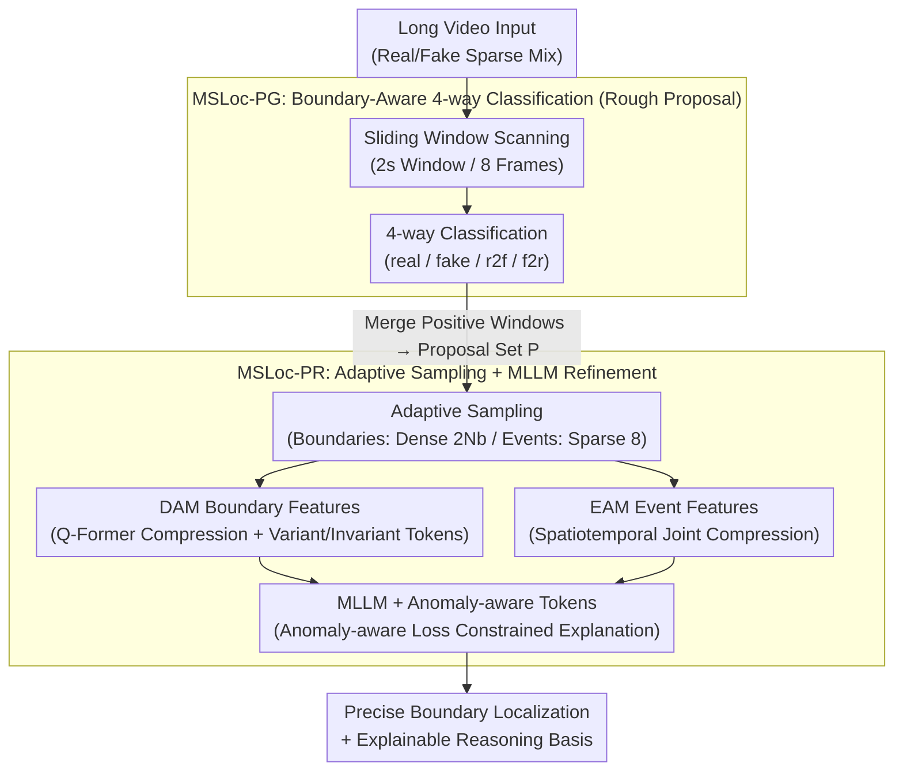

# Explainable Forensics of Manipulated Segments in Untrimmed Long Videos

**Conference**: ICML 2026  
**arXiv**: [2606.02402](https://arxiv.org/abs/2606.02402)  
**Code**: To be confirmed  
**Area**: AIGC Detection / AI Security / Video Forensics  
**Keywords**: AI-generated video detection, temporal localization, explainability, long video forensics, boundary-aware

## TL;DR
This paper proposes the task of **temporal localization and explainable analysis of AI-generated segments in long videos**, introducing the **large-scale TASLE dataset** and the **two-stage MSLoc baseline method**—achieving precise localization and explainable reasoning of manipulated segments in mixed real-fake videos through boundary-aware proposal generation and MLLM refinement.

## Background & Motivation

**Background**: Current AI-generated video detection methods primarily focus on binary classification (real/fake) of short video clips. Representative works such as DeMamba and BusterX++ are trained and evaluated on independent video segments lasting only a few seconds. Furthermore, existing AIGC detection datasets (GenVideo, GenVidBench) consist almost entirely of short videos or fully generated videos, **lacking annotations for mixed scenarios** where real and generated content are intertwined.

**Limitations of Prior Work**: Video manipulation in the real world typically follows a "**sparse embedding**" pattern—a small amount of AI-generated content is mixed into a large volume of real video rather than the entire video being forged. Under this setting, existing short video detectors face two major challenges: (1) **Loss of boundary information**: Models are insensitive to subtle anomalies at the junction of real and fake content, failing to capture the smooth transition from real to generated content; (2) **Long-tail interference**: A large amount of irrelevant real content introduces noise. Directly applying sliding window inference to an entire long video is computationally expensive, yet uniform sampling dilutes key boundary clues.

**Key Challenge**: The design assumption of short video detectors is that "each input segment is either completely real or completely fake," an assumption that collapses in long video mixed scenarios. Existing MLLM temporal localization models (such as Trace) possess reasoning capabilities but, when processing long videos of tens of seconds end-to-end, they become overwhelmed by irrelevant frames due to uniform sampling.

**Goal**: To establish the new task of "temporal localization and explainable analysis of AI-generated segments in long videos" and construct a corresponding large-scale dataset and baseline method.

**Key Insight**: The core observation is that manipulated segments in long videos often appear in the form of "**boundaries**"—the subtle inconsistencies at the junction of real and generated content are the strongest discriminative clues. The authors propose using "multi-classification" instead of "binary classification" to capture these boundary signals and design a two-stage pipeline: first using a lightweight model for coarse proposals (focusing on boundaries), then using an MLLM for fine localization and explanation (understanding semantics).

**Core Idea**: Transform long video forensics from a single-stage clip-level binary classification into a two-stage framework consisting of boundary-aware proposals + MLLM refinement, explicitly modeling anomalies at real-fake junctions through boundary classification and adaptive sampling.

## Method

### Overall Architecture
MSLoc aims to precisely locate AI-generated segments within long videos (tens of seconds) containing a mixture of real and fake content and provide an explainable basis for the judgment. It follows a classic "coarse-to-fine" two-stage approach, but each step is redesigned around "boundaries." In the first stage, MSLoc-PG efficiently scans the long video using a sliding window (2-second window, 8-frame sampling), reformulating detection as a four-way classification to quickly identify suspicious regions. In the second stage, MSLoc-PR takes these coarse proposals and applies an adaptive sampling strategy ("dense sampling for boundary regions, sparse sampling for event regions"). Features are compressed via DAM (boundary) and EAM (event) modules before being passed to an MLLM for fine localization and explanation. The key lies in: four-way classification forcing the model to watch for real-fake junctions, adaptive sampling concentrating computation on high-information-density transition zones, and anomaly-aware loss anchoring MLLM explanations to actual artifacts.

### Key Designs

**1. Boundary-Aware 4-way Classification: Shifting Focus to Junctions**

Actual tampering often involves small amounts of generated content sparsely embedded in long real videos, with the strongest clues hidden in subtle discontinuities (motion jitters, lighting mismatches) at the real-fake boundaries. Traditional short video detectors only perform real/fake binary classification, assuming "every segment is either all real or all fake," thus failing to capture transitions. MSLoc expands the label space to four classes $\mathcal{Y} = \{y_{\text{real}}, y_{\text{fake}}, y_{\text{r2f}}, y_{\text{f2r}}\}$, where $y_{\text{r2f}}$ and $y_{\text{f2r}}$ explicitly mark real $\to$ fake and fake $\to$ real boundaries. Each 2-second window is sampled uniformly at 8 frames and optimized using cross-entropy $\mathcal{L}_{\text{ce}} = -\frac{1}{N_b} \sum_{i=1}^{N_b} \log(p_{i, t_i})$. This objective forces the model to be sensitive to transition signals between consecutive frames rather than just judging an overall state—increasing F1Loc from 54.0 to 64.8 in ablations.

**2. Adaptive Sampling + Boundary/Event Feature Modeling (DAM + EAM): Focusing Computation on Boundaries**

In long videos, real-fake junctions often occupy only a small portion of a proposal but represent the highest information density. In contrast, the "event regions" within a proposal mainly provide semantic context for explanation and do not require frame-by-frame scrutiny. Based on this, MSLoc applies a "divide and conquer" strategy to each coarse proposal $P_i$: it performs dense sampling (e.g., $2 \times N_b = 32$ frames when $N_b=16$) at the $\phi\%$ boundary regions of both ends to capture subtle inter-frame anomalies, while performing sparse sampling (8 frames) in the internal event regions for high-level semantics. Boundary features are compressed via Q-Former, leveraging similarity priors between corresponding pixels in adjacent frames to calculate "inter-frame variant" and "inter-frame invariant" tokens. Event features utilize spatiotemporal joint compression. This asymmetric sampling improves boundary localization accuracy (2-3% higher than uniform sampling) and reduces MLLM burden through compression, yielding a 17.6% improvement in cross-domain F1Loc.

**3. Anomaly-Aware Loss: Grounding MLLM Explanations in Specific Artifacts**

Since AI-generated content in TASLE is constrained by reference frames and is extremely similar to real frames, MLLMs are prone to "hallucinating" plausible-sounding but groundless explanations. This paper injects three special "anomaly-aware tokens" into the MLLM input, encoded into a format readable by the LLM. Their output embeddings are then passed through a classification head to predict anomaly categories (e.g., "boundary start explanation," "object anomaly"), optimized by cross-entropy $\mathcal{L}_{\text{AA}}$. This acts as a tether for the reasoning process—the model must bind each explanation segment to specific anomaly categories rather than speaking in generalities, improving explanation truthfulness: the explainability score RQ increased from 3.79 to 3.99 after adding this loss.

## Key Experimental Results

### Main Results

| Method | Data | F1Det | F1Loc | RQ |
|------|------|-------|-------|-----|
| D3 | Seen AIGC types | 34.6 | 31.1 | ✗ |
| BusterX++* (Finetuned) | TASLE | 33.6 | 36.4 | ✗ |
| DeMamba* (Binary) | TASLE | 54.9 | 54.0 | ✗ |
| MSLoc-PG (4-way) | TASLE | 67.5 | 64.8 | ✗ |
| Trace* + DeMamba | TASLE | 55.7 | 59.1 | 3.45 |
| Trace* + MSLoc-PG | TASLE | 69.0 | 70.9 | 3.91 |
| **MSLoc (Full)** | **TASLE** | **70.1** | **72.2** | **4.05** |

### Generalization (Out-of-Domain)

| Setting | MSLoc-PG | MSLoc | Gain |
|------|----------|-------|------|
| Seen Generation Types | 62.7 F1Det | 67.0 F1Det | +4.3% |
| Unseen Generation Types | 50.0 F1Loc | 62.8 F1Loc | +25.6% |
| Out-of-Domain (TVSum) | 38.7 F1Loc | 56.3 F1Loc | +45.5% |

### Key Findings
- 4-way classification yields significant gains over binary: MSLoc-PG (67.5 F1Det) vs DeMamba (54.9), proving the efficacy of explicit boundary modeling.
- The two-stage design shows a clear advantage in generalization—MSLoc improves by 25.6% on unseen AIGC types.
- Boundary sampling is critical—Table 4 shows that reducing boundary sampling frames from 16 back to 8 drops the RQ from 4.01 to 3.80.
- Computational efficiency is manageable: Compared to Trace (9 min), MSLoc (12 min) increases inference overhead by only 33% while improving F1Loc from 37.3 to 63.8.

## Highlights & Insights
- **Boundary Classification Paradigm Shift**: Moving from "short video binary classification" to "long video 4-way classification" is a simple yet powerful improvement. Traditional AIGC detection ignores temporal clues at real-fake junctions; this can be transferred to other temporal anomaly detection tasks (deepfake detection, behavioral anomaly recognition).
- **Progressive Refinement in Two-Stage Architecture**: While the coarse-to-fine design is classic, the innovation lies in the first stage being "boundary-aware coarse localization" rather than just "candidate generation." The second stage then achieves boundary refinement and explainability through adaptive sampling and multimodal reasoning, which is particularly effective for long-tail problems.
- **Inspiration from Adaptive Sampling**: The idea of dense sampling for boundary regions and sparse sampling for event regions reflects a deep understanding of the "problem structure." This approach can be applied to other long-sequence processing tasks (long document reading comprehension, video event localization).

## Limitations & Future Work
- **Error Propagation in Cascaded Architecture**: MSLoc uses a cascaded two-stage design where missed detections in the first stage cannot be recovered later. Future work plans to explore end-to-end joint training.
- **Rapid Evolution of Generation Artifacts**: Current detection capabilities rely on the visibility of visual artifacts in AI-generated content. As video generation technology improves, artifacts of new generators will become more subtle—the authors commit to continuously updating the TASLE dataset.
- **Multimodal Cue Fusion**: Currently, only visual information is utilized. Future research could explore multimodal cues such as audio-visual synchronization, speaker lip movements, and background consistency.

## Related Work & Insights
- **vs. Short Video AIGC Detection** (DeMamba, BusterX++): Existing work focuses on binary classification assuming independent input clips. This paper extends to mixed long video scenarios, introducing 4-way classification and boundary modeling.
- **vs. Video Temporal Localization** (Trace, TimeChat): These models were originally designed for semantic event localization and perform poorly when applied directly to generation artifact detection (Trace alone achieves only 37.5 F1Loc). MSLoc addresses this via a two-stage design and adaptive sampling.
- **vs. Explainability Methods** (FakeShield, IVY-FAKE): These methods provide natural language explanations based on short videos. TASLE provides finer-grained annotations for dual-level explanations at both the boundary and object levels.

## Rating
- Novelty: ⭐⭐⭐⭐⭐  Systematically proposes a new task for long video AIGC localization and explainable analysis, achieving a full upgrade over traditional short video methods through 4-way classification and two-stage design.
- Experimental Thoroughness: ⭐⭐⭐⭐⭐  Introduces a 12.5K large-scale dataset + comprehensive ablation analysis + multiple generalization evaluation scenarios with sufficient baseline comparisons.
- Writing Quality: ⭐⭐⭐⭐  The problem statement is clear, the technical solution is logically rigorous, and the methodology section is well-structured.
- Value: ⭐⭐⭐⭐⭐  Both the dataset and the method have high practical value, addressing real-world video forensics needs; application prospects include content moderation, judicial forensics, and autonomous driving safety.

<!-- RELATED:START -->

## Related Papers

- [\[CVPR 2026\] ActivityForensics: A Comprehensive Benchmark for Localizing Manipulated Activity in Videos](../../CVPR2026/video_generation/activityforensics_a_comprehensive_benchmark_for_localizing_manipulated_activity_.md)
- [\[ICML 2026\] Enhancing Train-Free Infinite-Frame Generation for Consistent Long Videos](enhancing_train-free_infinite-frame_generation_for_consistent_long_videos.md)
- [\[NeurIPS 2025\] Scaling RL to Long Videos](../../NeurIPS2025/video_generation/scaling_rl_to_long_videos.md)
- [\[ICML 2026\] Rays as Pixels: Learning A Joint Distribution of Videos and Camera Trajectories](rays_as_pixels_learning_a_joint_distribution_of_videos_and_camera_trajectories.md)
- [\[ICML 2026\] LocoT2V-Bench: Benchmarking Long-form and Complex Text-to-Video Generation](locot2v-bench_benchmarking_long-form_and_complex_text-to-video_generation.md)

<!-- RELATED:END -->
