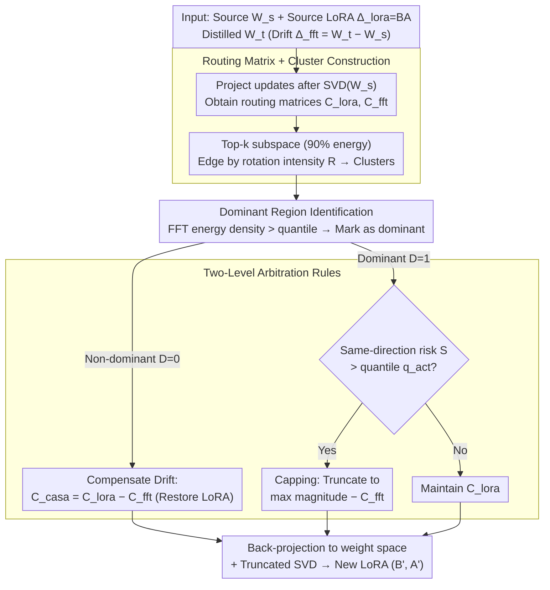

# Exploring Data-Free LoRA Transferability for Video Diffusion Models

**Conference**: ICML 2026  
**arXiv**: [2605.01929](https://arxiv.org/abs/2605.01929)  
**Code**: https://github.com/Noahwangyuchen/CASA  
**Area**: Video Diffusion Models / LoRA / Parameter-Efficient Transfer  
**Keywords**: Video Diffusion, LoRA Transfer, SVD Singular Subspace, Spectral Routing, Data-Free

## TL;DR
This paper presents the first weight-space analysis of Full Fine-Tuning (FFT) and LoRA for Video Diffusion Models (VDMs). It discovers that both "preserve the singular spectrum and only rotate the singular subspaces," but exhibit conflicting routing directions on head clusters. Based on this, the authors propose CASA—a data-free "spectral arbitration by clustering" LoRA transfer method that allows LoRA trained on base models like Wan2.1 to be directly transferred to distilled variants like FastWan without requiring user data or retraining.

## Background & Motivation

**Background**: VDMs such as Wan2.1, HunyuanVideo, and Sora generate high-fidelity videos but suffer from slow inference. Consequently, the community has developed various distillations—**step distillation** (compressing 50 steps to 4) and **causal distillation** (transforming bidirectional attention to causal for streaming). These distillations are typically implemented via FFT, leading to a VDM ecosystem of "shared-origin but weight-distinct" families. Meanwhile, LoRA remains the de facto standard for sharing style and character controls (e.g., numerous Wan2.1 LoRAs on HuggingFace).

**Limitations of Prior Work**: Directly applying a LoRA trained on a base model to its distilled variants **almost inevitably fails**, resulting in either style loss or structural collapse (Figure 1). Retraining is costly and requires the original training data, which is often infeasible in real-world scenarios where users only possess LoRA weights. Existing transfer works (e.g., X-Adapter, Trans-LoRA, LoRA-X, ProLoRA) either require data or are validated only on LLMs/Image Diffusion models, leaving a gap in VDM research.

**Key Challenge**: While both FFT and LoRA "gentle" modify the base weights (singular values remain nearly unchanged), they follow **different routing paths** within the shared singular subspaces. When FFT has already strongly modulated the functional pathway of a specific head cluster, injecting LoRA updates into the same pathway leads to either "over-activation" (constructive interference) or "mutual cancellation" (destructive interference).

**Goal**: (1) Provide a "microscope" for VDM weight spaces to understand the modifications made by FFT and LoRA; (2) Explain the root causes of direct LoRA transfer failure; (3) Design a data-free transfer algorithm to salvage LoRA utility.

**Key Insight**: Inspired by Shuttleworth 2025 (which identified "intruder dimensions" in LLM LoRAs), the authors utilize SVD to analyze VDM weights. They find that VDMs behave differently: head singular vectors remain nearly unchanged, middle spectra show block-wise mixing, and tail spectra diffuse. Crucially, LoRA **does not** introduce intruder dimensions but strictly maintains the spectral shape. This "spectral rigidity" motivates analyzing updates from the perspective of a routing matrix $\mathbf{C}=\mathbf{U}^\top\Delta\mathbf{V}$.

**Core Idea**: LoRA transfer is treated as "routing arbitration in singular subspaces." In non-dominant regions, FFT drift is compensated to restore LoRA functionality. In dominant regions, updates are capped at the maximum of the two values if a threshold is exceeded to prevent over-activation.

## Method

### Overall Architecture
CASA takes the source model $\mathbf{W}_s$, its trained LoRA $\Delta_{\text{lora}}=\mathbf{BA}$, and the distilled target model $\mathbf{W}_t$ (and thus $\Delta_{\text{fft}}=\mathbf{W}_t-\mathbf{W}_s$) as inputs. It outputs a new LoRA $(\mathbf{B}',\mathbf{A}')$ compatible with the target model. The process is performed independently per layer:
(1) Perform SVD on $\mathbf{W}_s$ to obtain $\mathbf{U}_s, \mathbf{S}_s, \mathbf{V}_s$;
(2) Project both updates onto the source singular basis to obtain routing matrices $\mathbf{C}_{\text{lora}}$ and $\mathbf{C}_{\text{fft}}$;
(3) Construct clusters in the top-k subspace (covering 90% energy);
(4) Update $\mathbf{C}_{\text{casa}}$ using two different rules based on whether the region is "dominant";
(5) Project back to weight space and perform low-rank decomposition to get the new LoRA.

### Key Designs

**1. Routing Matrix + Cluster Construction: Translating Weight Updates into Information Flow**

To visualize the modifications of LoRA and FFT, updates are placed in a perspective that identifies information flow between singular directions. CASA defines the routing matrix as $\mathbf{C}=\mathbf{U}_s^\top\Delta\mathbf{V}_s$, where rows are receivers and columns are senders. $\mathbf{C}(i,j)$ represents the strength of the $j$-th sender pushing towards the $i$-th receiver. A top-$k$ subspace is selected such that $\sum_{i=1}^k\sigma_i^2/\sum_i\sigma_i^2\ge 0.9$. Edges are connected based on predicted rotation intensity $\mathbf{R}(i,j)=|\mathbf{C}_{\text{lora}}(i,j)|/(|\sigma_i-\sigma_j|+\epsilon)$ exceeding a threshold $\tau$; connected components form clusters. Normalizing by the singular value difference $\sigma_i-\sigma_j$ accounts for the block-wise mixing observed in the middle spectrum, which aligns with Davis-Kahan perturbation theory—smaller differences in singular values lead to easier mixing.

**2. Dominant Routing Region Identification: Focusing on FFT "Highways"**

Not all cluster conflicts are fatal. Empirical findings show that FFT concentrates routing energy in a few "head clusters" (generation highways), whereas LoRA energy is distributed uniformly. Destruction occurs primarily when there is a conflict on these highways. CASA calculates the FFT send/receive energy density for each cluster $\mathcal{G}_m$: $\rho_m^{\text{send}}=\frac{1}{|\mathcal{G}_m|}\sum_{i\in\mathcal{G}_m}\|\mathbf{C}_{\text{fft}}(:,i)\|_2$. Clusters exceeding a quantile threshold $q_{\text{dom}}$ are marked as dominant. A routing position $(i,j)$ is marked $\mathcal{D}(i,j)=1$ if either $i$ or $j$ belongs to a dominant cluster.

**3. Two-level Arbitration (CASA Core): Compensation vs. Capping**

CASA employs differentiated rules because head cluster alignments can be strongly constructive (over-activation) or destructive. For the non-dominant region ($\mathcal{D}=0$), it compensates for the FFT drift: $\mathbf{C}_{\text{casa}}(i,j)=\mathbf{C}_{\text{lora}}(i,j)-\mathbf{C}_{\text{fft}}(i,j)$, ensuring the final routing yields exactly $\mathbf{C}_{\text{lora}}$. In the dominant region ($\mathcal{D}=1$), it calculates an over-activation risk $\mathbf{S}(i,j)=\mathbf{E}(i,j)\cdot\text{Context}(i,j)$, where $\mathbf{E}$ represents same-direction magnitude and $\text{Context}$ provides collective direction evidence via cosine similarity. If the risk $\mathbf{S}$ exceeds $q_{\text{act}}$, the intensity is capped at the maximum magnitude of the two components. This prevents the "generation highway" from being overwhelmed while maximizing LoRA style recovery.

### Loss & Training
**Zero training, zero data.** CASA is a closed-form weight operation: SVD $\rightarrow$ Routing Projection $\rightarrow$ Clustering $\rightarrow$ Threshold Arbitration $\rightarrow$ Back-projection $\rightarrow$ Truncated SVD to low-rank $(\mathbf{B}',\mathbf{A}')$. Hyperparameters $\tau, q_{\text{dom}}, q_{\text{act}}$ are adaptively determined by distribution.

## Key Experimental Results

### Main Results

Wan2.1-T2V-1.3B $\rightarrow$ Distilled variants (FastWan-1.3B / Rolling Forcing), LoRA: Steamboat-Willie & Jinx-v2:

| LoRA | Target Model | Method | Quality Score↑ | CSD (%)↑ |
|------|-------------|------|---------------|----------|
| Steamboat-Willie-1.3B | FastWan2.1-T2V-1.3B | Direct Reuse | 1.27 | 78.35 |
| Steamboat-Willie-1.3B | FastWan2.1-T2V-1.3B | **CASA** | **1.58** | **81.49** |
| Steamboat-Willie-1.3B | Rolling Forcing | Direct Reuse | 2.31 | 71.03 |
| Steamboat-Willie-1.3B | Rolling Forcing | **CASA** | **2.45** | — |

CASA consistently outperforms Direct Reuse in both quality and style similarity across 1.3B and 14B scales (FastWan-14B, Krea Realtime).

### Ablation Study

| Configuration | Key Metrics | Note |
|------|---------|------|
| Full CASA | Optimal | All modules (Routing+Identification+Arbitration) active |
| w/o cluster (per-entry) | Quality drops | Loses block-wise synergy |
| w/o dominant identification | Style (CSD) drops | Erroneously truncates LoRA signal |
| w/o arbitration (direct restore) | Artifacts appear | Constructive interference → Over-activation |

### Key Findings
- **Extreme Spectral Rigidity in VDMs**: Relative changes in singular values for FFT and LoRA are $\le 0.3\%$. This differs from LLMs where LoRA significantly raises leading singular values, suggesting VDM adaptation relies almost purely on **subspace rotation**.
- **No Intruder Dimensions in VDM-LoRA**: Unlike the findings of Shuttleworth 2025 in LLMs, head singular vectors in VDMs maintain near-perfect diagonal alignment, which has implications for future PEFT designs.
- **Divergent Routing Structures**: FFT concentrates energy on generating highways, while LoRA spreads it uniformly. Conflicts are localized to head clusters.
- **Necessity of Cluster-level Arbitration**: Treating singular directions individually is ineffective because they are interchangeable within the plateau; cluster-level handling preserves internal coordination.

## Highlights & Insights
- The **"Spectral Rigidity + Subspace Rotation"** framework provides a clean characterization of VDM PEFT and may serve as a standard analysis tool.
- **Data-Free utility** is the primary practical contribution, allowing transformation of LoRA files without original datasets or GPU training time.
- The discovery that **same-direction alignment causes conflict** is counter-intuitive but key: pushing the "generation highway" too far is just as destructive as canceling it out.

## Limitations & Future Work
- Validation is limited to two distillation types (step/causal) and the Wan backbone; results for HunyuanVideo, CogVideoX, or other Sora-style models remain to be seen.
- Metrics lack fine-grained temporal coherence or motion consistency analysis.
- Threshold robustness across model scales was not extensively mapped.
- Only pure low-rank LoRA structures $(\mathbf{B}, \mathbf{A})$ were tested; compatibility with DoRA or Adapters is unexplored.

## Related Work & Insights
- **vs ProLoRA**: While both are data-free, ProLoRA treats all singular directions equally. CASA's selective arbitration based on dominant regions is significantly stronger for VDMs.
- **vs Shuttleworth 2025**: This work provides a counter-example showing that the presence of "intruder dimensions" depends on the modality and architecture, rather than being an inherent property of LoRA.

## Rating
- Novelty: ⭐⭐⭐⭐ First comprehensive spectral/routing analysis for VDMs; unique arbitration rules.
- Experimental Thoroughness: ⭐⭐⭐⭐ Convincing across scales and distillation types, though lacks fine-grained motion metrics.
- Writing Quality: ⭐⭐⭐⭐ Logical progression from spectral analysis to the CASA algorithm.
- Value: ⭐⭐⭐⭐⭐ Direct benefit to industrial deployment and the open-source community.

<!-- RELATED:START -->

## Related Papers

- [\[ICML 2026\] WorldCache: Accelerating World Models for Free via Heterogeneous Token Caching](worldcache_accelerating_world_models_for_free_via_heterogeneous_token_caching.md)
- [\[ECCV 2024\] Exploring Pre-trained Text-to-Video Diffusion Models for Referring Video Object Segmentation](../../ECCV2024/video_generation/exploring_pre-trained_text-to-video_diffusion_models_for_referring_video_object_.md)
- [\[ICLR 2026\] Frame Guidance: Training-Free Guidance for Frame-Level Control in Video Diffusion Models](../../ICLR2026/video_generation/frame_guidance_training-free_guidance_for_frame-level_control_in_video_diffusion.md)
- [\[ICLR 2026\] Vid2World: Crafting Video Diffusion Models to Interactive World Models](../../ICLR2026/video_generation/vid2world_crafting_video_diffusion_models_to_interactive_world_models.md)
- [\[ICML 2026\] Where Concept Erasure Should Occur: Concept-Layer Alignment in Text-to-Video Diffusion Models](where_concept_erasure_should_occur_concept-layer_alignment_in_text-to-video_diff.md)

<!-- RELATED:END -->
