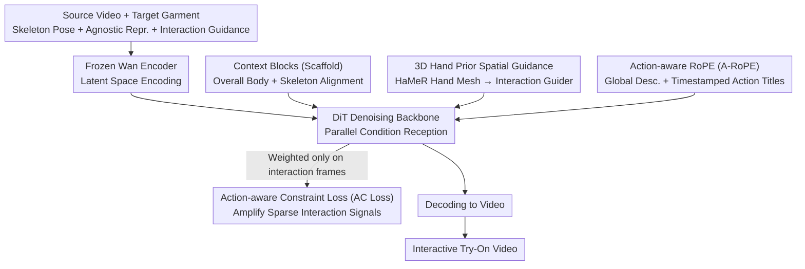

# iTryOn: Mastering Interactive Video Virtual Try-On with Spatial-Semantic Guidance

**Conference**: ICML 2026  
**arXiv**: [2605.21431](https://arxiv.org/abs/2605.21431)  
**Code**: TBD  
**Area**: Video Generation / Virtual Try-On  
**Keywords**: Interactive Video Virtual Try-On, Video Generation, Diffusion Models, Multimodal Conditions

## TL;DR
iTryOn defines the "Interactive Video Virtual Try-On" task for the first time—enabling individuals in videos to **actively manipulate garments** (zipping, lifting corners, stretching) rather than just passive display. By resolving spatial ambiguity through **3D hand priors**, strictly aligning timestamped action titles with corresponding frames using **Action-aware RoPE (A-RoPE)**, and amplifying learning signals in sparse interaction frames via **Action-aware Constraint Loss (AC Loss)**, it improves the ISR (Interaction Success Rate) on the self-built VVT-Interact from a baseline of 0.397 to 0.610 (+54%).

## Background & Motivation

**Background**: Virtual try-on has evolved from static images to Video Virtual Try-On (VVT). Recent methods based on Diffusion Transformers (DiT) achieve high-fidelity spatiotemporal consistency, preserving garment textures and the natural flow of movements.

**Limitations of Prior Work**: Existing VVT methods only handle **passive try-on scenarios** (individuals standing still or walking naturally). They completely overlook **real interactive scenarios** common in e-commerce live streaming—actively pulling zippers, lifting hem corners, or stretching garments to show elasticity. These interactions carry critical consumer information but cannot be generated by current models.

**Key Challenge**: Two core contradictions are difficult to reconcile:
- **Spatial Contradiction**: 2D skeleton poses lack Z-axis depth, making it impossible to distinguish between "moving hands near the chest to button" (interaction) vs. "resting hands on the chest" (non-interaction). Hand shapes and orientation information are lost.
- **Learning Contradiction**: Interaction frames are extremely sparse (typically only 5-10%). Gradient signals from simple non-interaction frames easily overwhelm complex action signals, causing models to ignore physical deformations.

**Goal**: Define and solve the Interactive VVT task, enabling models to understand "what interaction to perform," "when to interact," and "how to make physical contact."

**Key Insight**: Observed that existing VVT lacks **spatial precision** (no clear hand geometry) and **semantic precision** (no clear action intent or temporal boundaries). 3D hand priors resolve "spatial ambiguity," timestamped action titles solve "semantic ambiguity," and AC Loss amplifies the weight of interaction frames.

**Core Idea**: Multi-level Interaction Injection—injecting 3D hand geometry at the spatial layer, synchronized action titles at the semantic layer, and amplifying sparse interaction frame learning at the loss layer.

## Method

### Overall Architecture
iTryOn enables individuals in videos to not just passively display clothes, but to actually zip zippers, lift hems, and stretch fabrics. Inputs include source video $V_{\text{src}}$, target garment $G$, skeleton pose $V_{\text{pose}}$, garment-agnostic representation $V_{\text{agn}}$, and interaction guidance $\mathcal{C}$. The output is the try-on video $\hat{V}$. The pipeline first uses a frozen Wan encoder to encode inputs into latent space. The DiT backbone then **parallelly** receives three types of conditions during denoising: Context Blocks (scaffold for overall body and skeleton), Interaction Guider for fine 3D hand contact, and semantic injection of global descriptions plus timestamped action titles. After denoising, it decodes back to video. Three key designs address functional gaps: 3D hand priors fill spatial depth, A-RoPE pins action titles to frames, and AC Loss boosts sparse interaction signals.

### Key Designs

**1. 3D Hand Prior Spatial Guidance: Restoring Lost Depth to 2D Skeletons**

2D keypoint projections cannot distinguish between "hands moving near the chest to button" and "hands simply resting on the chest," nor can they differentiate hand shapes like "pinching" and "pressing"—Z-axis depth and finger geometry are lost. iTryOn adopts HaMeR to extract 3D hand meshes $V_{\text{hand}}$ (point clouds/mesh vertices). These are projected to feature space and processed by a lightweight Interaction Guider (convolution + self-attention), with the output fused additively with DiT tokens. 3D meshes are used instead of depth maps because they are garment-agnostic, preventing garment texture leakage from the source video and isolating "how hands move" from "what is worn."

**2. Action-aware RoPE (A-RoPE): Pinning Action Titles to Specific Frames**

A global caption is too broad to describe "zipping at the second second." However, directly feeding timestamped action titles can lead to description "leakage" into non-interactive frames. A-RoPE creates "virtual temporal channels" in temporal cross-attention: 1D RoPE is applied to the query of each video segment $i$ ($\hat{Q}_i = \text{1D-RoPE}(Q_i, i \cdot k)$ to maintain global order), but the same rotation is applied **only** to the keys of action titles corresponding to the **interaction segments** ($\hat{K}_i = \text{1D-RoPE}(K_i, i \cdot k)$ with $k=4$). Non-interaction segments use null titles without position encoding. This ensures high attention weights only for $(i, i)$ pairs where position encodings match, strictly aligning each action title with its responsible video segment.

**3. Action-aware Constraint Loss (AC Loss): Prioritizing the Critical 10% of Frames**

Interaction frames count for only 5-10% of the data. On the remaining 90% of simple non-interaction frames, the optimizer is easily drawn to stable, easy-to-learn gradients, submerging rare signals of complex wrinkles and deformations. AC Loss re-weights the loss by constructing a binary mask $\mathbb{M}_{\text{action}}$ (1 for interaction frames, 0 otherwise). The total loss is $\mathcal{L} = \mathcal{L}_{\text{std}} + \lambda \mathbb{E}[\|\mathbb{M}_{\text{action}} \odot (\hat{v}_\theta - v)\|_2^2]$, where $\lambda = 0.5$. The second term penalizes only interaction frames, stacking extra supervision on sparse keyframes to pull underfitted interaction events back to the center of learning. This approach essentially converts the "sparse imbalanced data" problem into a "sampling weight" problem.

### Loss & Training
The total loss consists of the standard diffusion loss plus the AC Loss term for interaction frame weighting ($\lambda = 0.5$); the Wan encoder is frozen, while the DiT backbone and Interaction Guider are primarily trained.

## Key Experimental Results

### Main Results (VVT-Interact 5292 videos: 5160 train / 132 test)

| Method | VFID$_I^p$ ↓ | VFID$_R^p$ ↓ | SSIM ↑ | LPIPS ↓ | FVD$^p$ ↓ | ISR$^p$ ↑ |
|------|-----------|-----------|--------|---------|---------|----------|
| ViViD | 29.83 | 1.27 | 0.726 | 0.164 | 468.5 | 0.397 |
| CatV2TON | 26.99 | 2.27 | 0.776 | 0.143 | 533.2 | 0.484 |
| MagicTryOn | 27.67 | 2.60 | 0.765 | 0.170 | 431.8 | 0.435 |
| **Ours** | **22.46** | **0.60** | **0.785** | **0.122** | **380.6** | **0.610** |

iTryOn establishes a dominant advantage, with ISR improving by 26% compared to the strongest baseline.

### Ablation Study

| Config | VFID$_I^p$ ↓ | ISR$^p$ ↑ | Key Observation |
|------|-----------|----------|---------|
| (a) Baseline | 27.12 | 0.477 | Fails to generate interactions |
| (b) +Data | 26.65 | 0.478 | Data alone is insufficient |
| (c) +(b)+Spatial Guidance | 24.85 | 0.517 | 3D hand guidance gain |
| (d) +(c)+Semantic Guidance | 22.76 | 0.599 | A-RoPE action titles gain |
| (e) +(d)+AC Loss | **22.46** | **0.610** | Complete model performance |

### Key Findings
- All three modules are indispensable—neither data alone nor single-modal guidance provides significant improvements.
- The ISR metric uses VLM for "semantic verification" rather than visual quality alone, acknowledging the dual requirements of "physical correctness vs. semantic correctness."
- An ISR of 0.610 indicates that 61% of interactions are correctly executed by the model (vs. 39.7% for the baseline).

## Highlights & Insights
- **A-RoPE Synchronization**: Distinguishes interaction vs. non-interaction segments through position encoding rotation, maintaining global temporal coherence while isolating local action descriptions. This is transferable to other tasks requiring precise temporal label alignment.
- **Geometric-Semantic Separation of 3D Hand Priors**: Using 3D meshes avoids depth map leakage of source garments. This design philosophy can be generalized to hand-object manipulation and human-tool interaction.
- **General Framework for Sparse Event Learning**: AC Loss transforms sparse imbalanced data learning into a standard sampling weight problem, applicable to any task containing sparse keyframes.
- **ISR Metric Innovation**: First use of VLM for semantic verification instead of visual quality alone, serving as a template for upgrading VVT evaluation standards.

## Limitations & Future Work
- The model lacks semantic garment understanding (e.g., "this shirt has a zipper"), occasionally generating "pantomime" interactions for infeasible actions.
- The ISR metric assesses interaction semantic success but struggles to quantify fine-grained physical accuracy (wrinkle physics, deformation angles).
- Dataset interaction categories are limited (only 6 types), and generalization to unseen interactions remains unknown.
- 3D hand priors rely on HaMeR extraction, which is sensitive to occlusion; future work could consider learning implicit hand representations directly from video.

## Related Work & Insights
- **vs ViViD / CatV2TON / MagicTryOn**: These methods optimize non-interactive VVT (spatiotemporal consistency, garment details) but fail to capture interaction intent; iTryOn bridges the fundamental gap in interaction understanding through multimodal condition fusion and sparse supervision re-weighting.
- **vs Video Editing (e.g., ControlNet)**: Editing methods use coarse-grained spatial conditions (bounding boxes, skeletons) but lack temporal information and physical constraints; iTryOn's A-RoPE and AC Loss can inspire future editing frameworks.
- **vs Human-Object Interaction (HOI)**: While current HOI focuses on recognition, this work reframes the problem as a **generative problem**, opening new directions for interaction synthesis.

## Rating
- Novelty: ⭐⭐⭐⭐⭐  First to define the Interactive VVT task; A-RoPE and AC Loss are purposeful innovations.
- Experimental Thoroughness: ⭐⭐⭐⭐⭐  VVT-Interact large-scale dataset + 3 baseline comparisons + complete ablation + quantitative/qualitative analysis + new ISR metric.
- Writing Quality: ⭐⭐⭐⭐  Clear logic; Figure 3 comparisons are persuasive. ISR reliance on VLM requires further validation.
- Value: ⭐⭐⭐⭐⭐  High potential for e-commerce and content creation; open-source data, benchmarks, and technical components (A-RoPE, AC Loss) are highly transferable.

<!-- RELATED:START -->

## Related Papers

- [\[CVPR 2026\] Vanast: Virtual Try-On with Human Image Animation via Synthetic Triplet Supervision](../../CVPR2026/video_generation/vanast_virtual_try-on_with_human_image_animation_via_synthetic_triplet_supervisi.md)
- [\[CVPR 2026\] The Devil is in the Details: Enhancing Video Virtual Try-On via Keyframe-Driven Details Injection](../../CVPR2026/video_generation/the_devil_is_in_the_details_enhancing_video_virtual_try-on_via_keyframe-driven_d.md)
- [\[CVPR 2026\] SemVideo: Reconstructs What You Watch from Brain Activity via Hierarchical Semantic Guidance](../../CVPR2026/video_generation/semvideo_reconstructs_what_you_watch_from_brain_activity_via_hierarchical_semant.md)
- [\[ICCV 2025\] SweetTok: Semantic-Aware Spatial-Temporal Tokenizer for Compact Video Discretization](../../ICCV2025/video_generation/sweettok_semantic-aware_spatial-temporal_tokenizer_for_compact_video_discretizat.md)
- [\[ICML 2026\] EPiC: Efficient Video Camera Control Learning with Precise Anchor-Video Guidance](epic_efficient_video_camera_control_learning_with_precise_anchor-video_guidance.md)

<!-- RELATED:END -->
