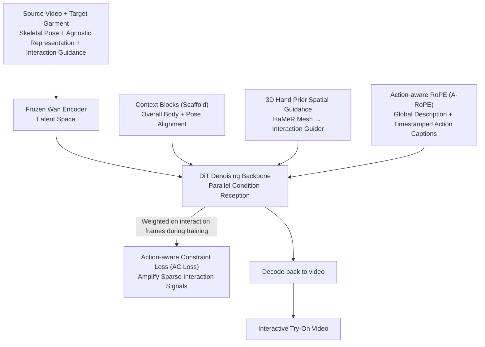

# iTryOn: Mastering Interactive Video Virtual Try-On with Spatial-Semantic Guidance

**Conference**: ICML 2026  
**arXiv**: [2605.21431](https://arxiv.org/abs/2605.21431)  
**Code**: To be confirmed  
**Area**: Video Generation / Virtual Try-On  
**Keywords**: Interactive Virtual Try-On, Video Generation, Diffusion Models, Multi-modal Conditioning

## TL;DR
iTryOn defines the "Interactive Video Virtual Try-On" task for the first time—enabling individuals in videos to **actively manipulate garments** (zipping, lifting hems, stretching fabric) rather than merely displaying them passively. By addressing spatial ambiguity with **3D hand priors**, strictly aligning timestamped action captions with corresponding frames via **Action-aware RoPE (A-RoPE)**, and amplifying learning signals for sparse interaction frames with **Action-aware Constraint Loss (AC Loss)**, it improves the Interactive Success Rate (ISR) from 0.397 to 0.610 (+54%) on the self-constructed VVT-Interact dataset.

## Background & Motivation

**Background**: Virtual try-on has evolved from static images to Video Virtual Try-On (VVT). Recent methods based on Diffusion Transformers (DiT) achieve high-fidelity spatiotemporal consistency, preserving garment textures and the natural flow of body movements.

**Limitations of Prior Work**: Existing VVT methods only handle **passive try-on scenarios** (individuals standing still or walking naturally to display clothes). They completely ignore **real-world interaction scenarios** common in e-commerce live streaming—actively zipping up, lifting garment edges, or stretching fabric to show elasticity. These interactions carry critical consumer information but cannot be generated by current models.

**Key Challenge**: Two levels of contradictions are difficult to reconcile:
- **Spatial Contradiction**: 2D skeletal poses lack Z-axis depth, making it impossible to distinguish "hand moving toward the chest to button" (interaction) vs. "hand resting on the chest" (non-interaction). Hand shape and orientation information are also lost.
- **Learning Contradiction**: Interaction frames are extremely sparse (typically only 5-10%). Gradient signals from simple non-interaction frames easily overwhelm complex action learning signals, causing models to ignore physical deformations.

**Goal**: Define and solve the Interactive VVT task, enabling models to understand "what interaction to perform," "when to interact," and "how to make physical contact."

**Key Insight**: It is observed that existing VVT lacks **spatial precision** (no explicit hand geometry) and **semantic precision** (no clear action intent or temporal boundaries). 3D hand priors resolve "spatial ambiguity," timestamped action captions resolve "semantic ambiguity," and AC Loss amplifies the weight of interaction frames.

**Core Idea**: Multi-level Interaction Injection—injecting 3D hand geometry at the spatial level, synchronized action captions at the semantic level, and amplifying learning for sparse interaction frames at the loss level.

## Method

### Overall Architecture
iTryOn enables individuals in videos to not just passively display clothes, but to actively zip, lift, or stretch fabric. Inputs include source video $V_{\text{src}}$, target garment $G$, skeletal pose $V_{\text{pose}}$, agnostic representation $V_{\text{agn}}$, and interaction guidance $\mathcal{C}$, outputting the try-on video $\hat{V}$. The pipeline first uses a frozen Wan encoder to embed the source video and conditions into latent space. The DiT backbone then **parallelly** receives three streams of conditions during denoising: Context Blocks (acting as a scaffold for overall body and skeleton), Interaction Guider for fine-grained 3D hand contact, and semantic injection via global descriptions plus timestamped action captions. After denoising, the latent is decoded back to video. Three key designs address existing gaps: 3D hand priors for spatial depth, A-RoPE for temporal alignment of actions, and AC Loss for weighting sparse interaction frames.

### Key Designs

**1. 3D Hand Prior Spatial Guidance: Restoring Missing Depth to 2D Skeletons**

2D keypoint projections cannot distinguish between "a hand moving toward the chest to button" and "a hand simply placed on the chest," nor can they differentiate hand shapes like "pinching" vs. "pressing"—Z-axis depth and finger geometry are lost. iTryOn adopts HaMeR to extract 3D hand meshes $V_{\text{hand}}$ (point clouds/mesh vertices). These are projected into feature space and processed by a lightweight Interaction Guider (convolution + self-attention) before additive fusion with DiT tokens. Using 3D meshes instead of depth maps ensures garment-agnosticism, preventing texture leakage from the source video and cleanly separating "hand movement" from "garment appearance."

**2. Action-aware RoPE (A-RoPE): Pinning Action Captions to Correct Frames**

Global captions are too vague to describe "zipping at the second second," yet directly feeding timestamped action captions causes descriptions to "leak" into non-interaction frames. A-RoPE creates "virtual temporal channels" in temporal cross-attention: a scaled 1D RoPE ($\hat{Q}_i = \text{1D-RoPE}(Q_i, i \cdot k)$) is applied to queries of each video segment $i$ to maintain global order. However, the same rotation ($\hat{K}_i = \text{1D-RoPE}(K_i, i \cdot k)$ with $k=4$) is only applied to keys of the action caption corresponding to **interaction segments**. Non-interaction segments use empty captions without positional encoding. This ensures high attention weights only for $(i, i)$ pairs where positional encodings match, making each action caption visible only to its responsible video segment, thus achieving strict alignment.

**3. Action-aware Constraint Loss (AC Loss): Prioritizing 10% Critical Frames**

Interaction frames comprise only 5-10% of the data. On the remaining 90% of simple non-interaction frames, optimizers are easily drawn to stable, easy-to-learn gradients, drowning out rare signals of complex wrinkles and deformations. AC Loss re-weights the loss by constructing a binary mask $\mathbb{M}_{\text{action}}$ (1 for interaction frames, 0 otherwise). The total loss is $\mathcal{L} = \mathcal{L}_{\text{std}} + \lambda \mathbb{E}[\|\mathbb{M}_{\text{action}} \odot (\hat{v}_\theta - v)\|_2^2]$, where $\lambda = 0.5$ and the second term penalizes only interaction frames. This adds extra supervision to sparse keyframes on top of the standard diffusion loss, forcing the model to focus on underfitted interaction events. This approach essentially transforms a "sparse imbalanced data" problem into a "sampling weight" problem.

### Training Strategy
The total loss consists of the standard diffusion loss plus the weighted interaction frame term from AC Loss ($\lambda = 0.5$). The Wan encoder is frozen, while the DiT backbone and Interaction Guider are the primary trained components.

## Key Experimental Results

### Main Results (VVT-Interact: 5292 videos, 5160 Train / 132 Test)

| Method | VFID$_I^p$ ↓ | VFID$_R^p$ ↓ | SSIM ↑ | LPIPS ↓ | FVD$^p$ ↓ | ISR$^p$ ↑ |
|------|-----------|-----------|--------|---------|---------|----------|
| ViViD | 29.83 | 1.27 | 0.726 | 0.164 | 468.5 | 0.397 |
| CatV2TON | 26.99 | 2.27 | 0.776 | 0.143 | 533.2 | 0.484 |
| MagicTryOn | 27.67 | 2.60 | 0.765 | 0.170 | 431.8 | 0.435 |
| **Ours** | **22.46** | **0.60** | **0.785** | **0.122** | **380.6** | **0.610** |

iTryOn establishes a dominant advantage, with a 26% gain in ISR.

### Ablation Study

| Configuration | VFID$_I^p$ ↓ | ISR$^p$ ↑ | Key Observation |
|------|-----------|----------|---------|
| (a) Baseline | 27.12 | 0.477 | Fails to generate interactions |
| (b) +Data | 26.65 | 0.478 | Data alone is insufficient |
| (c) +(b)+Spatial Guidance | 24.85 | 0.517 | 3D hand guidance helps |
| (d) +(c)+Semantic Guidance | 22.76 | 0.599 | A-RoPE aligns action captions |
| (e) +(d)+AC Loss | **22.46** | **0.610** | Full model performs best |

### Key Findings
- All three modules are indispensable—neither data nor single guidance alone yields significant improvements.
- The ISR metric utilizes VLMs for "semantic verification" rather than just visual quality, acknowledging the dual requirement of "physical correctness vs. semantic correctness."
- An ISR of 0.610 indicates that 61% of interactions are correctly executed (vs. 39.7% for the baseline).

## Highlights & Insights
- **A-RoPE Synchronization**: Distinguishes interaction/non-interaction segments through positional encoding rotation, preserving global temporal coherence while isolating local action descriptions. This is transferable to other tasks requiring precise alignment of temporal labels.
- **Geometric-Semantic Separation of 3D Hand Priors**: Using 3D meshes avoids depth map leakage of source garment geometry. This design philosophy can be extended to hand-object manipulation and human-tool interaction.
- **General Framework for Sparse Event Learning**: AC Loss treats sparse imbalanced data learning as a standard sampling weight problem, making the method applicable to any task involving sparse keyframes.
- **Innovative ISR Metric**: Employs VLMs for semantic verification for the first time, setting a precedent for upgrading evaluation standards in virtual try-on.

## Limitations & Future Work
- The model lacks semantic understanding of garment affordances (e.g., "this garment has a zipper"), occasionally generating "mime-like" interactions that are unfeasible.
- The ISR metric evaluates semantic success but struggles to quantify fine-grained physical accuracy (wrinkle physics, deformation angles).
- Limited interaction categories in the dataset (only 6 types); generalization to unseen interaction types remains unknown.
- 3D hand priors depend on HaMeR extraction and are sensitive to occlusion; direct learning of implicit hand representations from video could be considered.

## Related Work & Insights
- **vs. ViViD / CatV2TON / MagicTryOn**: These methods optimize for non-interactive VVT (spatiotemporal consistency, garment detail) but fail to capture interaction intent. iTryOn bridges the gap in interaction understanding through multi-modal condition fusion and re-weighted sparse supervision.
- **vs. Video Editing (ControlNet, etc.)**: Editing methods use coarse spatial conditions (bounding boxes, skeletons) to control content but lack temporal precision and physical constraints. iTryOn's A-RoPE and AC Loss could inspire future editing frameworks.
- **vs. Human-Object Interaction (HOI)**: While current HOI work focuses on recognition, this paper reframes the problem as a **generative task**, opening new directions for interaction synthesis.

## Rating
- Novelty: ⭐⭐⭐⭐⭐  First to define the Interactive VVT task; A-RoPE and AC Loss are targeted innovations.
- Experimental Thoroughness: ⭐⭐⭐⭐⭐  Includes the large-scale VVT-Interact dataset, 3 baseline comparisons, full ablation study, and both quantitative/qualitative analysis with the new ISR metric.
- Writing Quality: ⭐⭐⭐⭐  Clear logic; Figure 3 comparisons are persuasive. ISR reliance on VLMs may require further validation.
- Value: ⭐⭐⭐⭐⭐  Strong prospects in e-commerce and content creation. Open-source data, benchmarks, and technical components (A-RoPE, AC Loss) are highly transferable.

<!-- RELATED:START -->

## Related Papers

- [\[CVPR 2026\] Vanast: Virtual Try-On with Human Image Animation via Synthetic Triplet Supervision](../../CVPR2026/video_generation/vanast_virtual_try-on_with_human_image_animation_via_synthetic_triplet_supervisi.md)
- [\[CVPR 2026\] The Devil is in the Details: Enhancing Video Virtual Try-On via Keyframe-Driven Details Injection](../../CVPR2026/video_generation/the_devil_is_in_the_details_enhancing_video_virtual_try-on_via_keyframe-driven_d.md)
- [\[ICCV 2025\] SweetTok: Semantic-Aware Spatial-Temporal Tokenizer for Compact Video Discretization](../../ICCV2025/video_generation/sweettok_semantic-aware_spatial-temporal_tokenizer_for_compact_video_discretizat.md)
- [\[CVPR 2026\] SemVideo: Reconstructs What You Watch from Brain Activity via Hierarchical Semantic Guidance](../../CVPR2026/video_generation/semvideo_reconstructs_what_you_watch_from_brain_activity_via_hierarchical_semant.md)
- [\[ICML 2026\] EPiC: Efficient Video Camera Control Learning with Precise Anchor-Video Guidance](epic_efficient_video_camera_control_learning_with_precise_anchor-video_guidance.md)

<!-- RELATED:END -->
