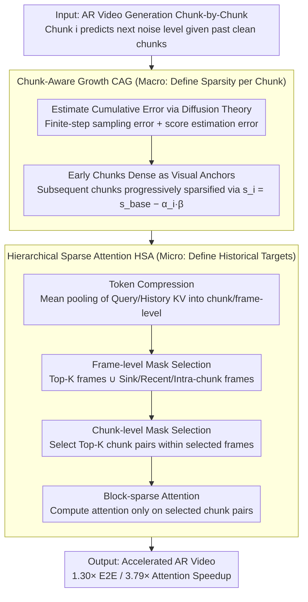

# Light Forcing: Accelerating Autoregressive Video Diffusion via Sparse Attention

**Conference**: ICML 2026  
**arXiv**: [2602.04789](https://arxiv.org/abs/2602.04789)  
**Code**: To be confirmed  
**Area**: Video Generation / Diffusion Models / Model Acceleration  
**Keywords**: Autoregressive Video Generation, Sparse Attention, Chunk-Aware Growth, Hierarchical Sparsity

## TL;DR
Light Forcing is the first sparse attention scheme customized for autoregressive (AR) video diffusion models. Chunk-Aware Growth (CAG) quantifies the cumulative error contribution of each generated chunk to dynamically allocate sparsity, while Hierarchical Sparse Attention (HSA) flexibly captures historical dependencies through frame-level → chunk-level dual-mask selection. It achieves 1.30× end-to-end / 3.79× attention speedup on Self Forcing, with a VBench total score of 84.5 > dense baseline 84.1.

## Background & Motivation

**Background**: Autoregressive video generation combines frame-by-frame generation with few-step diffusion, making it more suitable for real-time and interactive scenarios compared to bidirectional video diffusion. However, like all Transformer models, the quadratic complexity of attention is a deployment bottleneck—when Self Forcing generates the final chunk of a 480p video, attention accounts for approximately 75% of the total latency.

**Limitations of Prior Work**: Directly applying sparse attention designs intended for bidirectional models (e.g., STA / VMoBA / SLA) to AR leads to severe quality degradation:
- In AR, errors accumulate along the generation chain. Sparse attention exacerbates this accumulation, yet previous schemes ignore the **heterogeneous contribution of different chunks to global error**;
- Historical key information is underutilized—different layers, heads, and timesteps have varying needs for historical frames, and sliding windows cannot cover all critical information.

**Key Challenge**: In AR, the current chunk is predicted at the next noise level conditioned on past clean chunks. Subsequent chunks easily inherit the quality issues of preceding chunks, while simultaneously requiring flexible access to complex and diverse historical context patterns (diagonal, attention sinks, etc.), which contradicts fixed sparsification strategies.

**Goal**: Design a sparse attention framework specifically for AR video that reduces computation while preserving long-term consistency and rich motion.

**Key Insight**: Reduce cumulative error through chunk-level differentiated sparsity allocation (dense early, sparse later); use hierarchical mask selection to flexibly capture diverse historical dependencies under a fixed budget.

**Core Idea**: Utilize a theoretical framework to quantify the cumulative error of each chunk and allocate sparsity accordingly (CAG), paired with a coarse-to-fine two-level mask selection (HSA) to maintain global and local perception.

## Method

### Overall Architecture
Light Forcing addresses a specific contradiction: in autoregressive video diffusion, errors accumulate along the generation chain. Directly applying sparse attention designed for bidirectional models makes this accumulation worse, leading to a collapse in quality. Its solution is to split "macro allocation" and "micro selection" into two complementary modules: Chunk-Aware Growth (CAG) determines how sparse each chunk should be at the chunk level (dense for early chunks, sparse for later), and Hierarchical Sparse Attention (HSA) determines which historical chunks to focus on within each query chunk (via two-level masks). One controls the total budget while the other selects details, together reducing computation while maintaining long-term consistency and motion richness.

### Key Designs

**1. Chunk-Aware Growth (CAG): Early Chunks as "Visual Anchors", Sparsity Reserved for Later**

In AR, subsequent chunks inherit quality issues from previous ones. However, existing sparsity schemes treat every chunk equally, ignoring the heterogeneous contribution of different chunks to global error—the root cause of failure when applying sparsity directly. This paper derives a TV distance upper bound for the $i$-th chunk: $\text{TV}(q_t, p) \leq C_1 \frac{d^2 \log^3 T}{\sqrt{T}} + C_2 \sqrt{d} \varepsilon_{\text{score}} \log^2 T$. Based on this, early chunks retain dense attention to act as "visual anchors," while remaining chunks are progressively sparsified according to $s_i = s_{\text{base}} - \alpha_i \beta$ (where $\alpha_i$ is the noise level reached by the $i$-th chunk), with $\beta$ solved from the total FLOPs constraint $\sum_{i=2}^n (1 - s_{\text{base}} + \alpha_i \beta) l_i^q l_i^k d = (1 - s_{\text{target}}) \sum_{i=2}^n l_i^q l_i^k d$. Experiments confirm this necessity: early chunks suffer irreversible over-saturation damage if sparsified, while late chunks are almost lossless—allocating the budget to the most vulnerable early chunks is key to controlling error propagation.

**2. Hierarchical Sparse Attention (HSA): Flexible Retrieval of Diverse History within Budget**

Different layers, heads, and timesteps have varying requirements for historical frames (e.g., diagonal or attention sink patterns). Fixed sliding windows can only cover one pattern, inevitably losing key information. HSA makes this flexible via two stages: first, token compression uses mean pooling on query and historical KV to get chunk-level and frame-level representations $\tilde{q}^{(i)}, \tilde{k}^{:i}, \hat{k}^\mathcal{M}$; second, frame-level mask selection calculates frame-level relevance $p_r^{(i)} = \langle \tilde{q}_r^{(i)}, \hat{k}^\mathcal{M} \rangle$ for the $r$-th query chunk to select Top-K frames, forced to merge with a set of critical frames $\mathcal{F}^{(i)}$ (including initial sinks, recent frames, and current intra-chunk frames); finally, chunk-level mask selection picks Top-K chunk pairs based on $o_r^{(i)}(\tau, j) = \langle \tilde{q}_r^{(i)}, \tilde{k}_j^{(\tau)} \rangle$. By coarse screening frames then fine-picking chunks, both global perception and local precision are maintained, with frame-level retrieval adding only ~2% overhead. HSA and CAG are complementary—CAG sets macro sparsity, while HSA determines micro targets.

## Key Experimental Results

### Main Results (Self Forcing 1.3B, VBench, 5s Video)

| Method | Latency (s) | Speedup | Aesthetic | Imaging | Smoothness | Dynamics | Subject Consist. | Background Consist. | Total |
|------|---------|------|--------|--------|--------|--------|--------|--------|------|
| FlashAttention2 | 9.61 | 1.00× | 67.4 | 70.0 | 98.3 | 63.1 | 95.3 | 96.5 | 84.1 |
| STA | 8.27 | 1.16× | 64.5 | 71.7 | 98.5 | 48.9 | 96.3 | 96.9 | 83.6 |
| Radial | 7.39 | 1.30× | 45.8 | 66.1 | 96.0 | 88.6 | 90.2 | 93.6 | 73.7 |
| VMoBA | 7.42 | 1.29× | 65.2 | 69.9 | 97.3 | 84.2 | 92.8 | 95.5 | 83.6 |
| SLA | 7.71 | 1.25× | 66.7 | 69.8 | 98.3 | 44.2 | 95.6 | 96.7 | 83.2 |
| **Ours** | **7.39** | **1.30×** | **67.2** | **71.0** | **98.3** | **66.7** | **96.2** | **96.5** | **84.5** |

Total score of 84.5 exceeds the dense baseline of 84.1, while achieving 1.30× end-to-end and 3.79× attention speedup.

### Ablation Study

| Config | Subject | Aesthetic | Imaging | Dynamics | Total | Note |
|------|--------|------|------|------|------|------|
| FlashAttention2 | 95.3 | 67.4 | 70.0 | 63.1 | 84.1 | Full Dense |
| +1D Sparse Attn | 86.9 | 51.4 | 66.0 | 52.8 | 73.0 | Direct application collapses |
| +Fine-tuning | 94.9 | 65.1 | 69.8 | 46.4 | 82.8 | partial recovery only |
| +CAG | 96.1 | 67.7 | 71.0 | 37.5 | 83.2 | CAG improves quality but dynamics drop |
| **+CAG & HSA** | **96.2** | **67.2** | **71.0** | **66.7** | **84.5** | HSA restores dynamics, overall > baseline |

### Key Findings
- Direct application of sparse attention to AR causes severe collapse (73.0 vs 84.1); fine-tuning only partially recovers performance.
- Using CAG alone improves aesthetic/imaging quality but harms dynamics—excessive sparsity leads to over-reliance on preceding chunk priors. HSA restores dynamics via flexible historical access.
- Long video (Infinite-Forcing 15s): 84.1 vs 83.6 dense baseline, with significant dynamics Gain (64.7 vs 54.7).
- Robust HSA Top-K: Total scores remain 84.3-84.5 for Top-K = {6, 9, 12}.
- Efficient Deployment: Combined with FP8 + RoPE / RMSNorm fusion, it reaches 27.4 FPS on RTX 5090 (3.08× E2E speedup) and 33.9 FPS on H100—marking the first real-time AR video generation on consumer GPUs.

## Highlights & Insights
- **Ingenuity of Differentiated Strategy**: The derivation chain from observation (early sparsity irreversible vs late sparsity tolerable) → theory (AR cumulative error) → solution (quantified allocation) is highly persuasive.
- **Flexibility of Hierarchical Masking**: Unlike fixed sliding windows, the two-level selection (frame → chunk) maintains both global awareness and local precision. Attention pattern visualizations (diagonal, sinks) confirm its necessity.
- **Surpassing Baseline Quality**: Not only does it accelerate, but the generation quality (84.5) also exceeds the dense baseline (84.1), suggesting that standard dense attention contains significant redundancy and that proper sparsification can improve generalization.
- **Transferable Methodology**: The CAG/HSA logic can be extended to other sequential generation tasks (AR text, audio-video sync); the chunk-aware cumulative error analysis framework provides a reference for understanding error propagation in AR models.

## Limitations & Future Work
- The focus is on few-step (T=4) AR models like Self Forcing; generalization to more steps is unconfirmed.
- HSA frame-level retrieval overhead is 2%, leaving room for optimization.
- Evaluation relies heavily on VBench; cross-task evaluation (semantic consistency, multi-object tracking) would strengthen the results.
- CAG derivation assumes symmetry (identical $T$ for each chunk), which may be heterogeneous in practice.

## Related Work & Insights
- **vs Bidirectional Sparse Attention (STA / VMoBA / SLA)**: Designed for bidirectional models using chunk aggregation. This paper finds these lead to severe AR quality degradation because they ignore heterogeneous error contribution and complex history patterns.
- **vs Sliding Window Attention (LongFormer)**: Fixed windows lead to historical forgetting and long-term inconsistency; HSA uses dynamic frame retrieval to extend the receptive field while maintaining linear complexity.
- **vs Other AR Accelerations (Self Forcing / LongLive)**: Mostly improve denoising processes or KV caching. Light Forcing is orthogonal and stackable (2-3× combined speedup verified).

## Rating
- **Novelty**: ⭐⭐⭐⭐⭐ First systematic analysis of AR sparse attention failure followed by a dedicated solution; CAG and HSA are both original.
- **Experimental Thoroughness**: ⭐⭐⭐⭐ Covers multiple models, lengths, and benchmarks with complete ablations; minor drawback is reliance on automated metrics for quality.
- **Writing Quality**: ⭐⭐⭐⭐ Clear motivation, rigorous derivation, and well-organized; some math symbols are complex but overall smooth.
- **Value**: ⭐⭐⭐⭐⭐ Directly addresses a practical bottleneck for AR video, reaching real-time speeds on consumer GPUs (27.4 FPS) with open-sourced code; the theoretical framework has academic value for AR error analysis.

<!-- RELATED:START -->

## Related Papers

- [\[ICML 2026\] VEDA: Scalable Video Diffusion via Distilled Sparse Attention](veda_scalable_video_diffusion_via_distilled_sparse_attention.md)
- [\[ICML 2026\] DFSAttn: Dynamic Fine-Grained Sparse Attention for Efficient Video Generation](dfsattn_dynamic_fine-grained_sparse_attention_for_efficient_video_generation.md)
- [\[ICML 2026\] Lightning Unified Video Editing via In-Context Sparse Attention](lightning_unified_video_editing_via_in-context_sparse_attention.md)
- [\[ICML 2026\] Attention Sparsity is Input-Stable: Training-Free Sparse Attention for Video Generation via Offline Sparsity Profiling and Online QK Co-Clustering](attention_sparsity_is_input-stable_training-free_sparse_attention_for_video_gene.md)
- [\[NeurIPS 2025\] VORTA: Efficient Video Diffusion via Routing Sparse Attention](../../NeurIPS2025/video_generation/vorta_efficient_video_diffusion_via_routing_sparse_attention.md)

<!-- RELATED:END -->
