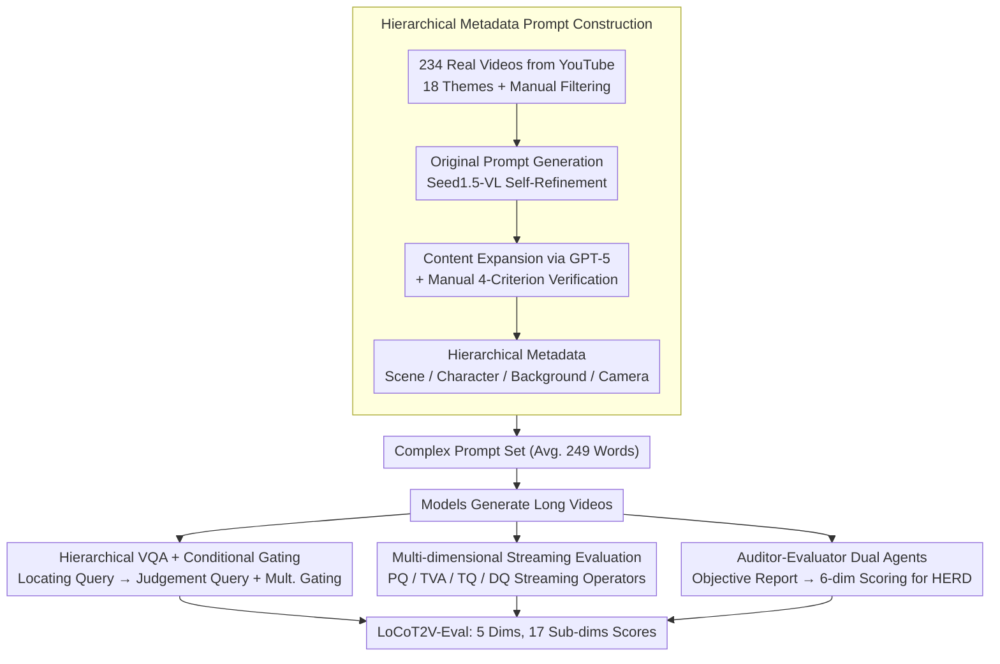

# LocoT2V-Bench: Benchmarking Long-form and Complex Text-to-Video Generation

**Conference**: ICML 2026  
**arXiv**: [2510.26412](https://arxiv.org/abs/2510.26412)  
**Code**: To be confirmed  
**Area**: Video Generation / Multimodal VLM / Evaluation Benchmark  
**Keywords**: Long Video Generation Benchmark, Complex Text Alignment, Hierarchical Metadata, Character Consistency

## TL;DR
LocoT2V-Bench is a professional benchmark designed for **long video + complex scene** generation—comprising 234 real video clips $\times$ 18 themes $\times$ an average of 249-word prompts. Accompanied by the LoCoT2V-Eval framework (5 dimensions, 17 sub-dimensions, including hierarchical VQA + conditional gating + Auditor-Evaluator dual-agent HERD), it systematically evaluates 17 long-video generation models. The results reveal a universal bottleneck: "strong perceptual quality but weak fine-grained alignment and poor character consistency."

## Background & Motivation

**Background**: Text-to-Video (T2V) has made significant progress in short videos, but generating long videos (>10 seconds, multiple scenes, complex spatial-temporal dynamics) remains an open challenge. Existing benchmarks (e.g., VBench / EvalCrafter) target short videos with simplified prompts, making them inadequate for evaluating complex scene generation.

**Limitations of Prior Work**:
- Primarily focus on frame-level visual quality and overall prompt consistency, ignoring fine-grained alignment (e.g., character attributes, specific actions).
- Metrics like CLIP-Score and FID are not well-suited for long videos and complex multi-scene prompts.
- Insufficient evaluation of character consistency, long-term temporal coherence, and high-level narrative expression.

**Key Challenge**: The gap between the professional-level control requirements (precise character settings / camera movements / multi-scene coherence) and current simplified evaluation frameworks.

**Goal**:
- Construct a long-video benchmark for professional-grade production workflows (234 real videos, 18 themes, multi-scene structured prompts).
- Design a comprehensive multi-dimensional evaluation framework covering Perceptual Quality / Text Alignment / Temporal Coherence / Dynamic Quality / Human Expectation Realization (HERD).

**Key Insight**: Leveraging real videos as anchors, utilizing hierarchical metadata (Scene / Character / Background / Camera), and employing multi-round conditional VQA for more precise evaluation of long-video generation.

**Core Idea**: **Hierarchical VQA + Conditional Gating** combined with an **Auditor-Evaluator Dual-Agent HERD** protocol to systematically evaluate models on fine-grained alignment and high-level human expectation fulfillment.

## Method

### Overall Architecture
LocoT2V-Bench targets the "blind spot" of long videos and complex prompts missed by existing benchmarks. On the data side, it collects 234 real videos from YouTube, extracts information via MLLMs and LLMs with manual verification, and reverse-constructs a set of multi-scene prompts with hierarchical metadata. On the evaluation side, LoCoT2V-Eval scores generated videos across 5 major dimensions and 17 sub-dimensions. The design is supported by four pillars: reverse-constructing metadata from real clips, using conditional gating in hierarchical VQA for fine-grained alignment, a streaming multi-dimensional framework for extremely long videos, and a dual-agent protocol for stabilizing subjective HERD assessments.

### Key Designs

**1. Hierarchical Metadata Prompt Construction: Reverse-engineering Scene/Character/Background/Camera from Real Videos**

This forms the foundation of the benchmark. Previous benchmarks often used prompts that were too simple (VBench-Long average of 7.6 words) or relied on LLMs to hallucinate descriptions. This work reverse-engineers prompts from real videos: thousands of 30-60s videos are scraped via YouTube, filtered manually for quality and relevance, leaving 234 samples. A multi-stage pipeline follows: Seed1.5-VL generates "original prompts," GPT-5 expands them into story-like prompts with detailed character settings, and humans verify them against four criteria (rationality, certainty, character completeness, consistency). The output is structured **hierarchical metadata**, providing explicit query points for evaluation and ensuring a highly challenging prompt set (avg. 248.85 words, complexity 8.70).

**2. Hierarchical VQA + Conditional Gating: Decomposing Global Alignment into Per-Character/Per-Attribute Verification**

Complex prompts contain dense details that global metrics like CLIP-Score cannot capture. This framework builds a tree-like multi-round Q&A: for each scene, it first verifies existence via a scene gate, then performs character localization and attribute verification, and finally checks background and camera movements. The "Localization Query" (e.g., "Is there a man in a red hat?") first anchors the character, followed by a "Judgement Query" (e.g., "Is this man tall?") to verify attributes. Character attribute scores are aggregated as $f^c_{\text{attr}} = \frac{1}{N_c} \sum_k y_k$, and action scores include an anchoring flag $a^c_s$: $f^c_{\text{action}} = a^c_s \cdot \frac{1}{M_c} \sum_q A(q \mid H_{N_c})$. This multiplicative gating is crucial—if the character is not localized ($a^c_s=0$), the action score becomes zero, preventing "hallucinated" high scores for non-existent characters.

**3. Multi-dimensional Streaming Evaluation Framework: Covering Pixel-level to Narrative Dimensions via Streaming Algorithms**

To handle long videos without exceeding memory limits, all metrics are implemented via streaming operators. Dimensions include Perceptual Quality (PQ), Text-Video Alignment (TVA), Temporal Quality (TQ), Dynamic Quality (DQ), and Human Expectation Realization (HERD). PQ uses DeQA-Score with multi-scale sampling: $PQ(v) = \frac{1}{|W|} \sum_w \frac{1}{n_{\alpha}} \sum_{f \in w} \text{DeQA}(f)$. Global alignment (OA) uses Qwen3-VL-8B for 0-100 scoring. Character consistency (CC) involves a "SAM3 tracking → MLLM verification → FG-CLIP2 embedding similarity" pipeline. These streaming calculations allow the evaluation of videos spanning several minutes.

**4. Auditor-Evaluator Dual Agents: Decoupling Duties for Objective "Human Expectation" Scoring**

HERD evaluates whether the video fulfills expectations implicit in the prompt, which is inherently subjective. To reduce bias and hallucinations, the work splits the task: the Auditor independently analyzes the video without seeing the prompt and produces an objective content report; the Evaluator then uses the report, prompt, and video to score 6 dimensions (Emotion, Narrative, Character Development, Visual Style, Theme Expression, Overall Impression) from 1-5. This "objective statement followed by subjective evaluation" mimics professional film review processes.

### Benchmark Data Comparison

| Benchmark | Samples | Avg. Word Count | Complexity | Features |
| :--- | :--- | :--- | :--- | :--- |
| EvalCrafter | 700 | 12.33 | 3.74 | Basic short video |
| VBench-Long | 946 | 7.64 | 2.54 | Simplified long video |
| VBench 2.0 | 90 | 125.46 | 8.13 | Complex single scene |
| **LocoT2V-Bench** | **234** | **248.85** | **8.70** | **Long + Complex + Hierarchical** |

## Key Experimental Results

### Main Results (Selected from 17 Long-Video Models)

| Method | PQ | Overall Alignment | Fine-grained Align | TVA Avg | Character Consist | Background Consist | TQ Avg | HERD | Dynamic Quality | Total |
| :--- | :--- | :--- | :--- | :--- | :--- | :--- | :--- | :--- | :--- | :--- |
| FreeNoise | 73.89 | 18.12 | 10.38 | 14.25 | 15.38 | 98.77 | 69.85 | 53.65 | 50.55 | 52.44 |
| DiTCtrl | 56.55 | 48.25 | 45.54 | 46.90 | 25.72 | 96.86 | 72.50 | 60.75 | 49.37 | 57.21 |
| LongLive | 80.51 | 55.50 | 36.15 | 45.83 | 54.92 | 99.18 | 83.66 | 81.30 | 61.52 | 70.56 |
| LongCat-Video | 77.75 | 65.59 | 51.01 | 58.30 | 42.08 | 98.31 | 78.45 | 84.80 | 59.29 | 71.72 |
| Sora2 | 66.59 | 69.64 | 54.09 | 61.87 | 45.40 | 99.10 | 80.97 | 86.42 | 64.78 | 72.13 |
| Kling 3.0 | 70.26 | 73.08 | 56.94 | 65.01 | 36.97 | 98.96 | 78.55 | 87.47 | 56.16 | 71.49 |

### Key Findings
- **High Perceptual Quality, Low Fine-grained Alignment**: PQ scores are 70-84%, but FGA scores are only 10-56% (a 2-7x difference)—models generate beautiful frames but struggle to follow complex textual constraints.
- **Superior Background Stability, Poor Character Consistency**: Background Consistency (BC) is generally 95-99%, while Character Consistency (CC) is mostly below 50% (even the best, CausVid, is only 45.97%)—models maintain environment stability but lose character identity.
- **Huge Gap between Overall and Fine-grained Alignment**: OA is 50-73%, but FGA drops to 10-56% (averaging a 40 percentage point drop)—MLLMs tend to give optimistic overall scores while overlooking specific missing details.
- **Kling 3.0 & Sora2 Lead**: Highest HERD (87.47% / 86.42%) and TVA (65.01% / 61.87%)—proprietary models show much stronger alignment with human expectations.
- **Direct Input vs. Multi-prompt**: Direct input methods (CausVid / SkyReels-V2) generally outperform multi-prompt decomposition methods (FreeNoise / MEVG) in FGA, suggesting end-to-end models handle complex text context better.

## Highlights & Insights
- **Hierarchical Metadata Design**: Unlike previous LLM-generated descriptions, metadata reverse-engineered from real videos (Scene/Character/Background/Camera) provides a ground-truth basis for fine-grained evaluation.
- **Conditional Gating VQA**: The "Localization → Judgement" switch and multiplicative gating ($a^c_s$) prevent hallucinated scoring and can be applied to other multi-round reasoning tasks.
- **Auditor-Evaluator Decoupling**: Breaks the hallucination/bias of single-agent evaluation by mimicking professional film review workflows, improving the reliability of HERD.
- **Streaming Evaluation**: Converts memory-intensive algorithms into streaming versions (multi-scale sampling, streaming optical flow), fully supporting ultralong videos.
- **Challenging Prompt Library**: The average 248.85-word count and 8.70 complexity represent the most challenging benchmark to date, reflecting the density of professional video production constraints.

## Limitations & Future Work
- The sample size of 234 is relatively small and cannot cover all edge cases.
- The 6 dimensions of HERD are subjective, and GPT-5's generated expectations may deviate from real user preferences.
- Character consistency relies on SAM3 tracking, which may accumulate errors during complex actions or long-term occlusions.
- Improvement plan: Expand samples to 500-1,000; validate HERD with more real user evaluations; improve character tracking robustness.

## Related Work & Insights
- **vs. VBench / EvalCrafter**: Those are for short videos with simple prompts; Ours uses complex multi-scene prompts + hierarchical metadata + fine-grained alignment.
- **vs. VBench 2.0**: VBench 2.0 uses complex prompts but has only 90 samples; Ours has 234 samples across 18 themes, rooted in real videos to reduce hallucination.
- **vs. Multi-prompt Methods**: Methods like Vlogger/StoryAdapter decompose prompts; Ours finds that direct input methods currently perform better as decomposition may lose context.
- **Insight**: The fine-grained hierarchical VQA framework can be transferred to 3D generation and image editing.

## Rating
- Novelty: ⭐⭐⭐⭐⭐ (First to introduce hierarchical metadata + conditional gating VQA + dual-agent HERD for long videos).
- Experimental Thoroughness: ⭐⭐⭐⭐⭐ (Evaluates 17 representative models, exposing widespread bottlenecks in character consistency).
- Writing Quality: ⭐⭐⭐⭐⭐ (Clear logic, precise methods, well-organized experiments).
- Value: ⭐⭐⭐⭐⭐ (Provides the most comprehensive benchmark for long-video generation; guides model improvement; highly transferable methodology).

<!-- RELATED:START -->

## Related Papers

- [\[ACL 2026\] OSCBench: Benchmarking Object State Change in Text-to-Video Generation](../../ACL2026/video_generation/oscbench_benchmarking_object_state_change_in_text-to-video_generation.md)
- [\[ICML 2026\] V2V-Bench: A Comprehensive Benchmark for Video-to-Video Generation Evaluation](v2v-bench_a_comprehensive_benchmark_for_video-to-video_generation_evaluation.md)
- [\[ICML 2026\] Enhancing Train-Free Infinite-Frame Generation for Consistent Long Videos](enhancing_train-free_infinite-frame_generation_for_consistent_long_videos.md)
- [\[CVPR 2026\] TiViBench: Benchmarking Think-in-Video Reasoning for Video Generation](../../CVPR2026/video_generation/tivibench_benchmarking_think-in-video_reasoning_for_video_generation.md)
- [\[CVPR 2026\] SLVMEval: Synthetic Meta Evaluation Benchmark for Text-to-Long Video Generation](../../CVPR2026/video_generation/slvmeval_synthetic_meta_evaluation_benchmark_for_text-to-long_video_generation.md)

<!-- RELATED:END -->
