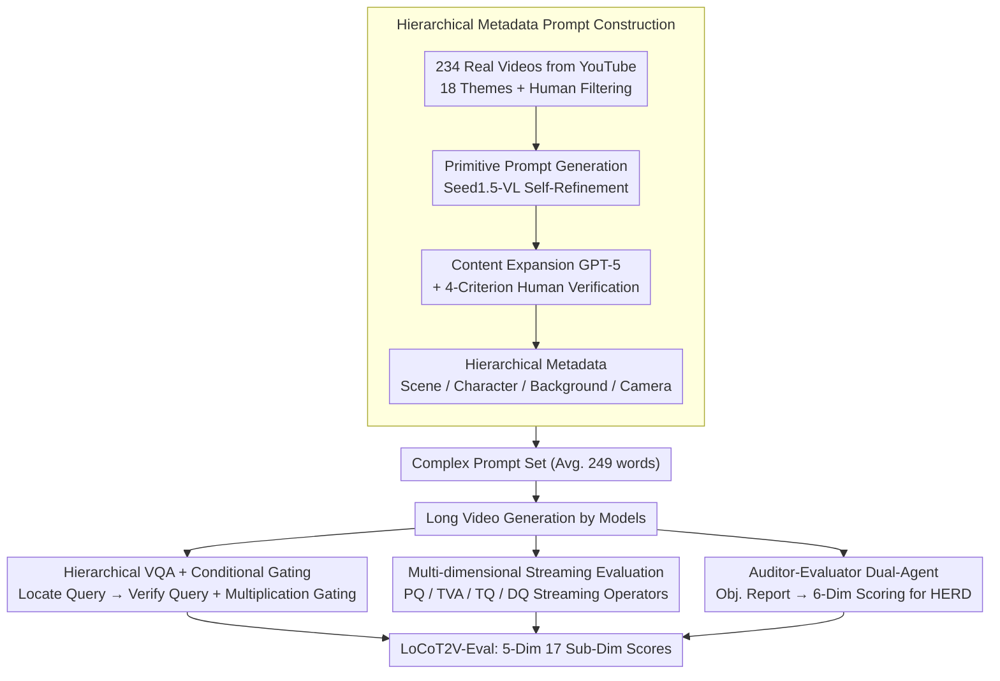

# LocoT2V-Bench: Benchmarking Long-form and Complex Text-to-Video Generation

**Conference**: ICML 2026  
**arXiv**: [2510.26412](https://arxiv.org/abs/2510.26412)  
**Code**: To be confirmed  
**Area**: Video Generation / Multimodal VLM / Evaluation Benchmark  
**Keywords**: Long-form Video Generation Benchmark, Complex Text Alignment, Hierarchical Metadata, Character Consistency

## TL;DR
LocoT2V-Bench is a professional benchmark for **long-form + complex scene** generation—featuring 234 real videos × 18 themes × 249-word average prompts. It includes the LoCoT2V-Eval framework across 5 dimensions and 17 sub-dimensions (incorporating hierarchical VQA + conditional gating + Auditor-Evaluator dual-agent HERD). Systematic evaluation of 17 long-form video generation models reveals a universal bottleneck: "strong perceptual quality, weak fine-grained alignment, and poor character consistency."

## Background & Motivation

**Background**: T2V has made significant progress in short videos, but long-form generation (> 10 seconds, multi-scene, complex spatio-temporal dynamics) remains an open problem. Existing benchmarks (VBench / EvalCrafter) target short videos with simplified prompts, making it difficult to evaluate complex scene generation.

**Limitations of Prior Work**:
- Primarily focus on frame-level visual quality and overall prompt consistency, neglecting fine-grained alignment (character attributes, actions).
- CLIP-Score / FID are ill-suited for long videos and complex multi-scene prompts.
- Insufficient evaluation of character consistency, long-term temporal coherence, and high-level narrative expression.

**Key Challenge**: The gap between the professional-grade control requirements for long-form video (precise character settings / camera movements / multi-scene coherence) and current simplified evaluation frameworks.

**Goal**:
- Construct a long-form video benchmark oriented toward professional production workflows (234 real videos, 18 themes, structured multi-scene prompts).
- Design a comprehensive multi-dimensional evaluation framework—Perceptual Quality / Text Alignment / Temporal Coherence / Dynamic Quality / Human Expectation Realization.

**Key Insight**: Starting from real videos, using hierarchical metadata (Scene / Character / Background / Camera) and multi-round conditional VQA to evaluate long-form video generation more precisely.

**Core Idea**: **Hierarchical VQA + Conditional Gating** + **Auditor-Evaluator dual-agent HERD**—systematically evaluating long-form video models on their capacity for fine-grained alignment and high-level expectation fulfillment.

## Method

### Overall Architecture
LocoT2V-Bench addresses the blind spot of "long-form + complex prompts" missed by existing benchmarks. It is divided into two parts: the data side, which extracts 234 real videos from YouTube via MLLM+LLM with human verification to reverse-construct complex prompts with hierarchical metadata; and the evaluation side, LoCoT2V-Eval, which scores generated videos across 5 major and 17 sub-dimensions. The design is supported by four pillars: reverse construction of prompts from real data, hierarchical VQA with conditional gating for precise alignment, a streaming multi-dimensional framework for ultra-long videos, and a dual-agent protocol for stabilizing subjective "human expectation" assessments.

### Key Designs

**1. Hierarchical Metadata Prompt Construction: Reverse-engineering Scene/Character/Background/Camera Prompts**

This is the foundation of the benchmark. Previous benchmarks either have overly simplified prompts or use LLMs to hallucinate long descriptions that lack structure. This work reverse-engineers prompts from real videos: thousands of 30-60s videos are sourced from YouTube, filtered for quality, and processed through a multi-stage pipeline. Seed1.5-VL generates primitive prompts via self-refinement, GPT-5 expands them into story-like prompts with detailed character settings, followed by human verification based on four criteria (rationality, certainty, character completeness, consistency). The result is structured **hierarchical metadata**, providing a clear basis for VQA evaluation with an average of 248.85 words per prompt—currently the most challenging prompt set available.

**2. Hierarchical VQA + Conditional Gating: Decomposing Coarse Alignment into Attribute-Level Verification**

Complex prompts contain dense details that CLIP scores cannot capture. This method builds a tree-like multi-round Q&A: for each scene, it first applies a scene existence gate, followed by character localization and attribute verification, then background and camera checks. The key is the coordination between "Locate Queries" ("Is there a man in a red hat?") and "Verify Queries" ("Is the man tall?"). Multiplication gating $a^c_s$ ensures that if a character is not localized, the action score is zero, preventing "hallucinated" high scores. Dialogue history $H_k = H_{k-1} \cup \{(q^{c, k}, y_k)\}$ accumulates to ensure later queries are grounded in verified context.

**3. Multi-dimensional Streaming Evaluation Framework: Covering from Pixels to Narrative via Streaming Algorithms**

This framework addresses "incomplete dimensions" and "out-of-memory" issues. It evaluates Perceptual Quality (PQ), Text-Video Alignment (TVA), Temporal Quality (TQ), Dynamic Quality (DQ), and Human Expectation Realization (HERD). PQ utilizes DeQA-Score with multi-scale frame sampling: $PQ(v) = \frac{1}{|W|} \sum_w \frac{1}{n_\alpha} \sum_{f \in w} \text{DeQA}(f)$. Global alignment (OA) uses Qwen3-VL-8B for consistency scoring, while Character Consistency (CC) employs a "SAM3 Tracking → MLLM Verification → FG-CLIP2 Embedding" pipeline. Operators are implemented via streaming (multi-scale sampling, streaming CLIP/optical flow) to enable the evaluation of videos spanning several minutes.

**4. Auditor-Evaluator Dual-Agent: Separating Responsibilities to Objectify Subjective Expectations**

HERD assessment (Human Expectation Realization Discovery) is inherently subjective. To mitigate hallucination or bias, the task is split: the Auditor independently analyzes the video without seeing the ground-truth "expectations" and produces an objective content report; the Evaluator then uses this report to score 6 dimensions (Emotion, Narrative, Character Development, Visual Style, Thematic Expression, Overall Impression) on a 1-5 scale. This weighted aggregation $S_{\text{HERD}} = \frac{1}{|D|} \sum_d s_d$ ensures every score is rooted in specific evidence from the Auditor's report.

### Data Construction Comparison

| Benchmark | Samples | Avg. Words | Complexity | Features |
|------|------|---------|--------|------|
| EvalCrafter | 700 | 12.33 | 3.74 | Basic short video |
| VBench-Long | 946 | 7.64 | 2.54 | Simplified long video |
| VBench 2.0 | 90 | 125.46 | 8.13 | Complex single scene |
| **LocoT2V-Bench** | **234** | **248.85** | **8.70** | **Long-form + Complex + Hierarchical Metadata** |

## Key Experimental Results

### Main Results (17 Long-form Models, Selected)

| Method | PQ | OA | FGA | TVA Mean | CC | BC | TQ Mean | HERD | DQ | Overall |
|------|--------|--------|---------|--------|--------|--------|-------|------|--------|------|
| FreeNoise | 73.89 | 18.12 | 10.38 | 14.25 | 15.38 | 98.77 | 69.85 | 53.65 | 50.55 | 52.44 |
| DiTCtrl | 56.55 | 48.25 | 45.54 | 46.90 | 25.72 | 96.86 | 72.50 | 60.75 | 49.37 | 57.21 |
| LongLive | 80.51 | 55.50 | 36.15 | 45.83 | 54.92 | 99.18 | 83.66 | 81.30 | 61.52 | 70.56 |
| LongCat-Video | 77.75 | 65.59 | 51.01 | 58.30 | 42.08 | 98.31 | 78.45 | 84.80 | 59.29 | 71.72 |
| Sora2 | 66.59 | 69.64 | 54.09 | 61.87 | 45.40 | 99.10 | 80.97 | 86.42 | 64.78 | 72.13 |
| Kling 3.0 | 70.26 | 73.08 | 56.94 | 65.01 | 36.97 | 98.96 | 78.55 | 87.47 | 56.16 | 71.49 |

### Key Findings
- **High PQ, Weak FGA**: PQ scores range from 70-84%, but FGA (Fine-Grained Alignment) is only 10-56%—a 2-7 fold difference—indicating models generate high-quality frames but struggle to follow complex textual constraints precisely.
- **Superior BC, Poor CC**: BC (Background Consistency) is consistently 95-99%, but CC (Character Consistency) is mostly < 50%—models maintain environmental stability but fail to preserve character identity.
- **Gap between Overall and Fine-grained Alignment**: OA is 50-73%, while FGA is 10-56% (an average drop of 40 points)—MLLMs tend to give optimistic overall scores while overlooking missing details.
- **Kling 3.0 / Sora2 Leadership**: HERD peaks at 87.47% / 86.42% and TVA at 65.01% / 61.87%—proprietary models show stronger alignment with human expectations.
- **Direct Input vs. Multi-Prompt**: Direct input methods (CausVid / SkyReels-V2) generally outperform multi-prompt decomposition methods (FreeNoise / MEVG) in FGA, suggesting end-to-end approaches handle complex text better.

## Highlights & Insights
- **Hierarchical Metadata Design**: Unlike prior LLM-generated long descriptions, reverse-constructing hierarchical metadata from real videos provides a structured basis for scene-by-scene and character-by-character evaluation.
- **Conditional Gating VQA**: The "Locate → Verify" multi-round dialogue switch with multiplication gating $a^c_s$ effectively prevents phantom scoring and is transferable to other multi-round reasoning tasks.
- **Auditor-Evaluator Decoupling**: Breaking the hallucination/bias of single-agent evaluation by mimicking film review processes strengthens the reliability of subjective metrics like HERD.
- **Streaming Evaluation**: Modifying memory-intensive algorithms into streaming formats (multi-scale sampling, streaming CLIP / Optical Flow) enables the evaluation of ultra-long videos.
- **Complex Prompt Library**: (248.85 words, 8.70 complexity) serves as the most challenging benchmark to date, reflecting the high constraint density of professional video production.

## Limitations & Future Work
- The sample size of 234 is relatively small and cannot cover all edge cases or extreme scenarios.
- The 6-dimension definition for HERD remains subjective; gaps may exist between GPT-5's generated expectations and actual user needs.
- Character consistency relies on SAM3 tracking, which may accumulate errors during complex motions, occlusions, or long-term trajectories.
- The evaluation toolchain depends on multiple models, making it complex to deploy and sensitive to tool versioning.
- Future Work: Expand sample size to 500-1000, incorporate real user validation for HERD, and improve character tracking robustness.

## Related Work & Insights
- **vs. VBench / EvalCrafter**: These were designed for short videos with simple prompts; Ours uses complex multi-scene prompts + hierarchical metadata + fine-grained alignment.
- **vs. VBench 2.0**: VBench 2.0 uses 125-word complex prompts but only 90 samples; Ours provides 249 words × 234 samples × 18 themes, derived from real videos to reduce hallucination.
- **vs. Multi-Prompt Methods**: Methods like Vlogger use LLMs to decompose long prompts; Ours finds that direct input methods currently perform better as decomposition may lose context.
- **Insights**: The fine-grained evaluation framework (Conditional VQA) is transferable to 3D generation and image editing. Hierarchical metadata offers a systematic path for building future complex prompt benchmarks.

## Rating
- Novelty: ⭐⭐⭐⭐⭐ (First to introduce hierarchical metadata + conditional gating VQA + HERD for long-form T2V).
- Experimental Thoroughness: ⭐⭐⭐⭐⭐ (Evaluated 17 representative models, uncovering universal consistency and alignment bottlenecks).
- Writing Quality: ⭐⭐⭐⭐⭐ (Clear logic, precise methods, well-organized experiments, and actionable conclusions).
- Value: ⭐⭐⭐⭐⭐ (Provides the most comprehensive long-form benchmark; guiding model improvements through identified bottlenecks).

<!-- RELATED:START -->

## Related Papers

- [\[ACL 2026\] OSCBench: Benchmarking Object State Change in Text-to-Video Generation](../../ACL2026/video_generation/oscbench_benchmarking_object_state_change_in_text-to-video_generation.md)
- [\[ICML 2026\] Enhancing Train-Free Infinite-Frame Generation for Consistent Long Videos](enhancing_train-free_infinite-frame_generation_for_consistent_long_videos.md)
- [\[ICML 2026\] Quant VideoGen: Auto-Regressive Long Video Generation via 2-Bit KV-Cache Quantization](quant_videogen_auto-regressive_long_video_generation_via_2-bit_kv-cache_quantiza.md)
- [\[CVPR 2026\] SLVMEval: Synthetic Meta Evaluation Benchmark for Text-to-Long Video Generation](../../CVPR2026/video_generation/slvmeval_synthetic_meta_evaluation_benchmark_for_text-to-long_video_generation.md)
- [\[ICML 2026\] T2AV-Compass: Towards Unified Evaluation for Text-to-Audio-Video Generation](t2av-compass_towards_unified_evaluation_for_text-to-audio-video_generation.md)

<!-- RELATED:END -->
