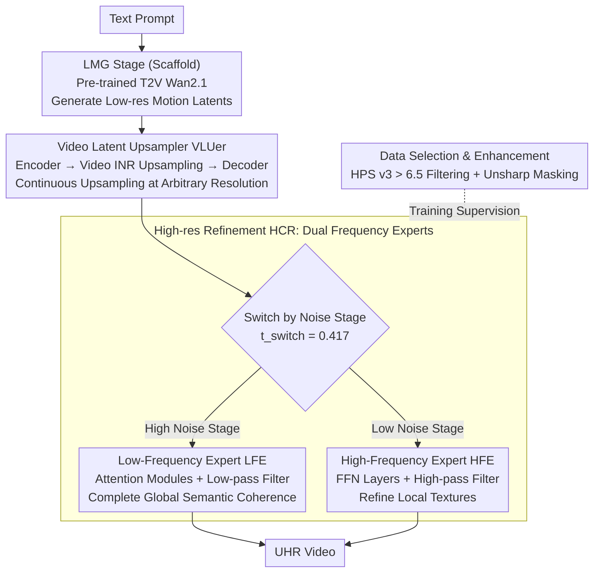

# LuVe: Latent-Cascaded Ultra-High-Resolution Video Generation with Dual Frequency Experts

**Conference**: ICML 2026  
**arXiv**: [2602.11564](https://arxiv.org/abs/2602.11564)  
**Code**: TBD  
**Area**: Video Generation / Ultra-High Resolution  
**Keywords**: Ultra-High-Resolution Video Generation, Diffusion Models, Dual Frequency Experts, Latent Space Upsampling, Cascaded Architecture

## TL;DR
LuVe redefines UHR video generation from "passive detail enhancement" to "active content completion." Through a three-stage cascade (Low-res Motion → Latent Upsampling → High-res Refinement) and dual frequency experts driven by frequency domain analysis (Low-Frequency Expert for global semantic consistency and High-Frequency Expert for texture refinement), LuVe achieves a total score of 84.03 on VBench 4K, surpassing UltraWan-4K's 83.75.

## Background & Motivation

**Background**: Significant progress has been made in low-resolution video diffusion, but quality degrades severely at ultra-high resolution (UHR). Existing solutions fall into three categories: training-free (modifying inference strategies without retraining), fine-tuning strategies (adapting to UHR datasets), and video super-resolution (VSR; generating at low-res then upsampling frame-by-frame).

**Limitations of Prior Work**:
- Training-free methods suffer from over-smoothed textures and missing high-frequency information, as the base T2V model has not seen UHR data and lacks inherent UHR capacity.
- VSR methods improve clarity but only perform low-level texture enhancement, failing to complete missing semantic structures and content.
- Directly training UHR models faces a triple coupling challenge: (1) **Motion modeling difficulty**—high-res scales limit temporal modules; (2) **Semantic planning failures**—spatial expansion leads to global/local repetition or inconsistency; (3) **Insufficient detail synthesis**—exhibiting motion blur, texture degradation, and high-frequency loss.

**Key Challenge**: Existing cascaded paradigms (e.g., FlashVideo, LaVie, Waver) restrict the high-resolution stage to being a "detail enhancer," which only improves low-level visual attributes and cannot perform true content and semantic completion.

**Goal**: To redefine the cascaded paradigm for UHR generation—not only enhancing details but also strengthening global semantic coherence and content fidelity.

**Key Insight**: Stage-wise behavior in the diffusion process is observed through Power Spectral Density (PSD) analysis: high-noise stages capture low-frequencies (global structure), while low-noise stages synthesize high-frequencies (details). This observation informs the design of specialized expert modules with clear division of labor.

**Core Idea**: Replace the traditional two-stage cascade with a three-stage LMG → VLU → HCR process. By deploying low-frequency and high-frequency experts at different diffusion stages, frequency domain constraints are applied to the diffusion process, realizing a complete workflow of motion prior establishment → intelligent latent upsampling → joint semantic-detail completion.

## Method

### Overall Architecture
LuVe shifts ultra-high-resolution video generation from "passive detail polishing" to "active content completion." Instead of merely sharpening the image, it completes the semantic structures missing from the low-resolution stage. It replaces the traditional two-stage cascade with three stages: First, a pre-trained T2V model (Wan2.1-1.3B) generates video latents at low resolution to establish reliable temporal motion priors (LMG). Second, a specialized upsampler performs continuous upsampling to arbitrary resolutions in the latent space, avoiding the massive overhead of VAE encoding/decoding (VLU). Finally, in the high-resolution stage, both low-frequency and high-frequency experts are integrated—one managing global semantic coherence and the other refining texture details (HCR). While LMG leverages a pre-trained T2V, the three core designs of this work lie in the latter two stages: the latent upsampler (VLUer), the dual frequency expert division (HCR), and the data recipe.

### Key Designs

**1. Video Latent Upsampler VLUer: Continuous upsampling in latent space to bypass E/D bottlenecks**

Traditional methods either interpolate in the latent space (leading to latent manifold deviation and blocky artifacts) or revert to RGB interpolation (requiring repeated VAE encoding/decoding with massive overhead). VLUer adopts an implicit neural representation (INR): an encoder extracts features $F$ from low-res latents $z_0^L$, a video INR upsampler maps features using 3D coordinates $Q(x, y, t)$, and a decoder learns spatio-temporal representations in the high-res latent domain to reconstruct $\hat{z}(x, y, t) = \text{Decoder}(U(F, Q(x, y, t)))$. Training consists of two phases: initial latent-domain L1 loss $\mathcal{L}_{\text{latent}} = \mathcal{L}_1(z_{sr}, z_{hr})$, followed by pixel-level supervision and frame difference loss $\mathcal{L}_{\text{pixel}} = \mathcal{L}_1(x_{sr}, x_{hr}) + \mathcal{L}_{\text{frame}}$, where $\mathcal{L}_{\text{frame}} = \frac{1}{n-1} \sum_{t=2}^n \|\Delta x_{sr}^{(t)} - \Delta x_{hr}^{(t)}\|_1$. Pixel-level loss eliminates blocky artifacts, while frame difference loss constrains motion consistency between adjacent frames, ensuring clear and jitter-free upsampling at any resolution.

**2. Dual Frequency Experts: Assigning frequencies to specific denoising stages**

PSD analysis reveals that the denoising process in Wan2.1 naturally exhibits frequency domain division: high-noise stages build low-frequency global structures, while low-noise stages synthesize high-frequency details. LuVe deploys two specialized LoRA experts accordingly: the Low-Frequency Expert (LFE) is trained during high-noise stages ($t \in [t_{\text{switch}}, 1]$) and integrated into DiT attention modules $y = \text{Attention}(x) + \text{LoRA}(\text{LowPass}(x))$, utilizing the global receptive field of attention for semantic planning. The High-Frequency Expert (HFE) is trained during low-noise stages ($t \in [0, t_{\text{switch}}]$) and integrated into FFN layers $y = \text{FFN}(x) + \text{LoRA}(\text{HighPass}(x))$, focusing on local textures. The switch point is set at $t_{\text{switch}} = 0.417$. This design achieves consistency across three levels: modules (Attention for global, FFN for local), time (High noise for LF, Low noise for HF), and filtering (Low/high-pass ensuring experts focus only on their respective frequency bands).

**3. Data Selection & Enhancement: Specialized training data for distinct experts**

The two experts require different types of training data. LFE requires semantically clean, globally consistent samples; thus, UltraVideo is scored using HPS v3, retaining only high-quality clips (> 6.5). HFE requires samples with rich texture boundaries; therefore, Unsharp Masking is applied to the LFE-filtered subset to deliberately amplify high-frequency components and boundary sharpness. This task-specialized data distribution ensures each expert receives optimal supervision in its targeted frequency band—removing Unsharp Masking increases FID_patch from 41.03 to 42.96.

## Key Experimental Results

### Main Results (VBench)

| Model | SC ↑ | BC ↑ | TF ↑ | IQ ↑ | AQ ↑ | Average ↑ |
|------|------|------|------|------|------|--------|
| Wan2.1-720p | 95.70 | 96.05 | 98.45 | 68.28 | 56.46 | 82.98 |
| UltraWan-1K | 95.40 | 96.45 | 98.98 | 58.26 | 49.89 | 79.79 |
| UltraWan-4K | 95.81 | 96.11 | 97.71 | 71.44 | 57.69 | 83.75 |
| CineScale-4K | 95.16 | 95.95 | 97.80 | 67.74 | 57.82 | 82.89 |
| **Ours-2K** | **95.83** | **96.76** | **98.18** | **71.15** | **59.78** | **84.34** |
| **Ours-4K** | **95.36** | **96.46** | **98.09** | **71.33** | **58.91** | **84.03** |

The 4K overall score of 84.03 exceeds UltraWan-4K (83.75) and CineScale-4K (82.89).

### Ablation Study

| Configuration | Mode | FID_patch ↓ | Realism ↑ | AQ ↑ |
|------|------|------------|--------|------|
| UHR scaling only | End-to-End | 54.10 | 6.72 | 57.04 |
| LoRA Experts | Cascaded | 47.03 | 7.28 | 58.65 |
| w/o Experts | Cascaded | 46.48 | 7.00 | 58.57 |
| w/o LF Expert | Cascaded | 43.86 | 7.08 | 59.10 |
| w/o HF Expert | Cascaded | 44.44 | 7.36 | 59.34 |
| w/o Data Selection | Cascaded | 43.77 | 7.40 | 58.80 |
| w/o Unsharp Masking | Cascaded | 42.96 | 7.52 | 59.53 |
| **Full Model** | Cascaded | **41.03** | **7.64** | **59.78** |

### Comparison with VSR Methods (VSR applied to generated videos)

| Method | MUSIQ ↑ | MANIQA ↑ | NIQE ↓ | DOVER ↑ |
|------|---------|---------|--------|---------|
| RealBasicVSR | 55.90 | 0.401 | 4.15 | 0.712 |
| FlashVSR | 56.54 | 0.402 | 3.20 | 0.755 |
| **Ours** | **58.01** | **0.410** | **3.16** | **0.784** |

### Key Findings
- **Cruciality of LFE**: Removing the LF expert increases FID_patch from 41.03 to 43.86 (+6.9%). Qualitative analysis shows scattered attention maps, semantic planning failures, and content artifacts.
- **HFE Contribution**: Removing the HF expert increases FID_patch to 44.44 (+8.3%), resulting in visually blurred textures and loss of detail.
- **Data Strategy**: Removing Unsharp Masking results in FID_patch of 42.96 vs 41.03 (-4.7%), demonstrating that data enhancement for the high-frequency expert is essential.
- **Human Evaluation**: Evaluated across 60 videos by 20 reviewers; the proposed method leads significantly in all dimensions (> 60% preference rate)—Overall Quality 63.5% / Details 60.3% / Temporal Consistency 62.3% / Text Alignment 61.1%.

## Highlights & Insights
- **Strategic Value of Paradigm Shift**: Moving from passive "detail enhancement" to "active content completion" redefines the role of the high-resolution stage; it upgrades the UHR problem from "how to be clearer" to "how to be more realistic and richer."
- **Elegant Frequency Domain Decoupling**: Identifying and exploiting the inherent frequency domain structure of the diffusion process via PSD analysis. The mapping of low/high-pass filters to specialized LoRA experts reflects a deep understanding of diffusion model mechanics.
- **Self-Consistency in Tiered Design**: Consistency in module selection (Attention → Global → LFE; FFN → Local → HFE) + consistency in temporal division (High noise → Low frequency → LFE; Low noise → High frequency → HFE) + consistency in data strategy (HPS filtering + Unsharp Masking).
- **Parameter Efficiency**: Implemented via LoRA, the total trainable parameters are far fewer than full fine-tuning.
- **Transferable Design**: The concept of frequency domain decomposition + stage-wise experts can be generalized to other multi-stage generation tasks (e.g., text-to-image super-resolution, multimodal generation).

## Limitations & Future Work
- VLUer inference introduces a 0.922s/frame latency compared to latent interpolation (0.004s); industrial-level real-time applications require further acceleration.
- The method depends on high-quality UHR video data (UltraVideo dataset) and is sensitive to data distribution.
- Improvements: Exploring more efficient latent space upsampling operators (distillation/knowledge transfer); investigating adaptive frequency switching instead of fixed $t_{\text{switch}} = 0.417$; extending to more tasks and architectures.

## Related Work & Insights
- **vs. Training-free Methods** (e.g., Demofusion, LSRNA): These extend pre-trained models to high resolution by modifying inference. While computationally efficient, they are limited by the base model's generative capacity. Ours actively enhances generation via frequency experts.
- **vs. Traditional VSR** (e.g., RealBasicVSR, VEnhancer): VSR modules are trained independently and cannot recover semantic information lost during low-resolution generation. Ours employs tight cascading and frequency expert coordination for joint semantic-detail optimization.
- **vs. Existing Cascaded Methods** (e.g., FlashVideo, LaVie, Waver): Prior schemes restrict the high-res stage to passive enhancement. Ours breaks this bottleneck by involving the high-res stage in content completion and semantic fidelity.

## Rating
- Novelty: ⭐⭐⭐⭐⭐ Paradigm innovation (detail enhancement to content completion) + frequency decomposition design with both theoretical depth and engineering value.
- Experimental Thoroughness: ⭐⭐⭐⭐⭐ Comprehensive cross-dimensional comparisons (VBench / FID_patch / Custom ratings vs. T2V / VSR / Human Eval) + detailed incremental ablation.
- Writing Quality: ⭐⭐⭐⭐ Rigorous logic; PSD analysis deeply motivates the design; method description is clear and reproducible.
- Value: ⭐⭐⭐⭐⭐ Addresses actual UHR generation bottlenecks (semantic consistency + detail fidelity), holding significant value for both academia and industry.

<!-- RELATED:START -->

## Related Papers

- [\[ICCV 2025\] Dual-Expert Consistency Model for Efficient and High-Quality Video Generation](../../ICCV2025/video_generation/dual-expert_consistency_model_for_efficient_and_high-quality_video_generation.md)
- [\[ICLR 2026\] Dual-IPO: Dual-Iterative Preference Optimization for Text-to-Video Generation](../../ICLR2026/video_generation/dual-ipo_dual-iterative_preference_optimization_for_text-to-video_generation.md)
- [\[CVPR 2026\] STCDiT: Spatio-Temporally Consistent Diffusion Transformer for High-Quality Video Super-Resolution](../../CVPR2026/video_generation/stcdit_spatio-temporally_consistent_diffusion_transformer_for_high-quality_video.md)
- [\[ICML 2026\] OLAF-World: Orienting Latent Actions for Video World Modeling](olaf-world_orienting_latent_actions_for_video_world_modeling.md)
- [\[CVPR 2026\] Dual-Granularity Memory for Efficient Video Generation](../../CVPR2026/video_generation/dual-granularity_memory_for_efficient_video_generation.md)

<!-- RELATED:END -->
