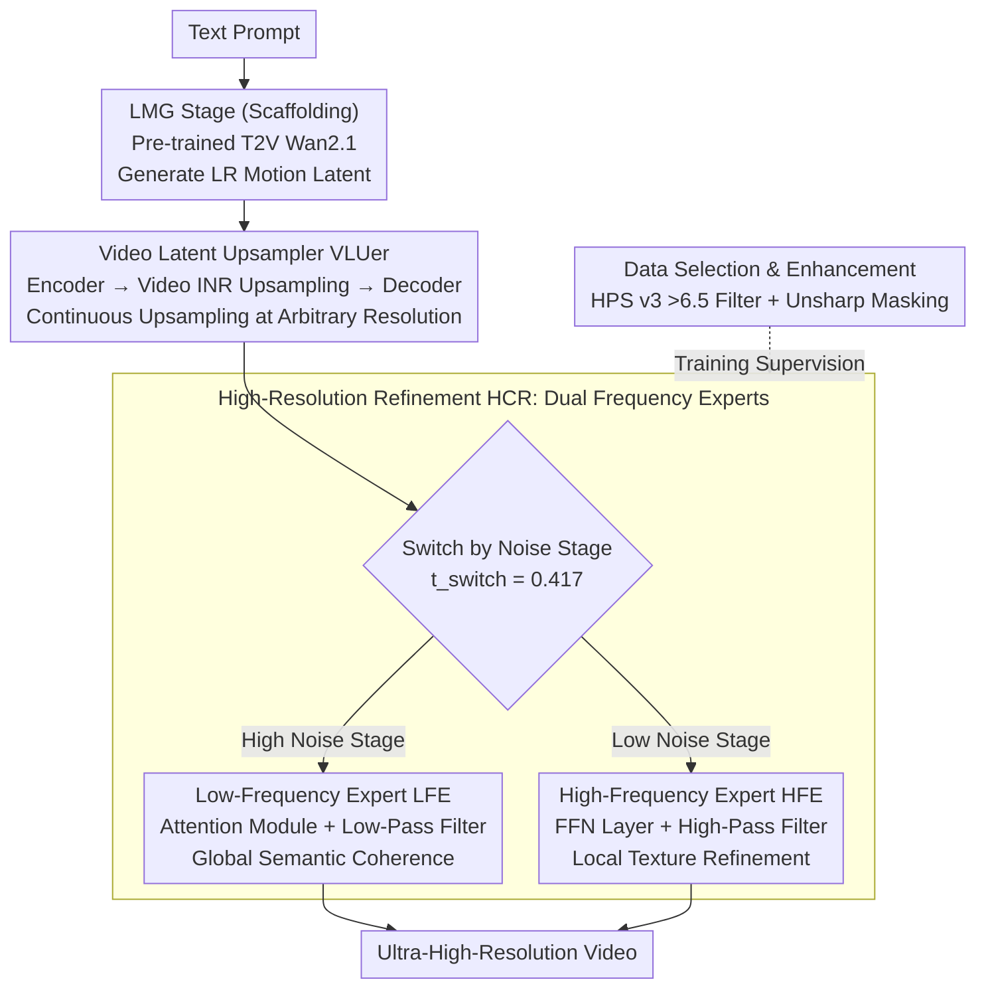

# LuVe: Latent-Cascaded Ultra-High-Resolution Video Generation with Dual Frequency Experts

**Conference**: ICML 2026  
**arXiv**: [2602.11564](https://arxiv.org/abs/2602.11564)  
**Code**: To be confirmed  
**Area**: Video Generation / Ultra-High-Resolution  
**Keywords**: Ultra-High-Resolution Video Generation, Diffusion Models, Dual Frequency Experts, Latent Space Upsampling, Cascaded Architecture

## TL;DR
LuVe redefines UHR video generation from "passive detail enhancement" to "active content completion." Through a three-stage cascade (Low-Resolution Motion → Latent Space Upsampling → High-Resolution Refinement) and frequency domain analysis-driven Dual Frequency Experts (Low-Frequency Expert for global semantic consistency, High-Frequency Expert for texture refinement), it achieves a total score of 84.03 on VBench 4K, surpassing UltraWan-4K's 83.75.

## Background & Motivation

**Background**: Video diffusion has made significant progress at low resolutions, but ultra-high-resolution (UHR) quality degrades severely. Existing solutions fall into three categories: training-free (modifying inference strategies without retraining), fine-tuning strategies (UHR dataset adaptation), and Video Super-Resolution (VSR, generating at low resolution then upsampling frame-by-frame).

**Limitations of Prior Work**:
- Training-free methods suffer from over-smoothed textures and missing high-frequency information, as the base T2V model has not seen UHR data and lacks endogenous capability.
- VSR methods improve clarity but only perform low-level texture enhancement, failing to complete missing semantic structures and content.
- Direct training of UHR models faces a triple coupling challenge: (1) **Motion modeling difficulty**—limitations of temporal modules when scaling spatial resolution; (2) **Semantic planning failures**—spatial expansion leads to global and local repetitions or inconsistencies; (3) **Insufficient detail synthesis**—motion blur, texture degradation, and missing high-frequency information.

**Key Challenge**: Existing cascaded paradigms (FlashVideo / LaVie / Waver) restrict the high-resolution stage to a "detail enhancer," which can only improve low-level visual attributes and cannot perform true content and semantic completion.

**Goal**: To redefine the cascaded paradigm for UHR generation—not only enhancing details but also strengthening global semantic coherence and content fidelity.

**Key Insight**: Observe the phasic nature of the diffusion process through Power Spectral Density (PSD) analysis—the high-noise stage captures low frequencies (global structure), while the low-noise stage synthesizes high frequencies (details). This observation leads to the design of expert modules with clear division of labor.

**Core Idea**: Replace the traditional two-stage cascade with an LMG → VLU → HCR three-stage pipeline. By deploying Low-Frequency and High-Frequency Experts at different diffusion stages to impose frequency domain constraints, the process achieves a complete flow: establishing motion priors → intelligent latent upsampling → joint semantic-detail completion.

## Method

### Overall Architecture
LuVe aims to transform ultra-high-resolution video generation from "passive detail polishing" to "active content completion"—not just clarifying the image, but completing semantic structures missing from the low-resolution stage. It replaces the traditional two-stage cascade with three stages: first, a pre-trained T2V (Wan2.1-1.3B) generates video latent codes at low resolution to establish reliable temporal motion priors (LMG); then, a specialized upsampler performs continuous upsampling at arbitrary resolutions in the latent space to avoid the massive overhead of VAE encoding/decoding (VLU); finally, in the high-resolution stage, both low-frequency and high-frequency experts are integrated—one managing global semantic coherence and the other refining texture details (HCR). While LMG leverages a pre-trained T2V and is not the primary contribution, the three key designs lie in the latter two stages: maintaining the latent manifold (VLUer), the division of labor between dual-frequency experts (HCR), and the specialized data used for training.

### Key Designs

**1. Video Latent Upsampler VLUer: Continuous upsampling in latent space to bypass encoding/decoding bottlenecks**

Traditional methods either interpolate on latents (causing deviations from the latent manifold and block artifacts) or convert back to RGB for interpolation (requiring repeated VAE encoding/decoding with massive overhead). VLUer adopts an Implicit Neural Representation (INR): the encoder first extracts feature $F$ from low-resolution latent $z_0^L$, the video INR upsampler maps features using 3D coordinates $Q(x, y, t)$, and the decoder learns spatio-temporal representations in the high-resolution latent domain to reconstruct $\hat{z}(x, y, t) = \text{Decoder}(U(F, Q(x, y, t)))$. Training occurs in two stages: first using only the latent domain L1 loss $\mathcal{L}_{\text{latent}} = \mathcal{L}_1(z_{sr}, z_{hr})$, then adding pixel supervision and frame difference loss $\mathcal{L}_{\text{pixel}} = \mathcal{L}_1(x_{sr}, x_{hr}) + \mathcal{L}_{\text{frame}}$, where frame difference is $\mathcal{L}_{\text{frame}} = \frac{1}{n-1} \sum_{t=2}^n \|\Delta x_{sr}^{(t)} - \Delta x_{hr}^{(t)}\|_1$. Pixel-level loss suppresses block artifacts, while frame difference loss explicitly constrains motion consistency between adjacent frames, ensuring arbitrary resolution upsampling is both clear and stable.

**2. Dual Frequency Experts: Assigning frequencies to specific diffusion denoising stages**

PSD spectral analysis reveals that the denoising process of Wan2.1 possesses an inherent frequency domain division—the high-noise stage primarily builds low-frequency global structures, while the low-noise stage synthesizes high-frequency details. LuVe follows this structure by deploying two specialized LoRA experts: the Low-Frequency Expert (LFE) is trained in the high-noise stage ($t \in [t_{\text{switch}}, 1]$), integrated into the DiT attention module as $y = \text{Attention}(x) + \text{LoRA}(\text{LowPass}(x))$, utilizing the natural global receptive field of attention for semantic planning. The High-Frequency Expert (HFE) is trained in the low-noise stage ($t \in [0, t_{\text{switch}}]$), integrated into the FFN layer as $y = \text{FFN}(x) + \text{LoRA}(\text{HighPass}(x))$, focusing on local textures. The switching point is set at $t_{\text{switch}} = 0.417$. This design is self-consistent across three aspects: modules (Attention for global, FFN for local), time (high noise for low frequency, low noise for high frequency), and filtering (low-pass/high-pass filters ensuring experts focus on their respective bands). LoRA ensures that total trainable parameters are significantly fewer than full fine-tuning.

**3. Data Selection and Enhancement Strategy: Tailored training data for dual experts**

The two experts learn different components, making uniform data inefficient. LFE requires semantically clean, globally consistent samples; therefore, UltraVideo is scored using HPS v3, retaining only high-quality segments with scores > 6.5. HFE requires samples with rich texture boundaries; thus, Unsharp Masking is applied to the LFE-filtered subset to intentionally amplify high-frequency components and boundary sharpness. This task-specific data distribution ensures each expert receives optimal supervision in its specialized frequency band—removing Unsharp Masking in ablations results in FID_patch degrading from 41.03 to 42.96.

## Key Experimental Results

### Main Results (VBench)

| Model | SC ↑ | BC ↑ | TF ↑ | IQ ↑ | AQ ↑ | Average ↑ |
|------|------|------|------|------|------|--------|
| Wan2.1-720p | 95.70 | 96.05 | 98.45 | 68.28 | 56.46 | 82.98 |
| UltraWan-1K | 95.40 | 96.45 | 98.98 | 58.26 | 49.89 | 79.79 |
| UltraWan-4K | 95.81 | 96.11 | 97.71 | 71.44 | 57.69 | 83.75 |
| CineScale-4K | 95.16 | 95.95 | 97.80 | 67.74 | 57.82 | 82.89 |
| **Ours-2K** | **95.83** | **96.76** | **98.18** | **71.15** | **59.78** | **84.34** |
| **Ours-4K** | **95.36** | **96.46** | **98.09** | **71.33** | **58.91** | **84.03** |

At 4K, the model achieves an overall score of 84.03, surpassing UltraWan-4K (83.75) and CineScale-4K (82.89).

### Ablation Study

| Configuration | Mode | FID_patch ↓ | Realism ↑ | AQ ↑ |
|------|------|------------|--------|------|
| UHR scaling only | End-to-end | 54.10 | 6.72 | 57.04 |
| LoRA Experts | Cascade | 47.03 | 7.28 | 58.65 |
| w/o Experts | Cascade | 46.48 | 7.00 | 58.57 |
| w/o LF Expert | Cascade | 43.86 | 7.08 | 59.10 |
| w/o HF Expert | Cascade | 44.44 | 7.36 | 59.34 |
| w/o Data Selection | Cascade | 43.77 | 7.40 | 58.80 |
| w/o Unsharp Masking | Cascade | 42.96 | 7.52 | 59.53 |
| **Full Model** | Cascade | **41.03** | **7.64** | **59.78** |

### Comparison with VSR Methods (VSR applied on VBench generation)

| Method | MUSIQ ↑ | MANIQA ↑ | NIQE ↓ | DOVER ↑ |
|------|---------|---------|--------|---------|
| RealBasicVSR | 55.90 | 0.401 | 4.15 | 0.712 |
| FlashVSR | 56.54 | 0.402 | 3.20 | 0.755 |
| **Ours** | **58.01** | **0.410** | **3.16** | **0.784** |

### Key Findings
- **Cruciality of LFE**: Removing the LF expert increases FID_patch from 41.03 to 43.86 (+6.9%); qualitative analysis shows scattered attention maps, semantic planning errors, and content artifacts.
- **Contribution of HFE**: Removing the HF expert increases FID_patch to 44.44 (+8.3%); visually resulting in texture blur and loss of detail.
- **Data Strategy**: Removing Unsharp Masking enhancement leads to FID_patch of 42.96 vs 41.03 (-4.7%), demonstrating that data augmentation for the high-frequency expert is indispensable.
- **Human Evaluation**: 60 videos × 20 reviewers; the method significantly leads in all dimensions (> 60% preference rate)—Overall Quality 63.5% / Detail 60.3% / Temporal Consistency 62.3% / Text Alignment 61.1%.

## Highlights & Insights
- **Strategic Value of Paradigm Shift**: Moving from passive "detail enhancement" to active "content completion" redefines the role of the high-resolution generation stage, shifting the UHR problem from "how to be clearer" to "how to be more realistic and rich."
- **Elegant Frequency Domain Insight**: Discovers and utilizes the endogenous frequency domain structure of the diffusion process through PSD analysis. The precise mapping of low/high-pass filters + specialized LoRA experts reflects a deep understanding of diffusion model internal mechanisms.
- **Self-Consistency in Triple-Layer Design**: Consistency in module selection (Attention → Global → LFE, FFN → Local → HFE) + temporal partitioning (High Noise → Low Frequency → LFE, Low Noise → High Frequency → HFE) + data strategy (HPS filtering + Unsharp Masking).
- **Parameter Efficiency**: Implemented via LoRA, total trainable parameters are far fewer than full fine-tuning.
- **Transferable Design**: The concept of frequency domain decomposition combined with phased experts can be generalized to other multi-stage generation tasks (text-to-image super-resolution, multimodal generation).

## Limitations & Future Work
- VLUer inference latency is 0.922s/frame vs. latent interpolation at 0.004s. There is still a massive gap, requiring further acceleration for industrial-grade real-time applications.
- The method relies on high-quality UHR video data (UltraVideo dataset) and is sensitive to data distribution.
- Future improvements: Exploring more efficient latent upsampling operators (distillation / knowledge transfer); researching adaptive frequency switching instead of fixed $t_{\text{switch}} = 0.417$; extending to more tasks and model architectures.

## Related Work & Insights
- **vs. Training-free Methods** (Demofusion / LSRNA): These extend pre-trained models to high resolution by modifying inference. While computationally efficient, they are limited by the base model's generative capacity; LuVe actively enhances generative capacity via frequency experts.
- **vs. Traditional VSR** (RealBasicVSR / VEnhancer): VSR modules are trained independently and cannot complete semantic information lost in the low-resolution stage; LuVe achieves joint semantic-detail optimization through tight cascading and frequency expert coordination.
- **vs. Existing Cascaded Methods** (FlashVideo / LaVie / Waver): Existing schemes restrict high-resolution stages to passive enhancement; LuVe breaks this paradigm bottleneck, allowing the high-resolution stage to participate in content completion and semantic fidelity.

## Rating
- Novelty: ⭐⭐⭐⭐⭐ Paradigm innovation (detail enhancement to content completion) + frequency domain decomposition design with both theoretical depth and engineering value.
- Experimental Thoroughness: ⭐⭐⭐⭐⭐ Comprehensive multi-dimensional comparisons (VBench / FID_patch / custom scores vs. T2V / VSR / Human Evaluation) + detailed, progressive ablations.
- Writing Quality: ⭐⭐⭐⭐ Rigorous logic; PSD analysis deeply motivates the design; method description is clear and reproducible.
- Value: ⭐⭐⭐⭐⭐ Addresses actual UHR generation bottlenecks (semantic consistency + detail fidelity), holding significant value for both academia and industrial applications.

<!-- RELATED:START -->

## Related Papers

- [\[ICLR 2026\] SimpleGVR: A Simple Baseline for Latent-Cascaded Generative Video Super-Resolution](../../ICLR2026/video_generation/simplegvr_a_simple_baseline_for_latent-cascaded_generative_video_super-resolutio.md)
- [\[ICML 2026\] OLAF-World: Orienting Latent Actions for Video World Modeling](olaf-world_orienting_latent_actions_for_video_world_modeling.md)
- [\[ICLR 2026\] Dual-IPO: Dual-Iterative Preference Optimization for Text-to-Video Generation](../../ICLR2026/video_generation/dual-ipo_dual-iterative_preference_optimization_for_text-to-video_generation.md)
- [\[ICML 2026\] iTryOn: Mastering Interactive Video Virtual Try-On with Spatial-Semantic Guidance](itryon_mastering_interactive_video_virtual_try-on_with_spatial-semantic_guidance.md)
- [\[ICML 2026\] Quantized Keys Steal Attention: Bias Correction for KV-Cache Compression in Video Generation](quantized_keys_steal_attention_bias_correction_for_kv-cache_compression_in_video.md)

<!-- RELATED:END -->
