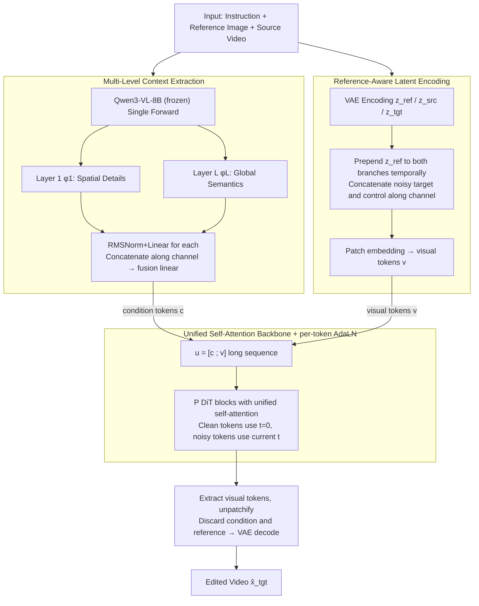

# MiVE: Multiscale Vision-language features for reference-guided video Editing

**Conference**: ICML 2026  
**arXiv**: [2605.14664](https://arxiv.org/abs/2605.14664)  
**Code**: https://mivepaper.github.io (Project page, code not explicitly open-sourced)  
**Area**: Video Editing / Multimodal VLM / Diffusion Models  
**Keywords**: Reference-guided, Video Editing, Multiscale VLM Features, Unified Self-Attention, DiT

## TL;DR
MiVE extracts the **first + last layer** hidden states of Qwen3-VL simultaneously as multiscale condition tokens. These are concatenated with VAE visual latents into a long sequence for reference-guided video editing within a unified self-attention DiT. On a 60-segment 720P benchmark, it achieved first place in both human preference and 6 VLM auto-scores, surpassing open-source Wan-Animate and commercial Kling O1.

## Background & Motivation

**Background**: The reference-guided video editing task is defined as: given a source video $x_{src}$ and an editing instruction $x_{text}$, an external image editor (e.g., FLUX.1 Kontext) is used to modify the first frame to obtain a reference image $x_{ref}$. The model is then required to **faithfully propagate** this modification to the entire video while **preserving** the motion and unedited regions of the original video. Current mainstream approaches follow two paths: (1) **Decoupled encoders** like T5 + SigLIP, where text and vision are encoded separately and fused via cross-attention in the DiT; (2) Using VLMs like Qwen3-VL / MiniCPM-V as a **unified encoder** (the path taken by Kling O1).

**Limitations of Prior Work**: Decoupled encoders suffer from an inherent "modality gap"—textual and visual features reside in different semantic spaces, making it difficult for the final cross-attention layer to truly bridge them. This leads to errors such as "misunderstood instructions" and "misaligned references" in video editing requiring fine-grained cross-modal reasoning. While unified VLM encoders resolve the modality gap, they typically **only use the hidden states of the last layer**, discarding rich local spatial details from early layers, causing edited videos to lose textures like hair strands, lighting, and fine details.

**Key Challenge**: There is a neglected hierarchical structure within VLMs—shallow layers tend to encode spatial local details (pixel-level alignment), while deep layers encode global semantics (instruction understanding). Existing methods either avoid VLMs entirely (losing unified semantic space) or only use the last layer (losing spatial details). Furthermore, cross-attention itself is asymmetric—visual tokens query the text, but text tokens are agnostic to the visual ones, hindering bidirectional fine-grained correspondence.

**Goal**: (1) Verify the hypothesis that shallow VLM layers encode spatial details while deep layers encode semantics; (2) Design a video editing framework capable of utilizing both shallow and deep VLM features; (3) Replace cross-attention with a truly symmetric unified attention mechanism.

**Key Insight**: The authors quantified the attention concentration of text tokens on visual tokens for each layer using a "cross-modality diagnostic matrix" $A_{txt \to vis}^{(l)} = E B^{\top}$, combined with Attention Mask Ratio calculated using SAM2-generated person masks. Results showed that for Qwen3-VL, $R_{mask} \approx 0.37$ at layer 0 and dropped to $0.23$ at the last layer. Shallow layers accurately locate person contours, while deep layer attention follows a diffused global pattern. This serves as direct evidence for the subsequent multiscale design.

**Core Idea**: **Extract first + last VLM layers $\to$ project to condition tokens $\to$ concatenate with visual latents into a long sequence $\to$ unified self-attention throughout**, using a shared attention manifold to perform "local detail propagation" and "global semantic understanding" simultaneously.

## Method

### Overall Architecture

The inputs to MiVE are the source video $x_{src}$, text instruction $x_{text}$, and reference image $x_{ref}$ (the edited first frame from an external image editor); the output is the edited video $\hat{x}_{tgt}$. The pipeline consists of three stages:

1. **Multi-Level Context Extraction**: $\{x_{text}, x_{ref}, x_{src}\}$ are fed into a frozen Qwen3-VL-8B. Hidden states from the **1st layer** and **$L$-th layer** ($\phi_1, \phi_L \in \mathbb{R}^{S \times D_{VLM}}$) are extracted, projected to $\mathbb{R}^{S \times D/2}$ via RMSNorm + Linear, concatenated along the feature dimension, and passed through a fusion linear layer to obtain condition tokens $c \in \mathbb{R}^{N_c \times D}$.
2. **Reference-Aware Latent Encoding**: $x_{src}, x_{tgt}, x_{ref}$ are all encoded into latents via a frozen VAE. During training, the reference latent $z_{ref}$ is **prepended along the temporal dimension** to both the noisy target $\tilde z_t$ and control $z_{src}$ branches. The two branches are then concatenated along the channel dimension, resulting in a shape of $(T'+1) \times 2C \times H' \times W'$. This allows the model to "see" the reference image as an appearance anchor from the very first frame.
3. **Unified Self-Attention Backbone**: The condition tokens $c$ and patchified visual tokens $v$ are concatenated into $u^{(0)} = [c; v] \in \mathbb{R}^{(N_c + N_v) \times D}$. The entire sequence undergoes **unified self-attention** within the DiT blocks, without cross-attention. A key trick is **per-token AdaLN**: clean tokens (condition + reference frame patches) use a fixed time embedding for $t=0$, while noisy tokens (target video patches) use the embedding for the current diffusion timestep $t$. The backbone is initialized from Wan2.1-T2V-14B self-attention blocks and trained using flow matching.

### Key Designs

1. **Multi-Level Context Extraction**:
    - **Function**: Enables the condition signal to carry both shallow-layer spatial details and deep-layer global semantics from the VLM.
    - **Mechanism**: Hidden states from the 1st and $L$-th layers of the same Qwen3-VL forward pass are extracted, projected via independent adapters, and **concatenated along the channel dimension into $D$ dimensions**: $c_{raw} = \text{Concat}_D(\tilde\phi_1, \tilde\phi_L)$, followed by a $\text{Linear}_{fuse}$ to produce final condition tokens. The first and last layers are chosen because diagnostic experiments show $R_{mask}$ extremes occur at the boundaries, while intermediate layers transition monotonically and contain redundant information.
    - **Design Motivation**: Addresses the limitation where using only the last VLM layer loses spatial details. Condition tokens $c$ do not depend on the diffusion timestep $t$, acting as fixed "semantic anchors" throughout the denoising process.

2. **Reference-Aware Latent Encoding (Temporal Prepend + Channel Dual-Branch)**:
    - **Function**: Provides both an appearance anchor (from the reference image) and a motion anchor (from the source video) without introducing masks.
    - **Mechanism**: Training constructs $z_t = \text{Concat}_C([z_{ref}; \tilde z_t], [z_{ref}; z_{src}])$, where both branches are preceded by $z_{ref}$ in time. During inference, the noisy target branch is initialized with $\tilde z_T \sim \mathcal{N}(0, I)$, while the control branch uses the actual source video. The entire latent is split into $N_v$ spatio-temporal patches.
    - **Design Motivation**: Ensures $z_{ref}$ acts as both an appearance and structural anchor. Temporal prepending ensures every attention layer sees it, while the dual-branch channel concatenation aligns control signals (source) and target signals (to-be-generated) at the latent level, avoiding failures of mask-guided methods in fast motion or complex backgrounds.

3. **Unified Self-Attention + per-token AdaLN**:
    - **Function**: Replaces asymmetric cross-attention with a symmetric, long-sequence self-attention, allowing condition and visual tokens to query each other in the same space.
    - **Mechanism**: $u^{(0)} = [c; v]$ enters $P$ DiT blocks. Each token determines its own AdaLN modulation—condition tokens and reference frame patches use $t=0$ embeddings (as if "always clean"), while other target patches use the current denoising $t$ embedding. Only $u^{(P)}[N_c:]$ is unpatchified at the output, discarding condition and reference frames to decode the final video $\hat x_{tgt} = \mathcal{D}(\hat z_0[1:])$.
    - **Design Motivation**: In cross-attention, visual queries the text but text cannot query the visual, preventing fine-grained bidirectional correspondence. Unified self-attention is naturally symmetric. Per-token AdaLN prevents clean signals from being "polluted" by noisy time embeddings, keeping the reference frame stable.

### Loss & Training

A flow matching objective is used (Lipman et al., 2023), initialized from Wan2.1-T2V-14B self-attention blocks. The model was trained for 8000 steps (~2 epochs, ~65 hours) at 720P / 81 frames on 8 H100 GPUs. Optimizer: AdamW, lr $3 \times 10^{-5}$, $\beta = (0.9, 0.999)$, 200-step warmup, gradient clipping 1.0. Inference takes ~6.5 minutes for an 81-frame 720P video on a single H100 (Qwen3-VL ~3s, DiT denoising ~328s, VAE decoding ~35s) with 50 GB peak VRAM. Training data includes 30K pairs: 24K filtered from OpenVE-3M (Qwen3-VL score $\ge 9.3$) across six editing categories, plus 6K portrait data constructed via foreground segmentation + background synthesis.

## Key Experimental Results

### Main Results

Benchmark: 60 720P videos, divided into a Simple subset (30 segments, from RoseBench + VPBench, with approximate masks) and a Complex subset (30 segments, all portrait videos involving atmosphere transfer / lighting redistribution / background replacement, no masks). Evaluation used Gemini-1.5-Pro as a judge for 6 dimensions (IA / CC / TS / PR / VA / SC) on a 0-10 scale, plus a 30-person user study for holistic scoring (1-5).

| Subset | Method | IA | CC | TS | VA | SC | User |
|------|------|------|------|------|------|------|------|
| Simple | VACE | 7.06 | 7.12 | 6.45 | 6.39 | 7.02 | 2.67 |
| Simple | LucyEdit | 6.14 | 7.56 | 7.55 | 5.96 | 7.13 | 1.58 |
| Simple | VideoCof | 7.53 | 8.04 | 8.62 | 6.41 | 8.28 | 1.46 |
| Simple | Kling O1 | 8.48 | 9.03 | 8.91 | 8.51 | 9.31 | 3.69 |
| Simple | **Ours** | **9.30** | 8.65 | 8.81 | **8.83** | **9.46** | **4.18** |
| Complex| LucyEdit | 7.22 | 7.02 | 6.36 | 5.57 | 7.05 | 1.78 |
| Complex| Wan-Animate | 8.87 | 7.78 | 7.83 | 7.73 | 8.98 | 3.03 |
| Complex| Kling O1 | 8.68 | 7.71 | 8.11 | 7.74 | 9.14 | 3.61 |
| Complex| **Ours** | **9.23** | **8.05** | **8.27** | **8.09** | **9.22** | **3.75** |

On the Simple set, MiVE ranked first in IA / VA / SC and was competitive in others (losing to commercial Kling O1 in some text-related metrics), but led significantly in user study (4.18 vs 3.69). For the Complex set, it took first place in all 6 dimensions + human preference.

### Ablation Study

| Configuration | IA | CC | TS | VA | SC | Description |
|------|------|------|------|------|------|------|
| Prev. SOTA (Decoupled + Dual Cross-Attn) | 6.76 | 6.10 | 5.88 | 5.87 | 7.45 | Old decoupled architecture baseline |
| Unified Enc. (only last layer) + Dual Cross-Attn | 8.51 | 8.24 | 7.68 | 7.42 | 8.03 | Unified encoder but last-layer only |
| Unified Enc. + Fused Cross-Attn | 8.53 | 8.22 | 7.87 | 8.08 | 9.00 | Single-branch cross-attention |

Switching from decoupled to a unified VLM encoder improved nearly all metrics by over 1.5 points—a benefit of the unified semantic space. Moving from cross-attention to unified self-attention (full MiVE) further boosted IA from 8.53 to the 9.23 range.

### Key Findings

- The **first layer** Attention Mask Ratio of VLMs (Qwen3-VL: 0.366, GLM-4.6V: 0.333) is significantly higher than the last layer (0.228, 0.270), validating the "shallow-spatial / deep-semantic" hypothesis.
- Qwen3-VL displays stronger shallow localization than GLM-4.6V (0.37 vs 0.33), prompting its selection as the backbone.
- In complex scenes (fast motion / strong lighting changes / hair color changes), MiVE's identity preservation is more stable than Wan-Animate and Kling O1, reflecting the strength of the temporal prepend reference latent design.
- The authors explicitly **refrain from reporting SSIM / LPIPS**, arguing that generated and input videos should fundamentally differ in editing tasks, rendering structural similarity metrics inapplicable.

## Highlights & Insights

- **Diagnostic Motivation**: The use of a simple $E B^{\top}$ matrix + SAM2 masks to quantify which VLM layers focus most on the foreground transforms intuition into data, providing a persuasive narrative.
- **Unified Self-Attention vs. Cross-Attention**: Conceptually aligned with Z-Image / FLUX, MiVE explicitly uses "clean / noisy per-token AdaLN" as a key design to encode the "clean reference" prior into time embeddings.
- **Efficiency of First/Last Layers**: Extracting only the extreme layers reduces projection parameters compared to uniform sampling, while the monotonic $R_{mask}$ suggests intermediate information is redundant.
- **Refusing SSIM / LPIPS**: Identifying the mismatch between traditional structural similarity metrics and editing tasks is a valuable critique for future research.

## Limitations & Future Work

- **Small Training Data**: 30K pairs mostly from OpenVE-3M / synthetic data. Performance in wild scenarios involving fluids, reflections, or transparent objects hasn't been specifically evaluated.
- **Computational Cost**: 6.5 minutes for 81 frames and 50 GB VRAM requirement limits consumer-grade accessibility. Acceleration (distillation, token pruning) is not discussed.
- **Potential Evaluator Bias**: Since the backbone is Qwen3-VL and the primary judge is Gemini, there may be an inherent bias in instruction-following style.
- **Optimal Layer Selection**: Only Qwen3-VL and GLM-4.6V were tested; the "first and last" rule may not be optimal for all VLMs.

## Related Work & Insights

- **vs VACE / VideoPainter (mask-guided)**: These rely on precise masks for spatial control; MiVE is mask-free, allowing the model to infer editing regions from instructions and references.
- **vs Lucy Edit / Wan-Animate (Unified, but last-layer only)**: These lose spatial details, appearing blurry in fine textures. MiVE recovers this via multiscale condition tokens.
- **vs Kling O1 (Commercial Unified VLM)**: MiVE shows a significant lead in IA (instruction-following), suggesting "last-layer only + cross-attn" might be a bottleneck for commercial systems.
- **vs Ditto / ICVE (Implicit prior + DiT)**: While similar in spirit, these use single-scale priors. MiVE's multiscale approach is better suited for complex scenes, analogous to the advantage of FPN over single-scale detectors.

## Rating
- **Novelty**: ⭐⭐⭐⭐ Multiscale VLM + unified self-attention is a systematic first for video editing, though individual components have precedent in image generation.
- **Experimental Thoroughness**: ⭐⭐⭐⭐ Solid benchmark, dual evaluators, user study, and 4 architectural ablations, though training scale is small.
- **Writing Quality**: ⭐⭐⭐⭐⭐ Excellent diagnostic derivation; the argument for selecting the first and last layers is complete and elegant.
- **Value**: ⭐⭐⭐⭐ Pushes the "VLM as unified encoder" paradigm into multiscale territory, setting a strong baseline for condition design in video generation.

<!-- RELATED:START -->

1. **Wan 2.1**: A Comprehensive Video Generation Framework, arXiv 2025.
2. **Kling**: A Video Generation Model with Unified Multimodal Context, Tech Report 2024.
3. **LucyEdit**: Reference-based Video Editing via Diffusion Models, CVPR 2024.

<!-- RELATED:END -->

## Related Papers

- [\[CVPR 2026\] MotionEnhancer: Leveraging Video Diffusion for Motion-Enhanced Vision-Language Models](../../CVPR2026/video_generation/motionenhancer_leveraging_video_diffusion_for_motion-enhanced_vision-language_mo.md)
- [\[CVPR 2026\] RecEdit-Drive: 3D Reconstruction-Guided Spatiotemporal Video Editing for Autonomous Driving Scenes](../../CVPR2026/video_generation/recedit-drive_3d_reconstruction-guided_spatiotemporal_video_editing_for_autonomo.md)
- [\[CVPR 2026\] Real-Time Generation of Streamable Talking Portrait Video with Reference-Guided Deep Compression VAEs](../../CVPR2026/video_generation/real-time_generation_of_streamable_talking_portrait_video_with_reference-guided_.md)
- [\[CVPR 2026\] VIVA: VLM-Guided Instruction-Based Video Editing with Reward Optimization](../../CVPR2026/video_generation/viva_vlm-guided_instruction-based_video_editing_with_reward_optimization.md)
- [\[ICLR 2026\] LoRA-Edit: Controllable First-Frame-Guided Video Editing via Mask-Aware LoRA Fine-Tuning](../../ICLR2026/video_generation/lora-edit_controllable_first-frame-guided_video_editing_via_mask-aware_lora_fine.md)

<!-- RELATED:END -->
