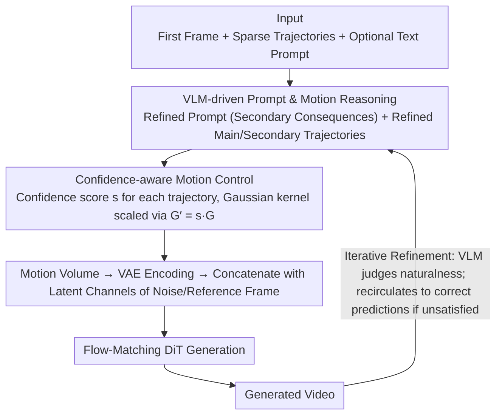

# MotiMotion: Motion-Controlled Video Generation with Visual Reasoning

**Conference**: ICML 2026  
**arXiv**: [2605.22818](https://arxiv.org/abs/2605.22818)  
**Code**: To be confirmed  
**Area**: Video Generation / Controllable Generation  
**Keywords**: Motion Control, Visual Reasoning, VLM, Video Generation, Physical Constraints

## TL;DR
MotiMotion transforms sparse, imprecise user trajectories and text prompts into physically plausible and causally consistent motion trajectories and text descriptions via VLM reasoning. It employs a **confidence-weighted** control strategy to guide a diffusion model, generating natural videos aligned with world knowledge and physical principles—achieving a physical authenticity score of 0.302 on MotiBench, significantly outperforming Wan-Move’s 0.218 (+38%).

## Background & Motivation

**Background**: Image-to-video generation models have achieved breakthroughs in visual quality and semantic consistency. However, precise logical controllability is lacking in practical applications—users can provide guidance via trajectories, bounding boxes, or optical flow, but this requires an exact understanding of motion details.

**Limitations of Prior Work**: Existing motion control methods (e.g., Wan-Move, MagicMotion) **assume that user inputs fully capture real motion dynamics and execute them strictly**. However, user-provided trajectories are often sparse, coarse, and physically inconsistent. For example, given the prompt "lifting a hand blocking dominoes," a user might specify the hand's trajectory but implicitly expect the dominoes to **fall in a chain reaction** once the constraint is removed—a causal relationship that current models fail to reason.

**Key Challenge**: Motion-controlled generation must balance two extremes: (1) strict execution of user input, leading to physical irrationality and lack of causality; (2) total neglect of user intent, resulting in loss of controllability. The root cause is the lack of capability to reason about visual context.

**Goal**: To construct an intelligent motion-controlled video generation framework that converts ambiguous user intentions into physically and causally consistent motion plans while retaining spatio-temporal controllability.

**Key Insight**: VLMs possess powerful world knowledge and visual understanding, enabling them to comprehend the visual context provided by the user and reason about implicit physical and causal logic. The problem is redefined as a "reasoning-generation" two-stage process: first, using a VLM to transform sparse inputs into dense, physically plausible control signals, and second, using a diffusion model to render the video.

**Core Idea**: Refine user trajectories and hallucinate secondary motions through training-free VLM reasoning. Introduce **confidence weighting** to allow the generator to rely on its own generative priors in low-confidence regions rather than rigid execution.

## Method

### Overall Architecture
MotiMotion deconstructs "motion-controlled video generation" into a "reasoning-generation" two-stage process. The core idea is that user-drawn trajectories are essentially "intentions" rather than "specifications," often being sparse, coarse, and physically contradictory; thus, the generator should not replicate them blindly. In the first stage, a training-free VLM acts as a "physical reasoner" to interpret the input image, trajectory visualization, and text prompt, completing the sparse input into a dense, causally consistent motion plan. This involves refining the main trajectory, hallucinating secondary motions (collisions, deformations, chain reactions), and producing a refined prompt with causal consequences. In the second stage, these plans are injected into a Flow-Matching video generator with associated confidence levels—high-confidence trajectories provide strong constraints, while low-confidence trajectories serve as coarse guidance. The design focuses on: how the VLM reasons, how confidence is utilized, and how to resolve single-turn imperfections through multi-turn iterations.

### Key Designs

**1. VLM-driven Prompt and Motion Reasoning: Expanding "Lifting Hand" to "Hand Rises, Dominoes Fall"**

Existing methods (Wan-Move / MagicMotion) assume user inputs fully characterize real dynamics. However, if a user only labels the hand's trajectory, the implicit causality of "dominoes falling after constraint removal" cannot be inferred by standard models. MotiMotion provides the VLM with three inputs: coordinate sequences normalized to $[0, 1]$ (text format), input images overlaid with trajectory visualizations, and optional text prompts. It outputs two components: a refined prompt detailing secondary consequences and a set of refined trajectories. These trajectories correct the user's primary path (adjusting temporal steps to reflect forces like friction or acceleration) and add secondary trajectories (identifying reactive objects or static anchors). This offloads physical common sense (coupling gears, falling after support removal) to the VLM's world knowledge.

**2. Confidence-aware Motion Control: A Continuous Transition Instead of "Strict vs. Ignore"**

Trajectories from VLMs or users can be imprecise; strict enforcement may propagate errors. This framework assigns a confidence score $s \in [0, 1]$ to each trajectory ($s=1$ for ground-truth level, $s \to 0$ for unreliable). During training, degradation is actively applied to low-confidence samples to simulate uncertainty (affine transforms for spatial inaccuracy, linearization for temporal sparsity, Savitzky-Golay for over-smoothing). This forces the model to learn that "the coarser the input, the more it should rely on itself." During inference, the Gaussian kernel intensity is scaled by $G' = s \cdot G$. High scores create sharp peaks, forcing the model to follow coordinates closely, while low scores weaken the signal, encouraging a fallback to the pre-trained generator's natural dynamic priors. Consequently, where VLM predictions fail (e.g., dominoes bending downward), lowering confidence allows for automatic artifact correction.

**3. Iterative Refinement Loop: Approaching Causally Correct Results via User Correction**

Single-turn reasoning may lead to misunderstandings (e.g., misinterpreting a trajectory as a camera zoom). Since the VLM can judge the naturalness of generated videos, it is integrated into a loop. Users can perform multiple calls to gradually correct VLM reasoning errors. For instance, in a clockwork example, the model requires four iterations to successfully model the coupled motion of gears after an initial failure.

### Implementation Details
The base generator is Wan 2.2 I2V-A14B (Flow-Matching). Motion is represented as $N$ point trajectories in a video of length $L$ and resolution $H \times W$. Each trajectory places a 2D Gaussian heatmap at corresponding frame positions, with standard deviation scaled by resolution and peak normalized to 1. The motion latent, encoded via VAE, is concatenated channel-wise with noise and reference latents before being fed into the DiT. Training involves two stages on OpenVid (5K steps, followed by 3K steps with 50% trajectory degradation). Gemini 3.1 Pro is used for motion reasoning.

## Key Experimental Results

### Main Results (MotiBench, VLM Auto-evaluation)

| Method | Physical Authenticity ↑ | Photo Authenticity ↑ | Semantic Consistency ↑ |
|------|----------|----------|----------|
| MagicMotion | 0.157 | 0.550 | 0.343 |
| Wan-Move | 0.218 | 0.483 | 0.511 |
| **Ours** | **0.302** | 0.520 | **0.665** |

### Forced-Choice Comparison Test

| Comparison | Object Attributes | Interaction | Overall | Human Eval |
|--------|--------|------|------|--------|
| Ours vs MagicMotion | 72.9% | 80.8% | 78.0% | 97.9% |
| Ours vs Wan-Move | 71.5% | 75.0% | 73.8% | 81.4% |

Physical authenticity improves by 38% compared to Wan-Move and 92% compared to MagicMotion. Human preference is approximately 50 percentage points higher than the random 50% baseline.

### Ablation Study

| Configuration | Physical Authenticity ↑ | Photo Authenticity ↑ | Semantic Consistency ↑ |
|------|----------|----------|----------|
| Baseline Motion Generator | 0.166 | 0.389 | 0.337 |
| + Prompt Reasoning | 0.237 | 0.475 | 0.544 |
| + Motion Reasoning | 0.285 | 0.493 | 0.641 |
| + Confidence-aware Control | 0.302 | 0.520 | 0.665 |

### Key Findings
- Each added component significantly improves results; motion reasoning contributes the most (Physical Authenticity 0.237 → 0.285).
- **Cross-method Reasoning Validation**: Applying the reasoning module to MagicMotion/Wan-Move consistently improves metrics, demonstrating generalizability.
- **Critical Role of VLM Reasoning**: Even without user text, reasoning based solely on images and trajectories improves physical authenticity (0.177 → 0.229) and semantic consistency (0.272 → 0.473).
- **Confidence Mechanism Corrects Errors**: Lowering confidence successfully corrects artifacts where VLM predictions are imprecise, such as dominoes bending.
- **Iterative Refinement Viability**: A clockwork case demonstrates that 4 iterations can achieve coupled gear motion where a single turn fails.

## Highlights & Insights
- **Elegance of Reasoning-Generation Decoupling**: Instead of learning physics within the diffusion model, a training-free VLM serves as a "physical reasoner." This preserves generator flexibility while leveraging VLM world knowledge, avoiding the immense cost of teaching video models common sense from scratch while enhancing interpretability.
- **Sophisticated Confidence-weighted Design**: This moves beyond the binary choice of "strict execution vs. ignore" towards continuous weighted trade-offs. By simulating input degradation during training, the model learns to adapt to input quality, naturally complementing the video model’s inherent generative priors.
- **Conversion from Sparse Intent to Dense Plan**: A key insight is that user input is "intent," not a "specification." Using a VLM to plan the full causal chain is essential for natural generation.

## Limitations & Future Work
- VLM-predicted trajectories may be spatially shaky or inaccurate due to visual encoder resolution limits.
- The method is limited to image-to-video scenarios and has not explored video-to-video extensions.
- Reliability depends on VLM quality; reasoning may fail for complex physical scenes (fluid simulation, multi-body systems) not prevalent in VLM training data.
- MotiBench is limited in scale (62 pre-event images).
- The confidence scoring mechanism is fixed during training but provided by VLM during inference; this mismatch could lead to instability.
- Future Work: Integrating physical simulators with VLM reasoning; expanding MotiBench; exploring online confidence learning.

## Related Work & Insights
- **vs MagicMotion**: Both handle motion control, but MagicMotion relies on strict execution of dense user trajectories. MotiMotion reduces user burden by inferring dense plans from sparse inputs, significantly boosting physical plausibility.
- **vs Wan-Move**: Wan-Move also uses trajectory injection within the Wan framework but relies on fully supervised trajectory tracking. MotiMotion offers more flexibility via confidence weighting and introduces causal planning via VLM reasoning, an innovation missing in Wan-Move.
- **vs Physics-aware Generation**: This work utilizes implicit physical knowledge in VLMs to avoid explicit solver overhead, though it may lack precision in extreme physical scenarios like complex fluids.

## Rating
- Novelty: ⭐⭐⭐⭐⭐  Innovatively integrates VLM reasoning into the motion control pipeline; confidence-aware control is an elegant rethink of motion conditioning.
- Experimental Thoroughness: ⭐⭐⭐⭐  Includes automated VLM eval, human studies, ablations, cross-method validation, and iterative analysis. MotiBench size (62 images) remains a limitation for generalizability.
- Writing Quality: ⭐⭐⭐⭐⭐  Clear logic, strong motivation, and vivid examples (dominoes/clocks).
- Value: ⭐⭐⭐⭐⭐  Addresses the core problem of sparse/imprecise inputs in video generation; demonstrated generalizability across existing methods.

<!-- RELATED:START -->

## Related Papers

- [\[CVPR 2026\] SynMotion: Semantic-Visual Adaptation for Motion Customized Video Generation](../../CVPR2026/video_generation/synmotion_semantic-visual_adaptation_for_motion_customized_video_generation.md)
- [\[CVPR 2026\] Lighting-grounded Video Generation with Renderer-based Agent Reasoning](../../CVPR2026/video_generation/lighting-grounded_video_generation_with_renderer-based_agent_reasoning.md)
- [\[CVPR 2026\] Thinking with Video: Video Generation as a Promising Multimodal Reasoning Paradigm](../../CVPR2026/video_generation/thinking_with_video_video_generation_as_a_promising_multimodal_reasoning_paradig.md)
- [\[CVPR 2026\] P-Flow: Prompting Visual Effects Generation](../../CVPR2026/video_generation/p-flow_prompting_visual_effects_generation.md)
- [\[CVPR 2026\] Unified Camera Positional Encoding for Controlled Video Generation](../../CVPR2026/video_generation/unified_camera_positional_encoding_for_controlled_video_generation.md)

<!-- RELATED:END -->
