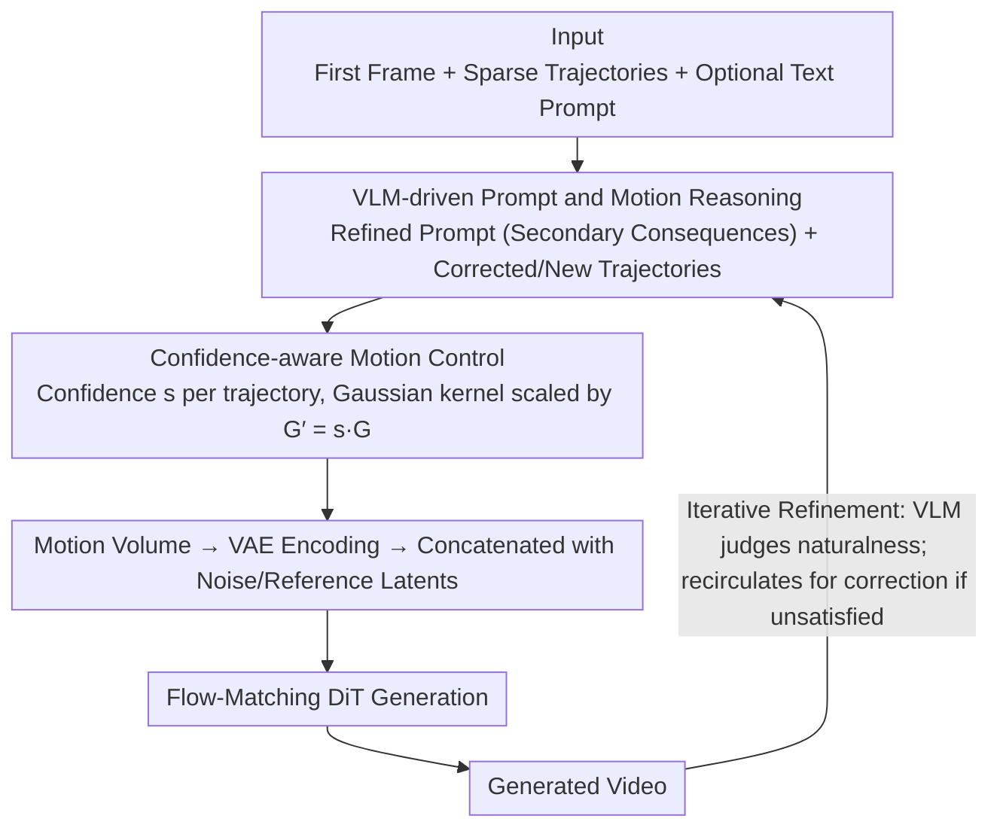

# MotiMotion: Motion-Controlled Video Generation with Visual Reasoning

**Conference**: ICML 2026  
**arXiv**: [2605.22818](https://arxiv.org/abs/2605.22818)  
**Code**: To be confirmed  
**Area**: Video Generation / Controllable Generation  
**Keywords**: Motion Control, Visual Reasoning, VLM, Video Generation, Physical Constraints

## TL;DR
MotiMotion **transforms** sparse and imprecise user trajectories and text prompts into physically plausible and causally consistent motion trajectories and text descriptions using VLM reasoning. It then employs a **confidence-weighted** control strategy to guide the diffusion model in generating natural videos aligned with world knowledge and physical principles—achieving a physical realism score of 0.302 on MotiBench, significantly surpassing Wan-Move's 0.218 (+38%).

## Background & Motivation

**Background**: Image-to-video generation models have made breakthroughs in visual quality and semantic consistency. However, practical applications lack precise logical controllability—while users can provide guidance via trajectories, bounding boxes, or optical flow, these require an exact understanding of motion details.

**Limitations of Prior Work**: Existing motion control methods (e.g., Wan-Move, MagicMotion) **assume that user inputs perfectly capture real motion dynamics and must be strictly executed**. However, user-provided trajectories are often sparse, coarse, and physically inconsistent. For example, given the prompt "Lift the hand blocking the dominoes," a user might specify the hand's trajectory but implicitly expects the dominoes to undergo a **chain reaction** once the constraint is removed—a causal relationship that typical models fail to reason about.

**Key Challenge**: Motion-controlled generation must balance two extremes: (1) strict execution of user input leading to physical implausibility and missing causality; and (2) complete neglect of user intent, resulting in loss of controllability. The root cause is a lack of reasoning capability regarding visual context.

**Goal**: To build an intelligent motion-controlled video generation framework that converts ambiguous user intent into physically and causally consistent motion plans while preserving spatial-temporal controllability.

**Key Insight**: VLMs possess powerful world knowledge and visual understanding capabilities, enabling them to interpret the visual context provided by the user and reason about implicit physical and causal logic. The problem is redefined as a "reason-then-generate" two-stage process: first, use a VLM to transform sparse inputs into dense, physically plausible control signals, then use a diffusion model to render the video.

**Core Idea**: Refine user trajectories and hallucinate secondary motions through training-free VLM reasoning, and introduce **confidence weighting** to allow the generator to rely on its own generative priors in low-confidence regions rather than following inputs rigidly.

## Method

### Overall Architecture
MotiMotion deconstructs "motion-controlled video generation" into two stages: Reasoning and Generation. The core premise is that user-drawn trajectories are "intents" rather than "specifications," often being sparse, rough, or physically contradictory. In the first stage, a training-free VLM acts as a "physical reasoner," interpreting the input image, trajectory visualizations, and text prompts to supplement sparse inputs into dense, causally consistent motion plans. This involves correcting the primary trajectory, hallucinating secondary motions (collisions, deformations, chain reactions), and producing a refined prompt with causal consequences. In the second stage, these plans are injected into a Flow-Matching video generator with assigned confidence levels—high-confidence trajectories act as strong constraints, while low-confidence ones serve only as coarse guidance.

### Key Designs

**1. VLM-driven Prompt and Motion Reasoning: Expanding "Lift Hand" to "Hand lifts, dominoes fall"**

Existing methods (Wan-Move/MagicMotion) default to the assumption that user inputs fully characterize real dynamics. However, if a user only labels the hand's trajectory, the model cannot infer the "chain reaction of dominoes" once the constraint is removed. MotiMotion provides the VLM with three inputs: coordinate sequences normalized to $[0, 1]$ (in text format), the input image with overlaid trajectory visualizations, and optional text prompts. It outputs two components: a refined prompt detailing secondary consequences and a set of refined trajectories that correct the user’s primary intent (adjusting timing for friction/acceleration) while adding secondary trajectories for impacted objects or static anchors.

**2. Confidence-aware Motion Control: A continuous transition between adherence and autonomy**

Trajectories from both VLMs and users can be imprecise. Rigidly enforcing them can propagate errors. This method assigns a confidence score $s \in [0, 1]$ to each trajectory. During training, degradation is applied to low-confidence samples to simulate uncertainty (affine transforms for spatial inaccuracy, linearization for temporal sparsity, Savitzky-Golay for over-smoothing). During inference, the Gaussian kernel intensity is scaled by $G' = s \cdot G$. High scores produce sharp peaks forcing adherence, while low scores weaken the signal, encouraging the model to fall back on its pre-trained natural dynamic priors.

**3. Iterative Refinement Loop: User-driven correction for causal accuracy**

Single-round reasoning may misinterpret intents. Since VLMs can judge the naturalness of generated videos, an iterative loop is established. Users can perform multiple rounds to correct VLM reasoning errors until satisfied, or the VLM can automatically terminate once it deems the result "fully credible." For instance, a complex clock mechanism involving coupled gears might require multiple iterations to model correctly.

### Implementation Details
The base generator is Wan 2.2 I2V-A14B (Flow-Matching). Motion is represented as $N$ point trajectories in a video of length $L$ and resolution $H \times W$. Each trajectory places a 2D Gaussian heatmap at its corresponding frame position, with the standard deviation scaled by resolution and the peak normalized to 1. The motion latent is encoded via VAE and concatenated with noise and reference latents along the channel dimension before entering the DiT. Training occurs in two stages on OpenVid: 5K steps initially, followed by 3K steps with trajectory degradation on 50% of samples. Gemini 1.5 Pro (referred to as a 3.1-class VLM in some contexts) is used for reasoning.

## Key Experimental Results

### Main Results (MotiBench, VLM-based Automatic Evaluation)

| Method | Physical Realism ↑ | Photo Realism ↑ | Semantic Consistency ↑ |
|------|----------|----------|----------|
| MagicMotion | 0.157 | 0.550 | 0.343 |
| Wan-Move | 0.218 | 0.483 | 0.511 |
| **Ours** | **0.302** | 0.520 | **0.665** |

### Two-Alternative Forced Choice (2AFC) Test

| Comparison | Object Properties | Interactions | Overall | Human Eval |
|--------|--------|------|------|--------|
| Ours vs MagicMotion | 72.9% | 80.8% | 78.0% | 97.9% |
| Ours vs Wan-Move | 71.5% | 75.0% | 73.8% | 81.4% |

Physical realism improved by 38% compared to Wan-Move and 92% compared to MagicMotion. Human preference exceeds the random 50% baseline by approximately 50 percentage points.

### Ablation Study

| Configuration | Physical Realism ↑ | Photo Realism ↑ | Semantic Consistency ↑ |
|------|----------|----------|----------|
| Base Motion Controller | 0.166 | 0.389 | 0.337 |
| + Prompt Reasoning | 0.237 | 0.475 | 0.544 |
| + Motion Reasoning | 0.285 | 0.493 | 0.641 |
| + Confidence-aware Control | 0.302 | 0.520 | 0.665 |

### Key Findings
- Every component contributes significantly; motion reasoning provides the largest gain (Physical Realism 0.237 → 0.285).
- **Cross-method Verification**: Applying the reasoning module to MagicMotion/Wan-Move consistently improves physical realism and semantic consistency, demonstrating generalizability.
- **VLM Reasoning Impact**: Even without user text, reasoning based solely on images and trajectories improves physical realism from 0.177 to 0.229.
- **Confidence Mechanism**: Successfully corrects artifacts in scenarios where VLM predictions are imprecise (e.g., bending dominoes or distorted seesaws).

## Highlights & Insights
- **Decoupling Reasoning and Generation**: Rather than forcing the diffusion model to learn physics, a training-free VLM serves as a "physical reasoner." This preserves the flexibility of the generative model while leveraging the VLM’s world knowledge, avoiding the massive cost of training video models on "common sense" data.
- **Elegant Confidence Design**: Moves beyond the binary choice of "adhere vs. ignore" toward a continuous trade-off. By simulating input degradation during training, the model learns to adapt to input quality naturally.
- **Intent vs. Specification**: A key insight is that user inputs are "intents." Using a VLM to plan the full causal chain is essential for producing natural results from sparse inputs.

## Limitations & Future Work
- VLM-predicted trajectories may be spatially jittery or inaccurate due to vision encoder resolution limits.
- The method is currently restricted to Image-to-Video and has not explored Video-to-Video extensions.
- Reliance on VLM quality: Reasoning may fail for complex physical scenes (e.g., fluid dynamics) not well-represented in VLM training data.
- MotiBench is relatively small (62 pre-event images).
- Future work: Integration of physical simulators with VLM reasoning; scaling MotiBench; exploring online confidence learning.

## Related Work & Insights
- **vs. MagicMotion**: Both handle motion control, but MagicMotion relies on dense user trajectories; MotiMotion uses VLMs to infer dense plans from sparse inputs, reducing user burden and improving realism.
- **vs. Wan-Move**: While both use trajectory injection, Wan-Move uses fully supervised tracking; MotiMotion is more flexible via confidence weighting and introduces causal planning via VLM reasoning.

## Rating
- Novelty: ⭐⭐⭐⭐⭐  Innovatively integrates VLM reasoning into the motion control pipeline; confidence-aware control is an elegant rethink of motion conditioning.
- Experimental Thoroughness: ⭐⭐⭐⭐  Includes automated VLM eval, human studies, ablations, and cross-method validation, though MotiBench scale is limited.
- Writing Quality: ⭐⭐⭐⭐⭐  Clear logic, well-justified motivation, and vivid examples.
- Value: ⭐⭐⭐⭐⭐  Addresses the core problem of imprecise input in video generation; demonstrates strong generalizability across existing frameworks.

<!-- RELATED:START -->

## Related Papers

- [\[CVPR 2026\] EffectMaker: Unifying Reasoning and Generation for Customized Visual Effect Creation](../../CVPR2026/video_generation/effectmaker_unifying_reasoning_and_generation_for_customized_visual_effect_creat.md)
- [\[CVPR 2026\] SynMotion: Semantic-Visual Adaptation for Motion Customized Video Generation](../../CVPR2026/video_generation/synmotion_semantic-visual_adaptation_for_motion_customized_video_generation.md)
- [\[ICML 2026\] Physics in 2-Steps: Locking Motion Priors Before Visual Refinement Erases Them](physics_in_2-steps_locking_motion_priors_before_visual_refinement_erases_them.md)
- [\[ICLR 2026\] Time-to-Move: Training-Free Motion-Controlled Video Generation via Dual-Clock Denoising](../../ICLR2026/video_generation/time-to-move_training-free_motion-controlled_video_generation_via_dual-clock_den.md)
- [\[CVPR 2026\] MoReGen: Multi-Agent Motion-Reasoning Engine for Code-based Text-to-Video Synthesis](../../CVPR2026/video_generation/moregen_multi-agent_motion-reasoning_engine_for_code-based_text-to-video_synthes.md)

<!-- RELATED:END -->
