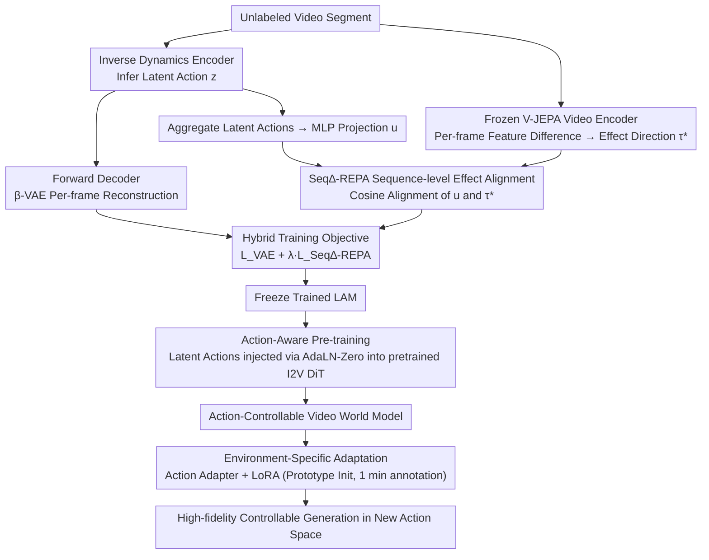

# OLAF-World: Orienting Latent Actions for Video World Modeling

**Conference**: ICML 2026  
**arXiv**: [2602.10104](https://arxiv.org/abs/2602.10104)  
**Code**: TBD  
**Area**: Video Generation / World Models / Self-Supervised Learning  
**Keywords**: Latent Action Learning, Video World Models, Cross-Context Transfer, Control Alignment

## TL;DR
OLAF-World learns transferable latent actions through **Sequence-level Control-Effect Alignment** (Seq∆-REPA)—turning unlabeled videos into action-controllable video world models and achieving zero-shot action transfer across contexts. With only 1 minute of annotated data, it achieves performance comparable to AdaWorld with 2 hours of data (rotation control accuracy 0.4680 vs 0.6420).

## Background & Motivation

**Background**: Video world models require large-scale frame-level action annotations for action control, but such labels are expensive and usually restricted to specific domains. Latent Action Models (LAM) promise to automatically discover control interfaces from unlabeled videos—inferring latent actions via an inverse dynamics encoder and predicting future frames with a forward decoder.

**Limitations of Prior Work**: Although latent action models reconstruct well **within a single video clip**, the learned latent actions **cannot transfer across contexts**. In different scenes, viewpoints, or lighting conditions, the same semantic action (e.g., "move forward") maps to completely different directions in the latent space. Two types of failure modes exist:
- **Shortcut Learning**: Encoders tend to encode scene-related visual cues rather than actual controllable factors.
- **Cross-Context Unidentifiability**: Since training objectives operate only within a single clip, the latent coordinate system can drift freely between different videos.

**Key Challenge**: Step-level reconstruction objectives (per-frame prediction loss) fail to provide a shared reference frame across videos, causing the representation of the same action to vary across environments, which destroys transferability.

**Goal**: To learn a structured, cross-context consistent latent action space that supports zero-shot action sequence transfer and rapid adaptation under low-data regimes.

**Key Insight**: While explicit action labels are unavailable, **the semantic effects of actions are observable**. The same underlying action should produce similar visual-semantic changes across different contexts. By leveraging a frozen self-supervised video encoder as a global reference, latent action sequences can be aligned with their effect directions (the net change in features).

**Core Idea**: Align latent actions with the visual-semantic changes captured by self-supervised encoders through sequence-level control-effect alignment, established a unified latent coordinate system across different contexts.

## Method

### Overall Architecture
OLAF-World aims to learn a "cross-context consistent" latent action space from unlabeled videos—ensuring that semantic actions like "move forward" map to the same direction in the latent space regardless of scene, viewpoint, or lighting. It consists of two stages: first, training an inverse dynamics model on unlabeled videos using Seq∆-REPA to align latent actions to a global reference frame; second, using the learned latent actions as a unified control interface to condition a pre-trained Video Diffusion Transformer. The core hypothesis is that while explicit action labels are missing, the "effects" of actions (observed visual-semantic changes) can serve as an anchor.

### Key Designs

**1. Seq∆-REPA Sequence-level Effect Alignment: Using "Action-Induced Changes" as a Unified Coordinate System**

A persistent issue with latent action models is their reliance on step-level reconstruction within single clips, allowing the latent coordinate system to drift across videos. Seq∆-REPA introduces a frozen self-supervised video encoder (V-JEPA ViT) as a global reference. For a clip $x_{0:K}$, per-frame features $s_i \in \mathbb{R}^D$ are extracted. The **effect direction** is defined as the average feature difference across the clip: $\tau^* = \frac{1}{K} \sum_{i=0}^{K-1} (s_{i+1} - s_i)$. Simultaneously, the encoder infers latent actions $z_{0:K-1}$, which are aggregated and projected via a trainable MLP: $\bar{z} = \frac{1}{K} \sum z_i$, $u = h_\psi(\bar{z})$. These are aligned using cosine similarity: $\mathcal{L}^{\text{Seq}\Delta\text{-REPA}}_\psi = 1 - \langle \text{norm}(u), \text{norm}(\tau^*) \rangle$. Three design points are critical: using feature differences instead of absolute features filters out static appearance; aggregating over the whole segment avoids unidentifiability from step-level tasks; and the frozen encoder ensures all videos align to the same semantic space.

**2. Hybrid Training Objective: Balancing Dynamics and Alignment**

Relying solely on alignment might lose dynamical details, while relying solely on reconstruction leads to shortcuts. This work combines $\beta$-VAE reconstruction with Seq∆-REPA alignment: $\mathcal{L}_{\text{LAM}} = \mathcal{L}^{\text{VAE}}_{\theta, \phi} + \lambda \mathcal{L}^{\text{Seq}\Delta\text{-REPA}}_\psi$, with $\lambda = 0.02$. The reconstruction term ensures latent actions encode useful dynamics for prediction, while the alignment term forces the encoder to learn action-related features rather than scene-specific cues.

**3. Action-Aware Pre-training: Injecting Latent Actions into Pre-trained Video DiT via AdaLN-Zero**

To turn the learned latent action space into a control interface for a world model, latent actions $z_{0:T-1}$ are extracted from unlabeled videos using the frozen LAM to condition a pre-trained Image-to-Video Diffusion Transformer (I2V DiT). Each action $z_t$ is linearly projected and added to the diffusion timestep embedding, then mapped to AdaLN-Zero modulation parameters for each DiT block. Since the backbone operates on latents compressed by a 3D video VAE (temporal compression $r=4$), every $r$ consecutive actions are packaged into a single latent-time condition vector. This ensures the world model is controlled by a cross-environment consistent interface.

**4. Environment-Specific Adaptation Strategy: 1-Minute Annotation for Global Alignment**

When a small amount of annotated data is available for a target environment, a lightweight action adapter $A_\eta$ maps environmental actions $a_t$ into the pre-trained latent space: $\hat{z}_t = A_\eta(a_t)$. For discrete actions, an embedding table $E \in \mathbb{R}^{|A| \times d_z}$ is initialized using latent action prototypes (inferred from annotated data via the frozen LAM). Subsequently, only the adapter and LoRA layers are fine-tuned. Due to the alignment properties of the base model, high-fidelity action tracking is achieved even with only 1 minute of annotated data.

## Key Experimental Results

### Main Results: Latent Space Structure Diagnosis (Linear Probe F1)

| Method | 1st→1st | 1st→3rd | 3rd→3rd | 3rd→1st |
|------|---------|---------|---------|---------|
| AdaWorld | 0.6004 | 0.4820 | 0.4827 | 0.4999 |
| **Ours** | **0.8138** | **0.6250** | **0.8256** | **0.5904** |

In cross-domain evaluations, 1st→3rd improved by +30% and 3rd→3rd by +71%, indicating that the latent coordinate system is truly aligned across contexts.

### Ablation Study: Data-Efficient Adaptation

| Method | Adaptation Videos | Image Quality ↑ | Trans RPE ↓ | Rot RPE ↓ |
|------|---------|---------------|------------|-----------|
| DirectAct | 0 | 0.7213 | 0.0703 | 1.4311 |
| AdaWorld | 0 | 0.5600 | 0.0470 | 1.0844 |
| Ours | 0 | 0.5400 | 0.0387 | 0.8773 |
| AdaWorld | 1 min | 0.5623 | 0.0318 | 0.6420 |
| **Ours** | 1 min | 0.5726 | 0.0284 | **0.4680** |
| AdaWorld | 2 hours | 0.6177 | 0.0263 | 0.3834 |
| **Ours** | 2 hours | 0.6312 | 0.0230 | **0.3785** |

In zero-shot, 1-minute, and 2-hour data scenarios, OLAF-World outperforms in RPE metrics; rotation control accuracy is 27% higher than AdaWorld with 1 minute of data.

### Key Findings
- **Cross-Domain Linear Separability**: While AdaWorld's F1 saturates at ~0.48, Ours maintains ~0.83, significantly improving cross-context consistency.
- **Action Prototype Similarity**: The cosine similarity matrix of action prototypes between different scenes shows a clear diagonal dominance, meaning identical actions across viewpoints have highly consistent representations.
- **Zero-Shot Transfer Quality**: Qualitative comparisons show that AdaWorld often suffers from "temporal bleaching", disappearing subjects, or trajectory drift during cross-context transfer, whereas Ours maintains scene consistency and action accuracy.

## Highlights & Insights
- **"Effects" as Alignment Reference**: Utilizing self-supervised encoders to extract action effects (feature change directions) bypasses the bottleneck of manual labeling and can generalize to other tasks requiring consistent conceptual representations.
- **Sequence-Level Aggregation Solves Unidentifiability**: Aligning latent actions and effect directions over an entire segment (rather than step-by-step) theoretically addresses the cross-context unidentifiability problem.
- **Dual Role of Frozen Encoders**: Serving as both feature extractors and alignment references, they stabilize training and provide strong universality through self-supervised pre-training.

## Limitations & Future Work
- Computational Overhead: Running two encoders (latent action + frozen video) increases computational costs compared to traditional inverse dynamics models.
- Dependency on Self-Supervised Encoders: The quality of alignment depends on the frozen encoder; performance may degrade in scenarios where the encoder struggles (e.g., extreme lighting, rare actions).
- Discrete vs. Continuous Actions: Experiments focused primarily on discrete actions (8-direction control); performance in continuous control scenarios remains to be evaluated.
- Long Video Generation: The current world model is conditioned on relatively short sequences (97 frames); maintaining consistency under cumulative error in long videos requires further exploration.

## Related Work & Insights
- **vs. AdaWorld and other LAM methods**: Previous methods used step-wise reconstruction or pixel/feature-based losses within single segments, failing to establish shared coordinates. This work improves unidentifiability via sequence-level alignment and global constraints.
- **vs. Representation Alignment**: While feature-to-feature alignment exists in video generation, this work introduces a **Control-Effect Alignment** paradigm specifically for downstream controllability.
- **vs. RL and Imitation Learning**: Unlike methods requiring explicit rewards or demonstration sequences, this work automatically learns control interfaces from unlabeled videos, offering higher generalizability.

## Rating
- Novelty: ⭐⭐⭐⭐⭐ Seq∆-REPA is a fundamental innovation for LAM, solving cross-context unidentifiability.
- Experimental Thoroughness: ⭐⭐⭐⭐⭐ Covers structural diagnosis, zero-shot transfer, and adaptation efficiency with clear data.
- Writing Quality: ⭐⭐⭐⭐⭐ Clear problem statement, tight motivation, and concise methodology.
- Value: ⭐⭐⭐⭐⭐ Enables the transformation of unlabeled videos into controllable world models with significant application potential.

<!-- RELATED:START -->

## Related Papers

- [\[CVPR 2026\] DriveLaW: Unifying Planning and Video Generation in a Latent Driving World](../../CVPR2026/video_generation/drivelaw_unifying_planning_and_video_generation_in_a_latent_driving_world.md)
- [\[ICML 2026\] World-R1: Reinforcing 3D Constraints for Text-to-Video Generation](world-r1_reinforcing_3d_constraints_for_text-to-video_generation.md)
- [\[CVPR 2026\] Inference-time Physics Alignment of Video Generative Models with Latent World Models](../../CVPR2026/video_generation/inference-time_physics_alignment_of_video_generative_models_with_latent_world_mo.md)
- [\[CVPR 2025\] World-Consistent Video Diffusion with Explicit 3D Modeling](../../CVPR2025/video_generation/world-consistent_video_diffusion_with_explicit_3d_modeling.md)
- [\[ICML 2026\] WorldCache: Accelerating World Models for Free via Heterogeneous Token Caching](worldcache_accelerating_world_models_for_free_via_heterogeneous_token_caching.md)

<!-- RELATED:END -->
