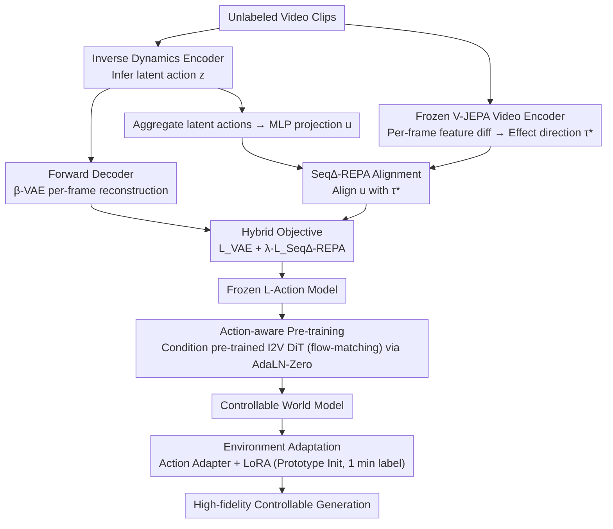

# OLAF-World: Orienting Latent Actions for Video World Modeling

**Conference**: ICML 2026  
**arXiv**: [2602.10104](https://arxiv.org/abs/2602.10104)  
**Code**: To be confirmed  
**Area**: Video Generation / World Models / Self-supervised Learning  
**Keywords**: Latent action learning, video world models, cross-context transfer, control alignment

## TL;DR
OLAF-World enables transferable latent action learning through **sequence-level control-effect alignment** (Seq∆-REPA). It transforms unlabeled videos into action-controllable world models, achieving zero-shot action transfer across contexts. With only 1 minute of labeled data, it reaches performance comparable to AdaWorld trained on 2 hours of data (rotation control precision 0.4680 vs. 0.6420).

## Background & Motivation

**Background**: Video world models require large-scale frame-level action annotations for control. However, such labels are costly and domain-restricted. Latent Action Models (LAM) promise to discover control interfaces from unlabeled videos by using an inverse dynamics encoder to infer latent actions and a forward decoder to predict future frames.

**Limitations of Prior Work**: While LAMs can reconstruct well **within a single video clip**, learned latent actions **cannot transfer across contexts**. In different scenes, viewpoints, or lighting conditions, the same semantic action (e.g., "move forward") maps to entirely different directions in the latent space. Two failure modes exist:
- **Shortcut Learning**: Encoders tend to encode scene-related visual cues rather than actual controllable factors.
- **Cross-context Non-identifiability**: Since training objectives operate only within single clips, the latent coordinate system can drift freely between different videos.

**Key Challenge**: Step-level reconstruction targets (per-frame prediction loss) fail to provide a shared reference frame across videos, causing identical actions to have different representations in different environments, which destroys transferability.

**Goal**: To learn a structured, cross-context consistent latent action space that supports zero-shot action sequence transfer and rapid adaptation with minimal data.

**Key Insight**: Although explicit action labels are unavailable, the **semantic effects of actions are observable**. The same underlying action should produce similar visual-semantic changes across different contexts. By leveraging a frozen self-supervised video encoder as a global reference, latent action sequences can be aligned to their effect direction (net change in features).

**Core Idea**: Align latent actions with visual-semantic changes captured by self-supervised encoders via sequence-level control-effect alignment, establishing a unified latent coordinate system across different contexts.

## Method

### Overall Architecture
OLAF-World aims to learn a cross-context consistent latent action space. It ensures that semantic actions like "move forward" map to the same direction in the latent space regardless of scene or viewpoint. It proceeds in two stages: first, training an inverse dynamics model on unlabeled videos using Seq∆-REPA to align latent actions to a global reference; second, using the learned latent actions as a unified control interface to condition a pre-trained Video Diffusion Transformer.

### Key Designs

**1. Seq∆-REPA Sequence-level Control-Effect Alignment: Unified Coordinates via "Action Changes"**

Standard LAMs suffer from coordinate drift because they rely on per-frame reconstruction within single clips. Seq∆-REPA introduces a frozen self-supervised video encoder (V-JEPA ViT) as a global reference. For a clip $x_{0:K}$, frame features $s_i \in \mathbb{R}^D$ are extracted. The **effect direction** is defined as the mean feature difference: $\tau^* = \frac{1}{K} \sum_{i=0}^{K-1} (s_{i+1} - s_i)$. Simultaneously, the latent encoder infers actions $z_{0:K-1}$, which are aggregated and projected via an MLP: $\bar{z} = \frac{1}{K} \sum z_i$, $u = h_\psi(\bar{z})$. The two are aligned using cosine similarity: 
$$\mathcal{L}^{\text{Seq}\Delta\text{-REPA}}_\psi = 1 - \langle \text{norm}(u), \text{norm}(\tau^*) \rangle$$
This design filters out static appearances, avoids step-level non-identifiability, and ensures all videos align to the same semantic space.

**2. Loss & Training: Balancing Reconstruction and Alignment**

To prevent the model from losing dynamical details or falling into shortcuts, a hybrid objective is used: 
$$\mathcal{L}_{\text{LAM}} = \mathcal{L}^{\text{VAE}}_{\theta, \phi} + \lambda \mathcal{L}^{\text{Seq}\Delta\text{-REPA}}_\psi$$ 
where $\lambda = 0.02$. The reconstruction term ensures latent actions capture useful dynamics for next-frame prediction, while the alignment term forces the encoder to learn action-related features rather than scene-specific cues.

**3. Action-aware Pre-training: Injecting Latent Actions into Video DiT**

The trained LAM extracts per-frame latent actions $z_{0:T-1}$ from unlabeled videos to condition a pre-trained Image-to-Video Diffusion Transformer (I2V DiT). Each $z_t$ is linearly projected and added to the diffusion timestep embedding, then mapped to AdaLN-Zero parameters for each DiT block. Since the backbone operates on latents with temporal compression $r=4$, every $r$ actions are packaged into one conditioning vector.

**4. Environment-specific Adaptation: Rapid Transfer with 1 Minute of Data**

When target environment labels are available, a lightweight action adapter $A_\eta$ maps environment actions $a_t$ into the pre-trained latent space: $\hat{z}_t = A_\eta(a_t)$. For discrete sets, embedding tables are used, initialized with action prototypes inferred by the frozen LAM. Because of the base model's alignment properties, high-fidelity control is achieved even with only 1 minute of labeled data.

## Key Experimental Results

### Main Results: Latent Space Structure Diagnosis (Linear Probing F1)

| Method | 1st→1st | 1st→3rd | 3rd→3rd | 3rd→1st |
|------|---------|---------|---------|---------|
| AdaWorld | 0.6004 | 0.4820 | 0.4827 | 0.4999 |
| **Ours** | **0.8138** | **0.6250** | **0.8256** | **0.5904** |

In cross-domain evaluations (grey columns), the method shows a +30% gain (1st→3rd) and +71% gain (3rd→3rd), indicating the latent coordinate system is truly aligned across contexts.

### Ablation Study: Data Efficient Adaptation

| Method | Adaptation Data | Image Quality ↑ | Trans RPE ↓ | Rot RPE ↓ |
|------|---------|---------------|------------|-----------|
| DirectAct | 0 | 0.7213 | 0.0703 | 1.4311 |
| AdaWorld | 0 | 0.5600 | 0.0470 | 1.0844 |
| Ours | 0 | 0.5400 | 0.0387 | 0.8773 |
| AdaWorld | 1 min | 0.5623 | 0.0318 | 0.6420 |
| **Ours** | 1 min | 0.5726 | 0.0284 | **0.4680** |
| AdaWorld | 2 hours | 0.6177 | 0.0263 | 0.3834 |
| **Ours** | 2 hours | 0.6312 | 0.0230 | **0.3785** |

Across all data regimes, OLAF-World outperforms baselines. With 1 minute of data, rotation control precision is 27% higher than AdaWorld.

### Key Findings
- **Cross-domain Linear Separability**: While AdaWorld's F1 saturates at ~0.48, this method maintains ~0.83, showing vastly improved consistency.
- **Action Prototype Similarity**: The cosine similarity matrix of action prototypes across scenes shows a strong diagonal structure—identical actions are represented consistently across views.
- **Zero-shot Transfer Quality**: Qualitatively, baselines often suffer from "temporal bleaching," vanishing subjects, or trajectory drift during cross-context transfer; this method maintains scene consistency and action accuracy.

## Highlights & Insights
- **"Effect" as an Alignment Reference**: Instead of relying on missing action labels, the method uses self-supervised encoders to extract action effects (feature change directions), bypassing the annotation bottleneck.
- **Sequence-level Aggregation**: By aligning at the clip level, the method theoretically addresses the non-identifiability problem inherent in step-wise latent models.
- **Dual Role of Frozen Encoders**: The frozen encoder serves as both a feature extractor and an alignment anchor, providing stability and universality across diverse video content.

## Limitations & Future Work
- **Computational Overhead**: Running two encoders (latent action + frozen video) increases training costs compared to traditional inverse dynamics.
- **SSL Encoder Dependency**: Alignment quality depends heavily on the frozen encoder; performance may degrade in cases where the encoder performs poorly (e.g., extreme lighting).
- **Discrete vs. Continuous**: Evaluation was primarily on discrete action sets; performance in continuous control scenarios remains to be evaluated.
- **Long Video Generation**: The current world model is conditioned on relatively short sequences; maintaining consistency under cumulative errors in long videos is an area for exploration.

## Related Work & Insights
- **vs. AdaWorld**: Prior LAMs use step-wise reconstruction within a single clip, failing to establish shared coordinates. This work solves identifiability via global constraints.
- **vs. Representation Alignment**: Unlike general feature-alignment works, this focus is on **control-effect alignment**, directly targeting downstream controllability.
- **vs. RL/IL**: Compared to methods requiring explicit rewards or demonstrations, this learns control interfaces from raw unlabeled video, offering higher scalability.

## Rating
- Novelty: ⭐⭐⭐⭐⭐ 
- Experimental Thoroughness: ⭐⭐⭐⭐⭐ 
- Writing Quality: ⭐⭐⭐⭐⭐ 
- Value: ⭐⭐⭐⭐⭐ 

<!-- RELATED:START -->

## Related Papers

- [\[CVPR 2026\] DriveLaW: Unifying Planning and Video Generation in a Latent Driving World](../../CVPR2026/video_generation/drivelaw_unifying_planning_and_video_generation_in_a_latent_driving_world.md)
- [\[ICML 2026\] World-R1: Reinforcing 3D Constraints for Text-to-Video Generation](world-r1_reinforcing_3d_constraints_for_text-to-video_generation.md)
- [\[CVPR 2026\] Inference-time Physics Alignment of Video Generative Models with Latent World Models](../../CVPR2026/video_generation/inference-time_physics_alignment_of_video_generative_models_with_latent_world_mo.md)
- [\[ICML 2026\] WorldCache: Accelerating World Models for Free via Heterogeneous Token Caching](worldcache_accelerating_world_models_for_free_via_heterogeneous_token_caching.md)
- [\[CVPR 2025\] World-Consistent Video Diffusion with Explicit 3D Modeling](../../CVPR2025/video_generation/world-consistent_video_diffusion_with_explicit_3d_modeling.md)

<!-- RELATED:END -->
