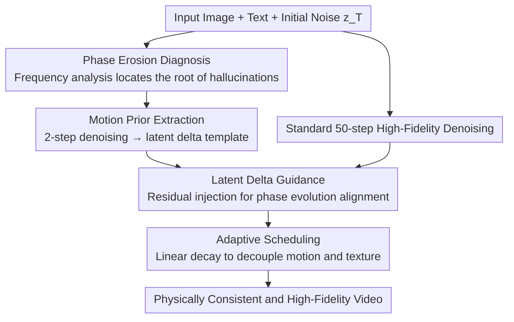

# Physics in 2-Steps: Locking Motion Priors Before Visual Refinement Erases Them

**Conference**: ICML2026  
**arXiv**: [2606.06361](https://arxiv.org/abs/2606.06361)  
**Code**: https://dnwjddl.github.io/phaselock/ (Project Page)  
**Area**: Video Generation / Diffusion Models  
**Keywords**: Image-to-Video, Physical Consistency, Phase Erosion, Frequency Domain Analysis, Training-free Guidance  

## TL;DR
This paper discovers that in Image-to-Video (I2V) diffusion models, "2-step inference is physically more reliable than 50-step inference." The root cause is identified as the erosion of the phase spectrum during the denoising process. Consequently, the authors propose PhaseLock, a training-free framework that extracts motion priors from 2-step inference and injects them into the high-fidelity denoising trajectory using Latent Delta Guidance. This approach improves physical consistency by an average of 6.2 points with negligible overhead (1.06× time, 1.02× VRAM).

## Background & Motivation
**Background**: Image-to-Video (I2V) diffusion models have achieved excellence in "what the frames look like"—rendering realistic objects, scenes, and textures. I2V is an ideal scenario for studying physical distortions because the input image fixes the initial frame, leaving motion as the primary degree of freedom.

**Limitations of Prior Work**: These models frequently generate motion that violates physical laws (e.g., objects disappearing into thin air, balls bouncing in the wrong direction), known as "physical hallucinations." Mainstream remedies either rely on external physics engines/modules or scale up data and model size. The former requires significant computation or manual labeling, while the latter still results in irrational dynamics despite increased scale.

**Key Challenge**: The authors pose a critical question: Does the model "not understand physics," or does it "understand it initially but forget it during generation"? They provide a counter-intuitive observation: using the same model, seed, and conditions, a 2-step denoising process often yields better physical consistency than a full 50-step process. While 50 steps achieve higher image quality (LPIPS drops from 0.23 to 0.19), physical consistency declines (Physics-IQ drops from 34.02 to 30.32). Essentially, the model overwrites the reasonable motion structure captured early on during the "visual refinement" stage.

**Key Insight**: The authors perform Fourier decomposition on video latents, separating them into magnitude spectra (appearance energy, texture contrast) and phase spectra (structural layout, motion trajectories). Observations along the denoising trajectory show that while the magnitude spectrum remains stable (minimal drop of ~2–3%), the phase spectrum degrades significantly (dropping ~18%) from step 2 to step 50. This indicates that denoising primarily destroys "structural dynamics" rather than "appearance energy."

**Core Idea**: Since reasonable motion priors are already formed at step 2 and the issue lies in subsequent refinement eroding the phase, the goal is to "lock" the phase motion prior from few-step inference and maintain it throughout the high-fidelity denoising trajectory. Using inter-frame differences in the spatial domain (latent delta) as a proxy for phase, the method constrains the generation process in a training-free, plug-and-play manner.

## Method

### Overall Architecture
PhaseLock is a training-free, model-agnostic two-stage framework applicable to any pre-trained I2V diffusion backbone. Stage 1: **Motion Prior Extraction**: Using the same initial noise, a 2-step denoising pass is performed to obtain a coarse but physically plausible latent sequence, from which a "motion template" is extracted via inter-frame differencing. Stage 2: **Latent Delta Guidance**: The same initial noise is used for a standard 50-step high-fidelity generation. At each step, the residual between the current inter-frame difference and the motion template is calculated and injected into the latents of subsequent frames with time-decaying intensity. This aligns the phase evolution of the high-fidelity trajectory with the early motion prior while keeping the first frame fixed as the conditional anchor. The authors intentionally avoid direct phase spectrum replacement or low-frequency band injection, as explicit frequency domain operations often introduce high-frequency artifacts; instead, they use "latent delta constraints" as a spatial domain proxy.

### Key Designs

**1. Phase Erosion Diagnosis: Identifying Phase Spectrum as the Root of Physical Hallucinations**

This serves as the foundation of the paper. The authors first confirm on spatio-temporal slices ($x\text{-}t$ slices) that 2-step results track ground truth motion more closely, whereas 50-step results exhibit temporal inconsistencies like a ball moving backwards. Latents are decomposed via Fourier Transform $\mathcal{F}(z)=A\cdot e^{i\phi}$, and two metrics are defined in the low-frequency region (normalized distance $<0.4$): **Phase Coherence** (average cosine similarity of phase angles) and **Magnitude Correlation** (Pearson correlation of log magnitudes). Across CogVideoX and Wan 2.1, magnitude correlation only drops 2–3%, while phase consistency plummets by ~18%. To counter the argument that 2-step results only appear consistent due to blurriness, the authors apply Gaussian blur ($\sigma\in\{0,8,16\}$); even under heavy blur, the correlation of the 2-step output's phase difference with ground truth remains 0.358, which is $3.6\times$ higher than the 50-step result (0.100), proving phase alignment is structural rather than an artifact of blur. Finally, causal experiments injecting 50% noise show that phase pollution results in an optical flow End-Point Error of 9.74 (~10 pixel displacement), while the same amount of magnitude pollution results in only 1.14 (~1 pixel), providing causal evidence that motion dynamics heavily depend on phase.

**2. Motion Prior Extraction: Using Latent Delta as a Spatial Proxy for Phase**

Once phase is identified as the key, the problem becomes how to extract the phase prior from the 2-step result. The authors define the **Latent Delta Operator** $\mathcal{T}(\mathbf{z})=\mathbf{z}_{2:F}-\mathbf{z}_{1:F-1}$, representing the difference between adjacent latent frames—this captures local temporal dynamics while suppressing time-invariant features like static backgrounds. In the first stage, the frozen backbone runs for $K_{\text{few}}=2$ steps with initial noise $\mathbf{z}_T$ to obtain coarse latents $\mathbf{z}^{\text{few}}$, and the motion template is derived as $\mathbf{M}^{\text{prior}}=\mathcal{T}(\mathbf{z}^{\text{few}})=\mathbf{z}^{\text{few}}_{2:F}-\mathbf{z}^{\text{few}}_{1:F-1}$. Theoretical support for using inter-frame differences instead of direct phase manipulation is provided: in natural videos, magnitude spectra of adjacent frames are approximately equal ($A_f\approx A_{f-1}\triangleq A$). Thus, $|\mathcal{F}(\boldsymbol{\Delta})|=2A|\sin(\frac{\phi_f-\phi_{f-1}}{2})|\approx A\cdot|\phi_f-\phi_{f-1}|$. Constraining the delta is approximately equivalent to constraining phase evolution without the artifacts associated with frequency domain edits.

**3. Latent Delta Guidance: Pulling High-Fidelity Trajectories Back to Motion Priors**

During the standard $K_{\text{full}}=50$ step generation in the second stage, current inter-frame dynamics $\mathbf{M}^{(k)}=\mathcal{T}(\mathbf{z}^{(k)})$ are calculated at each step $k$. The guidance signal is defined as the residual between the target template and current dynamics: $\mathcal{G}^{(k)}=\mathbf{M}^{\text{prior}}-\mathcal{T}(\mathbf{z}^{(k)})$. This signal is injected only into subsequent frames while keeping the first frame (the image condition anchor) unchanged: $\mathbf{z}^{(k)}_{2:F}\leftarrow\mathbf{z}^{(k)}_{2:F}+\lambda(k)\cdot\mathcal{G}^{(k)}$. Theoretically, minimizing $\|\mathbf{M}^{\text{prior}}-\mathbf{M}^{(k)}\|$ implicitly constrains phase evolution—the most sensitive component for motion ($8.5\times$ more than magnitude).

**4. Adaptive Scheduling: Decoupling Motion Generation and Texture Refinement**

Continuous guidance during late denoising stages can interfere with high-frequency texture refinement. Since coarse structures form early in the diffusion process, a linear decay schedule limits the guidance strength to the interval $[k_{\text{start}}, k_{\text{end}})$:

$$\lambda(k)=\begin{cases}\lambda_0\cdot\left(1-\dfrac{k-k_{\text{start}}}{k_{\text{end}}-k_{\text{start}}}\right) & k_{\text{start}}\le k<k_{\text{end}}\\ 0 & \text{otherwise}\end{cases}$$

Practically, parameters are set to $\lambda_0=0.05$, $k_{\text{start}}=0$, and $k_{\text{end}}=K_{\text{full}}/2$. This ensures strong adherence to the motion prior during global layout formation and releases the constraint for high-fidelity rendering in the latter half.

## Key Experimental Results

### Main Results
On the Physics-IQ benchmark (measuring kinematic deviation from ground truth), PhaseLock provides plug-and-play improvements across various backbones, outperforming much larger closed-source models:

| Model | Parameters | Physics-IQ Score | Gain |
|------|------|------------------|------|
| Sora (Closed) | - | 10.0 | - |
| Runway Gen-3 Alpha (Closed) | - | 22.8 | - |
| MAGI-1 (Open) | 24B | 30.2 | - |
| CogVideoX | 5B | 30.8 | - |
| + PhaseLock | 5B | **36.0** | +5.2 |
| LTX-Video | 2B | 26.4 | - |
| + PhaseLock | 2B | **32.0** | +5.6 |
| Wan 2.1 | 14B | 20.9 | - |
| + PhaseLock | 14B | **28.7** | +7.8 |
| Wan 2.1 Distill (4-step) | 14B | 27.7 | - |
| + PhaseLock | 14B | **29.4** | +1.7 |

Results on PhyGenBench (LVLM-based overall physical plausibility) also show comprehensive improvements:

| Model | Mechanics↑ | Optics↑ | Thermal↑ | Material↑ | Mean↑ |
|------|------|------|------|------|------|
| CogVideoX | 0.45 | 0.55 | 0.42 | 0.43 | 0.46 |
| + PhaseLock | 0.51 | 0.78 | 0.47 | 0.49 | **0.57** (+23.9%) |
| Wan 2.1 | 0.43 | 0.55 | 0.38 | 0.30 | 0.42 |
| + PhaseLock | 0.48 | 0.64 | 0.49 | 0.41 | **0.51** (+21.4%) |

### Efficiency and Fidelity Comparison

| Metric | Description |
|------|------|
| Time Overhead | 1.06× (vs. ~5× for WMReward) |
| Memory Overhead | 1.02× |
| Visual Fidelity | VBench subject/background consistency and motion smoothness remain stable; physical gains do not compromise image quality |
| Distilled Model Gain | Only +1.7 (Distilled 4-step models already have fewer steps and less phase erosion, consistent with the theory) |

### Key Findings
- **Causal Asymmetry between Phase and Magnitude**: Motion distortion caused by phase pollution is $8.5\times$ that of magnitude pollution. Denoising primarily erodes phase (−18%) rather than magnitude (−2~3%), explaining why fewer steps yield better physics.
- **Increasing Steps Does Not Solve the Problem**: Increasing from 50 to 100 steps only improves physical consistency by ~1 point while significantly increasing inference time, proving the issue is phase erosion during refinement, not insufficient denoising.
- **Spatial Proxy vs. Frequency Operations**: Direct phase replacement introduces high-frequency artifacts. Latent delta constraints effectively align phase while avoiding such artifacts.

## Highlights & Insights
- **The "knowledge erasure" framing is excellent**: Diagnosing physical hallucinations as "knowledge erasure" during refinement rather than "knowledge absence" changes the solution path—no external engines or retraining are needed, just the preservation of early priors.
- **Latent Delta as a Phase Proxy is a Transferable Trick**: Translating the frequency-domain goal of "constraining phase evolution" into simple spatial subtractions ($|\mathcal{F}(\Delta)|\approx A|\phi_f-\phi_{f-1}|$) provides theoretical grounding while avoiding artifacts.
- **Training-free and Low Overhead**: Achieving a 6.2-point physical improvement with 1.06× time and 1.02× VRAM is highly cost-effective compared to methods like WMReward.

## Limitations & Future Work
- The effectiveness relies on "similar magnitude spectra between adjacent frames" and "small inter-frame phase differences." For extremely violent or discontinuous motion, the approximation $|\mathcal{F}(\Delta)|\approx A|\phi_f-\phi_{f-1}|$ may fail.
- Parameters like $\lambda_0$ and the interval $[k_{\text{start}}, k_{\text{end}})$ are manually tuned. While a single set (0.05, first half decay) works across backbones, a systematic scan for different models/scenarios is lacking.
- Physical evaluation still partly relies on LVLM (GPT-4o) scoring, which introduces subjectivity. Physics-IQ is objective but limited in scene coverage; complex multi-object interactions remain open problems.
- Gains on distilled few-step models are notably smaller (+1.7 points), suggesting that as few-step sampling becomes the norm, the improvement room for PhaseLock may narrow.

## Related Work & Insights
- **vs. WMReward**: WMReward uses a latent world model as a reward for search and guidance, achieving similar gains but at $5\times$ temporal cost. PhaseLock achieves comparable results in 1.06× time using the model's own 2-step priors.
- **vs. PhysGen / VideoREPA**: These introduce external physics simulators or foundational models to inject knowledge. PhaseLock argues that the model already possesses the prior and simply needs protection from erasure.
- **vs. FreeInit / FreqPrior / FreeU**: These frequency-domain methods focus on visual, semantic, or temporal consistency. PhaseLock is the first to identify "phase erosion" as the mechanism for physical hallucinations and explicitly protect phase dynamics.

## Rating
- Novelty: ⭐⭐⭐⭐⭐ Counter-intuitive discovery that "fewer steps are physically better" + phase erosion diagnosis.
- Experimental Thoroughness: ⭐⭐⭐⭐ Three backbones + two physics benchmarks + VBench + causal control experiments; however, hyperparameter sensitivity analysis is limited.
- Writing Quality: ⭐⭐⭐⭐⭐ Seamless flow from observation to mechanism to method and theory; clear frequency-domain analysis.
- Value: ⭐⭐⭐⭐⭐ Training-free, model-agnostic, and near-zero overhead for significant physical consistency improvements.

<!-- RELATED:START -->

## Related Papers

- [\[ICML 2026\] MotiMotion: Motion-Controlled Video Generation with Visual Reasoning](motimotion_motion-controlled_video_generation_with_visual_reasoning.md)
- [\[CVPR 2025\] PhyT2V: LLM-Guided Iterative Self-Refinement for Physics-Grounded Text-to-Video Generation](../../CVPR2025/video_generation/phyt2v_llm-guided_iterative_self-refinement_for_physics-grounded_text-to-video_g.md)
- [\[CVPR 2026\] Phantom: Physics-Infused Video Generation via Joint Modeling of Visual and Latent Physical Dynamics](../../CVPR2026/video_generation/phantom_physics-infused_video_generation_via_joint_modeling_of_visual_and_latent.md)
- [\[CVPR 2026\] SynMotion: Semantic-Visual Adaptation for Motion Customized Video Generation](../../CVPR2026/video_generation/synmotion_semantic-visual_adaptation_for_motion_customized_video_generation.md)
- [\[ICML 2026\] VideoGPA: Distilling Geometry Priors for 3D-Consistent Video Generation](videogpa_distilling_geometry_priors_for_3d-consistent_video_generation.md)

<!-- RELATED:END -->
