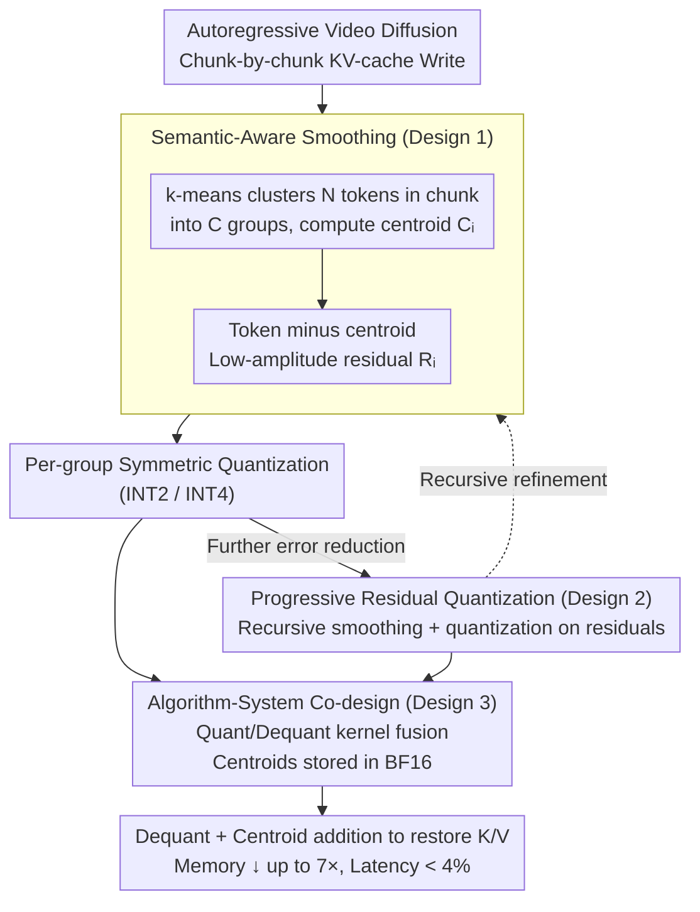

# Quant VideoGen: Auto-Regressive Long Video Generation via 2-Bit KV-Cache Quantization

**Conference**: ICML 2026  
**arXiv**: [2602.02958](https://arxiv.org/abs/2602.02958)  
**Code**: Yes (Website + GitHub specified in paper)  
**Area**: Video Generation / KV-Cache Quantization / Model Compression  
**Keywords**: Autoregressive Video Diffusion, KV-Cache, 2-bit Quantization, Spatial-Temporal Redundancy, Residual Quantization

## TL;DR
QVG is a training-free KV-cache quantization framework for autoregressive video diffusion. By employing semantic-aware clustering for token smoothing and progressive residual multi-stage compression, it reduces KV memory footprint to 1/7 of the original on LongCat-Video/HY-WorldPlay/Self-Forcing with <4% end-to-end latency overhead. At 2-bit, its quality significantly outperforms LLM quantization baselines like KIVI and QuaRot.

## Background & Motivation

**Background**: Video diffusion models are shifting from "bidirectional attention + short-segment denoising" to an **autoregressive + causal attention + KV-cache** chunk-by-chunk generation paradigm (e.g., CausVid, Self-Forcing, HY-WorldPlay). This aims to support long-duration, streaming, and interactive video generation. The key dependency of autoregression is the KV-cache: K/V tokens from early frames must reside in memory to avoid re-computation.

**Limitations of Prior Work**: KV-cache memory consumption grows almost linearly with the number of frames, quickly exhausting GPU VRAM. For instance, generating a 5-second 480p video with LongCat-Video requires ~38K latent tokens, corresponding to 34 GB of KV-cache, exceeding the capacity of a single RTX 5090. Worse, **short context is both an efficiency bottleneck and a capability bottleneck**—KV length directly determines the long-term consistency of identity, layout, and motion. Even top-tier long video systems currently peak at approximately 60 seconds.

**Key Challenge**: Existing LLM KV quantization methods (KIVI, KVQuant, QuaRot, RotateKV) **fail catastrophically** when applied to video. Video KVs exhibit highly heterogeneous numerical distributions in both token and channel dimensions—$\max|K|\approx 10^2$, $\max|V|\approx 10^3$. Furthermore, outlier channels vary by token. In symmetric per-group quantization ($X_{\text{INT}}=\lfloor X/S\rceil$), the scale factor $S=\max(|X|)/(2^{b-1}-1)$ is dictated by the maximum value of the entire token, causing quantization errors $\mathbb E[|x-\hat x|]\propto S$ to explode.

**Goal**: (i) Upgrade KV-cache quantization from LLM "general smoothing" to handle the heterogeneous distribution of video; (ii) Maintain video quality even under extreme 2-bit quantization; (iii) Eliminate the need for training or fine-tuning.

**Key Insight**: The authors observe that video KVs possess **strong spatial-temporal redundancy**—cosine similarity between latent tokens is high for both same-space patches in adjacent frames and adjacent patches in the same frame. Additionally, video content naturally supports **progressive encoding** (coarse-to-fine), similar to SVC streaming. These properties present two opportunities: similar tokens can share a centroid (subtracting it flattens heterogeneous distributions), and residuals can be further refined through multiple stages.

**Core Idea**: Use **k-means to cluster similar tokens and subtract the centroid** to obtain low-amplitude, quantization-friendly residuals (Semantic-Aware Smoothing), followed by **Progressive Residual Quantization** to compress residuals multi-stagedly from coarse to fine. This replaces the LLM-style outlier processing paradigm with a video-style redundancy utilization paradigm.

## Method

### Overall Architecture
QVG integrates into the KV-cache write path of any autoregressive video diffusion model without fine-tuning. It processes KV pairs chunk-by-chunk: (1) k-means clustering partitions $N$ tokens into $C$ groups and calculates centroids $C_i$; (2) tokens subtract their respective centroids to yield residuals $R_i$; (3) residuals undergo standard per-group symmetric quantization (INT2 or INT4); (4) to further reduce error, "residual smoothing + re-quantization" is performed recursively for several rounds (Pro version). During dequantization, $S_X\cdot X_{\text{INT}}+C_i$ is added back to approximate K/V. All centroids are stored in BF16 (minimal size), and the algorithm is co-optimized with the system on GPU to maintain <4% latency.

### Key Designs

**1. Semantic-Aware Smoothing: Flattening distributions via clustering and centroid subtraction**

LLM KV quantization (e.g., per-token in KIVI, rotation in QuaRot) assumes channel outliers are consistent across all tokens. In video, this assumption breaks down as tokens correspond to different spatial regions and motion patterns, causing outliers to drift between tokens. QVG breaks this by leveraging spatial-temporal redundancy: $N=HWT_c$ tokens in a chunk are clustered via k-means into $C$ groups with centroids $C_i\in\mathbb R^d$. Residuals $\mathbf R_i=\mathbf X_{\mathcal G_i}-C_i$ then enter symmetric per-group quantization. Since tokens in the same group have similar latent representations, "outlier channels" are absorbed by the centroid, significantly reducing maximum residual values. This content-based local homogenization fits the data better than fixed global rotations, reducing Key cache quantization error by ~6.9× and Value cache error by ~2.6×.

**2. Progressive Residual Quantization: Multi-stage refinement to thin out errors**

Single-pass quantization rounding error has a hard lower bound of $S_X/2$, which is problematic for extreme 2-bit cases. Borrowing from video's natural hierarchy of "coarse structure + high-frequency residuals," QVG refines residuals across multiple stages. The first round produces $\hat X_1$; the dequantization residual $\Delta_1=X-\hat X_1$ is then smoothed and quantized to yield $\hat\Delta_1$. After $L$ rounds, $\hat X=\hat X_1+\hat\Delta_1+\cdots+\hat\Delta_{L-1}$. Each stage decays the error geometrically. The number of stages $L$ acts as a "quality vs. compression" knob—QVG-Pro (multi-stage) achieves a PSNR of 30.4 at INT2, while single-stage QVG achieves 28.7, both far exceeding baselines.

**Design 3. Algorithm-System Co-design: Implementing smoothing and residuals on GPU with <4% latency**

KV quantization becomes meaningless if it slows down inference. QVG engineered these steps into the autoregressive KV write path: k-means is performed at chunk granularity, centroids are stored in BF16, and (de)quantization is fused with attention kernels. 2-bit values use packed INT representation. By maintaining intra-chunk parallelism and minimizing dequantization overhead, the end-to-end latency increase is kept under 4%, enabling deployment on consumer GPUs like the RTX 4090/5090.

### Loss & Training
Completely training-free with no gradient updates. Hyperparameters include: number of clusters $C$, number of residual stages $L$, and bit-width $b$.

## Key Experimental Results

### Main Results
Using BF16 full precision as a reference, QVG was compared against RTN, KIVI, and QuaRot on LongCat-Video-13B, HY-WorldPlay-8B, and Self-Forcing.

| Model | Setting | Method | Compression | PSNR | SSIM | LPIPS |
|---|---|---|---|---|---|---|
| LongCat-Video | INT2 480p | RTN | 6.40× | 20.87 | 0.719 | 0.203 |
| LongCat-Video | INT2 480p | KIVI | 6.40× | 20.32 | 0.719 | 0.208 |
| LongCat-Video | INT2 480p | QuaRot | 6.40× | 21.57 | 0.759 | 0.171 |
| LongCat-Video | INT2 480p | **QVG-Pro** | 4.97× | **30.38** | **0.935** | **0.048** |
| LongCat-Video | INT2 480p | **QVG** | 6.94× | **28.72** | **0.909** | **0.065** |
| LongCat-Video | INT4 480p | QuaRot | 3.55× | 33.74 | 0.960 | 0.033 |
| LongCat-Video | INT4 480p | **QVG-Pro** | 3.05× | **37.10** | **0.977** | **0.024** |

At extreme 2-bit settings, LLM baselines all result in PSNR $\le$ 25, whereas QVG reaches 28–30. At INT4, QVG-Pro exceeds the near-lossless performance of BF16 on certain metrics (PSNR >37).

### Ablation Study

| Configuration | Explanation | Effect |
|---|---|---|
| Full QVG-Pro | k-means smoothing + multi-stage residuals | Optimal |
| Semantic-Aware Smoothing only | Single-stage, single centroid subtraction | Moderate gain |
| Progressive Residual only | Residual recursion without clustering | Fails to solve channel outliers, 2-bit collapse |
| Naive per-group (RTN) | No smoothing or residuals | 2-bit collapse |

Key and Value cache quantization errors were reduced by ~6.9× and ~2.6×, respectively.

### Key Findings
- **2-bit video KV quantization is truly viable for the first time**: Previous state-of-the-art LLM quantization yielded PSNR 20-25; QVG improves this to 28-30.
- **HY-WorldPlay-8B deployed on a single RTX 4090**: Previously impossible due to KV memory overflow.
- **Extended context for better quality**: In Self-Forcing, using more context within a fixed memory budget via quantization resulted in better quality than the BF16 default, turning "memory saving" into "quality enhancement."

## Highlights & Insights
- **Diagnosing "video KV specificity" at the token-channel level**: The author identifies explicit "root causes"—$\max|K|\approx 10^2$ and token-dependent outlier drifting—rather than settling for general conclusions. This diagnostic paradigm is highly reusable.
- **k-means + Centroid subtraction = Data-driven outlier absorption**: Replacing fixed Hadamard rotations with content-aware local homogenization is a superior transition from general-purpose to domain-aware methodology.
- **The "Memory-Context-Quality" Flywheel**: While LLM quantization focuses on the "Compression-Accuracy Pareto" curve, QVG reveals that quantization can unlock longer KV contexts, thereby improving **capability metrics** like long-term consistency.

## Limitations & Future Work
- k-means is sensitive to the number of tokens per chunk; the number of clusters $C$ remains a manual hyperparameter.
- Increasing residual stages $L$ sacrifices compression ratio; dynamic stage selection for the "quality-memory" Pareto remains empirical.
- Focus is on 480p and chunk-level autoregressive models; validation on pixel-level autoregressive generation (token-by-token) is pending.
- Evaluation relies on reference-based metrics (PSNR/SSIM); the impact on "generative diversity" is not deeply explored.

## Related Work & Insights
- **vs. KIVI / KVQuant**: Effective for LLMs, but token-channel heterogeneity in video renders their outlier processing ineffective; QVG "localizes" and resolves this via clustering.
- **vs. QuaRot / RotateKV**: Global distribution smoothing via rotation cannot handle token-dependent outlier shifts; QVG uses data-driven centroids instead.
- **vs. Vector Quantization (PQCache, CommVQ)**: QVG uses "centroid subtraction + residual quantization," where centroids are anchors rather than full codebooks, making it more lightweight and training-free.
- **vs. StreamingT2V / WorldMem**: These design algorithmic memory mechanisms, while QVG expands the system-side KV budget; the two are complementary.

## Rating
- Novelty: ⭐⭐⭐⭐ 
- Experimental Thoroughness: ⭐⭐⭐⭐⭐ 
- Writing Quality: ⭐⭐⭐⭐⭐ 
- Value: ⭐⭐⭐⭐⭐ 

<!-- RELATED:START -->

## Related Papers

- [\[ICLR 2026\] FastCar: Cache Attentive Replay for Fast Auto-Regressive Video Generation on the Edge](../../ICLR2026/video_generation/fastcar_cache_attentive_replay_for_fast_auto-regressive_video_generation_on_the_.md)
- [\[ICML 2026\] Quantized Keys Steal Attention: Bias Correction for KV-Cache Compression in Video Generation](quantized_keys_steal_attention_bias_correction_for_kv-cache_compression_in_video.md)
- [\[CVPR 2026\] Towards Holistic Modeling for Video Frame Interpolation with Auto-regressive Diffusion Transformers](../../CVPR2026/video_generation/towards_holistic_modeling_for_video_frame_interpolation_with_auto-regressive_dif.md)
- [\[ICML 2026\] LocoT2V-Bench: Benchmarking Long-form and Complex Text-to-Video Generation](locot2v-bench_benchmarking_long-form_and_complex_text-to-video_generation.md)
- [\[ICML 2026\] Enhancing Train-Free Infinite-Frame Generation for Consistent Long Videos](enhancing_train-free_infinite-frame_generation_for_consistent_long_videos.md)

<!-- RELATED:END -->
