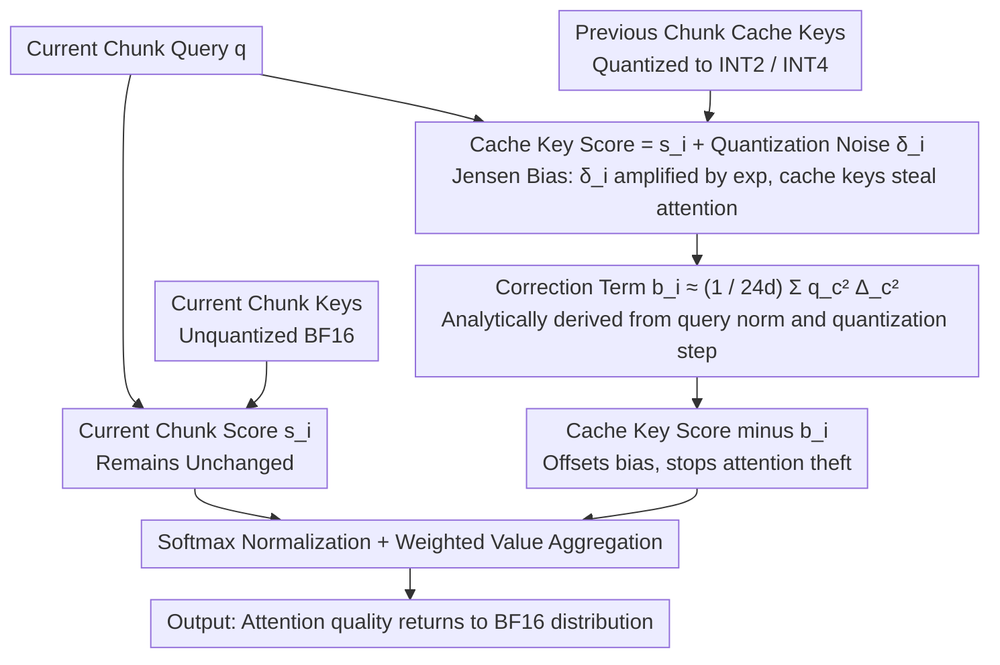

# Quantized Keys Steal Attention: Bias Correction for KV-Cache Compression in Video Generation

**Conference**: ICML 2026  
**arXiv**: [2605.26266](https://arxiv.org/abs/2605.26266)  
**Code**: To be confirmed  
**Area**: Video Generation / Model Compression  
**Keywords**: KV-Cache Quantization, Attention Bias, Diffusion Models, Jensen's Inequality

## TL;DR
This paper discovers that KV-cache quantization in chunked autoregressive video diffusion models causes a **systematic shift in attention weights** ("quantized keys steal attention"). By deriving a per-score correction term based on Jensen's Inequality, it restores video quality close to BF16 (VBench 78.02 vs 78.27) under aggressive INT2 quantization while saving 50% memory.

## Background & Motivation

**Background**: Chunked autoregressive video diffusion models (e.g., MAGI-1, SkyReels-V2) avoid redundant computation by maintaining a KV cache for previously generated video chunks. To save memory, industry practices employ quantization to compress cache keys and values to low bit-widths (INT2, INT4).

**Limitations of Prior Work**: Aggressive KV-cache quantization (especially INT2) severely degrades video quality, leading to the destruction of subjects and scene structures. Existing quantization methods (QuaRot, RTN, etc.) focus on how to reduce quantization noise itself but fail to fully address deeper issues introduced by quantization.

**Key Challenge**: Integer quantization introduces **zero-mean noise** at the attention score level, which theoretically should not change the expected behavior of attention. However, the **convexity** of the exponential function in softmax breaks this symmetry—positive deviations are amplified more significantly than negative deviations are suppressed. Consequently, the contribution of quantized cache keys to the partition sum is systematically overestimated.

**Goal**:
- Identify and quantify the impact of this systematic bias (Jensen bias) on attention weight distribution.
- Derive a theoretically sound correction term to restore the original attention distribution without retraining.
- Implement a correction scheme with minimal overhead.

**Key Insight**: Starting from Jensen's Inequality in probability theory—in softmax $\mathbb{E}[e^{s_i + \delta_i}] = e^{s_i} \cdot \mathbb{E}[e^{\delta_i}] > e^{s_i}$ (when $\delta_i$ is zero-mean quantization noise), the contribution of cache keys is systematically inflated.

**Core Idea**: Offset Jensen bias by subtracting a correction term $b_i = \log \mathbb{E}[e^{\delta_i}]$ from the cached attention scores, ensuring the corrected expected score contribution matches the unquantized case.

## Method

### Overall Architecture
In chunked autoregressive video diffusion, the query of the current chunk attends to two sets of keys: the high-precision BF16 keys of the current chunk and the low-bit quantized cache keys of preceding chunks. Standard softmax computes the partition sum for both sets separately before normalization. This work finds that quantization causes the partition sum on the cache key side to be systematically inflated, allowing cache keys to "steal" attention quality that should belong to the current chunk. The methodology follows a logical chain: first, explaining the inevitability of this bias via Jensen's Inequality; then, analytically deriving a per-token correction term $b_i$ to be subtracted from cache key scores before softmax; and finally, proving it adds negligible inference overhead without requiring retraining.

### Key Designs

**1. Theoretical Derivation of Jensen Bias: Why zero-mean noise leads to systematic drift**

Intuitively, integer quantization introduces zero-mean noise to attention scores, which should not alter attention behavior in expectation. However, since the exponential function in softmax is convex, the symmetry is broken. Let the quantized score for cache key $i$ be $\hat{s}_i = s_i + \delta_i$, where $\delta_i = \frac{q^\top \epsilon_i}{\sqrt{d}}$ is the projection of quantization noise $\epsilon_i \sim \mathcal{U}(-\Delta_i/2, +\Delta_i/2)$. The expectation of the cache-side partition sum is $\mathbb{E}[\hat{Z}_\mathcal{S}] = \sum_{i \in \mathcal{S}} e^{s_i} \cdot \mathbb{E}[e^{\delta_i}]$. By Jensen's Inequality, $\mathbb{E}[e^{\delta_i}] \geq e^{\mathbb{E}[\delta_i]} = 1$, hence $\mathbb{E}[\hat{Z}_\mathcal{S}] \geq Z_\mathcal{S}$. The magnitude of positive deviations amplified by the exponential is greater than that of suppressed negative deviations. This gap in the inequality is the Jensen bias—the mechanism through which cache keys steal attention. Recognizing this shifts the strategy from "minimizing quantization noise" to "correcting the consequences of noise."

**2. Derivation of Per-score Correction Term: Restoring expected contribution**

Since the contribution of cache keys is inflated by a factor of $\mathbb{E}[e^{\delta_i}]$, a correction term $b_i$ is subtracted from each cache token to cancel it out. The constraint is straightforward: $e^{s_i - b_i} \cdot \mathbb{E}[e^{\delta_i}] = e^{s_i}$, yielding $b_i = \log \mathbb{E}[e^{\delta_i}]$. Because quantization noise is independent across channels, this expectation can be decomposed per channel. For uniform quantization noise, the exact form is $b_i = \sum_{c=1}^d \log\left(\frac{\sinh(q_c \Delta_{i, c} / (2 \sqrt{d}))}{q_c \Delta_{i, c} / (2 \sqrt{d})}\right)$. In practice, using a second-order Taylor expansion $\log(\sinh(\alpha)/\alpha) \approx \alpha^2/6$ simplifies this to a clean approximation: $b_i \approx \frac{1}{24 d} \sum_{c=1}^d q_c^2 \Delta_{i, c}^2$. This term depends only on the query and the quantization step size $\Delta$, making it theoretically unbiased, practically concise, and generalizable to other formats like FP or MXFP.

**3. Inference Application + Complexity Control: Nearly free correction**

The correction term $b_i$ utilizes existing quantization parameters (step size $\Delta_{i, c}$) and query norms $\|q\|$, requiring no additional storage. For grouped quantization (group size $g = 32$), the extra computation is $O(QK \cdot d / g)$. Compared to the standard $QK^\top$ complexity of $O(QK \cdot d)$, this adds only a factor of $1/g$. When implemented with FlexAttention, end-to-end latency increases by only about 5%. This near-zero cost transforms a theoretical conclusion into a plug-and-play correction applicable to any quantization scheme.

### Loss & Training
The proposed method is an **inference-stage correction requiring no training**: original model parameters and training objectives remain unchanged, with calibration performed solely on cache key scores before the softmax operation.

## Key Experimental Results

### Main Results

| Model | Quantization | Precision | PSNR ↑ | SSIM ↑ | LPIPS ↓ | VBench ↑ | Description |
|------|--------|------|--------|--------|---------|---------|------|
| MAGI-1 | None | BF16 | — | — | — | 78.27 | Baseline |
| MAGI-1 | QuaRot+RTN | INT2 ✗ | 17.10 | 0.630 | 0.453 | 70.24 | No Correction |
| MAGI-1 | QuaRot+RTN | INT2 ✓ | 22.97 | 0.801 | 0.165 | **78.02** | Corrected |
| MAGI-1 | QVG+Correction | INT2 | 25.29 | 0.856 | 0.107 | 78.23 | Best Combo |
| SkyReels-V2 | QuaRot+RTN | INT2 ✗ | 19.20 | 0.708 | 0.319 | 71.44 | No Correction |
| SkyReels-V2 | QuaRot+RTN | INT2 ✓ | 20.42 | 0.784 | 0.202 | **78.58** | Corrected |

After correction, INT2 almost fully recovers BF16 quality; the correction is orthogonal and combinable with upstream compression methods like QVG; memory savings of 50% are achieved at the same quality level.

### Ablation Study

| Configuration | Attention Mass Shift $\Delta P_\mathcal{S}$ | Median | Description |
|------|-------------------------------|------|------|
| BF16 Baseline | — | 0 | No shift |
| INT2 No Correction | Significant Positive Shift | +0.15 | Cache keys steal attention |
| INT2 Corrected | Near zero after calibration | ~0 | Bias neutralized |

### Key Findings
- Attention mass shift directly correlates with the degree of video quality degradation.
- Correction improves PSNR across all group sizes, shifting the memory-quality trade-off curve toward higher quality.
- Performance gains are most pronounced under aggressive quantization (INT2 superior to INT4).
- Cross-domain applicability: Preliminary LLM experiments show the same bias mechanism in chunked prefill scenarios.

## Highlights & Insights
- **Theoretical Simplicity**: Distills complex quantization issues into a single root cause (Jensen bias). The correction formula requiring only query norms and step sizes, without complex statistics or retraining, offers an elegant information-theoretic perspective.
- **Cross-domain Applicability**: While the focus is on video diffusion, the same bias mechanism exists in LLM chunked prefill, indicating widespread relevance.
- **Plug-and-play nature**: The method is orthogonal to upstream quantization schemes (QuaRot, RTN, QVG, etc.), allowing seamless integration and high engineering value.

## Limitations & Future Work
- **Noise Model Assumptions**: The derivation assumes uniform zero-mean noise from integer quantization; it may fail for non-uniform or biased noise. Floating-point formats like FP and MXFP require re-derivation.
- **Expected Effectiveness**: The correction is unbiased in expectation, but when attention is highly concentrated on a few cache tokens, single-sample noise may dominate, reducing correction benefits.
- **Single-token Decoding Limitations**: The method performs best in multi-token current chunk scenarios. In standard LLM single-token decoding, competition between cache tokens is weaker, limiting the room for correction.

## Related Work & Insights
- **vs KIVI / KVQuant / QuaRot / QuantVideoGen**: These methods reduce noise during the quantization stage via step size reallocation or rotation; the proposed method complementarily removes residual bias during decoding, and the two approaches can be combined.
- **vs KVLinC**: KVLinC uses trained linear adapters to correct quantization errors; the proposed correction is analytically derived, requires no training, and possesses stronger generalization capabilities.
- **vs General Diffusion Quantization Research**: Previous work focused on the quantization of the softmax calculation itself; this work uniquely identifies structural bias introduced by KV-cache quantization through softmax convexity.

## Rating
- Novelty: ⭐⭐⭐⭐⭐ Reveals the fundamental issue of KV quantization from the perspective of Jensen's Inequality, providing a completely novel theoretical view.
- Experimental Thoroughness: ⭐⭐⭐⭐⭐ Covers three video models × two quantization schemes + detailed ablations (attention shift, memory-quality trade-off, cross-domain LLM).
- Writing Quality: ⭐⭐⭐⭐⭐ Clear logical chain, connecting phenomena → root cause → solution → verification.
- Value: ⭐⭐⭐⭐⭐ A plug-and-play solution with high industrial usability; directly benefits any model utilizing KV-cache quantization.

<!-- RELATED:START -->

## Related Papers

- [\[ICML 2026\] Quant VideoGen: Auto-Regressive Long Video Generation via 2-Bit KV-Cache Quantization](quant_videogen_auto-regressive_long_video_generation_via_2-bit_kv-cache_quantiza.md)
- [\[CVPR 2026\] Accelerating Autoregressive Video Diffusion via History-Guided Cache and Residual Correction](../../CVPR2026/video_generation/accelerating_autoregressive_video_diffusion_via_history-guided_cache_and_residua.md)
- [\[CVPR 2026\] When to Lock Attention: Training-Free KV Control in Video Diffusion](../../CVPR2026/video_generation/when_to_lock_attention_training-free_kv_control_in_video_diffusion.md)
- [\[ICML 2026\] DFSAttn: Dynamic Fine-Grained Sparse Attention for Efficient Video Generation](dfsattn_dynamic_fine-grained_sparse_attention_for_efficient_video_generation.md)
- [\[ICML 2026\] Attention Sparsity is Input-Stable: Training-Free Sparse Attention for Video Generation via Offline Sparsity Profiling and Online QK Co-Clustering](attention_sparsity_is_input-stable_training-free_sparse_attention_for_video_gene.md)

<!-- RELATED:END -->
