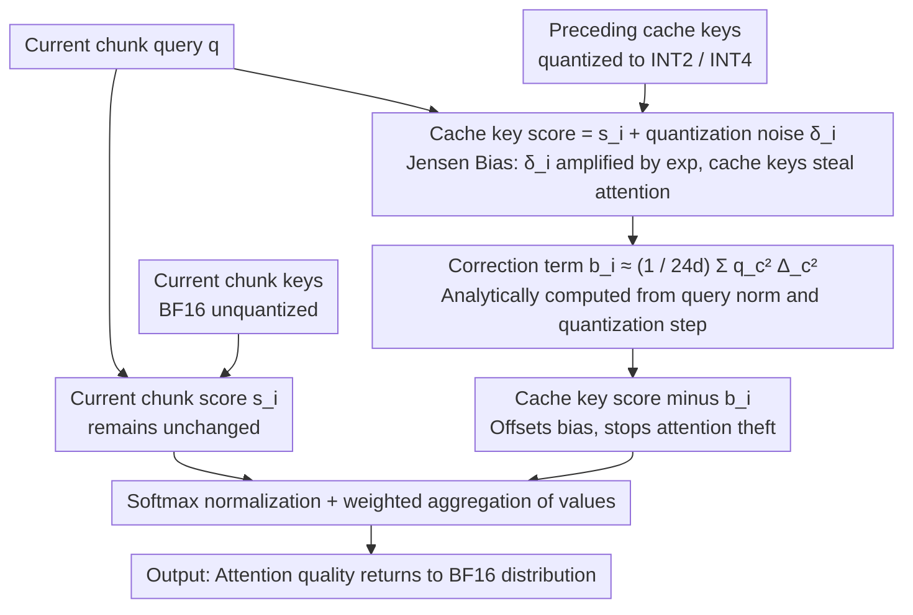

# Quantized Keys Steal Attention: Bias Correction for KV-Cache Compression in Video Generation

**Conference**: ICML 2026  
**arXiv**: [2605.26266](https://arxiv.org/abs/2605.26266)  
**Code**: To be confirmed  
**Area**: Video Generation / Model Compression  
**Keywords**: KV Cache Quantization, Attention Bias, Diffusion Models, Jensen's Inequality

## TL;DR
This paper identifies that KV cache quantization in chunked autoregressive video diffusion models causes a **systematic shift in attention weights** ("Quantized Keys Steal Attention"). By deriving a per-score correction term based on Jensen's Inequality, it restores video quality near BF16 levels (VBench 78.02 vs 78.27) under aggressive INT2 quantization, saving 50% memory.

## Background & Motivation

**Background**: Chunked autoregressive video diffusion models (e.g., MAGI-1, SkyReels-V2) avoid redundant computation by maintaining KV caches for previously generated video chunks. To save memory, industry practices employ quantization techniques to compress cache keys and values to low bit-widths (INT2, INT4).

**Limitations of Prior Work**: Aggressive KV cache quantization (especially INT2) severely degrades video quality, leading to the destruction of subject and scene structures. Existing quantization methods (QuaRot, RTN, etc.) focus on reducing quantization noise itself but fail to address deeper issues introduced by quantization.

**Key Challenge**: Integer quantization introduces **zero-mean noise** at the attention score level, which theoretically should not alter the expected behavior of attention. However, the exponential function in softmax is **convex**, breaking symmetry—positive deviations are amplified more than negative deviations are suppressed. This causes the contribution of quantized cache keys to the partition sum to be systematically overestimated.

**Goal**: 
- Identify and quantify the impact of this systematic bias (Jensen's bias) on attention weight distribution.
- Derive theoretically grounded correction terms to restore original attention distributions without retraining.
- Implement an extremely low-overhead correction scheme.

**Key Insight**: Starting from Jensen's Inequality in probability theory—in softmax, $\mathbb{E}[e^{s_i + \delta_i}] = e^{s_i} \cdot \mathbb{E}[e^{\delta_i}] > e^{s_i}$ (where $\delta_i$ is zero-mean quantization noise), leading to a systematic inflation of the contribution from cache keys.

**Core Idea**: Offset Jensen's bias by subtracting a correction term $b_i = \log \mathbb{E}[e^{\delta_i}]$ from cached attention scores, aligning the corrected expected score contribution with the unquantized case.

## Method

### Overall Architecture
In chunked autoregressive video diffusion, the current chunk's query attends to two sets of keys: the high-precision BF16 keys of the current chunk, and the low-bit quantized cache keys of preceding chunks. Standard softmax calculates partition sums for both groups before normalization. This paper finds that quantization causes the partition sum on the cache key side to be systematically inflated, allowing cache keys to "steal" attention quality intended for the current chunk. The methodology follows a logical chain: first using Jensen's Inequality to explain why this bias inevitably occurs, then analytically deriving a per-token correction term $b_i$ to be subtracted from cache key scores before softmax, and finally proving it adds negligible inference overhead—requiring no retraining.

### Key Designs

**1. Theoretical Derivation of Jensen's Bias: Why Zero-Mean Noise Causes Systematic Deviation**

Intuitively, integer quantization introduces zero-mean noise into attention scores, which should not alter attention behavior in expectation. However, the exponential function in softmax is convex, breaking this symmetry. Let the quantized score of cache key $i$ be $\hat{s}_i = s_i + \delta_i$, where $\delta_i = \frac{q^\top \epsilon_i}{\sqrt{d}}$ is the projection of quantization noise $\epsilon_i \sim \mathcal{U}(- \Delta_i/2, + \Delta_i/2)$. The expectation of the cache-side partition sum is $\mathbb{E}[\hat{Z}_\mathcal{S}] = \sum_{i \in \mathcal{S}} e^{s_i} \cdot \mathbb{E}[e^{\delta_i}]$. By Jensen's Inequality, $\mathbb{E}[e^{\delta_i}] \geq e^{\mathbb{E}[\delta_i]} = 1$, thus $\mathbb{E}[\hat{Z}_\mathcal{S}] \geq Z_\mathcal{S}$. The magnitude of exponential amplification for positive deviations exceeds the suppression for negative ones; this gap is Jensen's bias—where cache keys "steal" attention. This shift moves the focus from "reducing quantization noise" to "correcting the consequences of noise."

**2. Derivation of Per-Score Correction Term: Restoring Expected Contributions**

Since the cache key contribution is inflated by a factor of $\mathbb{E}[e^{\delta_i}]$, a term $b_i$ is subtracted from each cache token to cancel it. The constraint is straightforward: $e^{s_i - b_i} \cdot \mathbb{E}[e^{\delta_i}] = e^{s_i}$, solving to $b_i = \log \mathbb{E}[e^{\delta_i}]$. Because quantization noise is independent across channels, the expectation decomposes. For uniform quantization noise, it has an exact form $b_i = \sum_{c=1}^d \log\left(\frac{\sinh(q_c \Delta_{i, c} / (2 \sqrt{d}))}{q_c \Delta_{i, c} / (2 \sqrt{d})}\right)$. In practice, using a second-order Taylor expansion $\log(\sinh(\alpha)/\alpha) \approx \alpha^2/6$ yields a clean approximation $b_i \approx \frac{1}{24 d} \sum_{c=1}^d q_c^2 \Delta_{i, c}^2$. This depends only on the query and quantization steps, providing a theoretically unbiased and simple solution extendable to other formats like FP or MXFP.

**3. Inference-time Application + Complexity Control: Nearly Free Correction**

The correction term $b_i$ utilizes existing quantization parameters (step size $\Delta_{i, c}$) and the query norm $\|q\|$, requiring no extra storage. For grouped quantization (group size $g = 32$), the additional computation is $O(QK \cdot d / g)$, which is only $1/g$ relative to the standard $O(QK \cdot d)$ of $QK^\top$. Implemented with FlexAttention, end-to-end latency increases by only ~5%. This efficiency transforms a theoretical conclusion into a plug-and-play correction for any quantization scheme.

### Loss & Training
This method is a **training-free inference-stage correction**: original model parameters and training objectives remain unchanged; only the cache key scores are calibrated before softmax.

## Key Experimental Results

### Main Results

| Model | Quantization | Precision | PSNR ↑ | SSIM ↑ | LPIPS ↓ | VBench ↑ | Description |
|------|--------|------|--------|--------|---------|---------|------|
| MAGI-1 | None | BF16 | — | — | — | 78.27 | Baseline |
| MAGI-1 | QuaRot+RTN | INT2 ✗ | 17.10 | 0.630 | 0.453 | 70.24 | No Correction |
| MAGI-1 | QuaRot+RTN | INT2 ✓ | 22.97 | 0.801 | 0.165 | **78.02** | Corrected |
| MAGI-1 | QVG+Correction | INT2 | 25.29 | 0.856 | 0.107 | 78.23 | Best Combination |
| SkyReels-V2 | QuaRot+RTN | INT2 ✗ | 19.20 | 0.708 | 0.319 | 71.44 | No Correction |
| SkyReels-V2 | QuaRot+RTN | INT2 ✓ | 20.42 | 0.784 | 0.202 | **78.58** | Corrected |

With correction, INT2 almost fully restores BF16 quality; the correction is orthogonal and combinable with upstream methods like QVG; memory is reduced by 50% at equivalent quality.

### Ablation Study

| Configuration | Attention Quality Shift $\Delta P_\mathcal{S}$ | Median | Description |
|------|-------------------------------|------|------|
| BF16 Baseline | — | 0 | No shift |
| INT2 No Correction | Significant positive shift | +0.15 | Cache keys steal attention |
| INT2 Corrected | Close to 0 after calibration | ~0 | Bias is neutralized |

### Key Findings
- Attention quality shift directly correlates with video quality degradation.
- Correction improves PSNR across all group sizes, shifting the memory-quality trade-off curve toward higher quality.
- Performance gains are most significant under aggressive quantization (INT2 outperforming INT4).
- Cross-domain applicability: Preliminary LLM experiments show the same bias mechanism in chunked prefill scenarios.

## Highlights & Insights
- **Theoretical Simplicity**: Reduces complex quantization issues to a single root cause (Jensen's bias). The formula requires only query norms and step sizes—an elegant information-theoretic perspective.
- **Cross-domain Applicability**: While focused on video diffusion, the same mechanism exists in LLM chunked prefill, indicating universal relevance.
- **Plug-and-play**: Orthogonal to any upstream quantization scheme (QuaRot, RTN, QVG, etc.), making it highly valuable for engineering.

## Limitations & Future Work
- Noise Model Assumptions: Derivations assume uniform zero-mean noise from integer quantization; it may fail for non-uniform or biased noise. Floating-point formats (FP, MXFP) require re-derivation.
- Expected-level Validity: Correction is unbiased in expectation, but when attention is highly concentrated on a few cache tokens, single-sample noise may dominate, reducing gains.
- Single-token Decoding Limitations: Performant in multi-token current chunk scenarios; in standard LLM single-token decoding, competition between cache tokens is weaker, limiting the correction space.

## Related Work & Insights
- **vs KIVI / KVQuant / QuaRot / QuantVideoGen**: These reduce noise during quantization via step-size reallocation or rotation; Ours complementarily removes residual bias during decoding.
- **vs KVLinC**: KVLinC uses trained linear adapters; Ours is analytically derived and training-free with stronger generalization.
- **vs General Diffusion Quantization**: Previous work focused on softmax computation quantization; Ours uniquely identifies structural bias introduced via softmax convexity in KV caches.

## Rating
- Novelty: ⭐⭐⭐⭐⭐ Unveils the fundamental issue of KV quantization via Jensen's Inequality with a novel theoretical perspective.
- Experimental Thoroughness: ⭐⭐⭐⭐⭐ Three video models × two quantization schemes + detailed ablations (attention shift, memory-quality trade-off, cross-domain LLM).
- Writing Quality: ⭐⭐⭐⭐⭐ Clear logical chain: Phenomenon → Root Cause → Solution → Verification.
- Value: ⭐⭐⭐⭐⭐ Plug-and-play solution with high industrial utility for any model using KV cache quantization.

<!-- RELATED:START -->

## Related Papers

- [\[ICML 2026\] Quant VideoGen: Auto-Regressive Long Video Generation via 2-Bit KV-Cache Quantization](quant_videogen_auto-regressive_long_video_generation_via_2-bit_kv-cache_quantiza.md)
- [\[CVPR 2026\] Accelerating Autoregressive Video Diffusion via History-Guided Cache and Residual Correction](../../CVPR2026/video_generation/accelerating_autoregressive_video_diffusion_via_history-guided_cache_and_residua.md)
- [\[CVPR 2025\] When to Lock Attention: Training-Free KV Control in Video Diffusion](../../CVPR2025/video_generation/when_to_lock_attention_training-free_kv_control_in_video_diffusion.md)
- [\[ICML 2026\] DFSAttn: Dynamic Fine-Grained Sparse Attention for Efficient Video Generation](dfsattn_dynamic_fine-grained_sparse_attention_for_efficient_video_generation.md)
- [\[ICML 2026\] Attention Sparsity is Input-Stable: Training-Free Sparse Attention for Video Generation via Offline Sparsity Profiling and Online QK Co-Clustering](attention_sparsity_is_input-stable_training-free_sparse_attention_for_video_gene.md)

<!-- RELATED:END -->
