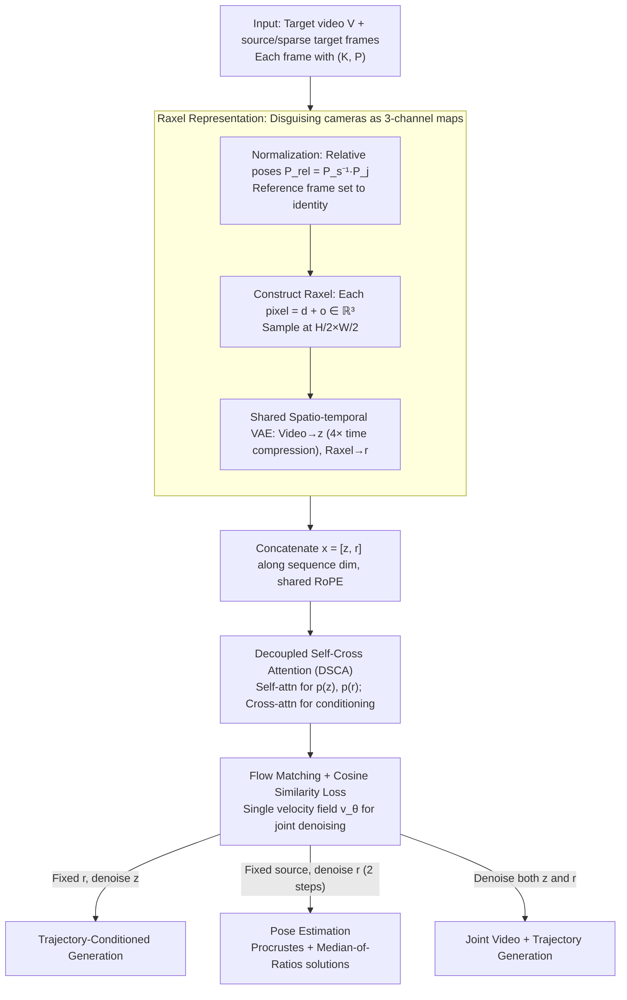

# Rays as Pixels: Learning A Joint Distribution of Videos and Camera Trajectories

**Conference**: ICML 2026  
**arXiv**: [2604.09429](https://arxiv.org/abs/2604.09429)  
**Code**: https://wbjang.github.io/raysaspixels/ (Project Page)  
**Area**: Video Generation  
**Keywords**: Video diffusion, camera pose, joint distribution, raxel, decoupled self-cross attention

## TL;DR
This work packs the per-pixel ray "origin + direction" of each camera into a 3-channel "raxel" map with the same shape as RGB images. It leverages a pre-trained video VAE as a camera encoder and employs Decoupled Self-Cross Attention to integrate raxels and video frames into a single Flow Matching DiT for joint denoising. For the first time, a single set of weights supports pose estimation, camera-controlled video generation, and joint "video + trajectory" generation.

## Background & Motivation
**Background**: In 3D vision, "recovering camera parameters from images" (SfM/COLMAP, DUSt3R, VGGT) and "rendering new views based on camera parameters" (NeRF, 3DGS, camera-controlled video diffusion like MotionCtrl/VD3D/Wonderland) have traditionally been two separate pipelines—the former being an inverse problem and the latter a forward problem, dual to each other but trained and evaluated independently.

**Limitations of Prior Work**: Camera-controlled video diffusion models treat poses as "known inputs," relying on external estimators (COLMAP, DUSt3R). These upstream estimators are prone to failure in scenarios with sparse inputs or viewing ambiguity, causing the downstream generation models to inherit this fragility. Conversely, pure estimators (VGGT) only output geometry and cannot "imagine" plausible pixels in occluded regions. Existing joint efforts (e.g., Matrix3D) often require 3DGS post-processing, meaning rendering is not end-to-end from the diffusion model.

**Key Challenge**: Pre-trained video diffusion models operate on dense spatial tensors (H×W×3 RGB latents), while camera parameters are low-dimensional global matrices (K, R, T totals about a dozen numbers). This structural mismatch has led prior work to either use adapters to project matrices into tokens (structural deficiency) or use Plücker embeddings (6 channels, unencodable by VAEs, requiring MLP + concatenation, bypassing pre-trained priors). In other words, the camera remains an "external condition" rather than part of the video model's generative loop.

**Goal**: To enable a single pre-trained video DiT to learn the **joint distribution** $p(z, r)$ of video frames $z$ and camera trajectories $r$. This allows the same set of weights to sample $p(r|z)$ (pose estimation), $p(z|r)$ (trajectory-conditioned generation), and $p(z, r)$ (joint generation), while ensuring cycle self-consistency.

**Key Insight**: Since video VAEs already compress 3-channel dense maps effectively, cameras can be "disguised" as 3-channel dense maps. Each pixel stores the sum of the $\mathbf{d} + \mathbf{o}$ vectors of the corresponding ray in a canonical coordinate system. This allows the same VAE, DiT, and RoPE to encode cameras with zero structural modifications.

**Core Idea**: Use "Rays as Pixels" (raxel) to represent cameras as 3-channel latents isomorphic to video frames, and apply Decoupled Self-Cross Attention for joint denoising of video and ray latents. Cameras are treated as "another modality" dual to video rather than an external condition.

## Method

### Overall Architecture
During training, the input consists of three types of frames: a target video $V$ of length $N$, $N_s$ source frames (clean, as conditions), and $N_t$ sparse target frames (noisy, supervised), with their sum being constant. Each frame $I_j$ is paired with intrinsic/extrinsic parameters $(K_j, P_j)$.

1. **Normalization**: A source frame $s$ is randomly selected as the origin. All extrinsic parameters are converted to relative poses $P_{\text{rel}}^{(j)} = P_s^{-1} P_j$, forcing $s$ to the identity matrix so the model learns relative geometry instead of absolute world coordinates.
2. **Raxel Map Construction**: For each pixel $\mathbf{u}$, it is back-projected via $K_j^{-1}$ to a unit direction in the camera frame, then rotated to the canonical world frame using $R_{\text{rel}}^{(j)}$ to obtain $\mathbf{d}$. The origin is $\mathbf{o} = T_{\text{rel}}^{(j)}$. Each raxel pixel is filled with $\mathbf{d} + \mathbf{o} \in \mathbb{R}^3$. The map is denoted as $R_j \in \mathbb{R}^{H_r \times W_r \times 3}$ (sampled at $H/2 \times W/2$ to save tokens).
3. **Shared VAE Encoding**: Video frames use the same spatio-temporal VAE $\mathcal{E}$ for 4× temporal compression to obtain $z_v$. Raxel maps are encoded without temporal compression as $r_v, r_s, r_t$, aligning with the video latent space.
4. **Joint Denoising**: $x = [z, r]$ is concatenated along the sequence dimension. Flow Matching with linear interpolation $x_t = (1-t)x_0 + t x_1$ trains a single velocity field $v_\theta$. Each DiT layer replaces standard self-attention with Decoupled Self-Cross Attention (DSCA).
5. **Inference Modes** (asymmetric schedule): Fix $z = z_s$ and noise $r$ → Pose Estimation; fix $r$ and noise $z$ → Trajectory-Conditioned Generation; noise both → Joint Generation.

The backbone is Wan 2.1 14B T2V, with an additional ray branch (independent LN, FFN, linear, 6B parameters), totaling 20B parameters, all fine-tuned.

### Key Designs

**1. Raxel Representation: Disguising cameras as 3-channel images**

Pre-trained video VAEs are experts at compressing "3-channel dense maps," but camera parameters are low-dimensional global matrices (K, R, T). To bridge this structural gap, prior works either used adapters or 6-channel Plücker embeddings. Raxel solves this by formatting cameras as a 3-channel map of the same shape as video frames. Each pixel stores $\mathbf{d} + \mathbf{o}$, where $\mathbf{d} = R_{\text{rel}} K^{-1}\tilde{\mathbf{u}} / \|K^{-1}\tilde{\mathbf{u}}\|_2$ is the unit ray direction and $\mathbf{o} = T_{\text{rel}}$ is the camera origin. Compared to Plücker or pointmaps, raxel is the only solution satisfying spatial alignment, 3-channel compatibility, and no depth requirement. Pose recovery uses Orthogonal Procrustes to fit $SE(3)$ on decoded $\hat{R}_k$, and focal length is robustly estimated via Median-of-Ratios $\hat{f}_x = \text{median}(u \cdot \hat{z} / \hat{x})$. Ablations show replacing raxel with Plücker embeddings causes FID to jump from 7.33 to 21.97 and FVD from 68 to 333.

**2. Decoupled Self-Cross Attention (DSCA): Mapping probability decomposition to architecture**

A single global self-attention on concatenated $z$ and $r$ leads to shallow coupling. DSCA splits attention in each block: first, internal self-attention for $z$ and $r$ separately to maintain temporal smoothness and geometric coherence; then, symmetric cross-attention ($z \leftarrow r$ and $r \leftarrow z$) to refine the modalities. This design mirrors the probability decomposition $\log p(z, r) = \log p(r) + \log p(z|r)$. Since $z$ and $r$ are spatially aligned, RoPE is applied to cross-attention queries/keys, forcing visual tokens to attend to corresponding raxel locations.

**3. Flow Matching + Cosine Loss + Asymmetric Schedule: Jointly learning diverse latents**

Ray latents are smooth and low-frequency, while video latents are high-frequency and information-dense. Pure MSE loss is often dominated by video magnitudes. A directional cosine penalty $\mathcal{L}(\theta) = \mathbb{E}[\|v_\theta - u_t\|^2 + \lambda (1 - v_\theta^\top u_t / (\|v_\theta\|\|u_t\|))]$ ($\lambda = 0.5$) is added to monitor angular deviation. Without this, $R_{\text{err}}$ increases from 0.020 to 0.058. Furthermore, the asymmetric schedule allows pose estimation to converge in just **2 steps** for optimal rotation accuracy, significantly saving inference costs.

### Loss & Training
- Flow Matching MSE + Cosine Direction term, $\lambda = 0.5$.
- Training sets: Re10K and DL3DV, with poses from ORB-SLAM and COLMAP aligned to a metric scale.
- 480 × 832 resolution with central cropping, preserving original aspect ratios.
- Time-reversal augmentation: Trajectories and their inverses are both used to encourage scene-trajectory decoupling.
- Fixed ratio of source/target frames to help the model learn source frame positions anywhere in the sequence.

## Key Experimental Results

### Main Results: Camera-controlled Video Generation (Table 4)

| Dataset | Method | FID ↓ | FVD ↓ | $R_{\text{err}}$ ↓ | $T_{\text{err}}$ ↓ |
|--------|------|-------|-------|------|------|
| Re10K | MotionCtrl | 22.58 | 229.34 | 0.231 | 0.794 |
| Re10K | Wonderland | 16.16 | 153.48 | 0.046 | 0.093 |
| Re10K | Kaleido | 18.04 | 103.03 | 0.049 | 0.181 |
| Re10K | **Ours** | **15.76** | **98.72** | 0.056 | 0.115 |
| DL3DV-140 | Wonderland | 17.74 | 169.34 | 0.061 | 0.130 |
| DL3DV-140 | Kaleido | 41.18 | 458.60 | 0.011 | 0.026 |
| DL3DV-140 | **Ours** | **9.73** | **102.52** | 0.098 | 0.192 |

Ours achieves state-of-the-art visual quality (FID/FVD) across three benchmarks without explicit 3D representations. While Kaleido shows better trajectory adherence ($R_{\text{err}}$, $T_{\text{err}}$) on DL3DV, its FID is significantly higher, suggesting it overfits to pose supervision at the expense of visual quality.

### Ablation Study: Cycle self-consistency on DL3DV-140 (Table 2)

| Configuration | FID ↓ | FVD ↓ | $R_{\text{err}}$ ↓ | $T_{\text{err}}$ ↓ |
|------|-------|-------|------|------|
| Ours (full) | 7.33 | 68.17 | 0.020 | 0.018 |
| w/o DSCA | 8.69 | 77.08 | 0.048 | 0.052 |
| w/o Cosine Sim. Loss | 9.48 | 97.84 | 0.058 | 0.094 |
| Plücker Embedding | 21.97 | 333.56 | 0.241 | 0.430 |

The cycle test involves sampling $r' \sim p(r|z)$ then $z' \sim p(z|r', I_s)$. Only joint distribution models can pass this sanity check.

### Key Findings
- **Raxel is the primary factor**: Replacing it with Plücker embeddings causes all metrics to fail, proving that a shared VAE latent space is more crucial than input-level 6-channel embeddings.
- **Rays converge faster than video**: Pose estimation reaches peak accuracy at 2 steps (Re10K 95.91 mRRA@30).
- **vs VGGT**: While pure estimators like VGGT are 2-5 points higher in rotation accuracy, the proposed method provides video generation as the primary goal with competitive pose secondary benefits.

## Highlights & Insights
- **"Disguising non-visual modalities as images"**: This template is generalizable—encoding camera/segmentation/depth into tensors compatible with pre-trained visual backbones.
- **Probability decomposition as architecture**: Mapping $\log p(z, r)$ to self/cross-attention steps integrates probabilistic intuition directly into Transformer operators.
- **Cycle self-consistency as a new benchmark**: Provides a standard sanity check for unified 3D generative models.
- **Asymmetric inference scheduling**: Using different step counts for different modalities within the same denoiser is a valuable strategy for multi-modal diffusion acceleration.

## Limitations & Future Work
- Training is limited to static scenes and smooth trajectories; generalization to dynamic objects (people, cars) remains unknown.
- The 4× temporal compression causes information loss in adjacent frames, limiting high-frame-rate quality.
- Pose accuracy still lags behind pure SfM methods like VGGT because video latents do not explicitly encode depth.
- High entry bar due to 20B parameters and the 14B Wan 2.1 backbone.

## Related Work & Insights
- **vs Matrix3D**: Unlike Matrix3D which uses 3DGS post-processing, this work renders video frames directly from the diffusion model, inheriting temporal priors from large-scale video data.
- **vs VD3D / MotionCtrl**: These treat cameras as external conditions via adapters. This work enables $p(r|z)$ by treating cameras as a generative modality.
- **vs Kaleido**: Kaleido uses cameras as positional embeddings in image diffusion. It struggles with temporal consistency on DL3DV-140, whereas this video-backbone-based approach maintains both.

## Rating
- Novelty: ⭐⭐⭐⭐⭐ First unified framework treating camera parameters as a dual generative modality to video frames using the same VAE/DiT.
- Experimental Thoroughness: ⭐⭐⭐⭐ Extensive benchmarks and cycle tests, though dynamic scene validation is missing.
- Writing Quality: ⭐⭐⭐⭐⭐ Clear comparison of camera representations and solid probabilistic justifications for DSCA.
- Value: ⭐⭐⭐⭐⭐ Establishes a new paradigm for 3D-aware video diffusion and provides a methodology for multi-modal joint generation.

<!-- RELATED:START -->

## Related Papers

- [\[ICML 2026\] EPiC: Efficient Video Camera Control Learning with Precise Anchor-Video Guidance](epic_efficient_video_camera_control_learning_with_precise_anchor-video_guidance.md)
- [\[CVPR 2026\] SymphoMotion: Joint Control of Camera Motion and Object Dynamics for Coherent Video Generation](../../CVPR2026/video_generation/symphomotion_joint_control_of_camera_motion_and_object_dynamics_for_coherent_vid.md)
- [\[ICCV 2025\] Disentangled World Models: Learning to Transfer Semantic Knowledge from Distracting Videos for Reinforcement Learning](../../ICCV2025/video_generation/disentangled_world_models_learning_to_transfer_semantic_knowledge_from_distracti.md)
- [\[ICML 2026\] Explainable Forensics of Manipulated Segments in Untrimmed Long Videos](explainable_forensics_of_manipulated_segments_in_untrimmed_long_videos.md)
- [\[ICML 2026\] Enhancing Train-Free Infinite-Frame Generation for Consistent Long Videos](enhancing_train-free_infinite-frame_generation_for_consistent_long_videos.md)

<!-- RELATED:END -->
