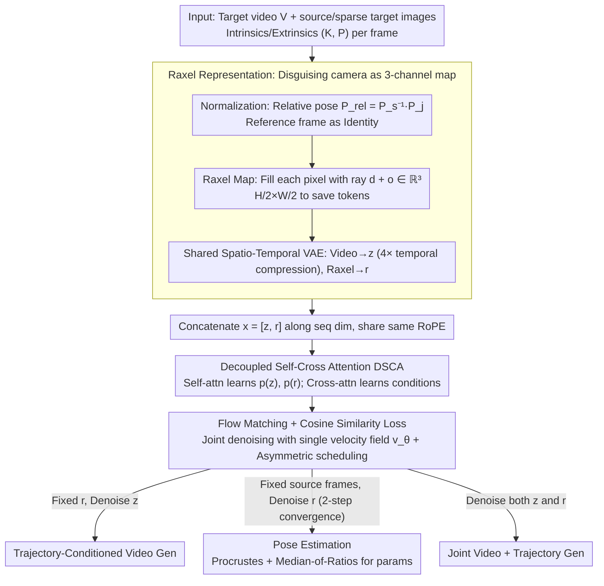

# Rays as Pixels: Learning A Joint Distribution of Videos and Camera Trajectories

**Conference**: ICML 2026  
**arXiv**: [2604.09429](https://arxiv.org/abs/2604.09429)  
**Code**: https://wbjang.github.io/raysaspixels/ (Project Page)  
**Area**: Video Generation  
**Keywords**: Video Diffusion, Camera Pose, Joint Distribution, raxel, Decoupled Self-Cross Attention

## TL;DR
Ours packs per-pixel camera rays ("origin + direction") into a 3-channel "raxel" map with the same shape as RGB, allowing a pre-trained video VAE to function directly as a camera encoder. By using Decoupled Self-Cross Attention to jointly denoise raxel and video frames within a single Flow Matching DiT, this work for the first time supports pose estimation, camera-controllable video generation, and joint "video + trajectory" generation using a single set of weights.

## Background & Motivation
**Background**: In 3D vision, "recovering camera parameters from images" (SfM/COLMAP, DUSt3R, VGGT) and "rendering new views based on camera parameters" (NeRF, 3DGS, camera-controllable video diffusion like MotionCtrl/VD3D/Wonderland) have long been two independent pipelines. The former is an inverse problem, while the latter is a forward problem; they are duals but are trained and evaluated separately.

**Limitations of Prior Work**: Camera-controllable video diffusion models treat poses as "known inputs," relying on external estimators (COLMAP, DUSt3R). However, these upstream estimators are prone to failure in scenarios with sparse inputs or ambiguous viewpoints, causing downstream generation models to inherit this fragility. Conversely, pure estimators (VGGT) only output geometry and cannot "imagine" plausible pixels in occluded areas. The few existing joint works (e.g., Matrix3D) require 3DGS post-processing, meaning rendering is not end-to-end from a diffusion model.

**Key Challenge**: Pre-trained video diffusion models operate on dense spatial tensors (H×W×3 RGB latents), while camera parameters are low-dimensional global matrices ($K, R, T$ totaling about a dozen numbers). Due to this structural mismatch, existing works either use adapters to project matrices into tokens (structurally limited) or use Plücker embeddings (6 channels, which cannot be encoded by VAEs, requiring MLP + concatenation and bypassing pre-trained priors). In other words, the camera remains an "external condition" and never truly enters the generation loop of the video model.

**Goal**: To enable a single pre-trained video DiT to learn the **joint distribution** $p(z, r)$ of video frames $z$ and camera trajectories $r$. This allows a single set of weights to sample $p(r|z)$ (pose estimation), $p(z|r)$ (trajectory-conditioned generation), and $p(z, r)$ (joint generation), while maintaining cycle self-consistency.

**Key Insight**: Since video VAEs already compress "3-channel dense maps" effectively, the camera can be "disguised" as a 3-channel dense map. Each pixel is filled not with RGB, but with the vector sum $\mathbf{d} + \mathbf{o}$ of the ray origin and direction in a canonical coordinate system. Thus, the same VAE, DiT, and RoPE can encode the camera with zero structural modifications.

**Core Idea**: Use "rays as pixels" (raxel) to represent the camera as a 3-channel latent isomorphic to video frames, and then use decoupled self-cross attention to jointly denoise video and ray latents, treating the camera as "another modality" dual to video rather than an external condition.

## Method

### Overall Architecture
During training, three types of frames are input: a target video $V$ of length $N$, $N_s$ source images (clean, used as conditions), and $N_t$ sparse target images (noisy, supervised), with the total sum fixed. Each frame $I_j$ is paired with intrinsic and extrinsic parameters $(K_j, P_j)$.

1.  **Normalization**: A source frame $s$ is randomly selected as the origin. All extrinsic parameters are converted into relative poses $P_{\text{rel}}^{(j)} = P_s^{-1} P_j$, setting $s$ to the identity matrix. This ensures the model learns relative geometry rather than absolute world coordinates.
2.  **Raxel Map Construction**: For each pixel $\mathbf{u}$, it is back-projected using $K_j^{-1}$ into a unit direction in the camera system, then transformed by $R_{\text{rel}}^{(j)}$ into the canonical world system to obtain $\mathbf{d}$; the origin is $\mathbf{o} = T_{\text{rel}}^{(j)}$. Each raxel pixel is filled with $\mathbf{d} + \mathbf{o} \in \mathbb{R}^3$, and the full map is denoted as $R_j \in \mathbb{R}^{H_r \times W_r \times 3}$ (using $H/2 \times W/2$ to save tokens).
3.  **Shared VAE Encoding**: Video frames use the same spatio-temporal VAE $\mathcal{E}$ for 4× temporal compression to obtain $z_v$. Raxel maps are not temporally compressed to obtain $r_v, r_s, r_t$, aligning them with the video latent space.
4.  **Joint Denoising**: $x = [z, r]$ is concatenated along the sequence dimension. Flow Matching with linear interpolation $x_t = (1-t)x_0 + t x_1$ is used to train a single velocity field $v_\theta$. In each DiT layer, Decoupled Self-Cross Attention (DSCA) replaces the original self-attention.
5.  **Three Inference Modes** (asymmetric schedule): Fix $z = z_s$ and denoise $r$ → Pose estimation; fix $r$ as clean and denoise $z$ → Trajectory-conditioned generation; denoise both → Joint generation.

The backbone is Wan 2.1 14B T2V, with an additional ray branch (independent LN, FFN, linear, 6B parameters), totaling 20B parameters, all fine-tuned.

### Key Designs

**1. Raxel Representation: Disguising the camera as a 3-channel image**

Pre-trained video VAEs are adept at compressing "3-channel dense maps," but camera parameters are low-dimensional global matrices ($K, R, T$), creating a structural mismatch. Existing works either use adapters to project matrices into tokens or use 6-channel Plücker embeddings (which VAEs cannot encode, necessitating MLP concatenation and bypassing pre-trained priors). Raxel solves this by formatting the camera as a 3-channel map of the same shape as video frames: each pixel contains the sum of the ray direction and origin $\mathbf{d} + \mathbf{o}$, where $\mathbf{d} = R_{\text{rel}} K^{-1}\tilde{\mathbf{u}} / \|K^{-1}\tilde{\mathbf{u}}\|_2$ is the unit ray direction in the world system and $\mathbf{o} = T_{\text{rel}}$ is the camera origin. Compared to Plücker (6 channels), raymap (6 channels), or pointmap (requires depth), raxel is the only solution that simultaneously satisfies "spatial alignment + 3-channel compatibility with pre-trained VAEs + no requirement for depth." Thus, the same VAE, DiT, and RoPE can encode the camera without structural changes. For pose recovery, Orthogonal Procrustes fits $SE(3)$ between the decoded $\hat{R}_k$ and reference $\hat{R}_s$; focal length is robustly estimated using Median-of-Ratios $\hat{f}_x = \text{median}(u \cdot \hat{z} / \hat{x})$. Ablations show its significance: replacing raxel with Plücker embeddings caused FID to jump from 7.33 to 21.97 and FVD from 68 to 333.

**2. Decoupled Self-Cross Attention (DSCA): Mapping probability decomposition to attention structure**

If video latent $z$ and ray latent $r$ undergo a single global self-attention on a concatenated sequence, the model tends to fit them independently with shallow cross-modal coupling. DSCA splits the attention in each DiT block into two steps: first, $z$ and $r$ each undergo self-attention to maintain temporal smoothness in video and geometric coherence in trajectories; then, symmetric cross-attention is applied ($z \leftarrow r$ and $r \leftarrow z$). Since $z$ and $r$ are spatially aligned, the query/key of cross-attn use RoPE, forcing visual tokens to attend to raxel tokens at corresponding positions. This design mirrors the probabilistic decomposition $\log p(z, r) = \log p(r) + \log p(z|r) \equiv \log p(z) + \log p(r|z)$—self-attn learns the marginals, while cross-attn learns the conditionals. This reduced cycle consistency FID from 8.69 to 7.33 and $R_{\text{err}}$ from 0.048 to 0.020.

**3. Flow Matching + Cosine Similarity Loss + Asymmetric Scheduling**

Ray latents are smooth, low-frequency, and low-rank, while video latents are high-frequency and information-dense. When sharing a velocity field $v_\theta(x_t, t)$, pure MSE loss tend to be dominated by the magnitude of the video pixels, drowning out the directional drift of rays. Therefore, a directional cosine penalty $\mathcal{L}(\theta) = \mathbb{E}[\|v_\theta - u_t\|^2 + \lambda (1 - v_\theta^\top u_t / (\|v_\theta\|\|u_t\|))]$ ($\lambda = 0.5$) is added to specifically target directional errors. Without it, $R_{\text{err}}$ increases from 0.020 to 0.058, and $T_{\text{err}}$ quintuples to 0.094. Since $z$ and $r$ occupy different token positions, they can be scheduled asynchronously: in camera-controllable generation, $r$ is fixed at $t=1$ while only $z$ is denoised; in pose estimation, only $r$ is denoised. The low-frequency structure of ray latents allows them to converge extremely fast, achieving optimal rotation accuracy in just **2 steps**.

### Loss & Training
- Flow Matching MSE + Cosine Directional term, $\lambda = 0.5$.
- Training sets: Re10K + DL3DV, using poses from ORB-SLAM and COLMAP, aligned to a unified metric scale.
- 480×832 resolution with center cropping to maintain original aspect ratios.
- Time-reversal augmentation: Trajectories and their reversals are used as training samples to encourage scene-trajectory decoupling.
- Fixed ratio of source/target frames to allow the model to learn source frame positions at any timestamp.

## Key Experimental Results

### Main Results: Camera-Controllable Video Generation (Table 4)

| Dataset | Method | FID ↓ | FVD ↓ | $R_{\text{err}}$ ↓ | $T_{\text{err}}$ ↓ |
| :--- | :--- | :--- | :--- | :--- | :--- |
| Re10K | MotionCtrl | 22.58 | 229.34 | 0.231 | 0.794 |
| Re10K | Wonderland | 16.16 | 153.48 | 0.046 | 0.093 |
| Re10K | Kaleido | 18.04 | 103.03 | 0.049 | 0.181 |
| Re10K | **Ours** | **15.76** | **98.72** | 0.056 | 0.115 |
| DL3DV-140 | Wonderland | 17.74 | 169.34 | 0.061 | 0.130 |
| DL3DV-140 | Kaleido | 41.18 | 458.60 | 0.011 | 0.026 |
| DL3DV-140 | **Ours** | **9.73** | **102.52** | 0.098 | 0.192 |
| T&T | Wonderland | 19.46 | 189.32 | 0.094 | 0.172 |
| T&T | Kaleido | 14.84 | 245.09 | 0.016 | 0.086 |
| T&T | **Ours** | **13.02** | **187.03** | 0.105 | 0.192 |

Ours achieves state-of-the-art visual quality (FID/FVD) across three benchmarks without using any explicit 3D representation or specialized camera embedding. While trajectory fidelity ($R_{\text{err}}$, $T_{\text{err}}$) is slightly lower than Kaleido, Kaleido’s FID on DL3DV-140 spikes to 41, indicating it overfits to pose supervision at the expense of visual quality.

### Ablation Study: cycle self-consistency on DL3DV-140 (Table 2)

| Configuration | FID ↓ | FVD ↓ | $R_{\text{err}}$ ↓ | $T_{\text{err}}$ ↓ |
| :--- | :--- | :--- | :--- | :--- |
| Ours (full) | 7.33 | 68.17 | 0.020 | 0.018 |
| w/o DSCA | 8.69 | 77.08 | 0.048 | 0.052 |
| w/o Cosine Sim. Loss | 9.48 | 97.84 | 0.058 | 0.094 |
| Plücker Embedding | 21.97 | 333.56 | 0.241 | 0.430 |

The cycle process involves sampling a trajectory $r' \sim p(r|z)$ from video, then re-generating video $z' \sim p(z|r', I_s)$ using $r'$. This requires $r' \approx r$ and $z' \approx z$—a test that models learning only conditional distributions physically cannot pass.

### Key Findings
- **Raxel is the primary factor**: Replacing it with Plücker embeddings caused all metrics to deteriorate significantly (FID ×3, $R_{\text{err}}$ ×12), proving that "sharing the VAE latent space" is far more important than "6-channel input-level embeddings."
- **Ray convergence is much faster than video**: Pose estimation mRRA@30 peaks in just 2 steps. The low-frequency structure of ray latents allows Flow Matching to reach the target almost immediately.
- **Comparison vs. VGGT**: The pure estimator VGGT achieves 2-5 points higher rotation accuracy. However, VGGT outputs 3D pointmaps with explicit geometry; ours focuses on video generation, where camera accuracy is a secondary product that is already sufficient.
- **DSCA and Cosine Loss are useful refinements**: When training data is clean, the improvement from DSCA is moderate (FID 8.69→7.33), but removing the cosine loss nearly triples rotation error.

## Highlights & Insights
- **"Disguising non-visual modalities as images" is a generalizable template**: The authors suggest this as a general pattern—re-encoding modalities like camera/segmentation/depth into tensors compatible with pre-trained visual backbone latent spaces.
- **Probability decomposition maps to attention structure**: The formula $\log p(z, r) = \log p(r) + \log p(z|r)$ corresponds directly to "self-attn for marginals + cross-attn for conditionals," effectively migrating probabilistic graphical model intuitions to DiT operators.
- **Cycle self-consistency as a new benchmark**: Only models that have learned an approximate joint distribution can return to their starting point in a loop.
- **Asymmetric inference scheduling**: Using different step counts for different modalities within the same denoiser is a valuable idea for accelerating multi-modal diffusion inference.

## Limitations & Future Work
- Training data is limited to static scenes and smooth camera trajectories; generalization to fast-moving shots or dynamic objects remains unknown.
- The 4× temporal compression causes adjacent frames to map to shared latent positions, potentially limiting quality for high-frame-rate or fast-motion content.
- Pose accuracy still lags behind VGGT by 2-5 points, as video latents do not explicitly encode depth.
- With 20B parameters and training on Wan 2.1 14B, the resource requirement is high.

## Related Work & Insights
- **vs. Matrix3D**: Matrix3D uses a multi-modal DiT for RGB+pose+depth but relies on 3DGS for rendering. Ours starts from a pre-trained video DiT, uses raxel to manage the camera branch, and outputs video directly, inheriting temporal priors from large-scale video data.
- **vs. VD3D / MotionCtrl / Wonderland**: These treat camera as an "external condition" via adapters. Ours makes the camera a "generatable modality," enabling the inverse $p(r|z)$.
- **vs. Kaleido**: Kaleido adds camera info as positional embeddings to image diffusion. It achieves high pose accuracy on DL3DV-140 but suffers from poor FID/FVD, suggesting that forcing cameras into image-only backbones sacrifices temporal consistency.

## Rating
- Novelty: ⭐⭐⭐⭐⭐ First unified framework treating camera parameters as generatable modalities dual to video frames using the same VAE and DiT.
- Experimental Thoroughness: ⭐⭐⭐⭐ Coverage of benchmarks, three types of ablations, and cycle self-consistency tests.
- Writing Quality: ⭐⭐⭐⭐⭐ The comparison of camera representations is clear, and the use of probabilistic decomposition to justify DSCA is technically sound.
- Value: ⭐⭐⭐⭐⭐ Establishes a new paradigm for 3D-aware video diffusion.

<!-- RELATED:START -->

## Related Papers

- [\[ICML 2026\] EPiC: Efficient Video Camera Control Learning with Precise Anchor-Video Guidance](epic_efficient_video_camera_control_learning_with_precise_anchor-video_guidance.md)
- [\[CVPR 2026\] SymphoMotion: Joint Control of Camera Motion and Object Dynamics for Coherent Video Generation](../../CVPR2026/video_generation/symphomotion_joint_control_of_camera_motion_and_object_dynamics_for_coherent_vid.md)
- [\[ICCV 2025\] Disentangled World Models: Learning to Transfer Semantic Knowledge from Distracting Videos for Reinforcement Learning](../../ICCV2025/video_generation/disentangled_world_models_learning_to_transfer_semantic_knowledge_from_distracti.md)
- [\[ICLR 2026\] Beyond Skeletons: Learning Animation Directly from Driving Videos with Same2X Training Strategy](../../ICLR2026/video_generation/beyond_skeletons_learning_animation_directly_from_driving_videos_with_same2x_tra.md)
- [\[ICML 2026\] Explainable Forensics of Manipulated Segments in Untrimmed Long Videos](explainable_forensics_of_manipulated_segments_in_untrimmed_long_videos.md)

<!-- RELATED:END -->
## Related Papers

- [\[ICML 2026\] EPiC: Efficient Video Camera Control Learning with Precise Anchor-Video Guidance](epic_efficient_video_camera_control_learning_with_precise_anchor-video_guidance.md)
- [\[CVPR 2026\] SymphoMotion: Joint Control of Camera Motion and Object Dynamics for Coherent Video Generation](../../CVPR2026/video_generation/symphomotion_joint_control_of_camera_motion_and_object_dynamics_for_coherent_vid.md)
- [\[ICCV 2025\] Disentangled World Models: Learning to Transfer Semantic Knowledge from Distracting Videos for Reinforcement Learning](../../ICCV2025/video_generation/disentangled_world_models_learning_to_transfer_semantic_knowledge_from_distracti.md)
- [\[ICML 2026\] Explainable Forensics of Manipulated Segments in Untrimmed Long Videos](explainable_forensics_of_manipulated_segments_in_untrimmed_long_videos.md)
- [\[ICML 2026\] Enhancing Train-Free Infinite-Frame Generation for Consistent Long Videos](enhancing_train-free_infinite-frame_generation_for_consistent_long_videos.md)

<!-- RELATED:END -->
