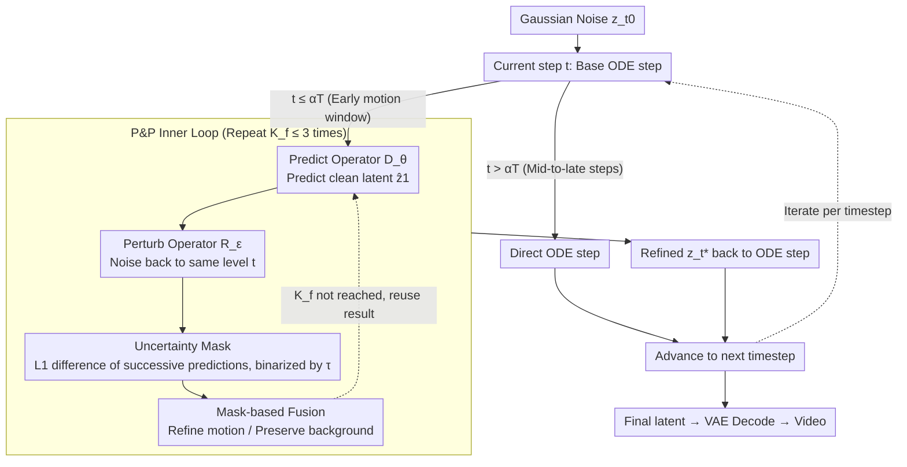

# Self-Refining Video Sampling

**Conference**: ICML 2026  
**arXiv**: [2601.18577](https://arxiv.org/abs/2601.18577)  
**Code**: https://agwmon.github.io/self-refine-video/ (Project Page)  
**Area**: Video Generation / Diffusion Models / Inference-time Sampling  
**Keywords**: Video Diffusion, Flow Matching, Self-Refining Sampling, Denoising Autoencoder, Physical Consistency

## TL;DR
The pretrained flow matching video generator is reinterpreted as a "denoising autoencoder." During inference, a Predict-and-Perturb inner loop iteratively corrects latent deviations within the same noise level. An uncertainty mask derived from model self-consistency is applied to refine only dynamic regions. This approach significantly enhances motion coherence and physical plausibility without any external verifier or additional training, achieving a human preference rate exceeding 70%.

## Background & Motivation

**Background**: Modern video generators, such as Wan2.1/2.2 and Cosmos-Predict, are predominantly based on flow matching. They use a learned vector field to push Gaussian noise toward the data distribution along an ODE in the VAE latent space. While considered early "world models," physical dynamics (multiobject interaction, complex human motion, rigid body free fall) remain a recognized weakness.

**Limitations of Prior Work**: Two mainstream paths for improving physical realism are computationally heavy. 1) **External verifier + rejection sampling** (e.g., Cosmos-Reason1, Bansal et al.): Generating multiple candidates and selecting the highest-scoring one suffers from low acceptance rates and expensive computation, and verifiers are often domain-specific with limited temporal-physical assessment capabilities. 2) **Additional training / post-training** (e.g., WISA, VideoJAM, CGI synthetic data fine-tuning): These require high-quality physical labels, incur massive training costs, and struggle to capture fine-grained motion via reward models.

**Key Challenge**: Large-scale trained video generators already encode priors of "realistic motion + structure" in their weights. However, standard ODE solvers follow a one-way trajectory—once coarse motion is determined in the early steps, no mechanism exists to revisit and correct it. While LLMs can critique-and-revise their output tokens, video generators lack such explicit feedback signals, especially for high-dimensional, temporally coupled latents.

**Goal**: To identify an inference-time self-refinement mechanism that is (i) training-free, (ii) independent of external models, (iii) computationally controlled, and (iv) plug-and-play with existing ODE solvers.

**Key Insight**: The authors observe that the flow matching objective can be rewritten as $\mathcal{L}_{\text{FM}}(\theta)=\mathbb{E}\bigl[\tfrac{1}{(1-t)^2}\lVert\hat z_1^\theta-z_1\rVert_2^2\bigr]$, where $\hat z_1^\theta = z_t+(1-t)u_\theta(z_t,t)$ is the model's prediction of the clean sample. This is a weighted version of the **generalized denoising autoencoder** (generalized DAE, Bengio 2013) objective. Consequently, a flow matching model is essentially a time-conditioned DAE across all noise levels, implicitly capable of "repeated corrupt-and-reconstruct to converge to the data manifold."

**Core Idea**: Reinterpreting the flow matching generator as a DAE, a pseudo-Gibbs inner loop is initiated at each sampling timestep $t$: predict the clean endpoint $\hat z_1$ (**Predict**), then perturb it back to the same noise level (**Perturb**). This is repeated 2–3 times before taking a standard ODE step—this is the **Predict-and-Perturb (P&P)** mechanism. An uncertainty mask based on self-consistency is overlaid to refine only motion regions, preventing oversaturation caused by CFG accumulation in static areas.

## Method

### Overall Architecture
The input remains Gaussian noise $z_{t_0}\sim\mathcal{N}(0,\mathbf{I})$, which follows an ODE along discretized timesteps $t_0<\cdots<t_T=1$. In the early "motion-determining window" ($t\le\alpha T$, where $\alpha\approx 0.2$), a base ODE step is performed to obtain $z_{t_{i+1}}^{(0)}$. A P&P inner loop is then executed for $K_f\le 3$ iterations. In each iteration, the "refined ODE result" and an "uncertainty mask" are computed simultaneously. The mask is used to fuse the refined result with the previous iteration's result at each spatial-temporal position, serving as the input for the next timestep. Later timesteps bypass refinement and use the base ODE. Total inference time increases by only $\sim 1.5\times$ without additional training or external models.

### Key Designs

**1. Reinterpreting Flow Matching as DAE: Legalizing "Iterative Correction"**

Standard ODE solvers follow a one-way trajectory; once early steps lock in coarse motion, there is no chance for review. This work reformulates the flow matching objective $\mathcal{L}_{\text{FM}}(\theta)=\mathbb{E}\bigl[\tfrac{1}{(1-t)^2}\lVert\hat z_1^\theta-z_1\rVert_2^2\bigr]$, asserting that $\hat z_1^\theta = z_t+(1-t)u_\theta(z_t,t)$ is the prediction of the clean sample. This perspective shift treats the pretrained model at any fixed $t$ as a legitimate DAE. The sampling process is split into two operators: the Predict operator $D_\theta(z_t,t):=z_t+(1-t)u_\theta(z_t,t)$ maps $z_t$ to a clean prediction, and the Perturb operator $R_\epsilon(z,t):=tz+(1-t)\epsilon$ adds noise back to level $t$. This justifies iterative refinement without retraining.

**2. Predict-and-Perturb (P&P) Inner Loop: Pulling States Toward High-Density Regions**

Since each $t$ acts as a DAE, pseudo-Gibbs sampling is performed. An iteration is defined as $z_t^{(k+1)}=\operatorname{P\&P}_{\epsilon_k}(z_t^{(k)},t):=R_{\epsilon_k}(D_\theta(z_t^{(k)},t),t)$. Starting from $z_t^{(0)}=z_t$, the Predict→Perturb cycle uses new Gaussian noise for local resampling, pulling the state toward the physical and temporal manifold. The refined $z_t^*:=z_t^{(K_f)}$ replaces the original $z_t$ in the ODE solver $z_{t_{i+1}}=z_t^*+\Delta t\cdot u_\theta(z_t^*,t)$. P&P is triggered only for $t<0.2$ ($K_f \le 3$), allowing local exploration without the cumulative errors of cross-level jumps like Restart.

**3. Uncertainty-aware Selective Refinement: Modifying Motion, Preserving Background**

Without constraints, large $K_f$ values can lead to CFG accumulation on static backgrounds, causing oversaturation artifacts (e.g., color shifts, exaggerated reflections). Motion regions do not suffer this because their predictions change across iterations. The method uses the $L_1$ difference between successive P&P predictions as a "self-consistency" signal: $\mathbf{U}(z_{t}^{(k-1)},z_{t}^{(k)}):=\tfrac{1}{C}\lVert D_\theta(z_{t}^{(k-1)},t)-D_\theta(z_{t}^{(k)},t)\rVert_1$, binarized with threshold $\tau=0.25$ into mask $M_{t_i}^{(k)}$. Fusion uses $z_{t_{i+1}}^{(k)}\leftarrow M_{t_i}^{(k)}\odot z_{t_{i+1}}^{(k)}+(1-M_{t_i}^{(k)})\odot z_{t_{i+1}}^{(k-1)}$. This "free" signal perfectly isolates moving objects (e.g., hands, limbs) from static backgrounds.

### Loss & Training
The method is **completely training-free**, using pretrained weights from Wan2.1 / Wan2.2 / Cosmos-Predict-2.5 with no gradient updates. It introduces three tunable hyperparameters: P&P iterations $K_f$ (default 2–3), uncertainty threshold $\tau$ (default 0.25), and P&P window $\alpha$ (default first ~20%). All operations are performed in the latent space.

## Key Experimental Results

### Main Results

Dynamic-bench (Wan2.2-A14B T2V, 120 challenging prompts, VBench + 20-person human evaluation):

| Method | Human Motion (%) | Human Text (%) | VBench Motion ↑ | VBench Const. ↑ | NFE | Time |
| :--- | :--- | :--- | :--- | :--- | :--- | :--- |
| Wan2.2 T2V (Default UniPC) | 73.57 | 57.64 | 98.01 | 90.68 | 40 | 1.0× |
| + NFE×2 | 74.05 | 57.55 | 98.03 | 90.66 | 80 | 2.0× |
| + CFG-Zero | 81.53 | 65.71 | 98.27 | 91.16 | 40 | 1.0× |
| + FlowMo (training-free) | 70.57 | 61.71 | 97.68 | 90.95 | 40* | 3.9× |
| + **Ours** | — | — | **98.41** | **91.33** | 60 | **1.5×** |

PAI-Bench Robotics I2V (Gemini 3 Flash for grasp evaluation, Qwen2.5-VL-72B for Robot-QA):

| Model + Method | Grasp ↑ | Robot-QA ↑ | Quality ↑ | NFE | Time |
| :--- | :--- | :--- | :--- | :--- | :--- |
| Cosmos-Predict-2.5 | 79.2 | 71.7 | 75.1 | 35 | 1.0× |
| + Verifier best-of-4 | 84.4 | 72.3 | 75.3 | 140 | 4.0× |
| + **Ours** | **89.6** | **76.3** | 75.1 | 57 | 1.6× |
| Wan2.2-I2V-A14B | 77.3 | 77.4 | 75.3 | 40 | 1.0× |
| + Verifier best-of-4 | 80.5 | 78.1 | 75.3 | 144 | 4.0× |
| + **Ours** | **85.7** | **80.3** | **75.5** | 60 | 1.5× |

Physical Alignment: On PhyWorldBench, the PC score improved from 29.3 to **40.0** (+10.7). In VideoPhy2, **84%** of users preferred this method over the default sampler. Spatial consistency (SSIM 0.401→**0.485**, PSNR 14.96→**17.21 dB**).

### Ablation Study

| Configuration | Key Findings | Description |
| :--- | :--- | :--- |
| Full (P&P + Mask) | Best motion/consistency | Complete method |
| P&P, $K_f=5$, no mask | Oversaturation, color shift | CFG accumulation in static areas |
| P&P, $K_f=2{-}3$, no mask | Improved motion, background loss | Acceptable with limited iterations |
| $t<0.2$ vs. All steps | Early trigger is sufficient | Higher $t$ shows marginal gain |
| $\tau$ 0.15 / 0.25 / 0.40 | 0.25 is optimal | Balance between background stability and motion refinement |

## Key Findings
- **Early steps are decisive**: Restricting P&P to the first 20% of steps yields almost all benefits, confirming that motion/physical structures are locked in early.
- **Uncertainty mask prevents oversaturation**: P&P alone can introduce artifacts. The mask ensures stability by preventing CFG accumulation in the background, which is crucial for superior results.
- **Videos are more robust than images**: A single P&P step causes semantic jumps in images but only moderate structural changes in videos due to cross-frame consistency actings as a "local search" constraint.
- **Mode-seeking translates to temporal consistency**: While P&P is mode-seeking and reduces image diversity, in videos it reduces jitter and flickering because inconsistent temporal states occupy low-density regions.
- **Scope of Reasoning**: Significant gains in graph traversal (0.1→0.8); however, maze solving shows zero improvement, suggesting P&P fixes "motion/temporal" errors rather than discrete logical knowledge.

## Highlights & Insights
- **Theoretical Insight**: Reinterpreting flow matching as a DAE justifies the iterative refinement process without distribution collapse.
- **Engineering Insight**: The mask calculation uses zero extra NFEs by binding it to existing Predict calls and reusing previous $z_{t_{i+1}}$ values.
- **Methodological Insight**: Using prediction variance as a proxy for uncertainty without external heads or ensembles.
- **Transferable Trick**: Adding 2–3 P&P loops in the first 20% of steps is a highly cost-effective "free" performance boost for any flow matching model.

## Limitations & Future Work
- **Lower bound of model priors**: P&P cannot create knowledge the base model lacks (e.g., maze solving); it only "excavates" existing high-density patterns.
- **Image mode-seeking**: Large $K_f$ lead to diversity collapse in images; the method relies on cross-frame consistency specific to video.
- **Hyperparameter calibration**: Thresholds like $\tau$ may require adjustment for different VAE channel counts or latent scales.
- **Integration**: Future work could combine P&P with reward-guided fine-tuning or adaptive $K_f$ logic based on mask energy.

## Related Work & Insights
- **vs. Restart Sampling**: Restart uses macro cross-level cycles for late-stage errors; this work uses micro intra-level cycles for early-stage motion errors.
- **vs. FreeInit**: FreeInit refines initial noise with high cost; this method refines intermediate latents efficiently.
- **vs. Verifier-based Sampling**: Ours is more cost-effective (1.6× time for higher gains vs. 4.0× time for verifiers).
- **vs. Annealed Langevin Dynamics**: ALD matches distributions; P&P is mode-seeking, which is desirable for de-flickering but a limitation for strict distribution matching.

## Rating
- Novelty: ⭐⭐⭐⭐ Reinterpreting flow matching as a DAE provides a strong theoretical basis; prediction-based uncertainty masks are a clever engineering innovation.
- Experimental Thoroughness: ⭐⭐⭐⭐⭐ Comprehensive evaluation across 3 models and 5+ benchmarks, including 2D toy experiments and image/video comparisons.
- Writing Quality: ⭐⭐⭐⭐⭐ Rigorous derivations, clear pseudo-code, and honest discussion of shortcomings like mode-seeking.
- Value: ⭐⭐⭐⭐⭐ Training-free, plug-and-play, and efficient. It offers significant improvements for current flow matching video generators.

<!-- RELATED:START -->

## Related Papers

- [\[CVPR 2025\] Spatiotemporal Skip Guidance for Enhanced Video Diffusion Sampling](../../CVPR2025/video_generation/spatiotemporal_skip_guidance_for_enhanced_video_diffusion_sampling.md)
- [\[CVPR 2026\] VISTA: A Test-Time Self-Improving Video Generation Agent](../../CVPR2026/video_generation/vista_a_test-time_self-improving_video_generation_agent.md)
- [\[ACL 2026\] Self-Correcting Text-to-Video Generation with Misalignment Detection and Localized Refinement](../../ACL2026/video_generation/self-correcting_text-to-video_generation_with_misalignment_detection_and_localiz.md)
- [\[CVPR 2026\] From Static to Dynamic: Exploring Self-supervised Image-to-Video Representation Transfer Learning](../../CVPR2026/video_generation/from_static_to_dynamic_exploring_self-supervised_image-to-video_representation_t.md)
- [\[CVPR 2026\] Infinity-RoPE: Action-Controllable Infinite Video Generation Emerges From Autoregressive Self-Rollout](../../CVPR2026/video_generation/infinity-rope_action-controllable_infinite_video_generation_emerges_from_autoreg.md)

<!-- RELATED:END -->
