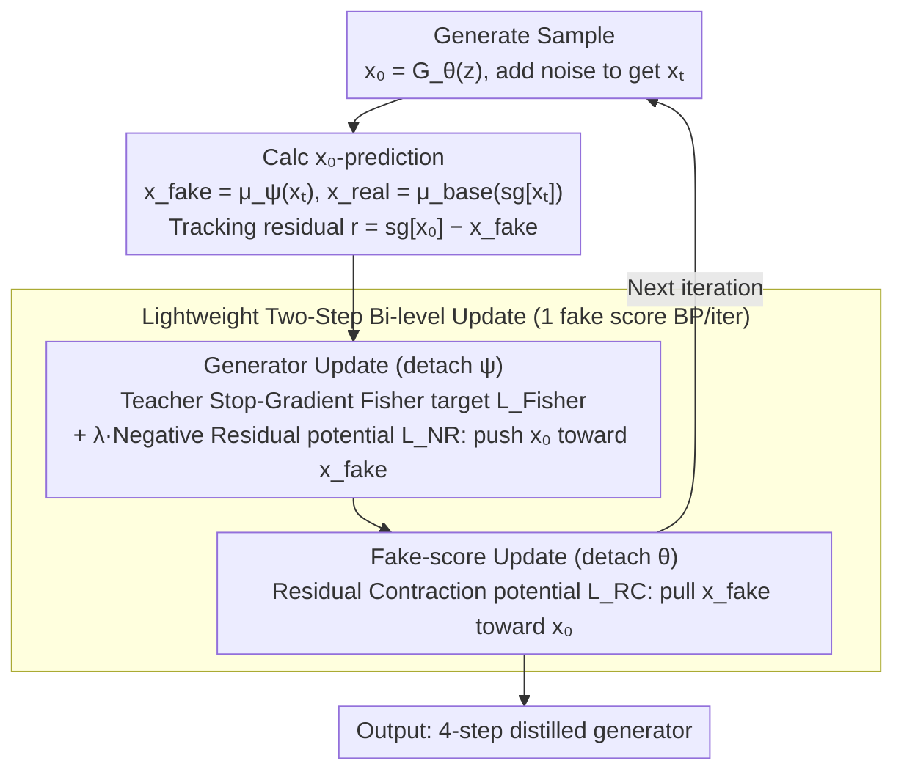

# SGMD: Score Gradient Matching Distillation for Few-Step Video Diffusion

**Conference**: ICML 2026  
**arXiv**: [2605.30116](https://arxiv.org/abs/2605.30116)  
**Code**: TBD  
**Area**: Video Generation / Diffusion Model Distillation  
**Keywords**: Diffusion model distillation, Score matching, Few-step generation, Motion preservation

## TL;DR
SGMD introduces a **stable teacher stop-gradient Fisher objective** and a **dual potential (NR/RC) mechanism** to address high tracking costs of fake scores (e.g., DMD2 requires 5 updates per iteration) and motion suppression in few-step video diffusion distillation. It achieves ~3× training acceleration while improving motion quality from 0.65 to 0.78 (VideoAlign) under 4-step distillation.

## Background & Motivation

**Background**: Diffusion models exhibit superior performance in video generation but suffer from high inference costs (large parameter counts, high latent dimensions, and multi-step sampling). The Distribution Matching Distillation (DMD) series represents the prevailing few-step acceleration scheme, compressing sampling steps by matching student and teacher distributions.

**Limitations of Prior Work**: DMD-style distillation faces two coupled challenges in aggressive few-step scenarios:
- **Tracking Cost**: The auxiliary score network (fake score) on the student side must track an evolving generator. Maintaining tracking consistency requires multiple fake score updates, with DMD2 requiring 5 updates per iteration.
- **Motion Suppression**: Reverse-KL style matching is **mode-seeking and conservative**, tending to avoid low-density regions in the target distribution. This lead to insufficient motion and loss of details in videos generated under few-step distillation.

**Key Challenge**: How to maintain distribution matching consistency while reducing fake score tracking overhead and preventing motion suppression? These two problems appear mutually restrictive.

**Goal**:
1. Identify a distribution matching objective that is consistent with DMD under ideal tracking conditions but more stable.
2. Design a lightweight tracking mechanism to reduce the number of fake score updates.
3. Simultaneously maintain motion intensity and visual quality in few-step video distillation.

**Key Insight**: Re-rethink distillation from the fake-score perspective. Instead of viewing the fake score as a tracking tool, it is treated as the primary optimization target that should move toward the teacher. Simultaneously, the generator acts as a tracker to maintain score consistency. This role reversal breaks the cyclic dependency.

**Core Idea**: Use teacher stop-gradient Fisher instead of reverse-KL as the distribution matching objective to obtain smoother gradient signals. Introduce a dual potential pair (NR/RC) to decouple tracking into outer correction and inner contraction, enabling a two-step bi-level optimization requiring only 1 fake score update.

## Method

### Overall Architecture
SGMD addresses two intertwined difficulties in DMD-style few-step video distillation: the high tracking cost of fake scores (DMD2 requires 5 updates to track the evolving generator) and the conservative nature of reverse-KL matching, which suppresses motion by avoiding low-density regions. The breakthrough lies in a role reversal: the fake score is treated as the primary optimization target moving toward the teacher, while the generator maintains score consistency as a tracker, breaking the cyclic dependency. Training alternates between: a generator update phase (detaching fake score) optimizing $\mathcal{L}_{\text{Fisher}}(\theta) + \lambda \mathcal{L}_{\text{NR}}(\theta)$, and a fake-score update phase (detaching generator) optimizing $\lambda \mathcal{L}_{\text{RC}}(\psi)$, requiring only 1 fake score backpropagation per iteration.

### Key Designs

**1. Teacher Stop-Gradient Fisher Objective: Replacing conservative reverse-KL with smoother matching gradients**

Standard score matching backpropagates teacher gradients through generated samples (often in OOD states), causing training instability. Conversely, reverse-KL is overly conservative, avoiding low-density regions and consequently suppressing motion details. SGMD freezes teacher input gradients (stop-gradient) and directs the fake score to track the teacher's score difference: $\mathcal{L}_{\text{Fisher}}(\theta, \psi) := \frac{1}{2} \|s_{\text{fake}}(x_t, t) - s_{\text{real}}(\text{sg}[x_t], t)\|^2 = \frac{1}{2} c(t) \|\Delta_t\|^2$, where $\Delta_t = \mu_\psi(x_t, t) - \mu_{\text{base}}(x_t, t)$ and $c(t) = \alpha_t^2 / \sigma_t^4$. Proposition 3.1 guarantees that under ideal tracking, this Fisher objective aligns with the distribution matching direction of reverse-KL, but its gradient signals are smoother and do not evade low-density regions, thus preserving motion details. The stop-gradient mechanism prevents invalid backpropagation of OOD gradients.

**2. Dual Potential (NR / RC) Mechanism: Decoupling the tracking problem via push-pull**

Tracking is computationally expensive because the generator and fake score are mutually dependent. SGMD defines the tracking residual $r(x_0, x_t) := \text{sg}[x_0] - x_{\text{fake}}$ to quantify the gap between generator output and fake score prediction, then constructs a pair of potentials with opposite signs: outer Negative Residual $\mathcal{L}_{\text{NR}}(\theta) := -\frac{1}{2} \|r\|^2$ and inner Residual Contraction $\mathcal{L}_{\text{RC}}(\psi) := +\frac{1}{2} \|r\|^2$. These induce opposite gradients in the $x_{\text{fake}}$ space: $\nabla_{x_{\text{fake}}} \mathcal{L}_{\text{NR}} = r$ and $\nabla_{x_{\text{fake}}} \mathcal{L}_{\text{RC}} = -r$. Along the dependency chain $x_0 \to x_t \to x_{\text{fake}}$, NR pushes the generator output toward the fake score prediction (maintaining score consistency), while RC pulls the fake score toward the generator output (reducing prediction error). Compared to SIM, which uses implicit gradients (complex and fixed intensity), this "push-pull" explicit potential decouples outer correction and inner contraction, making it geometrically intuitive and easy to implement.

**3. Lightweight Two-Step Bi-level Update: Reducing fake score updates from 5 to 1 per iteration**

To optimize across two time scales efficiently and stably, SGMD performs only two backpropagations per iteration: first updating the generator $\theta \leftarrow \theta - \eta_\theta \nabla_\theta(\mathcal{L}_{\text{Fisher}} + \lambda \mathcal{L}_{\text{NR}})$ (with $\psi$ detached), and then updating the fake score $\psi \leftarrow \psi - \eta_\psi \nabla_\psi(\lambda \mathcal{L}_{\text{RC}})$ (with $\theta$ detached). This constitutes an explicit single-step bi-level iteration, bypassing second-order implicit gradient calculations. By reducing fake score updates from 5 to 1 per iteration and saving approximately 80% of gradient computation per backpropagation, a ~3× training acceleration was measured on 32 H100 GPUs, with optimal performance at $\lambda = 0.1$.

### Loss & Training
Tracking weight $\lambda = 0.1$; AdamW optimizer ($\beta_1 = 0, \beta_2 = 0.999$), learning rate $1 \times 10^{-6}$; fixed 4-step distillation timesteps $\{1000, 960, 889, 727\}$, Euler solver.

> ⚠️ Refer to the original paper for detailed hyperparameter configurations.

## Key Experimental Results

### Main Results (4-step distillation on Wan2.1-T2V-14B teacher)

| Method | NFE | Fake-R | FVD ↓ | OptFlow ↑ | VBench-Quality ↑ | VBench-Semantic ↑ | DynDeg ↑ |
|--------|-----|--------|------|---------|-----------|-----------|---------|
| Base Model (50 steps) | 100 | — | 0.0 | 9.41 | 86.67 | 84.44 | 94.26 |
| DMD2 | 4 | 5 | 115.1 | 4.51 | 85.05 | 77.46 | 80.56 |
| TSG-Fisher | 4 | 5 | 126.7 | 8.18 | 82.98 | 71.50 | 94.25 |
| TSG-SIM | 4 | 1 | 193.0 | 3.27 | 82.68 | 73.21 | 59.72 |
| **SGMD** | **4** | **1** | **100.3** | **9.29** | **84.77** | **75.64** | **93.06** |

SGMD achieves motion intensity close to the base model (OptFlow 9.29 vs 9.41) with only 1 fake score update. Compared to DMD2, motion metrics are significantly improved (OptFlow +106%, DynDeg +15.5%), while VBench quality remains competitive.

### Ablation Study

| $\lambda$ | Total ↑ | Quality ↑ | Semantic ↑ | DynDeg ↑ |
|----------|---------|-------|-------|---------|
| 0.05 | 81.92 | 83.68 | 74.90 | 93.55 |
| **0.1** | **82.95** | **84.77** | **75.64** | **93.06** |
| 0.2 | 82.01 | 84.06 | 73.81 | 94.23 |
| 0.5 | 79.54 | 81.49 | 71.75 | 76.52 |

### Key Findings
- **Motion-Quality Trade-off**: Fisher tends to preserve motion details in low-density regions (smoother gradient signals), whereas reverse-KL (DMD2) conservatively concentrates on high-probability regions, leading to motion suppression. SGMD obtains strong motion via Fisher and recovers visual quality stably through NR/RC tracking.
- **Training Efficiency**: Fake score updates were reduced from 5 to 1 per iteration, reducing gradient computation by 80% per pass. Tested on 32 H100 GPUs, this yielded ~3× acceleration.
- **Human Evaluation Preferences** (Table 3): Overall preference for SGMD at 65% vs DMD2 at 13%; SGMD motion quality win rate at 71%; text alignment and visual quality were mostly evaluated as ties.
- **VideoAlign Evaluation** (Table 4): SGMD total score 19.36 > DMD2 18.86; motion quality 4.99 > 4.15 (+20%); visual quality 8.19 ≈ DMD2 8.47 (-2%).

## Highlights & Insights
- **Stable Distribution Matching Objective**: Teacher stop-gradient Fisher elegantly avoids OOD gradients while remaining equivalent to reverse-KL under ideal conditions (Proposition 3.1). Applicable to all diffusion distillation scenarios.
- **Reshaping the Fake-score Perspective**: Redefining the fake score as an "optimization target" and the generator as a "tracker" eliminates cyclic dependencies and is transferable to other two-timescale dual optimization problems.
- **Geometric Intuition of Dual Potentials**: NR and RC induce opposite gradients in the $x_{\text{fake}}$ space, forming a "push-pull" mechanism that is easier to implement and debug than SIM's implicit gradients.
- **Pathway to Efficient Distillation**: Achievement of 3× acceleration by reducing fake score updates (from 5 to 1) while maintaining or improving performance.

## Limitations & Future Work
- The tracking weight $\lambda$ is manually tuned; different teachers or distillation targets might require new searches. Adaptive $\lambda$ can be explored.
- Experiments only evaluated 4-step distillation; the effectiveness of SGMD in more aggressive 1-2 step scenarios needs further validation.
- Motion-Clarity Trade-off: While human evaluations suggest the trade-off is acceptable, clarity-sensitive applications (product videos, medical) may still require adjustments.
- Based solely on the single teacher Wan2.1-T2V-14B; adaptability to other video models (e.g., I2V-Turbo) needs verification.

## Related Work & Insights
- **vs DMD2**: Both use distribution matching, but DMD2 employs reverse-KL + frequent fake score updates; SGMD uses Fisher + dual potentials—avoiding the conservatism of reverse-KL and significantly reducing update frequency.
- **vs SIM**: Both focus on the implicit term of tracking lag, but SIM uses implicit gradients (complex), while SGMD uses explicit dual potentials (concise). SIM's relative intensity is fixed, whereas SGMD allows parameter tuning via $\lambda$.
- **vs Flash-DMD**: The latter focuses on timestep-aware training and RL, which are orthogonal optimization directions that can be combined with SGMD.
- **Inspiration**: The fake-score perspective and dual potential mechanism are transferable to image diffusion distillation and two-timescale optimization in other generative models.

## Rating
- Novelty: ⭐⭐⭐⭐⭐ Innovative fake-score perspective, elegant dual potential design, and deep theoretical analysis.
- Experimental Thoroughness: ⭐⭐⭐⭐⭐ Large-scale 14B model + multi-dimensional evaluation (VBench + FVD + OptFlow + Human + VideoAlign) + Ablation.
- Writing Quality: ⭐⭐⭐⭐ Clear logic, intuitive gradient analysis; length could be more compact.
- Value: ⭐⭐⭐⭐⭐ 3× training acceleration + significant motion improvement; directly reduces video distillation costs and points toward efficient large model distillation.

<!-- RELATED:START -->

## Related Papers

- [\[ICML 2026\] AAD-1: Asymmetric Adversarial Distillation for One-Step Autoregressive Video Generation](aad-1_asymmetric_adversarial_distillation_for_one-step_autoregressive_video_gene.md)
- [\[ICCV 2025\] DOLLAR: Few-Step Video Generation via Distillation and Latent Reward Optimization](../../ICCV2025/video_generation/dollar_fewstep_video_generation_via_distillation_and_latent.md)
- [\[ICCV 2025\] Adversarial Distribution Matching for Diffusion Distillation Towards Efficient Image and Video Synthesis](../../ICCV2025/video_generation/adversarial_distribution_matching_for_diffusion_distillation_towards_efficient_i.md)
- [\[CVPR 2026\] FlashMotion: Few-Step Controllable Video Generation with Trajectory Guidance](../../CVPR2026/video_generation/flashmotion_fewstep_controllable_video_generation.md)
- [\[CVPR 2026\] Reward Forcing: Efficient Streaming Video Generation with Rewarded Distribution Matching Distillation](../../CVPR2026/video_generation/reward_forcing_efficient_streaming_video_generation_with_rewarded_distribution_m.md)

<!-- RELATED:END -->
