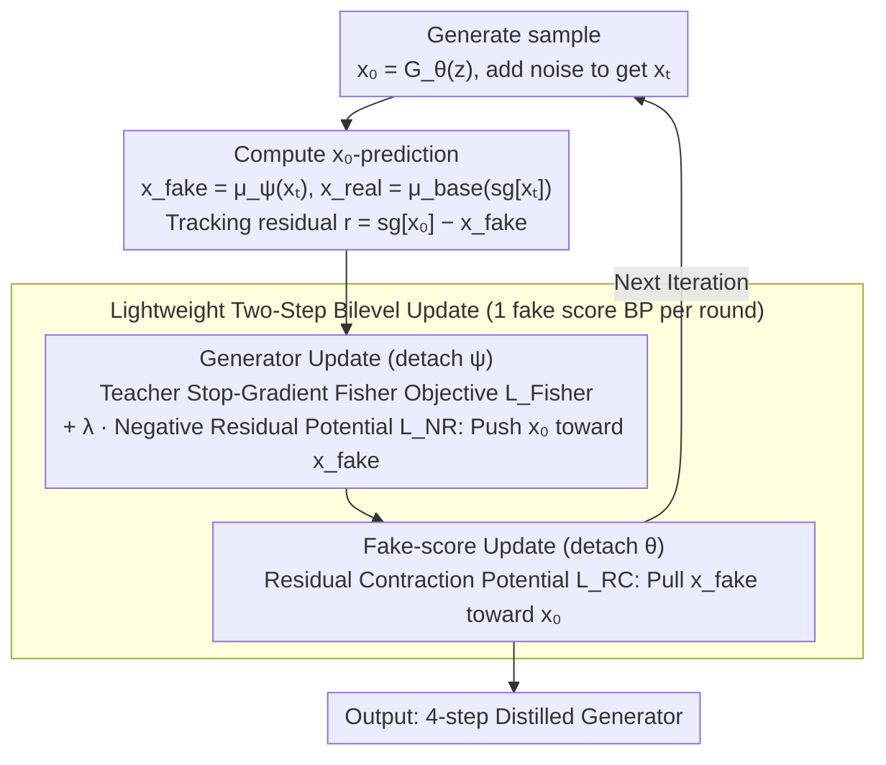

# SGMD: Score Gradient Matching Distillation for Few-Step Video Diffusion

**Conference**: ICML 2026  
**arXiv**: [2605.30116](https://arxiv.org/abs/2605.30116)  
**Code**: TBD  
**Area**: Video Generation / Diffusion Model Distillation  
**Keywords**: Diffusion Model Distillation, Score Matching, Few-step Generation, Motion Preservation

## TL;DR
SGMD introduces a **stable teacher stop-gradient Fisher objective** and a **dual potential (NR/RC) mechanism** to solve the high cost of fake score tracking (5 updates per round in DMD2) and motion suppression issues in few-step video diffusion distillation. It achieves ~3× training acceleration and improves motion quality from 0.65 to 0.78 (VideoAlign) under 4-step distillation.

## Background & Motivation

**Background**: Diffusion models excel in video generation but suffer from high inference costs due to large parameters, high latent space dimensions, and multi-step sampling. Distribution Matching Distillation (DMD) series represent the mainstream few-step acceleration solutions, compressing sampling steps by matching student and teacher generation distributions.

**Limitations of Prior Work**: DMD-style distillation faces two coupled challenges in aggressive few-step scenarios:
- **Tracking Cost**: The auxiliary score network (fake score) on the student side must track the evolving generator; maintaining tracking consistency requires multiple fake score updates (DMD2 requires 5 per iteration).
- **Motion Suppression**: Reverse-KL style matching is **mode-seeking and conservative**, tending to avoid low-density regions in the target distribution. This lead to insufficient motion and missing details in videos generated under few-step distillation.

**Key Challenge**: How to reduce fake score tracking overhead and prevent motion dynamic suppression while ensuring the consistency of distribution matching objectives? These two issues appear mutually restrictive.

**Goal**:
1. Identify a distribution matching objective that is consistent with DMD under ideal tracking conditions but more stable.
2. Design a lightweight tracking mechanism to reduce the number of fake score updates.
3. Simultaneously maintain motion intensity and visual quality in few-step video distillation.

**Key Insight**: Reconsider distillation from a fake-score perspective—rather than viewing the fake score purely as a tracking tool, treat it as the primary optimization target that should move towards the teacher; meanwhile, let the generator act as a tracker to maintain score consistency. This role reversal breaks the cyclic dependency.

**Core Idea**: Replace reverse-KL with teacher stop-gradient Fisher as the distribution matching objective to obtain smoother gradient signals. Introduce a dual potential pair (NR/RC) to decouple the tracking problem into an outer correction and an inner contraction, enabling two-step bilevel optimization with only 1 fake score update.

## Method

### Overall Architecture
SGMD addresses two mutually constraining challenges in DMD-style few-step video distillation: the need for the fake score to track the evolving generator (requiring 5 updates per round in DMD2) and the conservative nature of reverse-KL matching which suppresses motion. The breakthrough is a role reversal—the fake score is treated as the primary optimization target moving toward the teacher, while the generator maintains consistency. Training alternates between a generator update phase (detaching fake score) optimizing $\mathcal{L}_{\text{Fisher}}(\theta) + \lambda \mathcal{L}_{\text{NR}}(\theta)$, and a fake-score update phase (detaching generator) optimizing $\lambda \mathcal{L}_{\text{RC}}(\psi)$, requiring only 1 fake score backpropagation per round.

### Key Designs

**1. Teacher Stop-Gradient Fisher Objective: Replacing conservative reverse-KL for smoother matching gradients**

Standard score matching backpropagates teacher gradients through generated samples (often OOD), leading to unstable training. Reverse-KL is overly conservative, avoiding low-density regions and thus suppressing motion details. SGMD freezes teacher input gradients (stop-gradient), letting the fake score follow the teacher's score difference $\mathcal{L}_{\text{Fisher}}(\theta, \psi) := \frac{1}{2} \|s_{\text{fake}}(x_t, t) - s_{\text{real}}(\text{sg}[x_t], t)\|^2 = \frac{1}{2} c(t) \|\Delta_t\|^2$, where $\Delta_t = \mu_\psi(x_t, t) - \mu_{\text{base}}(x_t, t)$ and $c(t) = \alpha_t^2 / \sigma_t^4$. Proposition 3.1 guarantees that under ideal tracking, this Fisher objective aligns with the distribution matching direction of reverse-KL, but its gradient signals are smoother and do not avoid low-density regions, thus preserving motion details. Stop-gradient prevents invalid backpropagation of OOD gradients.

**2. Dual Potential (NR / RC) Mechanism: Decoupling tracking via push-pull**

Tracking is expensive because the generator and fake score are interdependently entangled. SGMD defines a tracking residual $r(x_0, x_t) := \text{sg}[x_0] - x_{\text{fake}}$ to quantify the gap between generator output and fake score prediction, then constructs a pair of potentials with opposite signs: outer negative residual $\mathcal{L}_{\text{NR}}(\theta) := -\frac{1}{2} \|r\|^2$ and inner residual contraction $\mathcal{L}_{\text{RC}}(\psi) := +\frac{1}{2} \|r\|^2$. These induce opposite gradients in $x_{\text{fake}}$ space: $\nabla_{x_{\text{fake}}} \mathcal{L}_{\text{NR}} = r$ and $\nabla_{x_{\text{fake}}} \mathcal{L}_{\text{RC}} = -r$. Along the dependency chain $x_0 \to x_t \to x_{\text{fake}}$, NR pushes the generator output toward the fake score prediction (maintaining consistency), while RC pulls the fake score toward the generator output (reducing prediction error). Compared to SIM, which uses implicit gradients (computationally complex and fixed intensity), this "push-pull" explicit potential decouples outer correction from inner contraction, offering better geometric intuition and ease of implementation.

**3. Lightweight Two-Step Bilevel Update: Reducing fake score updates from 5 to 1 per round**

To optimize across two time scales efficiently and stably, SGMD performs only two backpropagations per iteration: first updating the generator $\theta \leftarrow \theta - \eta_\theta \nabla_\theta(\mathcal{L}_{\text{Fisher}} + \lambda \mathcal{L}_{\text{NR}})$ (with $\psi$ detached), then updating the fake score $\psi \leftarrow \psi - \eta_\psi \nabla_\psi(\lambda \mathcal{L}_{\text{RC}})$ (with $\theta$ detached). This explicit single-step bilevel iteration bypasses second-order implicit gradient computation. Reducing fake score updates from 5 to 1 per round saves approximately 80% of gradient computation per iteration, resulting in a measured ~3× training acceleration on 32 H100 GPUs, with $\lambda = 0.1$ yielding optimal results.

### Loss & Training
Tracking weight $\lambda = 0.1$; Optimizer AdamW ($\beta_1 = 0, \beta_2 = 0.999$), learning rate $1 \times 10^{-6}$; 4-step distillation with fixed timesteps $\{1000, 960, 889, 727\}$, Euler solver.

> ⚠️ Refer to the original paper for specific hyperparameter details.

## Key Experimental Results

### Main Results (4-step distillation on Wan2.1-T2V-14B Teacher)

| Method | NFE | Fake-R | FVD ↓ | OptFlow ↑ | VBench-Qual ↑ | VBench-Sem ↑ | DynDeg ↑ |
|--------|-----|--------|------|---------|-----------|-----------|---------|
| Base Model (50 steps) | 100 | — | 0.0 | 9.41 | 86.67 | 84.44 | 94.26 |
| DMD2 | 4 | 5 | 115.1 | 4.51 | 85.05 | 77.46 | 80.56 |
| TSG-Fisher | 4 | 5 | 126.7 | 8.18 | 82.98 | 71.50 | 94.25 |
| TSG-SIM | 4 | 1 | 193.0 | 3.27 | 82.68 | 73.21 | 59.72 |
| **SGMD** | **4** | **1** | **100.3** | **9.29** | **84.77** | **75.64** | **93.06** |

SGMD achieves motion intensity close to the base model with only 1 fake score update (OptFlow 9.29 vs 9.41). Compared to DMD2, motion metrics are significantly improved (OptFlow +106%, DynDeg +15.5%), while VBench quality remains competitive.

### Ablation Study

| $\lambda$ | Total ↑ | Quality ↑ | Semantic ↑ | DynDeg ↑ |
|----------|---------|-------|-------|---------|
| 0.05 | 81.92 | 83.68 | 74.90 | 93.55 |
| **0.1** | **82.95** | **84.77** | **75.64** | **93.06** |
| 0.2 | 82.01 | 84.06 | 73.81 | 94.23 |
| 0.5 | 79.54 | 81.49 | 71.75 | 76.52 |

### Key Findings
- **Motion-Quality Trade-off**: Fisher tends to preserve motion details in low-density regions (smoother gradient signal), whereas reverse-KL (DMD2) conservatively concentrates on high-probability regions, leading to motion suppression. SGMD obtains strong motion via Fisher and restores visual quality through stable NR/RC tracking.
- **Training Efficiency**: Fake score updates are reduced from 5 to 1 per iteration, reducing gradient computation by 80% per pass; measured ~3× speedup on 32 H100 GPUs.
- **Human Evaluation Preferences** (Table 3): Overall preference SGMD 65% vs DMD2 13%; Motion quality SGMD 71% win rate; Text alignment / Visual quality mostly evaluated as ties.
- **VideoAlign Evaluation** (Table 4): Total score SGMD 19.36 > DMD2 18.86; Motion quality 4.99 > 4.15 (+20%); Visual quality 8.19 ≈ DMD2 8.47 (-2%).

## Highlights & Insights
- **Stable Distribution Matching Objective**: Teacher stop-gradient Fisher cleverly avoids OOD gradients while remaining equivalent to reverse-KL under ideal conditions (Proposition 3.1); applicable to all diffusion distillation scenarios.
- **Reshaping the Fake-score Perspective**: Redefining the fake score from a "tracker" to the "optimization target" and the generator as the "tracker"—this role reversal eliminates cyclic dependency and is transferable to other two-time-scale dual optimization problems.
- **Geometric Intuition of Dual Potentials**: NR and RC induce opposite gradients in $x_{\text{fake}}$ space to form a "push-pull" mechanism; simpler to implement and debug than SIM's implicit gradients.
- **Path to Efficient Distillation**: Achieves 3× acceleration by reducing fake score updates (from 5 to 1) while maintaining or improving performance.

## Limitations & Future Work
- The tracking weight $\lambda$ is manually tuned; different teachers or distillation goals might require new searches. Adaptive $\lambda$ could be researched.
- Experiments only evaluate 4-step distillation; whether SGMD remains effective in more aggressive 1-2 step scenarios requires further validation.
- Motion-Clarity Trade-off: Although human evaluation suggests the trade-off is acceptable, applications sensitive to clarity (product videos, medical) may still require adjustment.
- Evaluated only on the single teacher Wan2.1-T2V-14B; adaptation to other video models (e.g., I2V-Turbo) needs verification.

## Related Work & Insights
- **vs DMD2**: Both use distribution matching, but DMD2 uses reverse-KL + frequent fake score updates; SGMD uses Fisher + dual potentials—avoiding reverse-KL conservatism and significantly reducing update frequency.
- **vs SIM**: Both focus on the implicit term of tracking lag, but SIM uses implicit gradients (complex), while SGMD uses explicit dual potentials (concise); SIM has relatively fixed intensity, while SGMD allows tuning $\lambda$.
- **vs Flash-DMD**: The latter focuses on timestep-aware training and RL, which are orthogonal optimization directions that could be combined with SGMD.
- **Insight**: The fake-score perspective and dual potential mechanism are transferable to image diffusion distillation and other two-time-scale optimizations in generative models.

## Rating
- Novelty: ⭐⭐⭐⭐⭐  Innovative fake-score perspective, elegant dual potential design, deep theoretical analysis.
- Experimental Thoroughness: ⭐⭐⭐⭐⭐  Large-scale 14B model + multi-dimensional evaluation (VBench + FVD + OptFlow + Human + VideoAlign) + Ablations.
- Writing Quality: ⭐⭐⭐⭐  Clear logic, intuitive gradient analysis; could be more compact in length.
- Value: ⭐⭐⭐⭐⭐  3× training acceleration + significant motion improvement, directly lowering video distillation costs; points the way for efficient large-scale model distillation.

<!-- RELATED:START -->

## Related Papers

- [\[ICML 2026\] AAD-1: Asymmetric Adversarial Distillation for One-Step Autoregressive Video Generation](aad-1_asymmetric_adversarial_distillation_for_one-step_autoregressive_video_gene.md)
- [\[ICCV 2025\] DOLLAR: Few-Step Video Generation via Distillation and Latent Reward Optimization](../../ICCV2025/video_generation/dollar_fewstep_video_generation_via_distillation_and_latent.md)
- [\[ICCV 2025\] Adversarial Distribution Matching for Diffusion Distillation Towards Efficient Image and Video Synthesis](../../ICCV2025/video_generation/adversarial_distribution_matching_for_diffusion_distillation_towards_efficient_i.md)
- [\[CVPR 2026\] Transition Matching Distillation for Fast Video Generation](../../CVPR2026/video_generation/transition_matching_distillation_for_fast_video_generation.md)
- [\[CVPR 2026\] Reward Forcing: Efficient Streaming Video Generation with Rewarded Distribution Matching Distillation](../../CVPR2026/video_generation/reward_forcing_efficient_streaming_video_generation_with_rewarded_distribution_m.md)

<!-- RELATED:END -->
