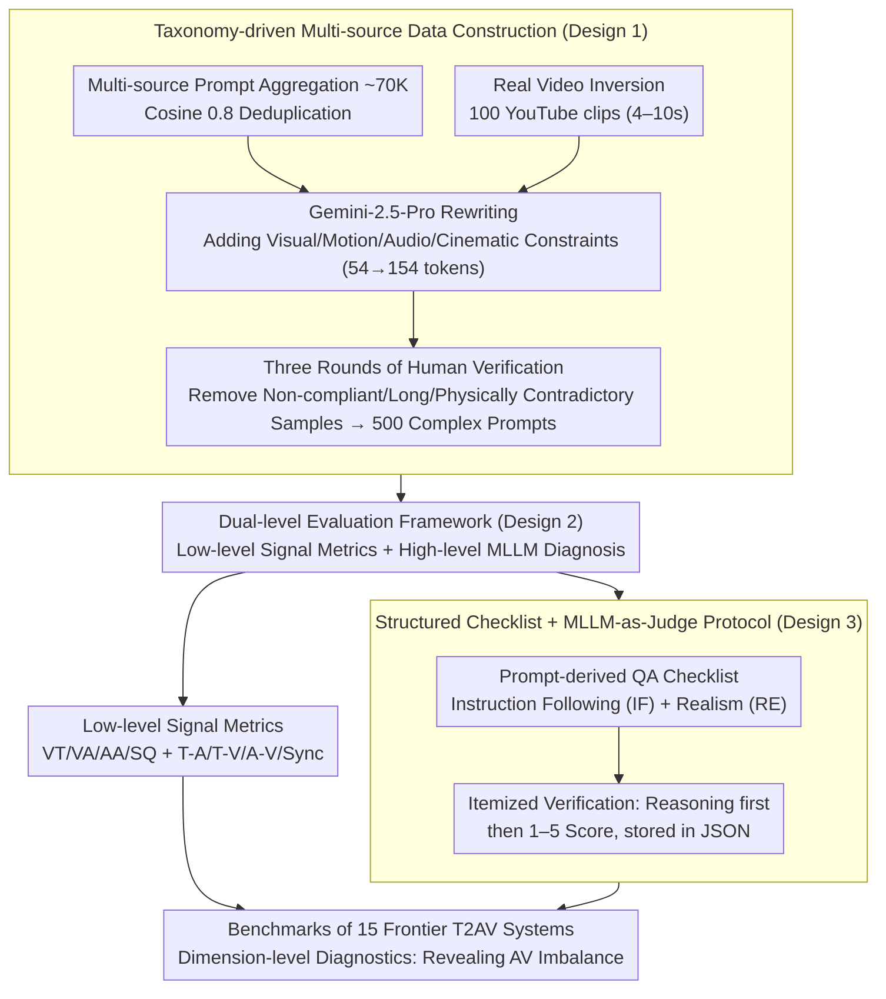

# T2AV-Compass: Towards Unified Evaluation for Text-to-Audio-Video Generation

**Conference**: ICML 2026  
**arXiv**: [2512.21094](https://arxiv.org/abs/2512.21094)  
**Code**: TBD  
**Area**: Multimodal VLM / Evaluation Benchmark  
**Keywords**: Text-to-Audio-Video Generation, Cross-modal Alignment, Evaluation Benchmark, MLLM-as-Judge, Audio-Visual Imbalance

## TL;DR
T2AV-Compass is the first comprehensive evaluation benchmark for Text-to-Audio-Video (T2AV) generation. It features 500 complex prompts and a dual-level evaluation framework combining low-level signal metrics with high-level MLLM diagnostics. By evaluating 15 cutting-edge T2AV systems, it quantitatively reveals an "audio realism bottleneck," where even top-tier models achieve over 85% realism in video but only approximately 50% in audio.

## Background & Motivation

**Background**: T2AV generation is at the frontier of multimodal content creation, with breakthrough systems like Sora and Veo emerging. However, evaluation frameworks remain inadequate, often relying on unimodal or weak multimodal benchmarks (e.g., VBench for video only, AudioCaps for audio only), which fail to capture true multimodal synergy.

**Limitations of Prior Work**:
- Insufficient capture of cross-modal semantic alignment and temporal synchronization—existing metrics cannot determine if generated sounds correspond to visible events.
- Benchmarking datasets are generally short and simplistic, failing to stress-test complex real-world scenarios.
- Fragmented evaluation dimensions—some focus on vision while others focus on audio, with almost no end-to-end multidimensional diagnostic frameworks.
- Lack of interpretability—it is difficult to attribute specific failure modes.

**Key Challenge**: T2AV generation requires simultaneous success across multiple axes (perceptual quality, cross-modal alignment, temporal synchronization, instruction following, and physical realism), yet evaluation frameworks often neglect one for the other.

**Goal**: To construct the first professional evaluation benchmark for T2AV generation that satisfies both "comprehensiveness" (covering multidimensional evaluation) and "diagnosability" (providing interpretable failure analysis).

**Key Insight**: A taxonomy-driven data construction paired with a dual-level evaluation metric system—combining low-level signal-based objective metrics with high-level semantic MLLM diagnostics.

**Core Idea**: Transform ambiguous instructions into verifiable constraints using structured questionnaires (QA checklists), supplemented by physical/knowledge realism checks to unify technical fidelity, semantic alignment, and instruction following within a single framework.

## Method

### Overall Architecture
T2AV-Compass addresses a question bypassed by existing benchmarks: when a model generates images and sound simultaneously, which modality is lagging and in which dimension does it fail? The benchmark is implemented in three stages: first, using a taxonomy-driven hybrid pipeline to generate 500 high-complexity audio-visual prompts; second, scoring them using a dual-level framework of "low-level signal metrics + high-level MLLM diagnostics"; and finally, evaluating 15 frontier T2AV systems on the same scale to provide dimension-level comparisons and failure attribution. The critical components are the data construction process, the tiered evaluation, and the traceability of MLLM scoring.

### Key Designs

**1. Taxonomy-driven Multi-source Data Construction: Making Prompts Complex and Physically Credible**
Short, simplistic prompts fail to expose the real weaknesses of models. Ours addresses this by first aggregating 70K high-quality prompts from VidProM, Kling, LMArena, and Shot2Story, then refining them. Using Gemini-2.5-Pro, prompts are rewritten to include constraints across vision, motion, audio, and cinematography, increasing the average length from 54 to 154 tokens and constraints from 5 to 10. To prevent "hallucinations" of pure text generation, 100 high-fidelity YouTube clips (4-10s) are used for video inversion, aligning prompts with real-world dynamics. Finally, three rounds of human verification ensure samples are compliant and physically sound. The taxonomy covers 8 metaphor types, 5 annotation dimensions, and 4 complexity factors.

**2. Dual-level Evaluation Framework: Signal Metrics for Efficiency, MLLM for Detail**
Signal-level metrics are objective but miss semantic nuances, while MLLM judgments are nuanced but slow and potentially biased. Ours utilizes both to complement each other. Low-level targets cover Video Quality (VT via DOVER++), Video Aesthetics (VA via Aesthetic Predictor V2.5), Audio Quality (AA and SQ via NISQA), and a suite of alignment metrics: Text-Audio (T-A via CLAP), Text-Video (T-V via VideoCLIP-XL-V2), Audio-Video (A-V via ImageBind), and synchronization (Synchformer). High-level subjective evaluation is handled by an MLLM: Instruction Following (IF) uses a structured QA checklist across 7 dimensions and 17 sub-dimensions, while Realism (RE) is split into visual (Motion Smoothness MSS, Object Integrity OIS, Temporal Consistency TCS) and audio (Audio Artifacts AAS, Texture Consistency MTC).

**3. Structured Checklist + MLLM-as-Judge Protocol: From Vague Scoring to Traceable Root Causes**
Instead of feeding abstract instructions to an MLLM for a global score, Ours automatically expands 500 prompts into "Instruction Following" and "Realism" checklists. During scoring, the MLLM is forced to **write reasoning text before providing a 1-5 score**, storing both in JSON. This dual approach forces the model to articulate its basis—reducing black-box volatility—and allows developers to locate exactly which constraint failed.

## Key Experimental Results

### Main Results: Comparison of 15 T2AV Systems

| Method | Open Source | Video Fidelity VT | Video Aesthetics VA | Audio Aesthetics AA | A-V Alignment | Sync DS ↓ | Avg Score |
|------|------|-----------|-----------|-----------|---------|----------|---------|
| Veo-3.1 | ✗ | 13.39 | 5.425 | 6.818 | 0.2856 | 0.6776 | 70.29 |
| Sora-2 | ✗ | 7.568 | 4.112 | 5.584 | 0.2419 | 0.8100 | 69.83 |
| Kling-2.6 | ✗ | 11.41 | 5.417 | 6.666 | 0.2495 | 0.7852 | 68.16 |
| Wan-2.6 | ✗ | 11.87 | 4.605 | 6.440 | 0.2149 | 0.8818 | 67.68 |
| LTX-2 | ✓ | 7.160 | 4.661 | 6.742 | 0.1851 | 0.8756 | 63.72 |
| Ovi-1.1 | ✓ | 9.336 | 4.368 | 6.531 | 0.1620 | 0.9624 | 61.23 |

Closed-source models dominate the top, but no single model reigns supreme in all dimensions.

### Ablation Study: Audio-Visual Imbalance

| Configuration | IF (Video) | IF (Audio) | Video Realism | Audio Realism | Notes |
|------|---------------|---------------|---------|---------|------|
| Veo-3.1 | 76.15% | 67.90% | 87.14% | 49.95% | Top model still lacks audio depth |
| Kling-2.6 | 73.72% | 63.89% | 87.98% | 47.03% | Excellent video, weaker audio |
| Wan-2.2 + Hunyuan-Foley | 74.45% | 58.23% | 89.63% | 62.14% | Pipeline: Great video, broken A-V alignment |
| AudioLDM2 + MTV | 68.30% | 65.80% | 76.45% | 58.92% | Pure AV synthesis lags behind |

### Key Findings
- **Audio Realism Bottleneck**: A 30-50 point gap exists between video metrics and audio realism, revealing a structural **audio-visual imbalance**. Even when top models reach 85%+ in video integrity/stability, audio remains near 50%.
- **Dynamic Instruction Following is Challenging**: In video IF, the "dynamics" dimension is the most discriminative. Frontier models drop significantly when executing complex motions and interactions (temporal consistency bottleneck).
- **Sound Effect Synthesis is the Weakest Link**: Sound effects are the most error-prone subcategory in audio IF; models struggle to link diverse physical sound events with text prompts and visual events.
- **Cascaded Pipelines are Fragmented**: Cascaded T2V → V2A pipelines can compete in unimodal quality but suffer from severe lags in overall A-V alignment due to "fragmented optimization."

## Highlights & Insights
- **Systematic Multidimensional Diagnostic System**: Integrates low-level signal metrics (DOVER++, CLAP, Synchformer) with high-level semantic verification (MLLM reasoning-based scoring) to upgrade failure attribution from "vague scores" to "traceable root causes."
- **Taxonomy-driven Data Construction**: Systematically designs constraints from cinematography, physical causality, and acoustic environments, processed through an LLM-rewrite and human-verification pipeline.
- **Quantitative Revelation of AV Imbalance**: Explicitly defines why AV generation hasn't reached human levels—pointing to the structural "bottleneck" of audio.
- **Interpretable Reasoning-first Scoring**: Mandatory textual reasoning before MLLM scoring resolves the reliability issues of black-box evaluation.

## Limitations & Future Work
- 500 prompts, while rich, do not cover all possible scenarios (e.g., long videos > 10s, unconventional interactions).
- MLLM-as-judge still carries inherent MLLM biases and potential instability.
- Audio evaluation could be deeper, lacking fine-grained metrics like spatial audio or spectral distortion.
- Many metrics rely on closed-source LLMs/models, limiting reproducibility; human validation across languages/cultures is still needed.
- Temporal sync metrics assume simple alignment, which may not hold for complex multi-source soundscapes.

## Related Work & Insights
- **vs VBench / EvalCrafter**: These focus only on video quality and text alignment while ignoring audio; T2AV-Compass upgrades audio to a first-class citizen.
- **vs JavisBench / VABench**: While these involve joint evaluation, Ours represents a significant leap in prompt complexity (154 vs 50-68 tokens), metric systematicity, and diagnostic depth.
- **vs AudioCaps / TTA-Bench**: Pure audio benchmarks that cannot characterize multimodal synergy.
- **Insight**: The correct path to professional benchmarking is "taxonomy-driven data design + hybrid objective/subjective metrics + interpretable diagnostics," a methodology applicable to other generative tasks like 3D or controllable text generation.

## Rating
- Novelty: ⭐⭐⭐⭐⭐ First comprehensive benchmark for T2AV; MLLM-as-judge structural QA paradigm + quantitative reveal of "AV imbalance."
- Experimental Thoroughness: ⭐⭐⭐⭐ Covers 15 systems with detailed diagnostics, though lacks large-scale correlation analysis with human annotation.
- Writing Quality: ⭐⭐⭐⭐⭐ Logical flow, high-quality diagrams, and clearly articulated contributions.
- Value: ⭐⭐⭐⭐⭐ Provides the first professional framework for T2AV research; data and code releases are expected to drive the field.

<!-- RELATED:START -->

## Related Papers

- [\[ICLR 2026\] JavisDiT++: Unified Modeling and Optimization for Joint Audio-Video Generation](../../ICLR2026/video_generation/javisdit_unified_modeling_and_optimization_for_joint_audio-video_generation.md)
- [\[CVPR 2026\] UniAVGen: Unified Audio and Video Generation with Asymmetric Cross-Modal Interactions](../../CVPR2026/video_generation/uniavgen_unified_audio_and_video_generation_with_asymmetric_cross-modal_interact.md)
- [\[ICCV 2025\] WorldScore: A Unified Evaluation Benchmark for World Generation](../../ICCV2025/video_generation/worldscore_a_unified_evaluation_benchmark_for_world_generation.md)
- [\[CVPR 2026\] VABench: A Comprehensive Benchmark for Audio-Video Generation](../../CVPR2026/video_generation/vabench_a_comprehensive_benchmark_for_audio-video_generation.md)
- [\[CVPR 2026\] VGA-Bench: A Unified Benchmark and Multi-Model Framework for Video Aesthetics and Generation Quality Evaluation](../../CVPR2026/video_generation/vga-bench_a_unified_benchmark_and_multi-model_framework_for_video_aesthetics_and.md)

<!-- RELATED:END -->
