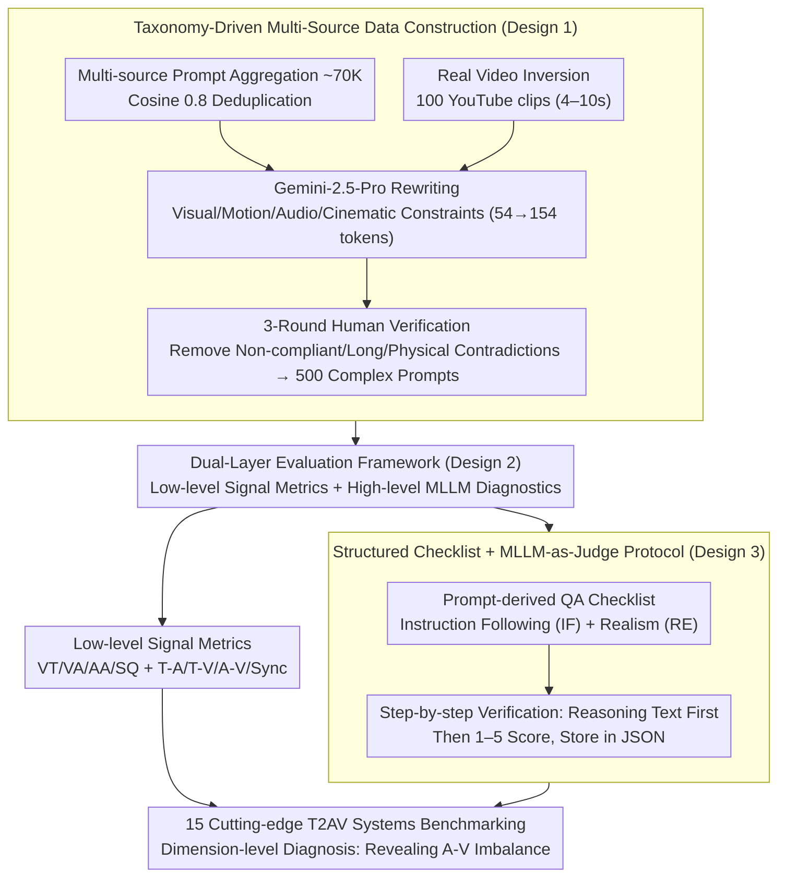

# T2AV-Compass: Towards Unified Evaluation for Text-to-Audio-Video Generation

**Conference**: ICML 2026  
**arXiv**: [2512.21094](https://arxiv.org/abs/2512.21094)  
**Code**: TBD  
**Area**: Multimodal VLM / Evaluation Benchmark  
**Keywords**: Text-to-Audio-Video Generation, Cross-modal Alignment, Evaluation Benchmark, MLLM-as-Judge, Audio-Visual Imbalance

## TL;DR
T2AV-Compass is the first comprehensive evaluation benchmark for Text-to-Audio-Video (T2AV) generation, featuring 500 complex prompts and a dual-layer evaluation framework (low-level signal metrics + high-level MLLM diagnostics). It systematically evaluates 15 cutting-edge T2AV systems, quantitatively revealing an "audio realism bottleneck" where even top-tier models achieve 85%+ realism in the video dimension versus only 50% in audio.

## Background & Motivation

**Background**: T2AV generation represents the frontier of multimodal content creation, with breakthrough systems like Sora and Veo emerging. However, evaluation systems remain inadequate, often relying on unimodal or weak multimodal benchmarks (e.g., VBench for video only, AudioCaps for audio only), which fail to characterize true multimodal synergetic properties.

**Limitations of Prior Work**:
- **Insufficient Capture of Alignment**: Existing metrics fail to address whether generated sounds correspond to visible events in terms of semantic alignment and temporal synchronization.
- **Simplistic Datasets**: Benchmark datasets are generally short and simplistic, failing to stress-test complex real-world scenarios.
- **Fragmented Evaluation Dimensions**: Current methods focus either on vision or audio, lacking an end-to-end multi-dimensional diagnostic framework.
- **Lack of Interpretability**: It is difficult to attribute specific failure cases to underlying causes.

**Key Challenge**: T2AV generation requires simultaneous success across multiple axes (perceptual quality, cross-modal alignment, temporal synchronization, instruction following, and physical realism), yet evaluation frameworks often neglect one or more of these dimensions.

**Goal**: To construct the first professional evaluation benchmark for T2AV generation that satisfies both "comprehensiveness" (covering multi-dimensional evaluation) and "diagnosticity" (interpretable failure analysis).

**Key Insight**: A taxonomy-driven data construction approach combined with a dual-layer evaluation metric system—integrating low-level signal objective metrics with high-level semantic MLLM subjective diagnostics.

**Core Idea**: Transform vague instructions into verifiable constraints using structured questionnaires (QA checklists), supplemented by physical/knowledge realism checks to unify technical fidelity, semantic alignment, and instruction following within a single framework.

## Method

### Overall Architecture
T2AV-Compass addresses a question often avoided by existing benchmarks: when a model generates images and sounds simultaneously, which modality is the bottleneck and in which dimension does it fail? The benchmark is implemented in three stages: first, a taxonomy-driven hybrid pipeline generates 500 high-complexity audio-visual prompts; second, a dual-layer framework of "low-level signal metrics + high-level MLLM diagnostics" is used for scoring; finally, 15 cutting-edge T2AV systems are evaluated on the same scale to provide dimension-level comparisons and failure attribution. The most critical components are the data construction process, the layered evaluation, and the traceability of MLLM scoring.

### Key Designs

**1. Taxonomy-Driven Multi-Source Data Construction: Ensuring Complexity and Physical Plausibility**
Short and simplistic prompts fail to reveal real model shortcomings, a common issue in older benchmarks (prompts often 50-68 words). This work aggregates high-quality prompts from communities like VidProM, Kling, LMArena, and Shot2Story, deduplicating via cosine similarity (0.8) to obtain ~70K entries. These are then rewritten using Gemini-2.5-Pro to add constraints across visual, motion, audio, and cinematic axes, increasing average length from 54 to 154 tokens and constraints from 5 to 10. To avoid the hallucinations of pure text generation, 100 high-fidelity YouTube clips (4-10s) are used for video inversion to align prompts with real-world dynamics. Finally, samples are filtered through three rounds of human verification. The taxonomy covers 8 metaphor types, 5 annotation dimensions, and 4 complexity factors.

**2. Dual-Layer Evaluation Framework: Signal Metrics for "Speed and Breadth," MLLM for "Depth and Detail"**
Signal-level metrics are objective and reproducible but miss semantic nuance, while MLLM judgments capture subtle semantics but are slow and biased. This framework uses both: low-level metrics cover Video Quality (VT via DOVER++), Aesthetics (VA via Aesthetic Predictor V2.5), Audio Quality (AA and SQ via NISQA), and cross-modal alignment (T-A via CLAP, T-V via VideoCLIP-XL-V2, A-V via ImageBind, and temporal Sync via Synchformer). High-level subjective evaluation reflects Instruction Following (IF) via a structured QA checklist from Gemini-2.5 (across 7 dimensions and 17 sub-dimensions) and Realism (RE), split into Video (Motion Smoothness, Object Integrity, Temporal Coherence) and Audio (Audio Artifacts, Texture Consistency).

**3. Structured Checklist + MLLM-as-Judge Protocol: From "Vague Scoring" to "Traceable Root Causes"**
Directly feeding abstract text instructions to an MLLM for a total score is neither credible nor attributable. This work automatically expands 500 prompts into "Instruction Following" and "Realism" checklists, where each check corresponds to a verifiable constraint. During scoring, the MLLM is forced to **write reasoning text before providing a 1-5 score**, storing both in JSON. This "Reasoning-before-Scoring" approach provides a basis for judgment, reduces black-box randomness, and allows for post-hoc localization of exactly which constraint failed.

## Key Experimental Results

### Main Results: Comparison of 15 T2AV Systems

| Method | Open Source | Video Fidelity (VT) | Video Aesthetic (VA) | Audio Aesthetic (AA) | A-V Align | Sync (DS) ↓ | Avg Score |
|------|------|-----------|-----------|-----------|---------|----------|---------|
| Veo-3.1 | ✗ | 13.39 | 5.425 | 6.818 | 0.2856 | 0.6776 | 70.29 |
| Sora-2 | ✗ | 7.568 | 4.112 | 5.584 | 0.2419 | 0.8100 | 69.83 |
| Kling-2.6 | ✗ | 11.41 | 5.417 | 6.666 | 0.2495 | 0.7852 | 68.16 |
| Wan-2.6 | ✗ | 11.87 | 4.605 | 6.440 | 0.2149 | 0.8818 | 67.68 |
| LTX-2 | ✓ | 7.160 | 4.661 | 6.742 | 0.1851 | 0.8756 | 63.72 |
| Ovi-1.1 | ✓ | 9.336 | 4.368 | 6.531 | 0.1620 | 0.9624 | 61.23 |

Closed-source models dominate the top tier, but no single model leads in all dimensions.

### Dimensional Diagnosis: Audio-Visual Imbalance

| Config | IF (Video) | IF (Audio) | Video Realism | Audio Realism | Note |
|------|---------------|---------------|---------|---------|------|
| Veo-3.1 | 76.15% | 67.90% | 87.14% | 49.95% | Top model still shows severe audio deficit |
| Kling-2.6 | 73.72% | 63.89% | 87.98% | 47.03% | Excellent video, weaker audio |
| Wan-2.2 + Hunyuan-Foley | 74.45% | 58.23% | 89.63% | 62.14% | Cascade: Good video, but A-V alignment breaks |
| AudioLDM2 + MTV | 68.30% | 65.80% | 76.45% | 58.92% | Pure synthesis methods lag behind |

### Key Findings
- **Audio Realism Bottleneck**: A 30-50 point gap exists between video and audio realism, revealing a structural **audio-visual imbalance**. Even top models reaching 85%+ in temporal stability struggle with audio realism (~50%).
- **Dynamic Instruction Following is Challenging**: The "Dynamics" dimension is the most discriminative in video IF; frontier models lose significant points during complex motion execution and interaction.
- **Sound Effect Synthesis is Weakest**: Sound Effects (SFX) is the most error-prone sub-category in audio IF; models struggle to link diverse physical sound events with visual prompts.
- **Fragmented Cascaded Pipelines**: Cascaded T2V → V2A pipelines can compete in unimodal quality (e.g., Wan-2.2 + Hunyuan-Foley video realism at 89.63), but global A-V alignment lags significantly due to "fragmented optimization."

## Highlights & Insights
- **Systematic Multi-dimensional Diagnostic System**: First to integrate low-level signal metrics (DOVER++, CLAP, Synchformer) with high-level semantic verification (MLLM reasoning-based scoring) in a unified framework.
- **Taxonomy-Driven Data Construction**: Systematic design of constraints across cinematography, physical causality, and acoustic environments, moving beyond simple prompt collections.
- **Quantitative Revelation of A-V Imbalance**: Explicitly characterizes the "bottleneck" of audio-visual generation—it is not a uniform lag across dimensions but a structural weakness in audio.
- **Interpretable Reasoning-before-Scoring**: Mandating textual reasoning before MLLM scoring mitigates the credibility issues associated with black-box evaluation.

## Limitations & Future Work
- 500 prompts, while representative, do not cover all scenarios (e.g., videos > 10s, unconventional interactions).
- MLLM-as-judge still carries inherent biases and potential instability.
- Audio evaluation could be deeper, lacking fine-grained metrics for spatial audio or spectral distortion.
- Dependence on closed-source LLMs for evaluation limits full reproducibility; large-scale human cross-validation is still needed.
- Temporal sync metrics assume single-event alignment, which may struggle with complex, multi-source soundscapes.

## Related Work & Insights
- **vs. VBench / EvalCrafter**: These only evaluate video quality and text alignment, ignoring audio; T2AV-Compass promotes audio to a first-class citizen.
- **vs. JavisBench / VABench**: While involving joint evaluation, this work provides a leap in prompt complexity (154 vs. 50-68 tokens), metric systematicity, and diagnostic depth.
- **vs. AudioCaps / TTA-Bench**: Pure audio benchmarks that cannot characterize multimodal synergy.
- **Insight**: The path to professional benchmarking lies in "taxonomy-driven data design + hybrid objective-subjective metrics + interpretable diagnostics," a paradigm applicable to 3D or controllable text generation.

## Rating
- Novelty: ⭐⭐⭐⭐⭐ First comprehensive T2AV benchmark; structured QA paradigm for MLLM-as-Judge; quantitative discovery of A-V imbalance.
- Experimental Thoroughness: ⭐⭐⭐⭐ Evaluation of 15 systems with detailed diagnostics; however, lacks large-scale correlation analysis with human labels.
- Writing Quality: ⭐⭐⭐⭐⭐ Logical flow, high-quality visualizations, and well-defined technical contributions.
- Value: ⭐⭐⭐⭐⭐ Provides a professional open evaluation framework for the T2AV community; code and data release expected to drive significant progress.

<!-- RELATED:START -->

## Related Papers

- [\[ICLR 2026\] JavisDiT++: Unified Modeling and Optimization for Joint Audio-Video Generation](../../ICLR2026/video_generation/javisdit_unified_modeling_and_optimization_for_joint_audio-video_generation.md)
- [\[CVPR 2026\] UniTalking: A Unified Audio-Video Framework for Talking Portrait Generation](../../CVPR2026/video_generation/unitalking_a_unified_audio-video_framework_for_talking_portrait_generation.md)
- [\[CVPR 2026\] UniAVGen: Unified Audio and Video Generation with Asymmetric Cross-Modal Interactions](../../CVPR2026/video_generation/uniavgen_unified_audio_and_video_generation_with_asymmetric_cross-modal_interact.md)
- [\[CVPR 2026\] VGA-Bench: A Unified Benchmark for Video Aesthetics and Generation Quality Evaluation](../../CVPR2026/video_generation/vga_bench_unified_benchmark_for_video_aesthetics_and_generation_quality.md)
- [\[ICCV 2025\] WorldScore: A Unified Evaluation Benchmark for World Generation](../../ICCV2025/video_generation/worldscore_a_unified_evaluation_benchmark_for_world_generation.md)

<!-- RELATED:END -->
