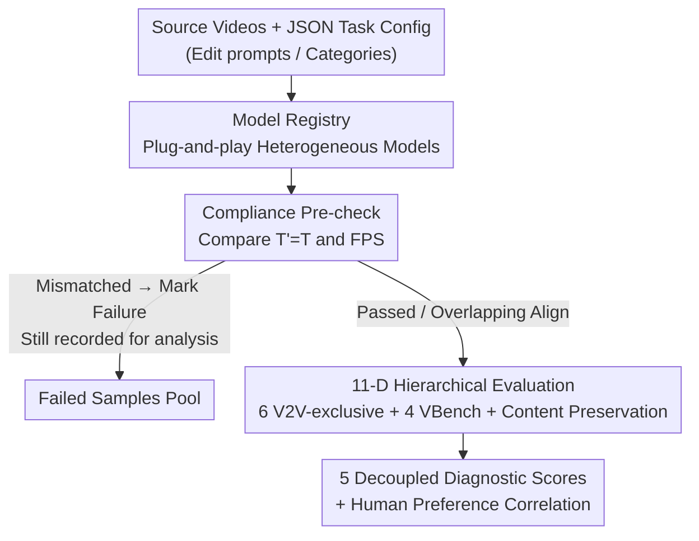

# V2V-Bench: A Comprehensive Benchmark for Video-to-Video Generation Evaluation

**Conference**: ICML 2026  
**arXiv**: [2606.05665](https://arxiv.org/abs/2606.05665)  
**Code**: To be confirmed  
**Area**: Video Generation / Evaluation Benchmarks  
**Keywords**: Video-to-Video Generation, Evaluation Benchmarks, Frame-level Correspondence, Temporal Consistency, Edit Faithfulness  

## TL;DR
Addressing the core challenge in Video-to-Video (V2V) editing—following instructions while maintaining frame-level alignment with the source video—which existing T2V/I2V metrics fail to capture, this paper proposes V2V-Bench. It introduces a benchmark with 11 decoupled dimensions across 5 categories (6 of which are V2V-exclusive) and uses a four-stage pipeline that first checks compliance before detailed evaluation. It achieves a Spearman correlation of 0.905 with human judgment across 6 core V2V dimensions.

## Background & Motivation
**Background**: Video-to-Video generation has become a vital paradigm for controllable video editing. Given a source video and an editing instruction, a model must perform transformations while preserving the temporal structure, scene dynamics, and spatial relationships of the source. Diffusion and autoregressive video models have advanced rapidly in generating realistic motion and high-fidelity visuals, with commercial models like Grok, Runway, Kling, and Sora launching V2V capabilities.

**Limitations of Prior Work**: Evaluation lags significantly behind. Mainstream benchmarks like VBench, VBench-I2V, and EvalCrafter assume a "single-input" paradigm (text prompt or single image), measuring perceptual quality, semantic relevance, and overall realism. However, the fundamental requirement of V2V—**that the output maintains fine-grained frame-by-frame correspondence with the source while faithfully applying edits**—is not captured by these metrics.

**Key Challenge**: There is a trade-off between edit faithfulness, temporal consistency, and source preservation. Different methods prioritize these differently, but a unified protocol is lacking to decouple, quantify, and compare them. Aggregating everything into a single score fails to diagnose where models succeed or fail across different types of transformations.

**Goal**: Construct a diagnostic benchmark capable of **hierarchical decoupling** of V2V quality. It should not only report a total score but also reveal why a model succeeds or fails dimension by dimension, validated by human annotations to ensure alignment with human preference.

**Key Insight**: The authors observe that the defining difference between V2V and T2V/I2V is the "source-output temporal correspondence constraint" ($o_t \leftrightarrow s_t$). They decompose this constraint into measurable sub-dimensions and employ a "compliance pre-check" to filter out outputs that fail to match frame counts or frame rates.

**Core Idea**: Replace a "single total score" with "compliance filtering followed by 11-dimensional hierarchical evaluation," specifically designing 6 V2V-exclusive dimensions to measure source correspondence and edit faithfulness.

## Method

### Overall Architecture
V2V-Bench follows a **four-stage sequential pipeline**. The input consists of source videos $\{v_1, v_2, \ldots\}$ and a JSON task configuration. The output is an interpretable diagnostic score across 11 dimensions for each model. The stages are: **Stage 1 (Input Preparation)**: A Task Dispatcher parses inputs and schedules tasks; **Stage 2 (Video Generation)**: Tasks are routed via a Model Registry supporting heterogeneous models (Veo-3.1, Grok, Open-Sora2); **Stage 3 (Quality Control)**: A compliance pre-check compares frame counts and frame rates, marking mismatches as failures; **Stage 4 (Multi-dimensional Evaluation)**: Passing video pairs are scored across 11 dimensions. The compliance check and V2V-exclusive dimensions are the primary contributions.

### Key Designs

**1. Compliance Pre-check: Frame-level Correspondence as a Hard Barrier**

V2V requires structural correspondence over time. The authors define three constraints: (i) Duration preservation $T'=T$; (ii) FPS consistency $\mathrm{FPS}(\mathcal{V}_o)=r$; (iii) Frame-level mapping $o_t \leftrightarrow s_t$ for all $t$. The first two are enforced during pre-check, while the third is evaluated via temporal/structural metrics. Experiments highlight this: Veo-3.1 achieved 100% compliance, but Grok and Open-Sora-2 failed consistently because they could not generate the exact duration (e.g., producing 185 or 129 frames for a 192-frame source). Compliance acts as a signal for long-video generation stability. For non-compliant models, evaluations are performed only on overlapping frames to ensure comparability.

**2. Six V2V-exclusive Dimensions: Custom Metrics for Source Correspondence and Edit Faithfulness**

- **Frame Correspondence**: Fuses DINO ViT-B/16 semantic features with SSIM for each frame pair $(s_t, o_t)$: $S_{\mathrm{fc}}=\frac{1}{T}\sum_{t=1}^{T}[\alpha \cdot \cos(f_s^t, f_o^t) + (1-\alpha)\cdot \mathrm{SSIM}(s_t, o_t)]$. Using $\alpha=0.7$ prioritizes semantic correspondence over pixel similarity, allowing for appearance edits while preserving high-level content.
- **Temporal Consistency**: Measures motion pattern preservation using the relative endpoint error of optical flow fields: $S_{\mathrm{temp}}=\exp(-\frac{1}{T-1}\sum_{t} \mathbb{E}[\frac{\|F_t^s - F_t^o\|_2}{\|F_t^s\|_2 + 1}])$.
- **Structural Preservation**: Extracts Canny edge maps and calculates an edge-level F1 score with spatial tolerance to check if object boundaries and spatial structures are preserved.
- **Layout Adherence**: Uses SSIM between source and generated frames to measure global spatial arrangement.
- **Edit Faithfulness**: Uses CLIP image-text similarity: $S_{\mathrm{edit}}=\frac{1}{T}\sum_t \frac{\cos(f_{\mathrm{CLIP}}(I_t^o), f_{\mathrm{CLIP}}(p))+1}{2}$.
- **Style Transfer Quality**: Measures the "magnitude" and "direction" of change: $S_{\mathrm{style}}=\lambda \cdot M_{\mathrm{Gram}} \cdot G_{\mathrm{dir}} + (1-\lambda)\cdot D_{\mathrm{CLIP}}$, where $M_{\mathrm{Gram}}$ is VGG-19 Gram matrix distance and $G_{\mathrm{dir}}$ penalizes edits deviating from the target direction.

**3. Hierarchical Decoupling Framework + Multi-Scenario Task Suite**

11 dimensions are organized into 5 categories: Temporal Alignment, Structural Faithfulness, Transformation Quality, Video Quality, and Semantic Alignment. Beyond the 6 V2V-exclusive metrics, Video Quality reuses 4 VBench metrics (Motion Smoothness, Aesthetic Quality, Imaging Quality, Temporal Flickering). Content Preservation uses RGB histogram correlation as a proxy: $S_{\mathrm{content}}=\frac{1}{T}\sum_t \mathrm{HistSim}(I_t^s, I_t^o)$. The suite includes 81 tasks covering object editing, appearance editing, style transfer, motion editing, and identity preservation. 

## Key Experimental Results

### Main Results
Evaluation of two commercial models (Veo-3.1, Grok) and one open-source model (Open-Sora2).

Compliance Results (41 evaluation samples):

| Model | Passed | Rate | Main Failure Mode |
|------|------|--------|--------------|
| Grok | 0 / 41 | 0.0% | Frames 192→185 |
| Veo-3.1 | 41 / 41 | 100.0% | None |
| Open-Sora-2 | 0 / 41 | 0.0% | Frames 192→129 |

11-Dimensional Comparison (Averages of 41 common tasks):

| Dimension | Grok | Veo | Open-Sora |
|------|------|-----|-----------|
| Imaging Quality | 0.4979 | **0.6522** | 0.3031 |
| Temporal Flickering | 0.9836 | **0.9856** | 0.9814 |
| Structural Preservation | **0.5726** | 0.2926 | 0.2225 |
| Temporal Consistency | **0.5289** | 0.1752 | 0.3464 |
| Frame Correspondence | **0.7895** | 0.7118 | 0.6697 |
| Edit Faithfulness | **0.6187** | 0.6161 | 0.6105 |
| Aesthetic Quality | **0.4981** | 0.4976 | 0.4931 |
| Motion Smoothness | 0.9657 | **0.9865** | 0.9645 |
| Layout Adherence | **0.7822** | 0.6564 | 0.6692 |
| Style Transfer | **0.8660** | 0.6903 | 0.6141 |
| Content Preservation | 0.6086 | **0.7489** | 0.4633 |
| **Average** | **0.7011** | 0.6376 | 0.5762 |
| **Wins** | **7 / 11** | 4 / 11 | 0 / 11 |

Grok outperformed others in edit faithfulness and source preservation, while Veo-3.1 excelled in pure visual quality (Imaging, Content Preservation, Motion Smoothness).

### Ablation Study
Comparing the discriminative power of "6 V2V-exclusive scores" vs. "all 11 dimensions":

| Configuration | Grok Avg | Veo Avg | Open-Sora Avg | Grok Wins |
|------|-----------|----------|----------------|----------------|
| 6 V2V-exclusive dimensions | 0.6937 | 0.5237 | 0.5221 | 6 / 6 |
| All 11 dimensions | 0.7011 | 0.6376 | 0.5762 | 7 / 11 |

The performance gap widens significantly on V2V-exclusive dimensions, showing they are more discriminative than general video quality metrics.

Human/VLM Preference Alignment (Spearman Correlation):

| Pair | All 11-D | V2V-core 6-D |
|------|----------|---------------|
| Human ↔ Bench | 0.688 | **0.905** |
| Human ↔ Gemini 2.5 Pro | 0.713 | 0.899 |
| Human ↔ GPT-4o | 0.737 | 0.816 |

### Key Findings
- **Compliance is the first threshold for V2V**: Failure to produce the correct frame count reveals fundamental flaws in long-video synthesis.
- **V2V-core 6-D highly aligns with human judgment (0.905)**, outperforming VLM judges (GPT-4o, Gemini) in this specific task subset.
- **Aggregated scores hide capability gaps**: Models converge on general video quality metrics, but V2V-exclusive dimensions reveal significant differences in structural preservation.

## Highlights & Insights
- **The "Compliance then Evaluation" design is practical**: Separating frame-alignment failures from edit-quality issues prevents using sophisticated metrics on videos with basic temporal errors.
- **Metric composition is efficient**: By leveraging existing modules (DINO, Flow, Gram matrices), the metrics are lightweight and training-free while effectively covering source correspondence.
- **Directional Style Score ($G_{\mathrm{dir}}$)**: Decoupling "whether a change occurred" from "whether it changed in the right direction" via CLIP space vectors is an insightful approach to measuring styles.

## Limitations & Future Work
- **Small Scale**: Only 81 tasks and 3 models were tested; human alignment studies were limited in size.
- **Proxy Dependence**: Reliance on RGB histograms and CLIP might be insensitive to complex semantic nuances.
- **Inconsistent Alignment for Failed Models**: Evaluating non-compliant models on overlapping frames may mask content loss caused by "dropped frames."
- **Future Directions**: Scaling to longer videos, more diverse source types, and introducing segmentation-consistency metrics to reduce reliance on coarse proxies.

## Related Work & Insights
- **Vs. VBench/EvalCrafter**: These target T2V/I2V without source temporal constraints; V2V-Bench fills this gap with 6 dedicated dimensions.
- **Vs. VLM-as-judge**: While VLM judges align well with humans, the specifically designed V2V-core metrics achieve higher correlation (0.905 vs 0.899/0.816).

## Rating
- Novelty: ⭐⭐⭐⭐ 
- Experimental Thoroughness: ⭐⭐⭐ 
- Writing Quality: ⭐⭐⭐⭐ 
- Value: ⭐⭐⭐⭐ 

<!-- RELATED:START -->

## Related Papers

- [\[CVPR 2026\] VGA-Bench: A Unified Benchmark and Multi-Model Framework for Video Aesthetics and Generation Quality Evaluation](../../CVPR2026/video_generation/vga-bench_a_unified_benchmark_and_multi-model_framework_for_video_aesthetics_and.md)
- [\[CVPR 2026\] VABench: A Comprehensive Benchmark for Audio-Video Generation](../../CVPR2026/video_generation/vabench_a_comprehensive_benchmark_for_audio-video_generation.md)
- [\[ICLR 2026\] DrivingGen: A Comprehensive Benchmark for Generative Video World Models in Autonomous Driving](../../ICLR2026/video_generation/drivinggen_a_comprehensive_benchmark_for_generative_video_world_models_in_autono.md)
- [\[ICLR 2026\] NarrLV: Towards a Comprehensive Narrative-Centric Evaluation for Long Video Generation](../../ICLR2026/video_generation/narrlv_towards_a_comprehensive_narrative-centric_evaluation_for_long_video_gener.md)
- [\[CVPR 2025\] VEU-Bench: Towards Comprehensive Understanding of Video Editing](../../CVPR2025/video_generation/veu-bench_towards_comprehensive_understanding_of_video_editing.md)

<!-- RELATED:END -->
