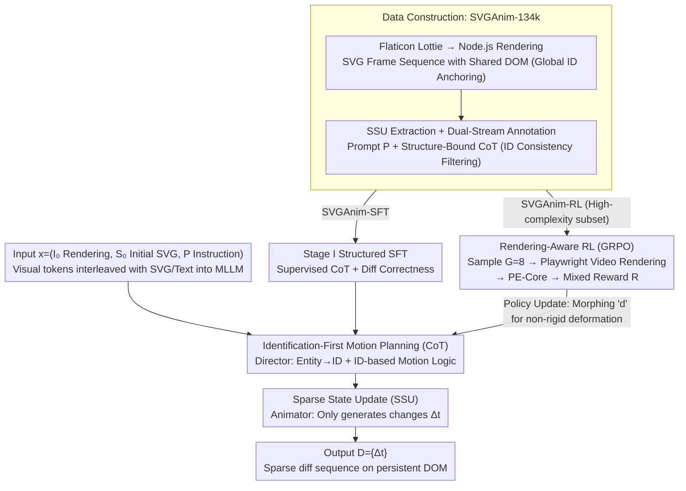

# VAnim: Rendering-Aware Sparse State Modeling for Structure-Preserving Vector Animation

**Conference**: ICML 2026  
**arXiv**: [2605.01517](https://arxiv.org/abs/2605.01517)  
**Code**: None (Project page only)  
**Area**: Generative Models / Vector Animation / Multimodal LLM  
**Keywords**: SVG Animation, Sparse State Update, Identification-First CoT, GRPO, Rendering-Aware RL

## TL;DR
VAnim models open-domain text-to-SVG animation as "sparse state updates on a persistent DOM tree" + "Identification-First motion planning" + "GRPO rendering-aware reinforcement learning." This approach compresses sequence lengths by $9.86\times$ while maintaining topological consistency, significantly outperforming GPT-5.2, Gemini 3 Pro, and LiveSketch.

## Background & Motivation
**Background**: SVG is the de facto standard in UI/Web/icon design due to its scalability, editability, and small file size. Vector animation (loading indicators, micro-interactions) requires adding a temporal dimension to SVGs. Current approaches follow two paths: optimization-based differentiable rendering (LiveSketch series) using SDS to iterate in pixel space for thousands of steps to approximate text-to-video priors, and general LLM-based methods (GPT-5.2, Gemini 3 Pro, Keyframer) that directly generate CSS/SMIL transformation code.

**Limitations of Prior Work**: Differentiable rendering methods (i) suffer from minute-level inference latency, preventing interaction, and (ii) treat vectors as independent strokes, lacking structural awareness, which causes closed shapes and occlusions to collapse, limiting them to sparse sketches. LLM-based methods suffer from affine bias: CSS/SMIL are mathematically limited to translation, rotation, and scaling, failing to perform path-level non-rigid deformations (e.g., a waving flag or a deforming water drop). Furthermore, rewriting the entire SVG frame-by-frame leads to (a) context explosion (86k tokens for 24 frames) and (b) identity drift (random modification of static elements).

**Key Challenge**: The fundamental tension between expressiveness (altering the `d` attribute for non-rigid geometric deformation) and stability (altering `d` easily destroys DOM topology/identity consistency). Any paradigm that "autoregressively generates the entire animated SVG" fails to resolve both issues simultaneously.

**Goal**: (i) Compress animation sequences to a length manageable by LLM contexts; (ii) impose hard constraints ensuring "elements not participating in the animation remain byte-for-byte identical"; (iii) provide path-level non-rigid deformation capabilities; (iv) incorporate non-differentiable SVG rendering into the training loop.

**Key Insight**: The authors observe that over 85% of SVG syntax in adjacent frames is redundant; only a few attributes like `d`, `transform`, and `opacity` actually change. Thus, an animation can be rewritten as an "initial SVG + a sequence of ID-anchored attribute deltas." This reduces the generation target from "entire tree token sequences" to "sparse diffs," naturally resolving context explosion and identity drift.

**Core Idea**: Redefine animation as "Sparse State Updates (SSU) on a persistent DOM tree," coupled with "Identification-First" CoT and rendering-aware GRPO, enabling the LLM to learn geometric deformations while preserving structure.

## Method
VAnim reconstructs data, representation, inference, and training to align with SSU.

### Overall Architecture
Input: Initial static SVG $S_0$, its rendering $I_0$, and a natural language instruction $P$. Output: A sequence of sparse state updates $\mathcal{D}=\{\Delta_t\mid t=1,\dots,T\}$, where each $\Delta_t$ is a set of "(id, attribute, new value)" triples, listing only attributes that changed relative to the previous frame.

The model is based on Qwen3-VL-8B-Thinking. A vision encoder projects $I_0$ into tokens interleaved with $S_0$ and $P$, allowing the model to align visual objects with DOM IDs across modalities. Generation is explicitly split into two stages, corresponding to the probability decomposition $p_\theta(o\mid x)=p_\theta(C\mid x)\cdot p_\theta(\mathcal{D}\mid C,x)$, where $C$ is the Structure-Bound CoT and $o=(C,\mathcal{D})$. Training consists of two stages: Stage I involves structured SFT on SVGAnim-SFT (123k), and Stage II involves rendering-aware GRPO on SVGAnim-RL (a high-complexity subset of 10k).

For data, the authors crawl Lottie files from Flaticon and generate ID-anchored SVG DOM sequences via Node.js scripts. After coordinate normalization, absolute-to-relative coordinate conversion, and cleaning, they obtain SVGAnim-134k. Doubao-Seed-1.6 is used for dual-stream annotation: user-centric prompt $P$ + Structure-Bound CoT $C$ (including "Entity Identification: blue circle → ID 05" and "Visual Dynamic Planning: ID 05 scale up/down"). Strict ID consistency filtering ensures all IDs referenced in the CoT exist.

### Key Designs

**1. Sparse State Update (SSU) Representation: Replacing "Frame-by-Frame Rewriting" with "Initial SVG + Attribute Diff Stream"**

Since 85% of SVG syntax is redundant between frames, SSU defines animation as $\Delta_t=\{(id, attr, v_t)\mid v_t\ne v_{t-1}, (id, attr, v_t)\in A(S_t)\}$. The complete animation is $(S_0,\Delta_1,\dots,\Delta_T)$. During serialization, `<|time=t|>` and `<|ID=id|>` tokens anchor changes to persistent DOM nodes. A 24-frame animation is compressed from 86k tokens to 9.2k ($9.86\times$ compression). Identity drift is eliminated by design because any attribute not listed in $\Delta_t$ remains unchanged by construction.

**2. Identification-First Motion Planning (CoT): Grounding Entities to DOM IDs before Temporal Logic**

Separating "what to do" from "which node to modify" prevents the model from targeting the wrong object. VAnim splits inference: the Director phase takes $I_0, S_0, P$ to produce a structured CoT $C$ consisting of Entity Identification (mapping visual objects to IDs) and Visual Dynamic Planning (describing ID-based temporal behavior). The Animator phase then generates the diff sequence $\mathcal{D}$ based on $C$. Ablations show that removing CoT drops semantic alignment from 0.281 to 0.255, as explicit grounding is a prerequisite for structural integrity.

**3. Rendering-Aware Reinforcement Learning (GRPO + Mixed Reward): Forcing Non-Rigid Deformation via Rendered Quality**

SFT only supervises code correctness but cannot evaluate visual appeal, leading to conservative strategies restricted to affine transforms. VAnim integrates non-differentiable SVG rendering into the training loop. For each input, $G=8$ candidates are sampled, rendered into $500\times 500$ videos using Playwright, and evaluated by the PE-Core video encoder. The reward is $\mathcal{R}=\lambda_{\text{align}}\mathcal{R}_{\text{align}}+\lambda_{\text{fmt}}\mathcal{R}_{\text{fmt}}$. $\mathcal{R}_{\text{align}}$ provides dense semantic signals to guide Bézier control point manipulation, while $\mathcal{R}_{\text{fmt}}\in\{-1,+1\}$ enforces hard constraints on renderability and ID validity. The objective uses the GRPO loss: $\mathcal{L}_{\text{GRPO}}=\mathbb{E}\bigl[\tfrac{1}{G}\sum_i\min(\tfrac{\pi_\theta(o_i\mid x)}{\pi_{\theta_{\text{old}}}(o_i\mid x)}\hat A_i,\text{clip}(\cdot)\hat A_i)-\beta D_{\text{KL}}\bigr]$.

### Loss & Training
Stage I: $\mathcal{L}_{\text{SFT}}(\theta)=-\mathbb{E}_{(I_0,S_0,P)\sim D_{\text{SFT}}}[\log p_\theta(C,\mathcal{D}\mid I_0,S_0,P)]$, maximum sequence 25k tokens, full-parameter fine-tuning.  
Stage II: GRPO objective as above, $G=8, \beta=0.01, \lambda_{\text{align}}=\lambda_{\text{fmt}}=1.0$, using $8\times$ H100 GPUs.

## Key Experimental Results

### Main Results
Measured on the SVGAnim-Test (1k held-out) using PE-Core-G14-448 for semantic alignment and Success Rate for renderability:

| Method | Semantic Alignment ↑ | Success Rate ↑ |
|:---|:---:|:---:|
| LiveSketch | 0.158 | 100.0% |
| GPT-5.2 | 0.234 | 88.5% |
| Gemini 3 Pro | 0.243 | 86.2% |
| VAnim (SFT-only) | 0.268 | 95.2% |
| **Ours (GRPO)** | **0.281** | **100.0%** |

VAnim-GRPO achieves the highest semantic alignment and 100% execution rate. While LiveSketch is always renderable, its low semantic score reflects frequent topological failures. GPT-5.2/Gemini suffer from unclosed tags and ID hallucinations in long sequences.

### Ablation Study

| Configuration | Semantic Alignment ↑ | Success Rate ↑ | Notes |
|:---|:---:|:---:|:---|
| Full VAnim | 0.281 | 100.0% | Complete method |
| w/o Rendering-Aware RL | 0.268 (-0.013) | 95.2% (-4.8%) | Degrades to SFT; "lazy motion" |
| w/o Structure-Bound CoT | 0.255 (-0.026) | 98.6% (-1.4%) | Target mismatches (e.g., rotating entire cabinet instead of door) |
| w/o SSU (Appendix) | — | 62.3% | Naive frame-by-frame generation fails |
| w/o input image (Appendix) | — | Significant drop | Vision anchoring is lost |

### Key Findings
- The three core components are indispensable: CoT ensures "correct node modification," SSU ensures "structure preservation," and RL ensures "expressive deformation." CoT contributes the most to semantic alignment.
- The 62.3% Success Rate for naive generation validates the identity drift hypothesis: without SSU constraints, LLMs randomly alter static attributes.
- Visual input $I_0$ is critical for SSIM and temporal smoothness; pure code + prompt input is insufficient for mapping visual objects to DOM IDs.

## Highlights & Insights
- Reformulating "sequence generation" as "sparse updates on persistent state" is a profound insight. It effectively introduces a "topological invariance" hard constraint at the architectural level rather than the loss level. This paradigm is transferable to any task involving local temporal changes on persistent structures, such as HTML/UI editing or CAD modification.
- Identification-First CoT bridges the gap between visual entities and DOM IDs, using "ID consistency filtering" to ensure the CoT's executability is embedded in the data pipeline.
- Using video encoders like PE-Core for RL rewards is an elegant way to incorporate non-differentiable rendering into the training chain. The combination of sparse format rewards and dense semantic rewards serves as a template for other code-to-render tasks.

## Limitations & Future Work
- Data is primarily derived from Flaticon's Lottie-style works, which are well-structured. Generalization to messy, real-world SVGs (missing IDs, deep nesting, group abuse) remains an open question.
- Rendering-aware RL depends on real-time headless browser rendering and video scoring, making it significantly more expensive than standard RLHF.
- Current VAnim focuses on visual animation but lacks support for JavaScript-triggered interactions or multi-scene narratives.
- Evaluation relies heavily on PE-Core, which shares roots with the training reward, potentially introducing metric circularity.

## Related Work & Insights
- **vs LiveSketch (Gal et al. 2024)**: LiveSketch optimizes strokes in pixel space; VAnim performs sparse editing directly on the SVG DOM, preserving topology by construction.
- **vs Keyframer / GPT-5.2 / Gemini 3 Pro**: General LLMs stay within the "comfort zone" of affine transforms. VAnim's RL signal pushes the policy to manipulate Bézier control points in the `d` attribute.
- **vs DeepSVG / SVGformer**: These focus on static vector composition; VAnim is the first to bring the LLM paradigm to open-domain vector animation without context explosion.

## Rating
- **Novelty**: ⭐⭐⭐⭐⭐ SSU + Identification-First CoT + Rendering-Aware GRPO is a systematic first for open-domain vector animation.
- **Experimental Thoroughness**: ⭐⭐⭐⭐ Includes strong baselines and extensive ablations, though lacks evaluation on "messy" manual SVGs.
- **Writing Quality**: ⭐⭐⭐⭐⭐ Motivation clearly articulates affine bias, context explosion, and identity drift.
- **Value**: ⭐⭐⭐⭐ Open-sourced data and framework are highly valuable for UI/Web automation and design tools.

<!-- RELATED:START -->

## Related Papers

- [\[CVPR 2026\] Vector Prism: Animating Vector Graphics by Stratifying Semantic Structure](../../CVPR2026/video_generation/vector_prism_animating_vector_graphics_by_stratifying_semantic_structure.md)
- [\[CVPR 2026\] LottieGPT: Tokenizing Vector Animation for Autoregressive Generation](../../CVPR2026/video_generation/lottiegpt_vector_animation_generation.md)
- [\[ICML 2026\] VEDA: Scalable Video Diffusion via Distilled Sparse Attention](veda_scalable_video_diffusion_via_distilled_sparse_attention.md)
- [\[ICML 2026\] DFSAttn: Dynamic Fine-Grained Sparse Attention for Efficient Video Generation](dfsattn_dynamic_fine-grained_sparse_attention_for_efficient_video_generation.md)
- [\[ICML 2026\] OLAF-World: Orienting Latent Actions for Video World Modeling](olaf-world_orienting_latent_actions_for_video_world_modeling.md)

<!-- RELATED:END -->
