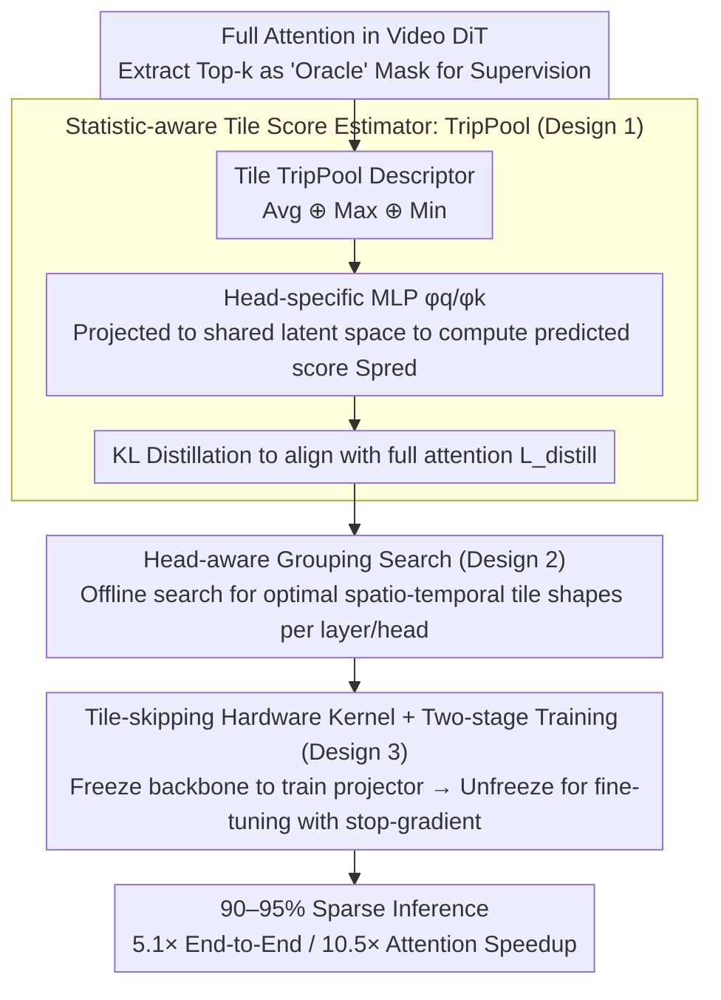

# VEDA: Scalable Video Diffusion via Distilled Sparse Attention

**Conference**: ICML 2026  
**arXiv**: [2605.30325](https://arxiv.org/abs/2605.30325)  
**Code**: To be confirmed  
**Area**: Video Generation / Diffusion Models / Model Acceleration  
**Keywords**: Sparse Attention, Video Diffusion Transformer, Distillation Learning, Hardware Optimization

## TL;DR
VEDA reformulates the sparse attention problem in video DiT as "explicit distillation of the full attention structure." By combining statistic-aware tile scoring, head-aware grouping search, and hardware-efficient kernels, it maintains generation quality at extreme 90-95% sparsity. It achieves a 5.1× end-to-end speedup and 10.5× attention acceleration for Waver-12B generating 720P 10-second videos.

## Background & Motivation

**Background**: Video Diffusion Transformers (DiTs) have become the mainstream for high-fidelity video synthesis, but the $O(N^2)$ computational bottleneck of self-attention is extremely severe during high-resolution, long-duration generation.

**Limitations of Prior Work**: Existing sparse attention methods face two fundamental issues under high pruning regimes (≥ 90%):
- **Static methods** (SVG, STA) rely on predefined spatio-temporal masks and lack adaptivity to head-specific attention geometries.
- **Dynamic methods** (VSA, VMOBA) rely on implicit learning and lack explicit supervision; the use of coarse statistics like mean pooling ignores critical signal peaks.

**Key Challenge**: High sparsity pruning leads to structural artifacts such as "water ripples, spatial warping, and temporal flickering." However, experiments reveal that this is **not caused by the sparsity ratio itself**, but rather by insufficient tile-level alignment between the sparse mask and the full attention structure.

**Goal**: Achieve aggressive sparsification and actual acceleration of video DiTs while maintaining generation quality.

**Key Insight**: A critical observation is that "oracle-level" masks (derived from the Top-k of full attention) maintain high quality even at 90% sparsity. This inspires the explicit supervision of tile selection targets instead of relying on implicit learning from diffusion objectives.

**Core Idea**: Reformulate sparse tile selection as explicit distillation of the full attention structure, complemented by head-aware grouping to handle head heterogeneity and hardware-efficient kernels for real-world acceleration.

## Method

### Overall Architecture
The starting point for VEDA is a counter-intuitive observation: at 90% sparsity, "oracle" masks extracted from the full attention Top-k still maintain high quality. This indicates that artifacts under high sparsity (ripples, warping, flickering) are not due to the sparsity ratio but due to poor alignment between the sparse mask and the full attention structure. Consequently, VEDA reformulates sparse tile selection as "explicit distillation of the full attention structure." Two additional components ensure actual speedup: head-aware grouping to address geometric heterogeneity across attention heads, and a tile-skipping hardware kernel to translate theoretical FLOPs reduction into end-to-end acceleration.

### Key Designs

**1. Statistic-aware Tile Score Estimator (TripPool): Learning Masks Aligned with Full Attention via Explicit Distillation**

Dynamic methods (VSA, VMOBA) implicitly learn sparse structures through the diffusion objective and use coarse statistics like mean pooling, which can erase critical signal peaks, leading to misaligned masks. VEDA adopts explicit supervision: for each query/key tile, it constructs a TripPool descriptor by concatenating the mean, maximum, and minimum values: $\text{TripPool}[\cdot] = \text{Avg}[\cdot] \oplus \text{Max}[\cdot] \oplus \text{Min}[\cdot]$. These are passed through head-specific MLPs $\phi_q, \phi_k$ and projected into a shared latent space to compute a predicted score $S_{ij}^{\text{pred}} = \frac{\phi_q(\text{TripPool}[\tilde{Q}_i]) \cdot \phi_k(\text{TripPool}[\tilde{K}_j])^\top}{\sqrt{d'}}$. Finally, KL divergence $\mathcal{L}_{\text{distill}} = \mathcal{D}_{KL}(A^{\text{tgt}} \| A^{\text{pred}})$ is used to align predictions with full attention. The max/min statistics specifically preserve peak dependencies missed by mean pooling, while the explicit distillation target avoids the drift associated with implicit learning. Ablation shows TripPool's approximation error (0.912) is significantly better than pure mean pooling (0.965) or max/min only (0.982).

**2. Head-aware Grouping Search: Tailored Spatio-temporal Tile Shapes for Every Head**

Spatio-temporal dependencies vary significantly across different layers and heads; a uniform tile grouping reduces tile recall under high sparsity. VEDA restricts tile configurations to the factorization of the hardware tile size $B$: $\Omega = \{(p_t, p_h, p_w) \in \mathbb{N}^3 \mid p_t p_h p_w = B\}$. For each candidate $\pi$, it minimizes the error between sparse approximation and full attention output on a calibration set: $\pi^*_{l, h} = \arg\min_{\pi \in \Omega} \mathbb{E}_{x \sim \mathcal{D}_{\text{cal}}} \|O^{\text{fu}}_{l, h}(x) - O^{\text{sp}}_{l, h}(x; \pi)\|_F^2$. The optimal grouping is searched offline per layer and per head. Assigning more spatial tiles to space-biased heads and more temporal tiles to time-biased heads improves motion quality by 7.2% and overall quality by 9.6% compared to static configurations.

**3. Tile-skipping Hardware Kernel + Two-stage Training: Converting Sparsity to Real Speedup with Stable Training**

Algorithmic sparsity requires kernel support for end-to-end acceleration without corrupting the pre-trained manifold. VEDA uses two-stage training for stability: the first stage freezes the backbone and trains only the projectors for 1000 steps to align sparse predictions; the second stage unfreezes all parameters for fine-tuning at the target sparsity. A crucial **stop-gradient** is applied in the total objective $\mathcal{L}_{\text{total}} = \mathcal{L}_{\text{diff}} + \lambda \mathcal{L}_{\text{distill}}$—backbone features do not receive gradients from the mask estimator. Experiments show that allowing backpropagation significantly degrades quality. On the hardware side, tile-skipping is implemented using ThunderKittens DSL and Hopper TMA: producer warps fetch selected key/value tiles non-contiguously from global memory to shared memory, while consumer warps execute Tensor Core operations simultaneously. This achieves ~80% of FlashAttention-3's efficiency, reducing a 92% attention overhead to 50%.

## Key Experimental Results

### Main Results (Comparison of Full Attention and VSA on Waver-1B and Wan2.1-1.3B)

| Model | Method | Sparsity | Subject Consistency | Background Consistency | Motion Smoothness | Aesthetic Quality | E2E Time |
|------|------|--------|---------|---------|--------|--------|----------|
| Waver-1B | Full Attention | 0% | 0.938 | 0.955 | 0.979 | 0.693 | 69.3s |
| Waver-1B | VSA | 87.5% | 0.933 | 0.949 | 0.978 | 0.692 | 34.3s |
| Waver-1B | **VEDA** | **90%** | **0.940** | **0.954** | **0.980** | **0.699** | **31.9s** |
| Waver-1B | **VEDA** | **95%** | 0.934 | 0.951 | 0.978 | 0.698 | **30.6s** |
| Wan2.1-1.3B | Full Attention | 0% | 0.940 | 0.969 | 0.977 | 0.670 | 58.5s |
| Wan2.1-1.3B | **VEDA** | **90%** | 0.887 | 0.941 | 0.972 | 0.663 | **37.6s** |

### Ablation Study

| Component | Configuration | Metric ↓ | Description |
|------|------|------|------|
| Tile Statistics | Mean Pooling | 0.965 | Ignores peaks |
| Tile Statistics | Max / Min | 0.982 | Misses median importance |
| Tile Statistics | **TripPool** | **0.912** | Preserves key dependencies |
| Grouping Strategy | Static [8, 8, 2] | +3.2% Motion Loss | Spatial bias |
| Grouping Strategy | Static [4, 4, 8] | Baseline | Balanced config |
| Grouping Strategy | **Head-aware Dynamic** | +7.2% Motion / +9.6% Overall | Adapts to head heterogeneity |

### Key Findings
- **Mask Accuracy Dominates Performance**: Generating with "oracle" masks at 90% sparsity far outperforms mean-pooled masks—the root cause is alignment quality, not the sparsity ratio.
- **Significant Head Heterogeneity**: Spatial/temporal dependency patterns vary greatly across layers and heads; uniform grouping fails at high sparsity.
- **Scalability**: Waver-12B generating 720P 10-second videos achieves 5.1× end-to-end speedup and 10.5× attention speedup, with attention overhead dropping from 92% to 50%; speedup increases with sequence length.

## Highlights & Insights
- **Fundamental Empirical Observation**: The "oracle mask" experiment precisely identifies the bottleneck as structural alignment rather than the sparsity ratio, overturning previous assumptions.
- **Paradigm Shift to Explicit Supervision**: Unlike letting the diffusion objective implicitly shape sparse structures, explicit distillation directly supervises tile scores to prevent drift. The stop-gradient design effectively preserves the pre-trained manifold.
- **Refined Head-aware Grouping**: Recognizing head heterogeneity and searching for specific spatio-temporal groupings provides finer granularity than concurrent static or global dynamic methods, which is applicable to other multi-head Transformer tasks.
- **Hardware-Algorithm Co-design**: From TMA asynchronous transfers to warp-specialized kernels, the implementation converts theoretical FLOPs reduction into real-world speedup, closing the engineering loop.

## Limitations & Future Work
- Two-stage training is stable but requires manual tuning of learning rates and steps, limiting generalizability.
- At 95%+ sparsity, further kernel fusion is needed to improve MFU.
- Head-aware grouping depends on an offline calibration set and may need re-searching for different data distributions.
- The robustness of TripPool to outlier distributions remains to be fully discussed (max/min are sensitive to outliers).

## Related Work & Insights
- **vs SVG / STA** (Static Sparsity): Relies on predefined patterns; Ours achieves content- and head-sensitive dynamic selection via explicit distillation.
- **vs VSA / VMOBA** (Dynamic Sparsity): Relies on implicit diffusion objectives and coarse pooling; Ours uses explicit distillation and refined statistics to capture the full attention structure accurately.
- **vs Other Acceleration** (Cache reuse PAB/TeaCache, Distillation CausVid): VEDA is orthogonal to these methods and can be combined for further gains.

## Rating
- Novelty: ⭐⭐⭐⭐⭐ First systematic introduction of explicit supervision and head-aware grouping for video DiT sparsification; the "mask accuracy" discovery changes the understanding of sparse attention bottlenecks.
- Experimental Thoroughness: ⭐⭐⭐⭐⭐ Comprehensive evaluation across model scales (1B / 12B), resolutions (480P / 720P), and sequence lengths (34K-245K); includes human evaluation, VBench, and detailed ablations.
- Writing Quality: ⭐⭐⭐⭐⭐ Clear progression of logic; findings are well-supported by experiments; individual module contributions are distinct.
- Value: ⭐⭐⭐⭐⭐ 5.1× acceleration is significant for industrial applications; the sparse attention design is also relevant for LLM acceleration.

<!-- RELATED:START -->

## Related Papers

- [\[ICML 2026\] Light Forcing: Accelerating Autoregressive Video Diffusion via Sparse Attention](light_forcing_accelerating_autoregressive_video_diffusion_via_sparse_attention.md)
- [\[ICML 2026\] DFSAttn: Dynamic Fine-Grained Sparse Attention for Efficient Video Generation](dfsattn_dynamic_fine-grained_sparse_attention_for_efficient_video_generation.md)
- [\[ICML 2026\] Lightning Unified Video Editing via In-Context Sparse Attention](lightning_unified_video_editing_via_in-context_sparse_attention.md)
- [\[NeurIPS 2025\] VSA: Faster Video Diffusion with Trainable Sparse Attention](../../NeurIPS2025/video_generation/vsa_faster_video_diffusion_with_trainable_sparse_attention.md)
- [\[ICML 2026\] Attention Sparsity is Input-Stable: Training-Free Sparse Attention for Video Generation via Offline Sparsity Profiling and Online QK Co-Clustering](attention_sparsity_is_input-stable_training-free_sparse_attention_for_video_gene.md)

<!-- RELATED:END -->
