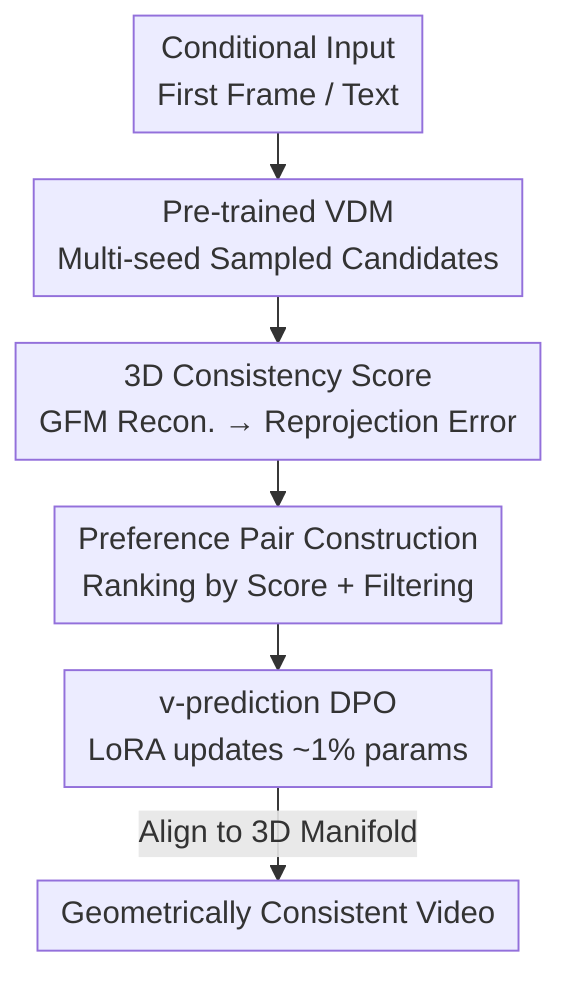

# VideoGPA: Distilling Geometry Priors for 3D-Consistent Video Generation

**Conference**: ICML 2026  
**arXiv**: [2601.23286](https://arxiv.org/abs/2601.23286)  
**Code**: https://hongyang-du.github.io/VideoGPA-Website (Project Page)  
**Area**: Video Generation / Diffusion Model Alignment  
**Keywords**: Video Diffusion Models, 3D Consistency, Geometric Foundation Models, DPO Preference Alignment, Self-supervised Reward

## TL;DR
VideoGPA utilizes a Geometric Foundation Model (GFM) to reconstruct generated videos into 3D point clouds and project them back into the original frames. It uses "reprojection error" as a self-supervised geometric consistency reward to automatically construct preference pairs. By applying DPO (fine-tuning ~1% parameters via LoRA with only ~2500 preference samples), it aligns pre-trained video diffusion models to a 3D-consistent manifold, significantly mitigating object deformation and spatial drift without compromising image quality.

## Background & Motivation
**Background**: Video Diffusion Models (VDMs), represented by CogVideoX, Wan, and HunyuanVideo, have achieved extremely realistic video generation by scaling DiT architectures and pre-training on billions of data points. The community further treats them as "data engines" for embodied AI, novel view synthesis, and physical simulation—tasks that rely on a faithful understanding of the 3D world.

**Limitations of Prior Work**: Despite being trained on massive 3D-consistent real-world videos, pre-trained VDMs frequently exhibit structural errors such as object deformation, spatial drift, and geometric collapse under significant camera motion. In other words, models have "seen" consistent data but have not learned consistent behavior.

**Key Challenge**: The authors attribute this paradox to the denoising objective itself—standard training only rewards pixel-level statistical matching without any explicit geometric regularization. Consequently, models learn to "hallucinate plausible textures" without injecting 3D consistency into the latent space.

**Goal**: To instill 3D consistency into pre-trained VDMs without retraining from scratch or relying on human annotations, while ensuring data efficiency and maintaining the original model's image quality and motion realism.

**Key Insight**: Geometric Foundation Models (GFMs, such as the DUSt3R/MASt3R/VGGT lineage) can feed-forwardly regress dense depth, camera poses, and point clouds from 2D observations, naturally carrying strong geometric priors. The authors' key observation is that for a geometrically valid video, the 3D structure reconstructed by a GFM should accurately reproject back to the original frames; otherwise, the reprojection error will soar. This provides a dense, differentiable "consistency probe" without human intervention.

**Core Idea**: Treat "GFM reprojection error" as a 3D consistency reward to automatically rank multiple videos sampled under the same conditions, construct preference pairs, and use DPO to push the generation distribution towards the 3D-consistent manifold—effectively using "reconstruction consistency" instead of "human preference" to align geometry.

## Method

### Overall Architecture
VideoGPA is a "review-and-correct" post-training alignment framework. Its core is transforming geometric supervision from a "retraining loss" into a "preference signal." The workflow is: given a conditional input (first frame or text), sample multiple candidate videos with the same semantics but varying geometric quality using a pre-trained VDM with different random seeds. For each candidate, use a GFM to detect per-frame depth and camera poses, assemble a global point cloud, and reproject the point cloud back to each frame to obtain $\hat{I}_t$. A 3D consistency score is calculated based on the reprojection reconstruction error. Candidates are ranked and paired into "winner $x^w$ / loser $x^l$" preference pairs. Finally, a Diffusion-DPO objective adapted for $v$-prediction is used to update approximately 1% of the parameters via LoRA, pushing the model towards high-consistency samples. This process does not modify the original model's backbone and requires no human annotation.

### Key Designs

**1. Reprojection Consistency Score: Turning "Geometric Correctness" into a Self-supervised Dense Reward**

This step directly addresses the lack of geometric regularization in the denoising objective. For each generated video, $T$ frames are uniformly sampled (default $T{=}10$). A GFM $\Phi$ predicts depth $D_t$ and camera pose $(R_t, t_t)$ for each frame. Each pixel $\tilde{\mathbf{u}}=[u,v,1]^\top$ is back-projected to world coordinates $\mathbf{X}_t(u,v) = R_t D_t(u,v) K^{-1}\tilde{\mathbf{u}} + t_t$, forming a colored point cloud $\mathcal{P}$. The point cloud is then reprojected back to each frame using inverse poses $E_{t,\mathrm{w2c}}=[R_t^\top \mid -R_t^\top t_t]$ and rasterized using the painter's algorithm to obtain reprojected maps $\hat{I}_t$. Finally, a standard reconstruction loss measures the discrepancy with the original frames:

$$E_{\mathrm{Recon}}=\frac{1}{T}\sum_{t=1}^{T}\Big(\mathrm{MSE}(\hat{I}_t, I_t)+\lambda\,\mathrm{LPIPS}(\hat{I}_t, I_t)\Big)$$

The elegance lies in "self-consistency": if the video geometry is valid, all frames must share a single 3D interpretation, resulting in low reprojection error. Any drift, collapse, or perspective distortion prevents a single 3D structure from explaining all views, causing the error to spike. This signal is dense, differentiable, and more robust than sparse pairwise constraints.

**2. DPO for v-prediction Video Diffusion: Injecting Preference Signals into the Denoising Manifold**

Mainstream video DiTs generally use $v$-prediction parameterization (target velocity $v_t \equiv \dot{x}_t = \alpha_t \epsilon - \sigma_t x_0$). The authors adapt Diffusion-DPO to this parameterization. Defining the velocity error energy term for sample $x$ as $\mathcal{E}(\theta,x,t)=\|v_t - v_\theta(x_t,t,c)\|^2$, the log-likelihood ratio of the policy relative to the reference policy is proportional to $\mathbb{E}_{t,\epsilon}[\mathcal{E}(\mathrm{ref},x,t)-\mathcal{E}(\theta,x,t)]$. Substituting into the Bradley-Terry/DPO framework yields the final objective:

$$\mathcal{L}_{\mathrm{DPO}}=-\mathbb{E}\Big[\log\sigma\big(\beta([\mathcal{E}(\mathrm{ref},x^w,t)-\mathcal{E}(\theta,x^w,t)] - [\mathcal{E}(\mathrm{ref},x^l,t)-\mathcal{E}(\theta,x^l,t)])\big)\Big]$$

During training, each preference pair $(x^w,x^l)$ shares the same noise $\epsilon$ and timestep $t$ to ensure a consistent optimization baseline, ensuring gradients reflect differences in geometric quality rather than sampling noise. The advantage over "retraining with direct geometric loss" is that it is an offline, stable preference objective that requires no iterative sampling and works with only ~1% LoRA parameters.

**3. Geometry-Isolated Preference Pair Construction: Making Geometry the Sole Differentiator**

The quality of DPO depends on "clean" preference pairs. The authors deliberately keep video semantics identical while varying only geometry, isolating geometry as the sole preference signal. In the I2V setting, the first frame of DL3DV-10K is used as a visual prompt, combined with 2–3 randomly sampled camera motion primitives (e.g., "zoom out," "side roll," "orbit") to create structured motion prompts. This intentionally generates large camera trajectories prone to exposing geometric inconsistencies while fixing scene content. In the T2V setting, captions generated by CogVLM2-Video are used as text prompts, introducing higher semantic diversity. For each prompt, candidates are ranked by 3D consistency score; pairs are formed only when the geometric gap is sufficient, and samples that are static, poor in overall quality, or have negligible score differences are pruned to ensure stable training signals. Notably, natural descriptive narrative prompts are used during evaluation (unlike the scripted motion prompts used in training), with no observed overfitting to script formats.

### Loss & Training
The base models are CogVideoX-5B (I2V/T2V) and CogVideoX1.5-5B (for comparison with GeoVideo), fine-tuned with LoRA (rank $r{=}64$, $\alpha{=}128$, ~1% parameters). Training was conducted on 8×A100 with AdamW, peak learning rate $5\times10^{-6}$, cosine decay, 500-step warm-up, and batch size 16. Standard configuration was trained for 10,000 steps, while the comparison with GeoVideo used only 1,500 steps. The 8K/9K/10K/11K subsets of DL3DV-10K were used for training, and the 1K subset for evaluation. All reprojection-based metrics use Depth Anything V3 as a backbone to avoid cyclic evaluation bias (i.e., "training with GFM and evaluating with GFM").

## Key Experimental Results

### Main Results
Under both I2V and T2V settings, VideoGPA leads across all 3D consistency metrics, and the VideoReward human alignment win rate is significantly higher than the baseline (the table below shows CogVideoX-I2V-5B / CogVideoX-5B base; arrows indicate higher/lower is better).

| Setting / Method | PSNR ↑ | SSIM ↑ | LPIPS ↓ | MVCS ↑ | 3DCS ↓ | Epipolar ↓ | VideoReward-OVL Win Rate |
|------------|--------|--------|---------|--------|--------|-----------|------|
| I2V Baseline | 22.85 | 0.786 | 0.476 | 0.945 | 0.485 | 0.585 | — |
| I2V SFT | 21.58 | 0.749 | 0.513 | 0.947 | 0.524 | 0.640 | 35.0% |
| I2V Epipolar-DPO | 21.38 | 0.773 | 0.475 | 0.944 | 0.487 | 0.545 | 66.0% |
| **I2V VideoGPA** | 21.24 | 0.779 | **0.473** | **0.950** | **0.483** | **0.539** | **76.0%** |
| T2V Baseline | 21.47 | 0.784 | 0.435 | 0.944 | 0.445 | 0.584 | — |
| T2V Epipolar-DPO | 21.58 | 0.791 | 0.434 | 0.953 | 0.443 | 0.579 | 48.67% |
| **T2V VideoGPA** | 21.24 | **0.803** | **0.411** | **0.953** | **0.422** | **0.548** | **60.33%** |

On I2V, MVCS increased from 0.945 to 0.950, and Epipolar decreased from 0.585 to 0.539. The OVL win rate of 76% significantly outperforms Epipolar-DPO (66%) and SFT (35%). On T2V, SSIM/LPIPS/3DCS/Epipolar are similarly optimal without degradation in image quality.

### Ablation Study
Compared to GeoVideo (based on CogVideoX1.5-5B), which uses explicit geometric supervision, VideoGPA achieves superior geometric consistency and human alignment with only 1,500 steps of lightweight post-training. A human blind test further corroborates that the gains are perceptible.

| Comparison | Epipolar ↓ | MVCS ↑ | VideoReward-OVL | Remarks |
|--------|-----------|--------|-----------------|------|
| GeoVideo (~10K videos + depth sup.) | 0.875 | 0.819 | 18.06% | Recon↑ but quality degrades significantly |
| **VideoGPA (1,500 steps)** | **0.567** | **0.982** | **57.64%** | No quality loss, superior geometry |
| Human Blind Test (25 persons × 20 groups, I2V) | — | — | **53.5% Preferred** | Epipolar-DPO only 22.4% |

### Key Findings
- "Geometry isolation" in preference pairs is critical: by fixing semantics and varying only geometry, DPO can direct signals towards consistency. Pruning static, low-quality, or small-gap samples is vital for stability.
- Significant improvements are achieved with only ~2,500 preference pairs and ~1% LoRA parameters, suggesting that geometric consistency behaves more like a capability that "needs to be awakened via alignment" rather than "learned from scratch."
- Although optimized for geometric consistency (mostly in static scenes), the model also improves dynamic motion coherence (higher MQ win rate). The authors explain that geometry acts as a regularizer; by projecting generation onto a physically feasible manifold, the model's motion priors can focus on object dynamics rather than "hallucinatory spatial corrections."

## Highlights & Insights
- **Reprojection Consistency as Reward**: Transforming "3D correctness" into the self-supervised probe of "reprojection error magnitude" bypasses human labeling and sparse geometric constraints. The signal is dense and differentiable—a clean paradigm for using GFM as a "geometric judge."
- **Scene-level Global Constraints > Local Pairwise Constraints**: Local constraints like Epipolar-DPO are effective for minor errors, but degenerated samples (e.g., texture collapse, frozen regions) can satisfy sparse epipolar constraints, leading to "false positives." VideoGPA requires all frames to share a single 3D interpretation; global reprojection error correctly rejects samples that are locally consistent but globally invalid.
- **Geometry as Motion Regularization**: By fixing the "stage" (projective geometry of the background and camera trajectory), the model better decouples camera motion from object motion, releasing capacity for authentic object dynamics—"fixing the scene geometry makes the actors perform better." This transfer perspective is highly insightful for other generative tasks like 4D or world models.

## Limitations & Future Work
- The geometric probe depends on GFM reconstruction quality. In scenarios where the GFM itself yields inaccurate reconstructions (high dynamics, transparent/reflective surfaces, extremely weak textures), the consistency score may be distorted. The paper intentionally focuses geometric alignment on primarily static scenes.
- Training uses DL3DV-10K (static scans). While OOD/Wan2.2 experiments in the appendix support generalization, the effectiveness on highly dynamic or multi-object interaction scenes could be further investigated.
- It only mitigates geometric inconsistency and does not explicitly model physics (collisions, rigid body dynamics). Extending reprojection rewards to preference signals with explicit physical constraints is a natural next step.
- Filtering strategies, such as the "sufficient score gap" threshold for DPO pairs and the motion primitive vocabulary, rely heavily on empirical settings, the sensitivity of which is not fully explored in the main text.

## Related Work & Insights
- **vs Epipolar-DPO (Kupyn et al., 2025)**: Both use DPO, but while the former uses sparse pairwise epipolar error as the preference signal, this work uses global reprojection scene-level consistency scores to avoid false positives from global collapse. VideoGPA is superior in consistency and win rate for both I2V/T2V.
- **vs GeoVideo (Bai et al., 2025)**: It adds explicit geometric consistency loss during the SFT stage, requiring ~10K videos with depth supervision and resulting in significant quality degradation. VideoGPA uses preference alignment and 1,500 steps of lightweight post-training, achieving better geometry without quality loss—demonstrating the balance of "preference alignment > explicit supervision."
- **vs Diffusion-DPO (Wallace et al., 2024)**: This work adapts it from image/$\varepsilon$-prediction to video $v$-prediction and replaces human feedback with self-supervised geometric reconstruction signals.

## Rating
- Novelty: ⭐⭐⭐⭐⭐ Transforming GFM reprojection error into a self-supervised geometric preference signal for VDM alignment via DPO is a clean and novel approach.
- Experimental Thoroughness: ⭐⭐⭐⭐ Extensive multi-baseline, multi-metric I2V/T2V evaluations + human blind tests + comparisons with SFT/Epipolar-DPO/GeoVideo. OOD/Wan2.2 results are mostly in the appendix.
- Writing Quality: ⭐⭐⭐⭐⭐ The flow from motivation to method to discussion is seamless; the analyses on "scene-level vs local" and "geometry as motion regularization" are particularly clear.
- Value: ⭐⭐⭐⭐⭐ A data-efficient, plug-and-play geometric alignment paradigm with significant practical implications for video generation as world models or data engines.

<!-- RELATED:START -->

## Related Papers

- [\[CVPR 2026\] Geometry-as-context: Modulating Explicit 3D in Scene-consistent Video Generation to Geometry Context](../../CVPR2026/video_generation/geometry-as-context_modulating_explicit_3d_in_scene-consistent_video_generation_.md)
- [\[ICML 2026\] CamGeo: Sparse Camera-Conditioned Image-to-Video Generation with 3D Geometry Prior](camgeo_sparse_camera-conditioned_image-to-video_generation_with_3d_geometry_prio.md)
- [\[CVPR 2026\] WorldReel: 4D Video Generation with Consistent Geometry and Motion Modeling](../../CVPR2026/video_generation/worldreel_4d_video_generation_with_consistent_geometry_and_motion_modeling.md)
- [\[CVPR 2025\] Learning Temporally Consistent Video Depth from Video Diffusion Priors](../../CVPR2025/video_generation/learning_temporally_consistent_video_depth_from_video_diffusion_priors.md)
- [\[ICCV 2025\] NormalCrafter: Learning Temporally Consistent Normals from Video Diffusion Priors](../../ICCV2025/video_generation/normalcrafter_learning_temporally_consistent_normals_from_video_diffusion_priors.md)

<!-- RELATED:END -->
