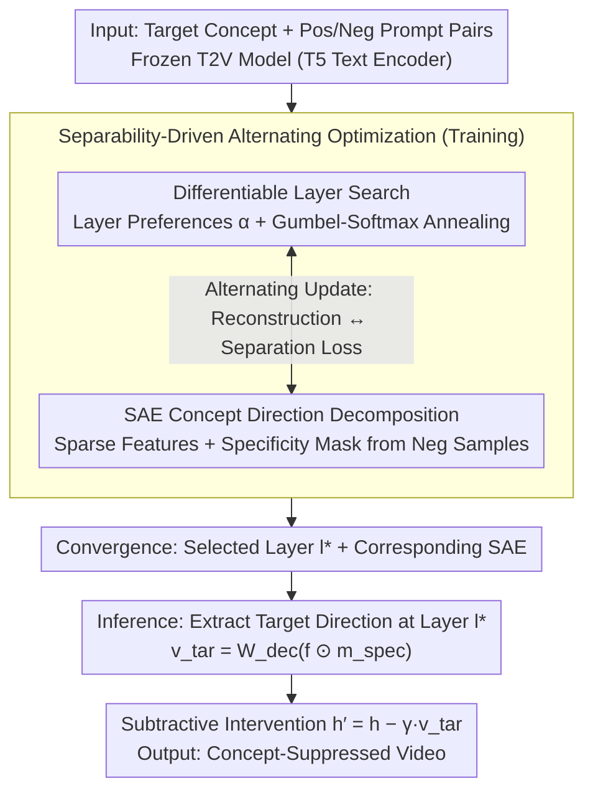

# Where Concept Erasure Should Occur: Concept-Layer Alignment in Text-to-Video Diffusion Models

**Conference**: ICML 2026  
**arXiv**: [2605.25941](https://arxiv.org/abs/2605.25941)  
**Code**: No public code  
**Area**: Video Generation / Diffusion Model Safety  
**Keywords**: Text-to-Video Diffusion, Concept Erasure, Layer Selection, Sparse Autoencoder, Safety Generation  

## TL;DR
This paper discovers that target concepts in text-to-video (T2V) diffusion models are most separable only at specific depths. It proposes CLEAR, which utilizes Gumbel-Softmax to learn "where to erase" and Sparse Autoencoders (SAE) to learn "which concept direction to erase," enabling precise suppression of target concepts while preserving video quality without modifying diffusion model weights.

## Background & Motivation
**Background**: Large-scale text-to-video models can generate high-quality, temporally consistent videos but may also produce copyrighted styles, celebrity identities, nudity, or other undesirable concepts. Existing concept erasure methods are generally categorized into two types: inference-time negative prompting/safety guidance, and training-time fine-tuning or closed-form weight modification.

**Limitations of Prior Work**: Many methods assume that concept erasure can be applied at fixed layers or any arbitrary layer, or focus only on "which features to erase," rarely studying the "optimal depth for erasure" systematically. However, the semantic representations in Diffusion Transformers are non-uniform across depths; different concepts become separable only at specific layers.

**Key Challenge**: Erasing at layers that are too shallow fails to intervene effectively as the target concept has not yet diverged from background semantics. Conversely, erasing too deep may cause semantic leakage or quality degradation as the target concept has already blended with the generative structure. Safety generation requires precise suppression of target concepts without damaging non-target content or video quality.

**Goal**: The authors aim to transform concept erasure from a fixed-layer heuristic into a learnable problem: automatically discovering the layer where the target concept is most separable from non-target semantics and performing localized intervention using feature-level directions only at that tier.

**Key Insight**: The paper proposes "concept-layer topological alignment," referring to the phenomenon where target concepts form more linearly separable and easily isolated subspaces at certain model depths. This observation transforms "layer selection" into an optimization objective based on concept-non-target separability.

**Core Idea**: CLEAR simultaneously learns the intervention layer and the concept direction. It uses Gumbel-Softmax for differentiable search of the layer index and a Sparse Autoencoder to decompose activations and construct specificity masks. During inference, it subtracts the target concept vector only at the selected layer.

## Method
The core of CLEAR is not to retrain the video diffusion model but to insert a learnable concept erasure module into the frozen T5 text encoder. During training, the system uses positive prompts of the target concept and contextually similar negative prompts to compare activation separability across layers. During inference, the model selects the most suitable layer, projects its activations into the SAE sparse space, extracts the direction specific to the target concept, and subtracts this direction from the original activations.

### Overall Architecture
The input consists of the target concept, positive/negative prompt pairs, and a pre-trained T2V diffusion model. During training, it maintains a set of depth preference parameters $\alpha_1, \dots, \alpha_L$ representing the suitability of each layer for erasure. Simultaneously, an SAE is trained to decompose dense activations into a sparser, more semantic feature space. The optimization objective requires the SAE to reconstruct activations while ensuring high target-specific energy and low non-target shared energy in the selected layer.

Upon completion, the layer distribution converges to $l^* = \arg\max_l \alpha_l$. During inference, the SAE module is attached only to this selected layer without updating diffusion weights. Given a hidden state $h_{l^*}$, CLEAR encodes it into sparse features, retains features related to the target concept via a specificity mask, decodes them back to the model space to form $v_{tar}$, and performs $h'_{l^*} = h_{l^*} - \gamma v_{tar}$.

### Key Designs

**1. Differentiable Layer Search: Making "Where to Erase" a Learnable Variable**

This step corresponds to the source of the selected layer $l^*$ in the framework. Traditional methods treat the erasure layer as a fixed hyperparameter or rely on manual layer-by-layer exhaustive search. However, the paper finds that different concepts become separable at different depths. CLEAR maintains preference parameters $\boldsymbol{\alpha} = (\alpha_1, \dots, \alpha_L)$ for all candidate layers and uses Gumbel-Softmax sampling to approximate one-hot layer weights $p_k = \frac{\exp((\log\alpha_k+g_k)/\tau)}{\sum_j\exp((\log\alpha_j+g_j)/\tau)}$ (where $g_k$ is Gumbel noise). As the temperature $\tau$ anneals during training, the soft distribution converges to a deterministic layer choice $l^* = \arg\max_l \alpha_l$. Layer selection is thus driven by backpropagation from the separability objective to the depth where the target concept is most naturally isolated.

**2. SAE Concept Direction Decomposition: Separating Target Concepts from Shared Semantics**

This corresponds to the SAE module in the architecture, addressing "which direction to erase without harming the background." Directly modifying dimensions of dense activations often causes collateral damage due to polysemy. CLEAR uses a Sparse Autoencoder (SAE) to encode activations $h$ into sparse features $f = \text{ReLU}(W_{enc}h + b_{enc})$. Using contextually similar negative prompts lacking the target concept, it constructs a shared mask $m_{shared}$, and its inverse becomes the specificity mask $m_{spec} = 1 - m_{shared}$. Features rarely appearing in non-target contexts are identified as the target concept direction, effectively disentangling "target concepts" from "shared visual semantics" in the sparse space.

**3. Separability-Driven Alternating Optimization and Inference-Time Subtraction: Adapting Layers to Directions**

This closed-loop process bonds the previous designs. Training alternates between two steps: fixing layer preferences while the SAE minimizes weighted reconstruction error and sparsity penalties; and fixing the SAE while updating layer preferences via a contrastive separation loss $\mathcal{L}_{con} = \log(1 + S_{uni} / (S_{spe} + \epsilon))$, which penalizes cases where shared/non-target energy $S_{uni}$ is too strong relative to concept-specific energy $S_{spe}$. Without the separation signal, layer search would favor stable but entangled layers; with it, it favors layers where concepts are naturally separable. At inference, no weights are updated; only the target direction $v_{tar} = W_{dec}(f \odot m_{spec})$ is subtracted from the hidden state. This makes CLEAR more potent than negative prompting but more localized than weight fine-tuning.

### Loss & Training
The training objective comprises two parts. The first is the SAE reconstruction and sparsity loss, which encourages activations under the current layer preference weighting to be reconstructed by sparse features. The second is the contrastive separation loss, which penalizes high shared/non-target energy relative to concept-specific energy. During optimization, layer preferences and SAE parameters are updated alternately with Gumbel-Softmax temperature annealing to obtain the optimal layer and SAE module for each independent concept.

A crucial detail is that CLEAR does not update the primary T2V model weights; it only locally modifies the hidden states of the text encoder during inference. This makes it more robust than pure negative prompts and less destructive than weight modification.

## Key Experimental Results

### Main Results
Evaluation was conducted on Wan2.2-5B and CogVideoX-2B. Target concepts included common objects, safety-sensitive concepts, celebrity identities, and artistic styles. The core metric is the Generative Rate (lower is better), alongside Overall Consistency, Imaging Quality, Aesthetic Quality, and Motion Smoothness.

| Model / Concept | Metric | CLEAR | Prev. SOTA | Gain |
| :--- | :--- | :--- | :--- | :--- |
| Wan2.2-5B, 10 Objects Avg | Generative Rate ↓ | 12.8% | T2VUnlearning 24.5% / SAFREE 28.1% | ~50% reduction in residual rate |
| Wan2.2-5B, French horn | Generative Rate ↓ | 7.8% | T2VUnlearning 26.4% / SAFREE 28.6% | More thorough erasure |
| Wan2.2-5B, Quality | Imaging Quality ↑ | 0.7025 | Origin 0.6910 / T2VUnlearning 0.6652 | Slight fidelity improvement |
| CogVideoX-2B, 10 Objects Avg | Generative Rate ↓ | 7.1% | T2VUnlearning 7.4% / SAFREE 14.6% | Lowest residual rate |
| CogVideoX-2B, Quality | Imaging Quality ↑ | 0.4683 | T2VUnlearning 0.3907 | Prevents quality collapse |

### Ablation Study
The study extended beyond object concepts to investigate harder categories like sensitive concepts, identities, and styles. Representative results for nudity and celebrity erasure:

| Configuration | Key Metric | Description |
| :--- | :--- | :--- |
| Wan2.2-5B, Nudity (Origin) | GR 67.3%, Imaging 0.6913 | High probability of sensitive content |
| Wan2.2-5B, NegPrompt / SAFREE | GR 55.5% / 48.7% | Inference guidance fails to suppress deep concepts |
| Wan2.2-5B, T2VUnlearning | GR 18.6%, Imaging 0.6737 | Strong erasure but weaker than CLEAR |
| Wan2.2-5B, CLEAR | GR 11.1%, Imaging 0.6928 | Lowest residue with original quality |
| Wan2.2-5B, Celebrity Avg | CLEAR 0.0151 vs. T2VUnlearning 0.0215 | Lower identity similarity indicates local erasure |
| CogVideoX-2B, Nudity | CLEAR 14.63% vs. VideoEraser 19.22% | Robust safety erasure across architectures |

### Key Findings
- Concept erasure is highly sensitive to layer position. The Generative Rate follows a V-shaped curve across layers; deviating from the optimal depth leads to either semantic residue or quality loss.
- CLEAR outperforms T2VUnlearning on Wan2.2-5B with better image quality. On CogVideoX-2B, while T2VUnlearning reduces residues, image quality drops significantly to 0.3907, indicating that weight-level modification more easily harms smaller models.
- For highly entangled concepts like nudity or celebrity identities, CLEAR significantly suppresses detection rates where negative prompting and SAFREE fail, proving that "optimal layer + sparse direction" is more reliable than simple prompt steering.

## Highlights & Insights
- The most valuable observation is that "where a concept is separable" is an intrinsic part of the erasure problem. CLEAR upgrades layer selection from a hyperparameter to a primary optimization variable.
- The use of SAE is disciplined: it is not for feature visualization but specifically for controllable intervention, disentangling target-specific energy from shared semantic energy.
- Not modifying the primary model weights is a major engineering advantage. For safety filtering and copyright protection, local activation intervention is cheaper and more modular than fine-tuning an entire T2V model.

## Limitations & Future Work
- CLEAR requires training an independent SAE and layer search module for each concept, which incur maintenance costs as concepts proliferate.
- The experiments rely on pre-trained concept detectors. Potential detector misses or lack of coverage for specific video frames impacts erasure metrics.
- The method currently focuses on the text encoder layers; the representation and leakage of temporal semantics within the video diffusion backbone remain to be analyzed.
- Robustness against compositional concepts, multilingual prompts, or adversarial jailbreak prompts requires further verification.

## Related Work & Insights
- **vs. NegPrompt / Safety Guidance**: Negative prompts only change signals at the input; CLEAR intervenes in internal concept directions, offering stronger inhibition.
- **vs. T2VUnlearning**: Weight-level unlearning permanently changes the model but may harm non-target quality; CLEAR avoids weight modification to minimize side effects.
- **vs. SAE-based T2I Erasure**: While previous SAE methods focus on "which features," this work emphasizes the equal importance of "which layer," particularly for the non-uniform representations in T2V models.
- **Transferable Insights**: Concept-layer alignment could be adapted for style editing, identity protection, and copyright filtering, as well as safety control in multimodal LLMs.

## Rating
- **Novelty**: ⭐⭐⭐⭐☆ Systematizing layer selection as a differentiable optimization is a clear and insightful perspective.
- **Experimental Thoroughness**: ⭐⭐⭐⭐☆ Covers two architectures and various concept types; metrics balance erasure and quality.
- **Writing Quality**: ⭐⭐⭐⭐☆ Clear motivation and pipeline; figures effectively demonstrate layer importance.
- **Value**: ⭐⭐⭐⭐☆ Highly practical for T2V safety generation, especially in deployment scenarios where weight modification is restricted.

<!-- RELATED:START -->

## Related Papers

- [\[CVPR 2026\] Composing Concepts from Images and Videos via Concept-prompt Binding](../../CVPR2026/video_generation/composing_concepts_from_images_and_videos_via_concept-prompt_binding.md)
- [\[ICLR 2026\] MoAlign: Motion-Centric Representation Alignment for Video Diffusion Models](../../ICLR2026/video_generation/moalign_motion-centric_representation_alignment_for_video_diffusion_models.md)
- [\[ICML 2026\] Exploring Data-Free LoRA Transferability for Video Diffusion Models](exploring_data-free_lora_transferability_for_video_diffusion_models.md)
- [\[CVPR 2026\] Inference-time Physics Alignment of Video Generative Models with Latent World Models](../../CVPR2026/video_generation/inference-time_physics_alignment_of_video_generative_models_with_latent_world_mo.md)
- [\[ICML 2026\] LocoT2V-Bench: Benchmarking Long-form and Complex Text-to-Video Generation](locot2v-bench_benchmarking_long-form_and_complex_text-to-video_generation.md)

<!-- RELATED:END -->
