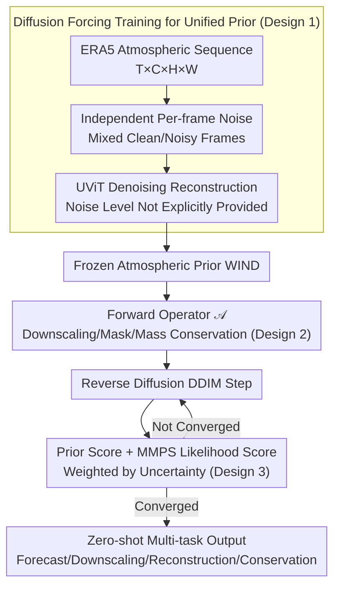

# WIND: Weather Inverse Diffusion for Zero-Shot Atmospheric Modeling

**Conference**: ICML2026  
**arXiv**: [2602.03924](https://arxiv.org/abs/2602.03924)  
**Code**: No public code found  
**Area**: Scientific Computing / Atmospheric Modeling / Diffusion Models  
**Keywords**: Meteorological foundation models, inverse problems, diffusion forcing, posterior sampling, physical constraints  

## TL;DR
WIND models the global atmospheric sequence as an unconditional video diffusion prior. During inference, it formulates forecasting, downscaling, sparse reconstruction, mass conservation, and warming scenarios as differentiable inverse problems, solving multiple classes of weather and climate tasks zero-shot using a single frozen model.

## Background & Motivation
**Background**: AI weather forecasting has established an efficient route beyond traditional Numerical Weather Prediction (NWP), with models like GraphCast and GenCast providing strong results on specific prediction tasks. Meanwhile, downstream needs in atmospheric science extend far beyond medium-range forecasting to include spatial downscaling, temporal downscaling, sparse observation completion, long-term climate scenarios, and physical conservation constraints.

**Limitations of Prior Work**: The current ecosystem is fragmented. A model is often trained for a single task: forecasting models for prediction, downscaling models for resolution enhancement, and reconstruction models for observation completion. Switching tasks requires retraining or fine-tuning, which is not only costly but also makes it difficult to ensure a shared atmospheric physical prior across tasks.

**Key Challenge**: The atmospheric system requires strong probabilistic generation capabilities while needing to be stably guided by external physical or observational constraints. Pure autoregressive models accumulate errors during long rollouts; standard full-sequence diffusion models struggle to mix clean frames from the previous window with noisy future frames; and conditional diffusion losing the universality of a foundation model if trained separately for every task.

**Goal**: The authors aim to train a single atmospheric generative prior that performs multiple weather/climate tasks during inference solely through changes in the forward operator, without task-specific fine-tuning. In other words, the training phase learns "what a reasonable atmospheric sequence looks like," and the inference phase informs the model "what observations or physical conditions must be met."

**Key Insight**: The paper treats atmospheric data as a video: variables are channels, time steps are frames, and the global grid corresponds to spatial dimensions. During training, it uses diffusion forcing to assign independent noise levels to each frame. During inference, it employs Moment Matching Posterior Sampling (MMPS) to estimate the observation likelihood gradient, injecting arbitrary differentiable constraints into the reverse diffusion process.

**Core Idea**: To train an atmospheric video diffusion prior capable of mixing clean and noisy frames via diffusion forcing, and then unify all downstream tasks as inverse problems of the form $Y=\mathcal{A}(X)+\eta$, with constraints applied by MMPS during the sampling process.

## Method
The WIND approach resembles "learning an atmospheric world model first, then formulating tasks as observation equations." The model itself does not recognize specific tasks like forecasting or downscaling; these differences are encapsulated within the inference-time operator $\mathcal{A}$.

### Overall Architecture
The training data comes from ERA5 at 1.5-degree resolution, covering 70 atmospheric variables with sequences of length 5 at 6-hour intervals. The backbone is a UViT, with inputs and outputs in the form of atmospheric state sequences $T\times C\times H\times W$. During training, independent noise levels are sampled for each frame, transforming a clean atmospheric sequence into a partially corrupted one, which the UViT then reconstructs.

During inference, given a task observation $Y$ and a forward operator $\mathcal{A}$—for example, $\mathcal{A}$ is average pooling for spatial downscaling, a temporal mean for temporal downscaling, a binary mask for sparse reconstruction, or a non-linear calculation for Dry Air Mass (DAM) conservation. In each step of the reverse diffusion, WIND provides a prior score, while MMPS provides a likelihood score based on the difference between $\mathcal{A}(\hat X)$ and the target $Y$. Samples are updated using the sum of these scores.

### Key Designs

**1. Diffusion Forcing for a Unified Prior**: Autoregressive weather generation requires appending the last frame of the previous window (clean context) to the start of the next window. However, standard video diffusion assigns the same noise level to all frames; once the model encounters an out-of-distribution "mixture of clean and noisy frames," long rollouts diverge. WIND utilizes diffusion forcing: it independently samples noise levels $k^t$ for each time step, with the forward process $z^t=\alpha(k^t)x^t+\beta(k^t)\epsilon^t$. This trains the model on arbitrary "clean/noisy" combinations. During inference, known history is treated as clean and the future as noisy, supporting stable rollouts of arbitrary length. Crucially, the model **does not explicitly receive the noise level** and must infer uncertainty for each frame from the input state, learning more robust spatio-temporal representations.

**2. Formulating Tasks as Differentiable Inverse Problems**: Traditional approaches train separate models for forecasting, downscaling, and reconstruction. WIND unifies these into a single inverse problem $Y=\mathcal{A}(X)+\eta$—recovering a complete state $X$ that satisfies the atmospheric prior from partial observations $Y$. Task differences are embedded in the forward operator $\mathcal{A}$: spatial downscaling uses $\mathcal{A}(X)=\mathrm{AvgPool}(X)$, temporal downscaling uses $\mathcal{A}(X)=\frac{1}{T}\sum_t x^t$, sparse reconstruction uses $\mathcal{A}(X)=M\odot X$, and physical conservation uses non-linear integral formulas. Thus, the same frozen model generalizes zero-shot to various tasks by simply switching $\mathcal{A}$.

**3. MMPS Guidance instead of Point-Estimate Constraints**: A difficulty in injecting constraints into reverse diffusion is that the likelihood term $p(X|Z)$ lacks a closed-form solution. Standard Diffusion Posterior Sampling (DPS) approximates it as a Dirac delta at the current prediction, ignoring model uncertainty, which can cause observation gradients to distort the prior at high noise levels. WIND uses Moment Matching Posterior Sampling (MMPS), approximating $p(X|Z)$ as a Gaussian distribution with covariance estimated via Tweedie covariance. This allows the prior to dominate when noise is high/prediction is unreliable, and strengthens likelihood guidance when noise is low/prediction is reliable, enabling stable application of high-dimensional or non-linear atmospheric constraints.

### Loss & Training
The training objective is denoising score matching / clean sequence reconstruction. The model learns to recover atmospheric states from sequences with varied noise level combinations. It uses 5-frame windows, 6-hour intervals, 70 variables, and a 1.5-degree ERA5 grid. Inference utilizes DDIM-style updates, incorporating the MMPS likelihood score for constrained tasks. Forecasting, downscaling, and physical constraints are all performed at inference without task-specific fine-tuning.

## Key Experimental Results

### Main Results
The main results demonstrate the model's cross-task capability rather than a single leaderboard score. For medium-range forecasting, WIND is more stable than autoregressive diffusion baselines on WeatherBench2, though its absolute CRPS at 1.5 degrees does not aim to beat specialized high-resolution models. For downscaling and reconstruction, WIND's advantages lie in spectral consistency and physical alignment without task-specific training.

| Task | Evaluation Setup | WIND Results | Comparison | Conclusion |
|------|----------|----------|----------|----------|
| 14-day Prob. Forecast | 24 initial states (2021), 10 members, CRPS/SSR | CRPS better than AR-UViT after several days; SSR approaches 1 | AR-UViT | Diffusion forcing is more stable and avoids variable overshoot |
| WeatherBench2 24h T2m | CRPS ↓ | 0.286 | GenCast 0.209, IFS ENS 0.396 | Low-res general prior is weaker than specialized GenCast but better than IFS ENS |
| Spatial Downscaling | 6° to 1.5°, RMSE/PSD | Temp 0.63, Geopotential 45.17, MSLP 42.68 | Specialized UViT/FNO | RMSE often lower than UViT; spectral high-freq details better than FNO |
| 1% Sparse Recon | 1% obs points, RMSE | Temp 0.65, Geopotential 48.64, MSLP 47.12 | UViT/Kriging | Better than specialized UViT for most variables; less over-smoothed than Kriging |
| 4-year DAM Rollout | Dry air mass stability | Strictly maintains target DAM | Unconstrained WIND | Physical constraints prevent mass drift after ~200 days |

### Ablation Study

| Configuration | Key Indicator | Explanation |
|------|---------|------|
| Without DAM guidance | DAM drift after ~200 days in 4-year rollout | Pure data-driven generation eventually deviates from physical conservation |
| With DAM guidance | DAM maintained for entire 4-year rollout | MMPS can enforce hard physical constraints without retraining |
| Warming Free Run | Storm Bernd +2K/+14% humidity | The model diffuses OOD thermal anomalies back to the training climatology |
| Warming Guided Run | Peak precip. enhancement +13.9% | Matches Clausius-Clapeyron expectation of ~+14% |
| Spatial Downscaling UViT | Lowest RMSE in most cases | Task-specifically trained models excel at minimizing pixel-wise error |
| WIND Downscaling | PSD closer to ERA5, Pearson consistency 0.96 | General prior better preserves high-frequency and physical statistiscal structures |

### Key Findings
- A single frozen model can cover multiple task classes by switching $\mathcal{A}$, proving "meteorological foundation model + inverse problem inference" is more flexible than "specialized model per task."
- While focus on RMSE does not always favor WIND over specialized UViT, its spectra and distributions are closer to ERA5, particularly reducing high-frequency smoothing seen in deterministic models.
- Sparse reconstruction highlights the value of the foundation prior: where specialized models struggle with 1% observations, WIND completes unobserved regions using the global atmospheric prior.
- Physical constraints behave as plug-and-play guidance at inference rather than soft regularization during training, making long-term mass conservation and warming scenarios controllable.

## Highlights & Insights
- The most elegant aspect is the unity: forecasting, downscaling, reconstruction, mass conservation, and warming scenarios are all different operators within the same posterior sampling framework.
- Diffusion forcing aligns perfectly with meteorological rollout requirements, solving the critical issue in video diffusion of how to naturally handle mixed "known past and unknown future" noise states.
- MMPS incorporates uncertainty into guidance strength. For chaotic atmospheric dynamics, this is more principled than simple point-estimate DPS.
- The paper suggests that for climate scenarios, the ability to apply new physical constraints zero-shot is potentially more important than minor RMSE leads on fixed benchmarks.

## Limitations & Future Work
- WIND uses 1.5-degree ERA5, and the authors acknowledge it is not yet competing with 0.25-degree operational forecasting SOTA. Scaling will require higher resolution and larger models.
- Many results are illustrated through spectra and plots; while superior in physical consistency, specialized models often still lead in pixel-wise RMSE. Systematic evaluation of local risks and water/energy closure is needed.
- MMPS guidance adds inference cost, especially for constraints requiring conjugate gradient solvers. Long climate simulations with large ensembles remain computationally expensive.
- Warming experiments use simplified global thermal perturbations (+2K, +14% humidity), which are sufficient for mechanism verification but far from real localized climate change scenarios.

## Related Work & Insights
- **vs GenCast/GraphCast**: These are optimized for medium-range forecasting. WIND's strength is unified inverse inference and zero-shot task transfer.
- **vs full-sequence diffusion**: Standard full-sequence diffusion cannot naturally continue a clean context; WIND's per-frame independent noise training is better suited for rolling generation.
- **vs FNO/UViT downscaling**: Specialized models may minimize RMSE but often at the cost of smoothed predictions; WIND prioritizes spectral and distributional physical realism.
- **vs PINNs**: While traditional PINNs bake laws into the loss or architecture, WIND applies constraints via operator guidance during inference, offering higher flexibility.

## Rating
- Novelty: ⭐⭐⭐⭐⭐ Naturally unifies diffusion forcing, MMPS, and atmospheric multi-task inverse problems.
- Experimental Thoroughness: ⭐⭐⭐⭐☆ Covers many tasks including long rollouts and OOD warming; however, resolution remains at proof-of-concept levels.
- Writing Quality: ⭐⭐⭐⭐☆ Clear methodology and helpful diagrams; results are somewhat distributed between main text and appendix.
- Value: ⭐⭐⭐⭐☆ Highly insightful for scientific foundation models and climate AI; currently serves as a strong research framework.

<!-- RELATED:START -->

## Related Papers

- [\[CVPR 2025\] Zero-1-to-A: Zero-Shot One Image to Animatable Head Avatars Using Video Diffusion](../../CVPR2025/video_generation/zero-1-to-a_zero-shot_one_image_to_animatable_head_avatars_using_video_diffusion.md)
- [\[CVPR 2026\] Scaling Zero-Shot Reference-to-Video Generation](../../CVPR2026/video_generation/scaling_zero-shot_reference-to-video_generation.md)
- [\[CVPR 2026\] StoryTailor: A Zero-Shot Pipeline for Action-Rich Multi-Subject Visual Narratives](../../CVPR2026/video_generation/storytailora_zero-shot_pipeline_for_action-rich_multi-subject_visual_narratives.md)
- [\[CVPR 2026\] Are Image-to-Video Models Good Zero-Shot Image Editors?](../../CVPR2026/video_generation/are_image-to-video_models_good_zero-shot_image_editors.md)
- [\[ECCV 2024\] DreamMotion: Space-Time Self-Similar Score Distillation for Zero-Shot Video Editing](../../ECCV2024/video_generation/dreammotion_space-time_self-similar_score_distillation_for_zero-shot_video_editi.md)

<!-- RELATED:END -->
