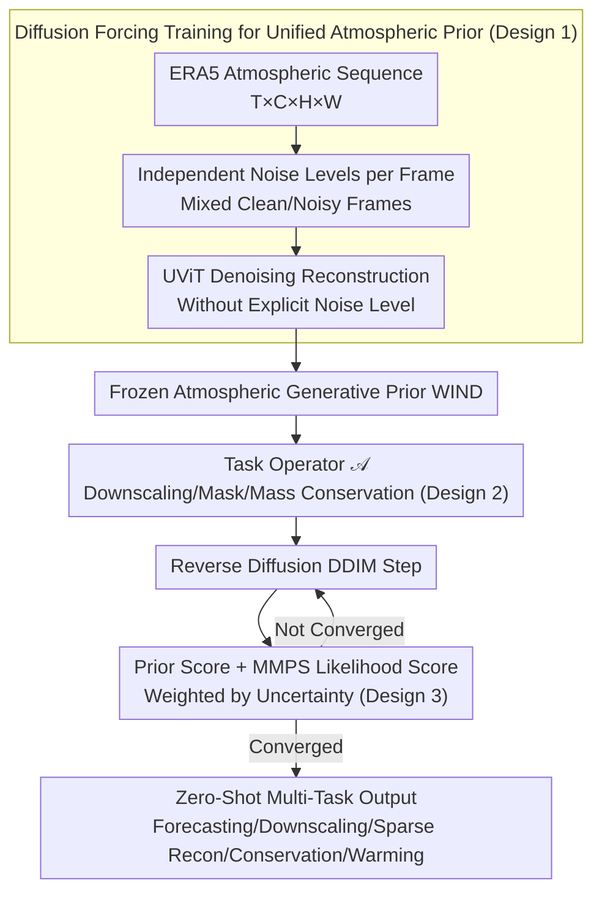

# WIND: Weather Inverse Diffusion for Zero-Shot Atmospheric Modeling

**Conference**: ICML2026  
**arXiv**: [2602.03924](https://arxiv.org/abs/2602.03924)  
**Code**: No public code found  
**Area**: Scientific Computing / Atmospheric Modeling / Diffusion Models  
**Keywords**: Weather Foundation Models, Inverse Problems, Diffusion Forcing, Posterior Sampling, Physical Constraints  

## TL;DR
WIND models global atmospheric sequences as an unconditional video diffusion prior. During inference, it treats forecasting, downscaling, sparse reconstruction, mass conservation, and warming scenarios as differentiable inverse problems, enabling a single frozen model to solve multiple weather and climate tasks zero-shot.

## Background & Motivation
**Background**: AI weather forecasting has established an efficient alternative to traditional numerical weather prediction (NWP). Models like GraphCast and GenCast provide strong results on specific prediction tasks. Meanwhile, downstream needs in atmospheric science extend far beyond medium-range forecasting to include spatial downscaling, temporal downscaling, sparse observation completion, long-term climate scenarios, and physical conservation constraints.

**Limitations of Prior Work**: The current ecosystem is fragmented. Models are typically trained for a single task: forecasting models for prediction, downscaling models for resolution enhancement, and reconstruction models for data completion. Every new task requires retraining or fine-tuning, which is not only costly but also makes it difficult to ensure a shared atmospheric physical prior across different tasks.

**Key Challenge**: Atmospheric systems require strong probabilistic generative capabilities while needing stable guidance from external physical or observational constraints. Pure autoregressive models suffer from error accumulation in long rollouts; standard full-sequence diffusion models struggle to combine clean frames from previous windows with future noisy frames; and conditional diffusion losing the universality of foundation models if trained separately for each task.

**Goal**: The authors aim to train a single atmospheric generative prior that performs various weather/climate tasks through changes in the forward operator during the inference stage, rather than through task-specific fine-tuning. In other words, the model learns "what a reasonable atmospheric sequence looks like" during training, and is told "what observation or physical conditions must be met" during inference.

**Key Insight**: The paper treats atmospheric data as a video: variables are channels, time steps are frames, and the global grid represents spatial dimensions. Training employs diffusion forcing, where each frame has an independent noise level. Inference uses moment matching posterior sampling (MMPS) to estimate observation likelihood gradients, injecting arbitrary differentiable constraints into the reverse diffusion process.

**Core Idea**: Train an atmospheric video diffusion prior capable of mixing clean and noisy frames using diffusion forcing, then unify all downstream tasks as inverse problems of the form $Y=\mathcal{A}(X)+\eta$, with constraints applied via MMPS during sampling.

## Method
The WIND approach resembles learning an atmospheric "world model" and subsequently formulating tasks as observation equations. The model itself remains agnostic to whether a specific task is forecasting, downscaling, or sparse reconstruction; these differences are encapsulated within the operator $\mathcal{A}$ during inference.

### Overall Architecture
Training data is sourced from ERA5, using a 1.5-degree resolution, 70 atmospheric variables, and sequences of length 5 at 6-hour intervals. The backbone is a UViT, where inputs and outputs are atmospheric state sequences of shape $T\times C\times H\times W$. During training, noise levels are sampled independently for each frame, transforming clean atmospheric sequences into sequences with varying degrees of corruption, which the UViT then reconstructs.

During inference, given a task observation $Y$ and a forward operator $\mathcal{A}$. For example, $\mathcal{A}$ is average pooling in spatial downscaling, a temporal mean operator in temporal downscaling, a binary mask in sparse reconstruction, and a nonlinear global dry air mass (DAM) calculation in mass conservation. In each step of the reverse diffusion, WIND first provides a prior score, then MMPS provides a likelihood score based on the discrepancy between $\mathcal{A}(\hat X)$ and the target $Y$. The sample is updated by combining both.

### Key Designs

**1. Diffusion Forcing Training for Unified Atmospheric Prior**: Autoregressive weather generation requires appending the last frame of the previous window (clean context) to the front of the next window. However, standard video diffusion assigns the same noise level to all frames. When the model encounters "mixed clean + noisy" inputs, it falls out-of-distribution, leading to divergence in long rollouts. WIND adopts diffusion forcing: noise levels $k^t$ are sampled independently for each time step, with the forward process $z^t=\alpha(k^t)x^t+\beta(k^t)\epsilon^t$. This ensures the model sees arbitrary "clean/noisy" combinations during training. During inference, historical context is treated as clean frames and future frames as noisy frames for seamless concatenation, supporting stable rollouts of arbitrary length. Crucially, the model **does not explicitly receive noise levels**; it must infer uncertainty per frame from the input state, learning more robust spatiotemporal representations rather than relying on a fixed noise schedule.

**2. Formulating Downstream Tasks as Differentiable Inverse Problems**: Traditional approaches train specialized models for forecasting, downscaling, and sparse reconstruction. WIND unifies all tasks into a single inverse problem $Y=\mathcal{A}(X)+\eta$—recovering a full state $X$ that satisfies the atmospheric prior from partial observations $Y$. Task differences are shifted into the forward operator $\mathcal{A}$: $\mathcal{A}(X)=\mathrm{AvgPool}(X)$ for spatial downscaling, $\mathcal{A}(X)=\frac{1}{T}\sum_t x^t$ for temporal downscaling, $\mathcal{A}(X)=M\odot X$ for sparse reconstruction, and nonlinear integral formulas for physical conservation. Thus, the same frozen model can zero-shot transfer to various tasks simply by changing $\mathcal{A}$.

**3. MMPS Guided Sampling instead of Point Estimation Constraints**: Injecting constraints into reverse diffusion is difficult because the likelihood term $p(X|Z)$ lacks a closed-form solution. Standard Diffusion Posterior Sampling (DPS) approximates it as a Dirac delta at the current prediction point, effectively ignoring model uncertainty. Consequently, at high noise levels, observation gradients can overly distort samples and destroy the generative prior. WIND utilizes Moment Matching Posterior Sampling (MMPS): approximating $p(X|Z)$ as a Gaussian distribution with covariance and using Tweedie covariance to estimate prediction uncertainty. This ensures the prior dominates when noise is high and predictions are unreliable, while likelihood guidance strengthens as noise decreases, allowing stable application of high-dimensional, low-dimensional, or nonlinear atmospheric constraints.

### Loss & Training
The training objective is denoising score matching / clean sequence reconstruction. The model learns to recover atmospheric states from sequences with varied noise levels. The study uses 5-frame windows, 6-hour intervals, 70 variables, and a 1.5-degree ERA5 grid. The inference stage employs DDIM-like updates, adding the MMPS likelihood score for constrained tasks. All meteorological forecasting, downscaling, and physical constraints are performed during inference without task-specific fine-tuning.

## Key Experimental Results

### Main Results
The main results demonstrate that the same model can work across different tasks. In medium-range forecasting, due to the coarser resolution, WIND's absolute CRPS on WeatherBench2 does not seek to outperform specialized models but is more stable than autoregressive diffusion baselines. In downscaling and sparse reconstruction, WIND's advantages lie in power spectra, physical consistency, and the lack of task-specific training.

| Task | Evaluation Setting | WIND Result | Baseline | Conclusion |
|------|----------|----------|----------|------|
| 14-day Probabilistic Forecast | 24 initials in 2021, 10-member ensemble, CRPS/SSR | CRPS better than AR-UViT after several days; SSR approaches 1 | AR-UViT (Autoregressive Diffusion) | Diffusion forcing is more stable, avoiding humidity/precipitation variable overshoot |
| WeatherBench2 24h T2m | CRPS ↓ | 0.286 | GenCast 0.209, IFS ENS 0.396 | Low-res general prior is weaker than specialized GenCast but better than IFS ENS |
| Spatial Downscaling | 6° to 1.5°, RMSE/PSD | Temp 0.63, Geopotential 45.17, MSLP 42.68 | Specialized UViT/FNO | RMSE often lower than UViT; high-frequency spectral details better than FNO without task training |
| Sparse Recon 1% | 1% observation points, RMSE | Temp 0.65, Geopotential 48.64, MSLP 47.12 | UViT / Kriging | Outperforms specialized UViT on most variables; much less prone to oversmoothing than Kriging |
| 4-year DAM Constrained Rollout | Dry air mass stability | Strictly maintains target DAM throughout | Unconstrained WIND | Physical constraints prevent mass drift after ~200 days |

### Ablation Study

| Configuration | Key Metric | Description |
|------|---------|------|
| No DAM guidance | DAM drift after ~200 days in 4-year rollout | Pure data-driven generation eventually deviates from physical conservation |
| DAM guidance | Maintain target DAM throughout 4-year rollout | MMPS can enforce hard physical constraints without retraining |
| Warming Free Run | Storm Bernd +2K/+14% humidity, only 50.3% precip enhancement signal | Model diffuses OOD thermal anomalies back to the training climate state |
| Warming Guided Run | Mean peak precip enhancement +13.9% | Close to the Clausius-Clapeyron expectation of ~+14% |
| Spatial Downscaling UViT | Lowest RMSE for most variables | Specialized models hold an advantage in pixel-wise error |
| WIND Spatial Downscaling | PSD closer to ERA5, Pearson consistency 0.96 | General prior better preserves high frequencies and physical statistical structure |

### Key Findings
- A single frozen model can cover multiple task types by changing $\mathcal{A}$, proving that "Atmospheric Foundation Model + Inverse Problem Inference" is more flexible than task-specific models.
- While WIND does not always win on RMSE against specialized UViT, its power spectra and distributions are closer to real ERA5, specifically reducing high-frequency smoothing issues seen in deterministic models.
- Sparse reconstruction highlights the value of a foundation prior: with only 1% observations, specialized conditional models struggle to generalize, whereas WIND uses the global atmospheric prior to complete unobserved regions.
- Physical constraints are plug-and-play guidance during inference rather than soft regularization during training, making long-term mass conservation and warming scenario simulations controllable.

## Highlights & Insights
- The most elegant aspect of the paper is unification: forecasting, downscaling, sparse reconstruction, mass conservation, and warming scenarios are not separate modules but different operators within the same posterior sampling framework.
- Diffusion forcing aligns perfectly with the requirements of meteorological rollouts. It addresses a specific but critical issue in video diffusion: how to naturally accept a mixed noise state of "known past, unknown future."
- The role of MMPS is not just making diffusion obey conditions, but incorporating uncertainty into guidance strength. For chaotic atmospheric dynamics, this is more principled than simple point-estimate DPS.
- This paper serves as a reminder for SciML not to focus solely on single-task SOTA. In climate contexts, the ability to impose new physical constraints zero-shot may be more important than marginal RMSE gains on a fixed benchmark.

## Limitations & Future Work
- WIND uses 1.5-degree ERA5; the authors acknowledge they are not competing directly with 0.25-degree operational forecasting SOTA. Deployment would require higher resolution, more variables, and larger model scales.
- Many results are illustrated via plots and spectra; RMSE does not always outperform specialized models. Systematic quantitative evaluation is still needed for extreme events, local risks, and energy/moisture closures.
- MMPS guidance introduces additional inference costs, particularly for constraints requiring conjugate gradient solves. While costs are analyzed, optimization is needed for large ensembles or long climate simulations.
- Warming experiments use simplified global thermal perturbations (+2K, +14% humidity). This is suitable for mechanism verification but remains distant from realistic regionalized climate change scenarios.

## Related Work & Insights
- **vs GenCast/GraphCast**: These models are optimized for medium-range forecasting and are stronger on absolute WeatherBench2 metrics; WIND's advantage lies in unified inverse problem inference and zero-shot task transfer.
- **vs full-sequence diffusion**: Standard full-sequence diffusion struggles to connect clean contexts in long rollouts; WIND's independent noise training is better suited for rolling generation.
- **vs FNO/UViT downscaling**: Specialized models might achieve better RMSE but often produce smooth predictions via pixel losses; WIND emphasizes physical realism in spectra and distributions.
- **vs Physics-Constrained Neural Networks**: While traditional methods embed conservation laws into losses or architectures, WIND applies constraints via operator guidance during inference, offering higher flexibility.

## Rating
- Novelty: ⭐⭐⭐⭐⭐ Naturally unifies diffusion forcing, MMPS, and atmospheric multi-task inverse problems with high conceptual integrity.
- Experimental Thoroughness: ⭐⭐⭐⭐☆ Covers many tasks, including long rollouts and OOD warming cases, though resolution remains proof-of-concept.
- Writing Quality: ⭐⭐⭐⭐☆ Clear methodology and helpful diagrams; however, results are somewhat scattered between the main text and appendix.
- Value: ⭐⭐⭐⭐☆ Highly insightful for scientific foundation models and climate AI; currently more of a research framework than a production tool.

<!-- RELATED:START -->

## Related Papers

- [\[CVPR 2025\] Zero-1-to-A: Zero-Shot One Image to Animatable Head Avatars Using Video Diffusion](../../CVPR2025/video_generation/zero-1-to-a_zero-shot_one_image_to_animatable_head_avatars_using_video_diffusion.md)
- [\[CVPR 2026\] StoryTailor: A Zero-Shot Pipeline for Action-Rich Multi-Subject Visual Narratives](../../CVPR2026/video_generation/storytailora_zero-shot_pipeline_for_action-rich_multi-subject_visual_narratives.md)
- [\[CVPR 2026\] Are Image-to-Video Models Good Zero-Shot Image Editors?](../../CVPR2026/video_generation/are_image-to-video_models_good_zero-shot_image_editors.md)
- [\[ECCV 2024\] DreamMotion: Space-Time Self-Similar Score Distillation for Zero-Shot Video Editing](../../ECCV2024/video_generation/dreammotion_space-time_self-similar_score_distillation_for_zero-shot_video_editi.md)
- [\[CVPR 2026\] Towards Holistic Modeling for Video Frame Interpolation with Auto-regressive Diffusion Transformers](../../CVPR2026/video_generation/towards_holistic_modeling_for_video_frame_interpolation_with_auto-regressive_dif.md)

<!-- RELATED:END -->
