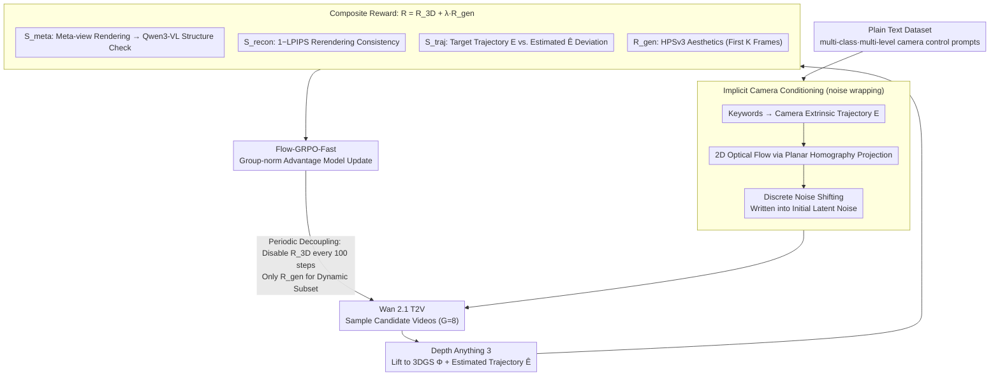

# World-R1: Reinforcing 3D Constraints for Text-to-Video Generation

**Conference**: ICML 2026  
**arXiv**: [2604.24764](https://arxiv.org/abs/2604.24764)  
**Code**: None  
**Area**: Video Generation / World Models  
**Keywords**: Text-to-Video Generation, 3D Consistency, Reinforcement Learning, Flow-GRPO, Camera Control  

## TL;DR
World-R1 reformulates the 3D consistency problem in text-to-video models as a reinforcement learning post-training task. It utilizes Flow-GRPO to align video foundation models, such as Wan 2.1, with implicit camera conditioning and 3D-aware rewards. This approach significantly reduces geometric hallucinations without altering model architecture or inference pipelines while maintaining general video generation quality.

## Background & Motivation
**Background**: Large-scale video generation models are now capable of generating high-fidelity short videos and are increasingly viewed as a foundation for world models. However, their training objectives primarily focus on matching visual distributions in image/video space, lacking explicit 3D geometric constraints. While this is less noticeable for static shots or minor movements, geometric drift in object shapes, wall structures, and scene layouts often occurs when prompts require large camera motions, such as orbiting an object, moving through a corridor, or zooming into a building.

**Limitations of Prior Work**: Existing 3D-aware video generation typically incorporates 3D modules, point clouds/3DGS constraints, or auxiliary camera-control networks during inference. Although these methods improve consistency, they introduce architectural changes, extra inputs, expensive inference, and restricted task scopes. Many are also biased toward image-to-video rather than pure text-to-video. Conversely, simply training on more video data does not guarantee that the model will internalize rigid geometric laws.

**Key Challenge**: Video foundation models may have already acquired some implicit 3D knowledge during pre-training, but standard generation objectives do not force the model to utilize this knowledge under large viewpoint changes. To transform a generator into a world simulator, geometric feedback is essential; however, overly rigid feedback could potentially suppress dynamic objects and visual diversity.

**Goal**: The authors aim to internalize 3D geometric constraints into text-to-video foundation models without introducing explicit 3D reasoning modules, relying on large-scale 3D supervised data, or altering the inference pipeline. The objectives include improved camera trajectory following, object persistence, and 3D reconstruction consistency without sacrificing general video quality on VBench.

**Key Insight**: The paper adopts an analysis-by-synthesis reward design. After generating a video, a 3D foundation model is used to lift the video into 3D Gaussian Splatting (3DGS) and camera trajectories. The system then renders from new viewpoints, compares reconstruction quality, checks trajectory deviations, and uses a VLM to evaluate structural reliability from a meta-view. Thus, the model does not learn directly from 3D annotations but understands which videos are 3D-consistent through rewards.

**Core Idea**: By using Flow-GRPO to combine 3DGS reconstruction, meta-view semantic evaluation, trajectory alignment, and general visual quality into a composite reward, the researchers align existing T2V models via RL. This makes geometric consistency an inherent preference of the model rather than an external hard constraint at inference time.

## Method

### Overall Architecture
The base model for World-R1 is Wan 2.1 T2V, and the training prompts are derived from a plain text dataset synthesized by Gemini (approximately 3,000 scene descriptions categorized by visual domain and camera control complexity). Given a prompt, the system identifies camera motion keywords—such as "push in," "pan left," or "orbit left"—and generates a corresponding camera extrinsic trajectory. It then projects the trajectory into 2D optical flow for adjacent frames and injects camera motion priors into the initial latent noise using Go-with-the-Flow style noise wrapping. Finally, the video foundation model samples a group of candidate videos under this latent condition.

Once the candidate videos are generated, World-R1 calculates a composite reward. The 3D-aware reward comprises meta-view structural evaluation, 3DGS reconstruction fidelity, and camera trajectory alignment. The general generation reward uses HPSv3 to evaluate the aesthetic and visual quality of the initial frames. During training, Flow-GRPO-Fast treats the video sampling process as a stochastic policy rollout, updating the model using advantages normalized within the group. A periodic decoupling phase is inserted every 100 steps to temporarily disable the 3D-aware reward and optimize solely on the high-dynamic subset to prevent geometric constraints from suppressing dynamic content.

### Key Designs
**1. Plain Text Dataset: Decoupling Geometry Learning from Visual Bias**

Previous research on camera control largely relied on open-domain video data with limited resolution and noisy text-video alignment, which often tied geometric laws to specific visual distributions. World-R1 instead uses Gemini to synthesize approximately 3,000 plain text scene descriptions covering natural landscapes, urban architecture, and surreal environments. These are graded by camera control complexity—ranging from implicit motion to single-direction commands and complex combined trajectories. Since plain text lacks a fixed visual prior, the model must learn rigid geometric laws from the combination of scene and camera actions rather than memorizing a specific video's appearance.

**2. Implicit Camera Conditioning: Writing Camera Trajectories into Initial Noise**

Explicit camera-control modules require additional networks and architectural changes, while plain text prompts alone struggle to ensure stable complex camera motions. World-R1 adopts a parameter-free implicit conditioning strategy: it scans the prompt for motion keywords to derive a camera extrinsic sequence $E=\{E_t\}$ ($E_t=E_{t-1}\cdot T_{\text{action}}(t)$). Using a pinhole camera model and fronto-parallel planar homography, it projects relative camera motion into adjacent frame optical flow $f(u)=u'-u$. To avoid variance collapse in overlapping areas or voids in occluded zones, the method employs discrete noise shifting: summing noise moved to the same target pixel $v'$ and normalizing by the square root of the incidence count $\rho(v')$ ($z_{t+1}(v')=\frac{1}{\sqrt{\rho(v')}}\sum_{v\to v'}z_t(v)$). This injects camera-induced spatial structure into the initial noise while maintaining unit variance, providing the RL process with an inductive bias for camera motion without adding inference modules.

**3. Composite Reward: Exposing Hidden 3D Errors via Analysis-by-Synthesis**

Matching visual distributions in video frame space alone cannot expose hidden geometric errors like "paper-thinness" or "texture stretching." World-R1 uses analysis-by-synthesis to convert "visual similarity" into optimized feedback for "3D self-consistency." Generated videos are lifted to 3DGS representation $\Phi_{GS}$ via Depth Anything 3, allowing for the calculation of $R_{3D}=S_{meta}+S_{recon}+S_{traj}$. $S_{meta}$ renders 3DGS from an offset meta-view for structural checking; $S_{recon}$ measures consistency between the original video and 3DGS rerendering via $1-\text{LPIPS}$; and $S_{traj}$ penalizes the deviation between the target trajectory $E$ and the estimated $\hat{E}$.

**4. Periodic Decoupled Training: Preventing Geometric Constraints from Suppressing Dynamic Content**

Strict 3D consistency can suppress non-rigid dynamics like walking people or fire, leading to "reward hacking" where the model generates overly static videos. World-R1 reserves approximately 500 high-dynamic prompts for a multi-stage training loop. The main phase uses the full weighted reward, but every 100 steps, a dynamic fine-tuning phase is inserted where $R_{3D}$ is disabled and only $R_{gen}$ is optimized on the dynamic subset. This regularization ensures the model maintains generalization for complex dynamic motion while learning world simulation.

### Loss & Training
World-R1 uses Flow-GRPO-Fast for online RL post-training. The deterministic ODE sampling of flow matching is reformulated into a noisy reverse-time SDE to provide an explorable policy. A group of videos is sampled for each prompt, and advantages are normalized via group-wise reward mean and standard deviation. The model is updated using a clipped objective similar to PPO/GRPO with KL constraints. Two versions were trained: World-R1-Small (Wan2.1-T2V-1.3B) on 48 H200 GPUs and World-R1-Large (Wan2.1-T2V-14B) on 96 H200 GPUs.

## Key Experimental Results

### Main Results
World-R1 not only preserves but actually improves VBench scores across aesthetics and subject consistency compared to the base models.

| Method | Aesthetic Quality | Imaging Quality | Motion Smoothness | Subject Consistency | Background Consistency |
|------|-------------------|-----------------|-------------------|---------------------|------------------------|
| CogVideoX-1.5-5B | 62.07 | 65.34 | 98.15 | 96.56 | 96.81 |
| Wan2.1-T2V-1.3B | 62.43 | 66.51 | 97.44 | 96.34 | 97.29 |
| ReCamMaster | 42.70 | 53.97 | 99.28 | 92.05 | 93.83 |
| World-R1-Small | 65.74 | 67.53 | 98.55 | 97.58 | 96.67 |

| Method | PSNR | SSIM | LPIPS | Description |
|------|------|------|-------|------|
| CogVideoX-1.5-5B | 24.44 | 0.783 | 0.242 | Strong video baseline |
| Wan2.2-T2V-14B | 23.47 | 0.779 | 0.253 | Larger Wan series baseline |
| Wan2.1-T2V-14B | 19.76 | 0.629 | 0.405 | World-R1-Large base |
| Wan2.1-T2V-1.3B | 17.40 | 0.550 | 0.467 | World-R1-Small base |
| World-R1-Small | 27.63 | 0.858 | 0.201 | Gain of +10.23 dB PSNR over base |
| World-R1-Large | 27.67 | 0.865 | 0.162 | Gain of +7.91 dB PSNR over base |

### Ablation Study

| Reward Component Ablation | PSNR | SSIM | LPIPS | VBench AVG | Conclusion |
|-----------------|------|------|-------|------------|------|
| Full pipeline | 27.63 | 0.858 | 0.201 | 85.21 | Best balance of geometry and quality |
| w/o meta-view score | 26.91 | 0.841 | 0.218 | 83.67 | Hidden structural defects harder to penalize |
| w/o reconstruction score | 25.14 | 0.798 | 0.271 | 84.35 | 3D reconstruction consistency drops |
| w/o trajectory score | 26.27 | 0.829 | 0.237 | 84.53 | Weaker camera trajectory following |

| Training/Conditioning Ablation | PSNR | SSIM | LPIPS | VBench AVG | Key Impact |
|----------------|------|------|-------|------------|----------|
| Full | 27.63 | 0.858 | 0.201 | 85.21 | Most stable overall |
| w/o noise wrapping | 24.46 | 0.745 | 0.298 | 76.39 | Loss of inductive bias for trajectory |
| w/o periodic decoupled training | 27.89 | 0.898 | 0.192 | 82.64 | Higher reconstruction but Tends toward over-rigidity |
| w/o 3D-aware reward | 18.93 | 0.502 | 0.496 | 84.96 | Geometric constraints fail |
| w/o general reward | 27.57 | 0.849 | 0.206 | 83.44 | Logic remains strong, but perceptual quality drops |

### Key Findings
- 3D consistency is the most significant result: World-R1-Small exhibits a jump from 17.40 to 27.63 PSNR, and World-R1-Large moves from 19.76 to 27.67.
- General video quality is preserved. World-R1-Small outperforms its base model on VBench metrics including Aesthetic and Imaging quality.
- Ablations indicate that the 3D reward is essential; without it, PSNR remains near base levels.
- Periodic decoupled training is crucial for preventing reward hacking. Without it, the model becomes too static, dropping VBench scores from 85.21 to 82.64.

## Highlights & Insights
- Instead of making 3D consistency an external inference-time module, the paper uses RL to internalize it as a model preference, keeping the inference pipeline simple.
- The reward design is comprehensive: meta-view checks for hidden geometry, reconstruction checks for self-consistency, and trajectory checks for control.
- Training with plain text data allows the model to learn rigid geometric laws without expensive real-world 3D video labels.
- The implementation of periodic decoupled training recognizes the tension between 3D rigidity and dynamic content, making it a more practical world simulator.

## Limitations & Future Work
- High training costs: World-R1-Large requires 96 H200 GPUs and expensive online RL generation/evaluation.
- Dependence on the base model: Issues like complex multi-object interactions or hand details may still inherit the base model's flaws.
- Reward dependency: The RL process might inherit biases from external evaluators like Depth Anything 3 or Qwen3-VL.
- Trajectory constraints: Current camera paths are based on keywords. Future work could integrate free-form trajectories or real robot/simulator interfaces.

## Related Work & Insights
- **vs CameraCtrl / ReCamMaster**: Unlike these methods which use explicit modules, World-R1 uses latent noise wrapping and RL without adding inference overhead.
- **vs 3D-aware video generation**: Rather than using 3D decoders, World-R1 distills constraints into the generator using 3D models as training-time critics.
- **vs Flow-GRPO**: World-R1 contributes specific 3D-aware rewards within this RL framework and addresses the reward hacking problem.
- **Key Insight**: World modeling for generative models does not strictly require large 3D datasets; physical constraints can be transferred from 3D foundation models to generators via preference optimization.

## Rating
- Novelty: ⭐⭐⭐⭐☆ Using 3D consistency as an RL reward is an insightful application of existing tools.
- Experimental Thoroughness: ⭐⭐⭐⭐⭐ Comprehensive tests covering user studies, metrics, and long-video generalization.
- Writing Quality: ⭐⭐⭐⭐☆ Clear framework description and thorough appendix.
- Value: ⭐⭐⭐⭐⭐ Significant for the transition of T2V models toward robust world simulators.

<!-- RELATED:START -->

## Related Papers

- [\[CVPR 2026\] ExPose: Reinforcing Video Generation Models for Extreme Pose Estimation](../../CVPR2026/video_generation/expose_reinforcing_video_generation_models_for_extreme_pose_estimation.md)
- [\[CVPR 2026\] Endless World: Real-Time 3D-Aware Long Video Generation](../../CVPR2026/video_generation/endless_world_real-time_3d-aware_long_video_generation.md)
- [\[CVPR 2026\] Yume1.5: A Text-Controlled Interactive World Generation Model](../../CVPR2026/video_generation/yume15_a_text-controlled_interactive_world_generation_model.md)
- [\[AAAI 2026\] 3D4D: An Interactive Editable 4D World Model via 3D Video Generation](../../AAAI2026/video_generation/3d4d_an_interactive_editable_4d_world_model_via_3d_video_generation.md)
- [\[ICML 2026\] OLAF-World: Orienting Latent Actions for Video World Modeling](olaf-world_orienting_latent_actions_for_video_world_modeling.md)

<!-- RELATED:END -->
