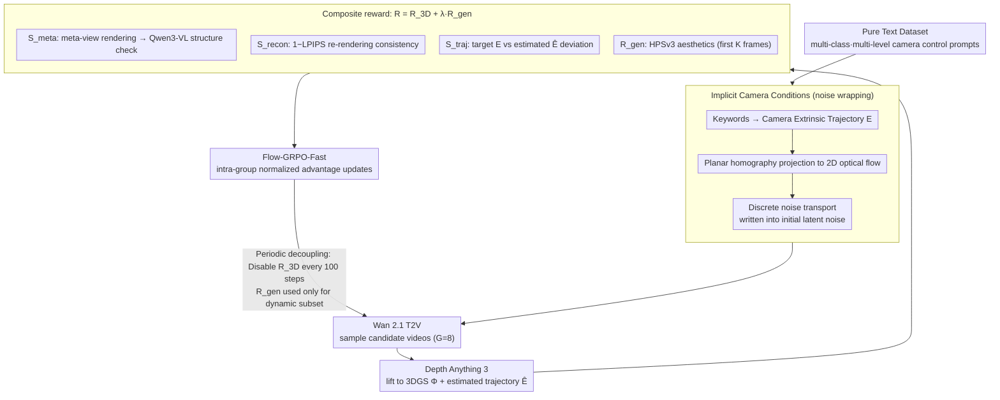

# World-R1: Reinforcing 3D Constraints for Text-to-Video Generation

**Conference**: ICML 2026  
**arXiv**: [2604.24764](https://arxiv.org/abs/2404.24764)  
**Code**: None  
**Area**: Video Generation / World Models  
**Keywords**: Text-to-Video Generation, 3D Consistency, Reinforcement Learning, Flow-GRPO, Camera Control  

## TL;DR
World-R1 transforms the 3D consistency problem of text-to-video models into reinforcement learning (RL) post-training. By using implicit camera conditioning and 3D-aware rewards to perform Flow-GRPO alignment on video foundation models like Wan 2.1, it significantly reduces geometric hallucinations without altering model architecture or inference pipelines, while maintaining general video generation quality.

## Background & Motivation
**Background**: Large-scale video generation models are capable of generating high-fidelity short videos and are increasingly viewed as a foundation for world models. However, their training objectives primarily involve matching visual distributions in image/video space, lacking explicit 3D geometric constraints. For static shots or minor movements, this is less apparent; once a prompt requires large camera movements—such as orbiting an object, moving through a corridor, or zooming into a building—object shapes, wall structures, and scene layouts often drift.

**Limitations of Prior Work**: Existing 3D-aware video generation often incorporates 3D modules, point cloud/3DGS constraints, or auxiliary camera-control networks during inference. While these methods improve consistency, they introduce architectural changes, extra inputs, expensive inference, and restricted task scopes, with many biased toward image-to-video rather than pure text-to-video. Conversely, training solely on more video data does not guarantee that the model will internalize rigid geometric laws.

**Key Challenge**: Video foundation models may have already learned a degree of implicit 3D knowledge during pre-training, but standard generation objectives do not force the use of this knowledge during large viewpoint changes. To make a model a generator that acts more like a world simulator, geometric feedback is required; however, if the feedback is too rigid, it may suppress dynamic objects and visual diversity.

**Goal**: The authors aim to internalize 3D geometric constraints into text-to-video foundation models without introducing explicit 3D inference modules, relying on large-scale 3D supervised data, or altering the inference pipeline. Goals include better camera trajectory following, object persistence, and 3D reconstruction consistency, all without sacrificing general video quality on VBench.

**Key Insight**: The paper adopts an analysis-by-synthesis reward design. After generating a video, a 3D foundation model is used to "lift" the video into 3D Gaussian Splatting (3DGS) and an estimated camera trajectory. Reconstruction quality is compared through rendering from new perspectives, trajectory deviations are checked, and a VLM evaluates the structural reliability of meta-views. In this way, the model does not learn directly from 3D annotations but understands which videos are 3D-consistent through rewards.

**Core Idea**: Combine 3DGS reconstruction, meta-view semantic evaluation, trajectory alignment, and general visual quality into a reward function using Flow-GRPO to perform RL alignment on existing T2V models. This makes geometric consistency an internal generative preference of the model rather than an external hard constraint at inference time.

## Method

### Overall Architecture
The base model of World-R1 is Wan 2.1 T2V, using training prompts from a pure-text dataset synthesized by the authors using Gemini (approximately 3,000 scene descriptions graded by visual domain and camera control complexity). Given a prompt, the system identifies camera motion words, such as "push in," "pan left," or "orbit left," and generates a corresponding camera extrinsic trajectory. It then projects this trajectory into 2D optical flow between adjacent frames and injects camera motion priors into the initial latent noise using a Go-with-the-Flow style noise wrapping. The video foundation model samples a set of candidate videos under this latent condition.

After candidate videos are generated, World-R1 calculates a composite reward. The 3D-aware reward consists of meta-view structural evaluation, 3DGS reconstruction fidelity, and camera trajectory alignment; the general generation reward uses HPSv3 to evaluate the aesthetic and visual quality of the initial frames. Flow-GRPO-Fast is used during training, treating the video sampling process as a stochastic policy rollout and updating the model using advantages normalized within the group. A periodic decoupling phase is inserted every 100 steps to temporarily disable the 3D-aware reward and optimize only on high-dynamic subsets to prevent geometric constraints from suppressing dynamic content.

### Key Designs
**1. Pure Text Dataset: Decoupling Geometric Learning from Visual Bias**

Prior camera-control research mostly relies on open-domain video data, which has limited resolution, noisy text-video alignment, and ties geometric laws to the visual distribution of specific datasets. World-R1 instead uses Gemini to synthesize approximately 3,000 pure-text scene descriptions covering natural landscapes, urban architecture, and surreal environments, graded by camera control complexity: implicit motion, single-direction instructions, and complex composite trajectories. Since pure text has no fixed visual prior, the model must learn rigid geometric laws from the combination of scenes and camera actions rather than memorizing the appearance of specific videos. Grading allows the model to learn physics-compliant generation from easy to difficult levels. This dataset serves as the common input for camera conditioning, rewards, and decoupled training.

**2. Implicit Camera Conditions: Writing Camera Trajectories into Initial Noise**

Explicit camera-control modules require adding networks, changing architectures, and increasing inputs, while pure-text prompts make it difficult for foundation models to execute complex camera movements stably. World-R1 adopts a parameter-free implicit conditioning strategy inspired by Go-with-the-Flow: it first uses keyword detection to scan motion words in the prompt and recursively calculates the camera extrinsic sequence $E=\{E_t\}$ ($E_t=E_{t-1}\cdot T_{\text{action}}(t)$); then, it use a pinhole camera model with fronto-parallel planar homography to project relative camera motion into adjacent frame optical flow $f(u)=u'-u$. Since direct noise warping causes variance collapse in overlapping areas and holes in occluded areas, the method uses discrete noise transport: noise moved to the same target pixel $v'$ is summed and normalized by the square root of the incidence count $\rho(v')$ ($z_{t+1}(v')=\frac{1}{\sqrt{\rho(v')}}\sum_{v\to v'}z_t(v)$). This injects the camera-induced spatial structure into the initial noise while maintaining unit variance. This provides the RL process with a starting point infused with camera motion inductive bias, making it easier for the model to learn trajectory following without adding inference modules. Removing noise wrapping in ablations caused PSNR to drop from 27.63 to 24.46 and VBench from 85.21 to 76.39, proving this prior is critical for convergence and control.

**3. Composite Reward: Exposing Hidden 3D Errors via Analysis-by-Synthesis**

Matching visual distributions only in video frame space fails to expose hidden geometric errors like "paper-like objects," "floating artifacts," or "texture stretching." World-R1 uses analysis-by-synthesis to convert "looking like" into optimizable feedback of "3D consistency." After a video is generated, Depth Anything 3 is used to lift it into a 3DGS representation $\Phi_{GS}$ and estimate the camera trajectory $\hat{E}$, calculating $R_{3D}=S_{meta}+S_{recon}+S_{traj}$. $S_{meta}$ renders the 3DGS from offset meta-views and uses Qwen3-VL to judge text fidelity and structural reliability, specifically catching defects invisible from canonical views; $S_{recon}$ uses $1-\text{LPIPS}$ to measure consistency between the original video and 3DGS re-renderings; $S_{traj}$ penalizes the deviation between target $E$ and estimated $\hat{E}$ trajectories, preventing the model from bypassing reconstruction metrics with static videos. Finally, a general reward $R_{gen}$ (HPSv3 aesthetics of the first $K$ frames) is superimposed to maintain visual quality, with the total objective $R(x,c)=R_{3D}(x,E,c)+\lambda_{gen}R_{gen}(x,c)$. Each component addresses a different potential shortcut; removing $R_{3D}$ in ablations resulted in a PSNR of only 18.93, nearly regressing to the base model level.

**4. Periodic Decoupled Training: Preventing Geometric Constraints from Suppressing Dynamics**

Strict 3D consistency can inadvertently suppress non-rigid dynamics (walking people, flowing water, fire), leading the model to "reward hack" by generating static, stiff videos. World-R1 reserves approximately 500 high-dynamic prompts in the dataset and employs multi-stage cyclic training: the main stage uses the full weighted reward to strengthen 3D capabilities, while a dynamic fine-tuning stage is inserted every 100 steps to temporarily disable $R_{3D}$ and optimize only with $R_{gen}$ on the dynamic subset. This step acts as a regularizer, ensuring the model maintains generalization for complex dynamic motion while learning world simulation. Removing this step yielded higher reconstruction scores (PSNR 27.89, SSIM 0.898) but dropped VBench from 85.21 to 82.64, confirming the model becomes overly rigid.

### Loss & Training
World-R1 uses Flow-GRPO-Fast for online RL post-training. The deterministic ODE sampling of flow matching is rewritten as a noise-injected reverse-time SDE to form an explorable policy; for each prompt, a group of videos is sampled, and advantages are normalized based on group-level reward mean and standard deviation. A clipped objective similar to PPO/GRPO with KL divergence constraints is then used to update the model. Two versions were trained: World-R1-Small based on Wan2.1-T2V-1.3B (using 48 H200s), and World-R1-Large based on Wan2.1-T2V-14B (using 96 H200s). Training resolution was $832 \times 480$, with a GRPO group size of 8 and 48 parallel groups.

## Key Experimental Results

### Main Results
The main results are divided into two categories: VBench for general video quality and 3DGS reconstruction for geometric consistency. World-R1 does not sacrifice VBench performance; instead, it surpasses the base model in aesthetics, imaging, and subject consistency.

| Method | Aesthetic Quality | Imaging Quality | Motion Smoothness | Subject Consistency | Background Consistency |
|------|-------------------|-----------------|-------------------|---------------------|------------------------|
| CogVideoX-1.5-5B | 62.07 | 65.34 | 98.15 | 96.56 | 96.81 |
| Wan2.1-T2V-1.3B | 62.43 | 66.51 | 97.44 | 96.34 | 97.29 |
| ReCamMaster | 42.70 | 53.97 | 99.28 | 92.05 | 93.83 |
| World-R1-Small | 65.74 | 67.53 | 98.55 | 97.58 | 96.67 |

| Method | PSNR | SSIM | LPIPS | Description |
|------|------|------|-------|------|
| CogVideoX-1.5-5B | 24.44 | 0.783 | 0.242 | Strong video baseline |
| Wan2.2-T2V-14B | 23.47 | 0.779 | 0.253 | Larger Wan series baseline |
| Wan2.1-T2V-14B | 19.76 | 0.629 | 0.405 | Base for World-R1-Large |
| Wan2.1-T2V-1.3B | 17.40 | 0.550 | 0.467 | Base for World-R1-Small |
| World-R1-Small | 27.63 | 0.858 | 0.201 | +10.23 dB PSNR over 1.3B base |
| World-R1-Large | 27.67 | 0.865 | 0.162 | +7.91 dB PSNR over 14B base |

### Ablation Study
Ablations of reward components and training strategies show that each component is not redundant but balances geometric consistency, trajectory control, and visual quality.

| Reward Component Ablation | PSNR | SSIM | LPIPS | VBench AVG | Conclusion |
|-----------------|------|------|-------|------------|------|
| Full pipeline | 27.63 | 0.858 | 0.201 | 85.21 | Best balance between geometry and quality |
| w/o meta-view score | 26.91 | 0.841 | 0.218 | 83.67 | Harder to penalize hidden structural defects |
| w/o reconstruction score | 25.14 | 0.798 | 0.271 | 84.35 | Significant drop in 3D consistency |
| w/o trajectory score | 26.27 | 0.829 | 0.237 | 84.53 | Weaker camera trajectory following |

| Training/Condition Ablation | PSNR | SSIM | LPIPS | VBench AVG | Key Impact |
|----------------|------|------|-------|------------|----------|
| Full | 27.63 | 0.858 | 0.201 | 85.21 | Most stable overall |
| w/o noise wrapping | 24.46 | 0.745 | 0.298 | 76.39 | Loss of trajectory inductive bias, worse control |
| w/o periodic decoupled training | 27.89 | 0.898 | 0.192 | 82.64 | Higher reconstruction but lower quality (too rigid) |
| w/o 3D-aware reward | 18.93 | 0.502 | 0.496 | 84.96 | Maintains general quality but fails geometry |
| w/o general reward | 27.57 | 0.849 | 0.206 | 83.44 | Strong geometry but lower perceptual quality |

| Analysis Item | Result | Meaning |
|--------|------|------|
| User Study Geometric Consistency Win-rate | 92% | Human preference for World-R1 structural stability |
| User Study Camera Control Win-rate | 76% | Superior complex trajectory following over Wan 2.1 |
| User Study Overall Preference | 86% | Geometric constraints do not harm overall look |
| Auto 3D metric vs Human Preference Agreement | 91.17% | Reconstruction metrics align well with subjective judgment |
| MVCS small backbone | 0.974 → 0.989 | Multi-view consistency improved without 3DGS reliance |
| MVCS large backbone | 0.963 → 0.993 | Large models benefit similarly |
| 121-frame long-video PSNR | 18.32 → 26.32 | Short-video training generalizes to longer horizons |

### Key Findings
- 3D consistency shows the strongest gains: World-R1-Small improved from 17.40 PSNR (Wan2.1-1.3B) to 27.63, and World-R1-Large improved from 19.76 (Wan2.1-14B) to 27.67, with significantly lower LPIPS.
- General video quality was not crushed by 3D constraints. In VBench, World-R1-Small surpassed Wan2.1-1.3B in Aesthetics, Imaging, Motion Smoothness, and Subject Consistency.
- Reward ablation shows the 3D reward is a necessary condition for geometric improvement; without it, PSNR was only 18.93. Removing the general reward kept geometry strong but lowered VBench scores, indicating the necessity of balancing composite rewards.
- Periodic decoupled training is critical to prevent reward hacking. Without it, reconstruction metrics were slightly higher, but VBench fell from 85.21 to 82.64, suggesting the model may become too static or rigid.

## Highlights & Insights
- The paper does not implement 3D consistency as an external inference-time module but internalizes it as a model preference through RL. This keeps the inference process as simple as a standard T2V model once training is complete.
- The reward design is comprehensive: meta-view checks hidden geometric issues, reconstruction checks self-consistency, trajectory checks control, and general reward checks visual quality. Each metric closes a potential loophole.
- Using pure-text data for post-training is insightful. It allows the model to learn geometric laws from a massive set of scene descriptions and camera actions without relying on expensive real 3D video annotations.
- The paper addresses the concern that 3D constraints might suppress dynamic content using periodic decoupled training. This detail makes the method more like a practical world generator rather than one that only produces static, reconstructible scenes.

## Limitations & Future Work
- Training costs are high. World-R1-Small requires 48 H200s, and Large requires 96, with online RL necessitating repeated video generation and 3D/reward evaluations, which is more expensive than standard SFT.
- The method is limited by the upper bound of the base video model's capabilities. Complex multi-object interactions, hand details, long-term non-rigid motion, and extremely long-horizon scenes may still inherit defects from the Wan base.
- The 3D reward relies on external evaluators like Depth Anything 3, 3DGS, Qwen3-VL, and HPSv3; bias in these evaluators could lead to biased model preferences.
- Current camera trajectories are derived from keywords and preset motion primitives. Future work could support free-form trajectory inputs, continuous control signals, or interfaces with real trajectories from robotics/autonomous driving simulators.

## Related Work & Insights
- **vs CameraCtrl / ReCamMaster**: These methods control trajectories through explicit camera-control modules or conditional inputs. World-R1 achieves control through latent noise wrapping and RL rewards without adding inference modules.
- **vs 3D-aware video generation**: Explicit 3D representations or 3D decoders often require architectural modifications and high inference costs; World-R1 uses 3D models as training-time critics to distill constraints into the video generator.
- **vs Flow-GRPO**: Flow-GRPO provides an RL framework for visual generation; World-R1's contribution lies in designing effective rewards for 3D consistency and solving reward hacking in video geometric constraints.
- **vs Go-with-the-Flow**: Go-with-the-Flow uses noise wrapping for camera motion priors. World-R1 uses this as the conditioning foundation for RL post-training to learn geometric consistency via rewards.
- **Insight**: To perform world modeling for generative models, one does not necessarily need large-scale 3D annotations; strong 3D foundation models and VLMs can be used as training-time discriminators, leveraging RL or preference optimization to transfer physical constraints to the generator.

## Rating
- Novelty: ⭐⭐⭐⭐☆ Converting 3D consistency into an RL post-training reward is insightful, combining existing 3D/VLM/RL tools with a clear goal.
- Experimental Thoroughness: ⭐⭐⭐⭐⭐ Comprehensive results across main experiments, user studies, MVCS, long video, reward ablation, and component ablation.
- Writing Quality: ⭐⭐⭐⭐☆ Clear framework description with extensive appendices; the main text leans on appendices for some ablation values.
- Value: ⭐⭐⭐⭐⭐ Highly valuable for the transition of T2V toward world models, particularly for simulation, robotics, and autonomous driving video generation requiring camera motion and geometric stability.

<!-- RELATED:START -->

## Related Papers

- [\[CVPR 2026\] ExPose: Reinforcing Video Generation Models for Extreme Pose Estimation](../../CVPR2026/video_generation/expose_reinforcing_video_generation_models_for_extreme_pose_estimation.md)
- [\[CVPR 2026\] Endless World: Real-Time 3D-Aware Long Video Generation](../../CVPR2026/video_generation/endless_world_real-time_3d-aware_long_video_generation.md)
- [\[ICML 2026\] VideoGPA: Distilling Geometry Priors for 3D-Consistent Video Generation](videogpa_distilling_geometry_priors_for_3d-consistent_video_generation.md)
- [\[AAAI 2026\] 3D4D: An Interactive Editable 4D World Model via 3D Video Generation](../../AAAI2026/video_generation/3d4d_an_interactive_editable_4d_world_model_via_3d_video_generation.md)
- [\[CVPR 2026\] Yume1.5: A Text-Controlled Interactive World Generation Model](../../CVPR2026/video_generation/yume15_a_text-controlled_interactive_world_generation_model.md)

<!-- RELATED:END -->
