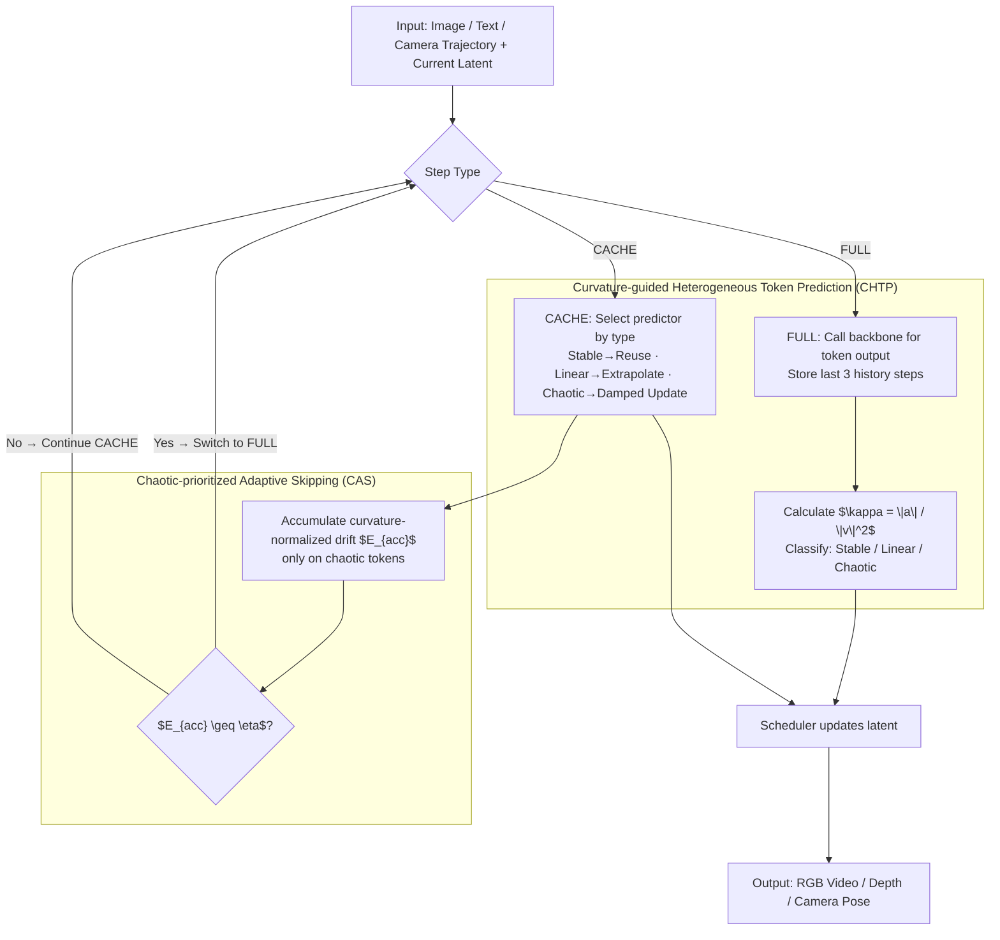

# WorldCache: Accelerating World Models for Free via Heterogeneous Token Caching

**Conference**: ICML 2026  
**arXiv**: [2603.06331](https://arxiv.org/abs/2603.06331)  
**Code**: https://github.com/FofGofx/WorldCache  
**Area**: Video Generation / World Model Acceleration  
**Keywords**: Diffusion World Models, Feature Caching, Heterogeneous Tokens, Adaptive Step Skipping, Inference Acceleration  

## TL;DR
WorldCache addresses the issue of non-uniform evolution of multimodal tokens (such as RGB and depth) in diffusion world models. By categorizing tokens into stable, linear, and chaotic types based on curvature and adaptively triggering full forward passes, it achieves up to 3.65x to 3.7x end-to-end acceleration on models like HunyuanVoyager and Aether, while substantially maintaining the quality of world generation and 3D reconstruction.

## Background & Motivation
**Background**: Generative world models are evolving beyond simple video generation toward environment dynamics simulation. Common inputs include images, text, and camera trajectories, while outputs simultaneously include RGB video, depth, or geometric information. Many high-quality world models are based on diffusion transformers, requiring dozens to hundreds of denoising steps. Each step invokes a large backbone, leading to high costs for interactive use and long-horizon rollouts.

**Limitations of Prior Work**: Training-free feature caching is an attractive direction for accelerating diffusion models because it requires no retraining, simply reusing or predicting intermediate features during sampling. However, most caching strategies originate from unimodal image/video diffusion, where token dynamics are assumed to be homogeneous. Directly transferring these to world models leads to error accumulation, as trajectories differ significantly between RGB and depth, across spatial regions, and at motion boundaries. Unified reuse, linear extrapolation, or fixed skipping intervals fail to handle these differences.

**Key Challenge**: Most tokens in a world model are smooth across many denoising steps and suitable for aggressive caching. However, a few critical tokens exhibit non-linear directional mutations that often determine whether geometric boundaries, depth discontinuities, and motion structures collapse. Globally conservative strategies are slowed down by a few difficult tokens, while globally aggressive strategies cause these difficult tokens to drift.

**Goal**: The authors aim to retain the training-free advantages of feature caching while making the strategy aware of token heterogeneity and temporal non-stationarity in world models. Specifically, the goal is to reduce sampling latency of diffusion world models like HunyuanVoyager and Aether on a single GPU while maintaining the quality of multimodal rollouts (RGB/depth/camera pose).

**Key Insight**: This paper views the denoising output of each token as a temporal trajectory, estimating velocity, acceleration, and curvature using the last three full forward passes. Smaller curvature indicates a trajectory closer to linear; larger curvature indicates sharp local directional changes, requiring more cautious prediction and timely full recomputation.

**Core Idea**: Use curvature to drive token-level heterogeneous prediction and monitor the normalized drift of chaotic tokens exclusively to decide when to re-invoke the full backbone. This concentrates computational power on the few tokens and difficult time intervals that truly trigger rollout failures.

## Method

### Overall Architecture
WorldCache alternates between FULL and CACHE steps during diffusion sampling. FULL steps call the world model backbone normally, store the outputs in a history buffer, calculate curvature, and refresh classification masks—managed by **Curvature-guided Heterogeneous Token Prediction (CHTP)**. CACHE steps bypass the backbone, using different predictors based on token type to generate surrogate outputs for the diffusion scheduler.

Unlike fixed-interval caching, WorldCache utilizes **Chaotic-prioritized Adaptive Skipping (CAS)** to maintain an accumulated drift signal $E_{acc}$. After each CACHE step, curvature-normalized feature drift is calculated only on chaotic tokens and added to $E_{acc}$. When $E_{acc}$ exceeds a threshold $\eta$, the next step switches back to FULL for recalibration. This workflow is a training-free, inference-only strategy that modifies neither model weights nor the scheduler.

### Key Designs
1. **Curvature-guided Heterogeneous Token Prediction (CHTP): Allocating prediction orders via trajectory curvature**

	Token dynamics in world models are long-tailed: background/smooth areas evolve almost linearly, while tokens related to boundaries, depth jumps, or motion change directions abruptly. A uniform predictor fails by causing drift in difficult tokens or wasting computation on simple ones. CHTP views denoising outputs as trajectories and uses the last three FULL outputs to estimate velocity $v$ and acceleration $a$. It defines curvature $\kappa_i=\|a_i\|_2/(\|v_i\|_2^2+\epsilon)$ as a normalized "local turn rate." Tokens are partitioned by curvature quantiles $(p_s,p_c)$ into: stable tokens (low curvature) using zero-order reuse $\tilde{y}_{t,i}=y_{t^\star,i}$; linear tokens (medium curvature) using first-order linear extrapolation $\tilde{y}_{t,i}=y_{t^\star,i}+k\,v_{t^\star,i}$; and chaotic tokens (high curvature). For chaotic tokens, linear extrapolation diverges, so a Hermite-style damped update is used, mixing current and historical velocities with a smoothstep weight $v_i^{adapt}(k)=(1-\alpha_k)v_{t^\star,i}+\alpha_k v_{t^\star-1,i}$ to suppress directional drift during long cache streaks.

2. **Chaotic-prioritized Adaptive Skipping (CAS): Deciding recomputation based on difficult token drift**

	Heterogeneous prediction requires a robust decision on when to recalibrate via the backbone. Fixed intervals are not robust across modalities, and raw difference thresholds fail because feature norms vary wildly with modality and timestep. CAS constructs a dimensionless drift $e_i(t)=\kappa_i\|\tilde{y}_{t,i}-\tilde{y}_{t+1,i}\|_2$. Multiplying by curvature cancels global scale differences, making the threshold universal across modalities and timesteps. Crucially, it averages this only over the **chaotic token set** to obtain $E(t)$ for accumulation into $E_{acc}$. Since rollout collapse typically starts from these difficult tokens, focusing on them prevents simple tokens from diluting risk signals. When $E_{acc}\geq\eta$, the next step is forced back to FULL to recalibrate.

### Loss & Training
WorldCache does not train the model nor change the diffusion scheduler. It is an inference-time strategy. Core hyperparameters include quantile thresholds $(p_s,p_c)$, maximum cache streak $n_{max}$, and the CAS threshold $\eta$. Defaults used in Aether experiments set $\eta=0.20$ as a trade-off between speed and quality.

## Key Experimental Results

### Main Results
Experiments cover HunyuanVoyager-13B image-to-world generation, Aether-5B image-to-world generation, and Aether 3D reconstruction.

| Model/Task | Method | WorldScore Static | WorldScore Dynamic | PSNR | SSIM | LPIPS | Latency | Speed | Memory |
|-----------|------|-------------------|--------------------|------|------|-------|---------|-------|--------|
| HunyuanVoyager-13B world gen | Original | 66.28 | 46.40 | ∞ | 1.000 | 0.000 | 1053.7s | 1.00x | 50.44GB |
| HunyuanVoyager-13B world gen | TeaCache | 60.88 | 42.61 | 16.25 | 0.565 | 0.372 | 311.5s | 3.38x | 56.52GB |
| HunyuanVoyager-13B world gen | EasyCache | 64.16 | 44.91 | 21.76 | 0.737 | 0.208 | 294.5s | 3.58x | 50.98GB |
| HunyuanVoyager-13B world gen | WorldCache | 64.89 | 45.43 | 23.49 | 0.770 | 0.176 | 288.6s | 3.65x | 50.58GB |
| Aether-5B world gen | Original | 64.60 | 45.22 | ∞ | 1.000 | 0.000 | 179.7s | 1.00x | 46.58GB |
| Aether-5B world gen | EasyCache | 62.89 | 44.02 | 22.84 | 0.720 | 0.186 | 120.9s | 1.49x | 46.59GB |
| Aether-5B world gen | WorldCache | 63.68 | 44.72 | 31.87 | 0.924 | 0.066 | 107.2s | 1.68x | 46.59GB |

| 3D reconstruction Method | Abs Rel | $\delta<1.25$ | $\delta<1.25^2$ | ATE | RPE trans | RPE rot | Latency | Speed | Memory |
|------------------------|---------|--------|----------|-----|-----------|---------|---------|-------|--------|
| Aether Original | 0.340 | 0.502 | 0.738 | 0.177 | 0.068 | 0.780 | 55.42s | 1.00x | 50.19GB |
| TeaCache | 0.341 | 0.496 | 0.724 | 0.183 | 0.068 | 0.797 | 25.85s | 2.14x | 50.20GB |
| HERO | 0.347 | 0.490 | 0.716 | 0.181 | 0.071 | 0.861 | 27.44s | 1.96x | 61.56GB |
| WorldCache | 0.341 | 0.508 | 0.741 | 0.184 | 0.068 | 0.796 | 21.20s | 2.61x | 50.20GB |

### Ablation Study
Ablations verify that token prediction must be curvature-heterogeneous and skipping triggers must focus on normalized chaotic drift.

| Token Prediction Strategy | PSNR | SSIM | LPIPS | Latency | Note |
|----------------|------|------|-------|---------|------|
| Reuse | 22.74 | 0.714 | 0.336 | 86.32s | Cheap but fails on changing tokens |
| Linear | 18.01 | 0.537 | 0.396 | 87.07s | Fails in high-curvature regions |
| Damped | 23.76 | 0.665 | 0.276 | 87.51s | Too conservative for easy tokens |
| Random Group | 22.59 | 0.710 | 0.314 | 86.98s | Diversity alone is not the source |
| CHTP | 25.76 | 0.791 | 0.227 | 86.94s | Curvature grouping yields best fidelity |

### Key Findings
- On HunyuanVoyager, WorldCache is slightly faster than EasyCache while improving PSNR (21.76 to 23.49) and WorldScore Dynamic, proving it does not gain speed by simply sacrificing quality.
- In Aether world generation, WorldCache significantly outperforms other methods in PSNR/SSIM/LPIPS with negligible memory overhead.
- 3D reconstruction metrics show that caching does not destroy geometric capabilities, with depth accuracy ($\delta<1.25$) even slightly exceeding the baseline.
- Ablations confirm that uniform predictors make opposite errors on different token types, and monitoring "chaotic tokens + actual drift" is superior to global drift signals.

## Highlights & Insights
- The paper shifts diffusion caching from "which steps to skip" to "which tokens can be safely predicted at which steps," a granularity specialized for multimodal world models.
- Curvature acts as a natural bridge, explaining why prediction errors grow with second-order changes and serving as a scale-invariant drift metric.
- It is training-free and model-level, making it a practical "plug-and-play" accelerator for large world model deployment.
- The evaluation is multifaceted, ensuring geometric consistency and physical integrity aren't sacrificed for perceptual scores.

## Limitations & Future Work
- The method requires three FULL steps for stable curvature estimation, limiting efficiency gains in very short sampling paths.
- Curvature and drift thresholds are currently manual hyperparameters; automated settings across diverse models remain for future work.
- Research focus was on RGB/depth world models; more complex simulators with language or agent states may introduce further token heterogeneity.
- Caching currently approximates backbone outputs in feature space without direct physical consistency constraints.

## Related Work & Insights
- **vs TeaCache / EasyCache**: These use global signals for skip decisions. WorldCache improves the quality-speed trade-off by differentiating token types and focusing on chaotic ones.
- **vs HiCache / TaylorSeer**: Layer-wise caching often incurs high memory costs or requires offloading for world models. WorldCache is model-level with near-zero memory overhead.
- **vs token-adaptive caching**: Most prior work targets unimodal images; WorldCache links token difficulty to multimodal geometric dynamics.
- **Insight**: Future multimodal generation acceleration should leverage "local dynamics" signals (like curvature) rather than just attention or global feature differences.

## Rating
- Novelty: ⭐⭐⭐⭐☆ 
- Experimental Thoroughness: ⭐⭐⭐⭐⭐ 
- Writing Quality: ⭐⭐⭐⭐☆ 
- Value: ⭐⭐⭐⭐⭐ 

<!-- RELATED:START -->

## Related Papers

- [\[CVPR 2026\] Accelerating Diffusion-based Video Editing via Heterogeneous Caching: Beyond Full Computing at Sampled Denoising Timestep](../../CVPR2026/video_generation/accelerating_diffusion-based_video_editing_via_heterogeneous_caching_beyond_full.md)
- [\[CVPR 2026\] DisCa: Accelerating Video Diffusion Transformers with Distillation-Compatible Learnable Feature Caching](../../CVPR2026/video_generation/disca_accelerating_video_diffusion_transformers_wi.md)
- [\[ICML 2026\] Exploring Data-Free LoRA Transferability for Video Diffusion Models](exploring_data-free_lora_transferability_for_video_diffusion_models.md)
- [\[ICML 2026\] Light Forcing: Accelerating Autoregressive Video Diffusion via Sparse Attention](light_forcing_accelerating_autoregressive_video_diffusion_via_sparse_attention.md)
- [\[ICML 2026\] OLAF-World: Orienting Latent Actions for Video World Modeling](olaf-world_orienting_latent_actions_for_video_world_modeling.md)

<!-- RELATED:END -->
