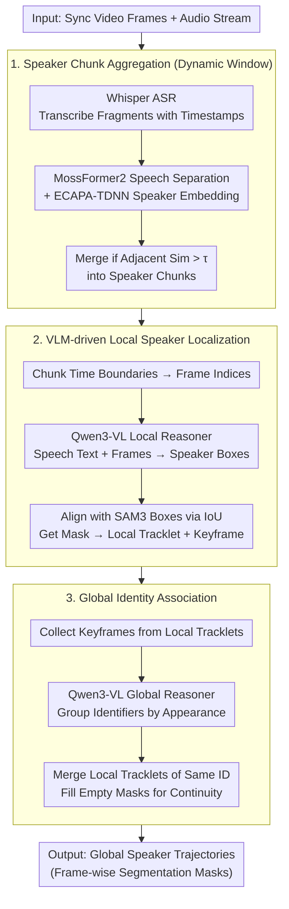

# AVTrack: Audio-Visual Tracking in Human-centric Complex Scenes

**Conference**: ICML 2026  
**arXiv**: [2606.02724](https://arxiv.org/abs/2606.02724)  
**Code**: https://github.com/FudanCVL/AVTrack (Available)  
**Area**: Video Understanding  
**Keywords**: Audio-visual tracking, instance segmentation, human-centric, multi-modal reasoning, dataset benchmark

## TL;DR

This paper proposes the AVTrack dataset and the AVTracker baseline method to address the Audio-Visual Instance Segmentation and tracking (AVIS) task in complex human-centric scenes. By defining eight challenging conditions, a rigorous evaluation benchmark was constructed. A three-stage divide-and-conquer framework was designed (ASR segmented aggregation → local speaker localization → global identity association), which outperforms existing state-of-the-art methods by approximately 8 percentage points on the HOTA metric.

## Background & Motivation

**Background**: Audio-visual speaker tracking aims to locate and track active speakers using auditory and visual cues. In recent years, Audio-Visual Segmentation (AVS) has progressed from pixel-level segmentation to instance-level segmentation and tracking (AVIS). Representative methods like AVISM utilize Mask2Former and VITA with window attention to achieve memory-efficient instance-level audio-visual segmentation.

**Limitations of Prior Work**: Existing datasets and benchmarks have severe limitations. Early speaker tracking datasets (AV16.3, CAV3D) were collected in controlled laboratory environments with simple scenes. AVA-ActiveSpeaker only provides bounding boxes and lacks cross-frame identity consistency. The AVSBench series consists mainly of 5–10 second short clips, which cannot evaluate long-range temporal modeling. Although AVISeg extends the duration to approximately 60 seconds, the scenes remain simple, lacking complex conditions such as camera motion, occlusion, and position changes, particularly underperforming in human-centric scenarios.

**Key Challenge**: Existing benchmarks bias toward evaluating static audio-visual co-occurrence rather than truly testing the model's robust spatio-temporal modeling and cross-modal reasoning capabilities in complex dynamic scenes. Simplified evaluation environments mask the true limitations of existing methods.

**Goal**: (1) Construct a high-quality AVIS evaluation benchmark for complex human-centric scenes; (2) Provide a modular, scalable, and strong baseline method to support follow-up research.

**Key Insight**: The authors systematically define eight complex audio-visual scene conditions (occlusion, position change, background switching, camera motion, multi-instance, multi-turn speaking, audio-visual inconsistency, and dynamic scale). These are used as criteria to build the dataset from multiple video sources (TV dramas, movies, vlogs, animations, variety shows, interviews, and stage performances) to ensure scene diversity and challenge.

**Core Idea**: Construct a high-difficulty AVIS benchmark dataset, AVTrack, by strictly defining complex scene standards, and propose a three-stage divide-and-conquer baseline, AVTracker, which integrates ASR-driven dynamic window aggregation, VLM local reasoning, and global identity association.

## Method

### Overall Architecture

AVTracker adopts a divide-and-conquer strategy to decompose human-centric AVIS into three stages. The input consists of synchronized video frame sequences and audio streams, and the output is the global instance trajectory for each speaker (including frame-wise segmentation masks). Workflow: Stage 1 performs ASR transcription and aggregates fragments into semantically complete speaker chunks (Speaker Chunks) based on speaker embedding similarity; Stage 2 utilizes a VLM within the local time window of each chunk to associate speech content with visible characters, combined with SAM3 to generate frame-wise instance masks, forming local tracklets (Local Tracklets); Stage 3 employs a global reasoner to associate local tracklets of the same speaker across segments and output complete global speaker trajectories.

### Key Designs

**1. Speaker Chunks Aggregation with Dynamic Windows: Merging ASR fragments into complete units based on speaker semantics as the base unit for subsequent processing.**

ASR outputs fragmented short transcripts with timestamps. Processing each independently is inefficient and breaks semantic coherence. This step first uses Whisper to convert audio into fragments $\mathcal{C} = \{c_i = (t_i^s, t_i^e, x_i)\}$, optionally uses MossFormer2 for speech separation to obtain enhanced signals $\hat{\mathbf{a}}_i$, and then extracts speaker embeddings $\mathbf{e}_i = \mathcal{E}(\hat{\mathbf{a}}_i)$ via ECAPA-TDNN. When the cosine similarity of adjacent fragments $\text{sim}(c_i, c_{i+1}) > \tau$, they are merged into one chunk. Compared to mechanical fixed-duration windows, partitioning based on "whether the same person is speaking continuously" preserves complete semantic units and temporal continuity, reducing the number of local windows and simplifying global association.

**2. VLM-driven Local Speaker Localization: Precisely matching speech content with characters in the frame within the chunk time range and producing frame-wise masks.**

Directly matching audio features to visual features in complex scenes is fragile. AVTracker takes the path of "text as a bridge": it converts the time boundaries of chunk $s_k$ into frame indices $f_k^s, f_k^e$, and uses Qwen3-VL as the local reasoner $\mathcal{R}^{local}$. It takes speech text $x_k$ and video frames as input to predict active speaker boxes $\mathbf{b}_{\mathcal{R}}^{(f)}$. Simultaneously, SAM3 generates candidate human boxes and masks for each frame. IoU maximization is used to align VLM predictions with SAM3 detections: $\mathbf{b}^{(f)} = \arg\max_{\mathbf{b} \in \mathcal{B}_{\text{SAM3}}^{(f)}} \text{IoU}(\mathbf{b}_{\mathcal{R}}^{(f)}, \mathbf{b})$. The frame with the largest mask area is selected as the keyframe. Using VLM's language-visual reasoning to establish the semantic bridge of "who is saying this" is much more robust than traditional audio feature matching in occluded or multi-person scenes, while SAM3 complements this with high-quality instance masks.

**3. Global Identity Association: Stitching local trajectories scattered across different time windows into coherent global trajectories based on identity.**

The same speaker often appears repeatedly in multiple discontinuous fragments. Local processing alone cannot establish cross-segment identity consistency. AVTracker collects keyframes of all local trajectories $\mathcal{F}_{\text{key}} = \{I_{f_k^{\text{key}}}\}_{k=1}^{K}$ and passes them to the VLM-based global reasoner $\mathcal{R}^{global}$ to group keyframes by character appearance and establish identity mappings $\mathcal{G}: p \mapsto \{k_1, k_2, \ldots\}$. Finally, it merges all local trajectories belonging to the same identity into a global trajectory $\mathcal{T}_p = \bigcup_{k \in \mathcal{G}(p)} \mathcal{T}_k^{\text{local}}$, filling unobserved frames with empty masks to maintain temporal continuity. This step compensates for the lack of long-range association in the local stage, allowing the "divide-and-conquer" approach to merge back into complete trajectories.

## Key Experimental Results

### Main Results

Comparison of VIS and AVIS methods on the AVTrack benchmark (all values in %):

| Method | Type | HOTA ↑ | DetA ↑ | AssA ↑ | IDF1 ↑ | MOTA ↑ |
|------|------|--------|--------|--------|--------|--------|
| VITA | VIS | 9.70 | 10.54 | 9.35 | 12.32 | 1.91 |
| LBVQ | VIS | 10.29 | 11.77 | 9.36 | 12.87 | 1.98 |
| CAVIS | VIS | 11.46 | 12.10 | 10.07 | 12.95 | 1.96 |
| AVISM | AVIS | 20.84 | 23.22 | 19.53 | 26.57 | 3.95 |
| ACVIS | AVIS | 20.60 | 22.59 | 19.66 | 26.23 | 4.23 |
| AVTrackFormer | AVIS | 21.47 | 22.51 | 20.26 | 26.41 | 4.11 |
| **AVTracker** | **AVIS** | **29.08** | **31.18** | **28.47** | **34.55** | **16.20** |

### Ablation Study

| Config | Description | HOTA | DetA | AssA | IDF1 | MOTA |
|------|------|------|------|------|------|------|
| Base | Whisper-large + Qwen3-VL-8B | 28.85 | 31.75 | 27.39 | 34.45 | 16.39 |
| M1 | Whisper-small (Smaller Audio Model) | 25.19 | 27.33 | 24.25 | 29.92 | 14.88 |
| M2 | Qwen3-VL-4B (Smaller VLM) | 24.47 | 25.85 | 24.37 | 28.86 | 14.48 |
| M3 | Both Models Reduced | 24.01 | 25.49 | 23.69 | 28.47 | 13.52 |
| M4 | VLM → Replaced by Face Detection | 23.62 | 24.80 | 21.31 | 27.16 | 11.03 |
| S1 | + SepFormer Speech Separation | 28.41 | 30.81 | 27.54 | 33.65 | 15.99 |
| S2 | + MossFormer2 Speech Separation | 29.08 | 31.18 | 28.47 | 34.55 | 16.20 |
| C1 | Remove Local Segment Compression | 16.88 | 18.34 | 16.33 | 19.99 | 9.34 |
| C2 | Fixed Window instead of Dynamic Window | 27.45 | 29.57 | 26.64 | 32.97 | 13.49 |

### Key Findings

- VIS methods achieve HOTA scores below 12 on AVTrack, indicating that pure visual cues are entirely insufficient in complex human-centric scenes. While AVIS methods double performance by introducing audio, they remain suboptimal (approx. 20–21).
- AVTracker improves HOTA by approximately 8 points over the strongest AVIS baseline. Its core advantage stems from VLM-driven cross-modal reasoning and the local-global divide-and-conquer strategy.
- Local fragment compression is critical: removing it causes HOTA to plummet from 24.01 to 16.88 (-7.13), demonstrating that compact local representations are key to the scalability of global association.
- Speech separation requires high quality for positive gains: MossFormer2 improves HOTA by 0.23, whereas SepFormer reduces it by 0.44. Low-quality separation introduces noise and temporal misalignment.
- Model scale is sensitive for both modalities: Reducing the VLM from 8B to 4B drops HOTA by 4.38, while reducing the speech model from large to small drops it by 3.66.

## Highlights & Insights

- **Text as a Semantic Bridge**: Instead of directly matching audio and visual features, it converts audio to text via ASR and uses a VLM to associate text semantics with visual characters. This indirect alignment is more robust in complex scenes than end-to-end audio-visual matching. This concept can be transferred to other cross-modal alignment tasks.
- **Dynamic Window vs. Fixed Window**: Partitioning processing windows based on semantic completeness (speaker segment boundaries) rather than mechanical fixed durations prevents the truncation of semantic units. This design philosophy is applicable to any video understanding task requiring temporal segmentation.
- **Dataset Design Methodology**: Systematically defining eight complex conditions and using them to filter videos is a "definition-first" methodology that serves as a useful reference for constructing other benchmarks.

## Limitations & Future Work

- AVTrack is released only as a test set (871 videos) without training data, which limits the fair evaluation of training-based paradigms.
- AVTracker relies on multiple large pre-trained models (Whisper-large, Qwen3-VL-8B, SAM3), resulting in high inference costs and difficult real-time deployment.
- The current baseline combines modules in a cascaded manner, causing errors to accumulate across stages (ASR error → aggregation error → local localization error → global association error). An end-to-end differentiable unified framework might further improve performance.
- Speech overlap remains a bottleneck; low-quality speech separation can harm performance, necessitating more robust multi-speaker solutions.
- Future work could explore memory-enhanced Agentic reasoning and dynamic scene graph representations for more complex, long-range audio-visual understanding.

## Related Work & Insights

- **AVISM** (CVPR 2025): An AVIS method combining Mask2Former and VITA, utilizing window attention for memory-efficient instance-level audio-visual segmentation.
- **COMBO** (2024): A cross-modal fusion method that explicitly models bilateral audio-visual relations.
- **SAM3** (2025): Segment Anything with Concepts, providing general instance segmentation capabilities, used as a mask sampler in this work.
- **Qwen3-VL**: A vision-language model used as the core reasoning engine here; it performs speaker-speech association in a zero-shot manner.
- **OVIS / MOSE**: Benchmarks for video instance segmentation in occluded/complex scenes. AVTrack extends similar challenge definitions into the audio-visual dimension.

<!-- RELATED:START -->

## Related Papers

- [\[AAAI 2026\] R-AVST: Empowering Video-LLMs with Fine-Grained Spatio-Temporal Reasoning in Complex Audio-Visual Scenarios](../../AAAI2026/video_understanding/r-avst_empowering_video-llms_with_fine-grained_spatio-temporal_reasoning_in_comp.md)
- [\[ICML 2026\] Unified Multimodal Visual Tracking with Dual Mixture-of-Experts](unified_multimodal_visual_tracking_with_dual_mixture-of-experts.md)
- [\[ICML 2026\] RELO: Reinforcement Learning to Localize for Visual Object Tracking](relo_reinforcement_learning_to_localize_for_visual_object_tracking.md)
- [\[CVPR 2025\] H-MoRe: Learning Human-centric Motion Representation for Action Analysis](../../CVPR2025/video_understanding/h-more_learning_human-centric_motion_representation_for_action_analysis.md)
- [\[CVPR 2026\] Adaptive Capacity Autoregressive Visual Tracking](../../CVPR2026/video_understanding/adaptive_capacity_autoregressive_visual_tracking.md)

<!-- RELATED:END -->
