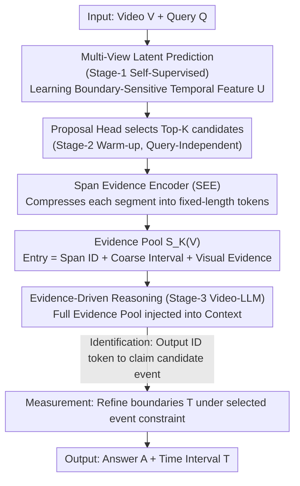

# Foresee-to-Ground: From Predictive Temporal Perception to Evidence-Driven Reasoning

**Conference**: ICML 2026  
**arXiv**: [2605.21973](https://arxiv.org/abs/2605.21973)  
**Code**: TBD  
**Area**: Video Understanding / Multimodal VLM / Video Temporal Grounding  
**Keywords**: Video Temporal Grounding (VTG), Video-LLM, Evidence Pool, Identify-then-Measure, Boundary Detection

## TL;DR
Foresee-to-Ground (F2G) reformulates Video Temporal Grounding (VTG) from direct timestamp regression into an "identify-then-measure" two-stage problem. By utilizing predictive temporal perception and a span evidence encoder to build a candidate event evidence pool, the LLM generates precise boundaries constrained by selected events. This approach improves R@0.7 by 4.1 points on Charades-STA and 6.7 points on ActivityNet.

## Background & Motivation

**Background**: When Video-LLMs are applied to VTG, mainstream methods typically regress timestamps directly from flattened visual token sequences, performing a black-box mapping between discrete token space and continuous time domains.

**Limitations of Prior Work**: Direct timestamp regression faces two core issues:
- **Numerical Fragility**: The misalignment between the discrete token representation of LLMs and continuous temporal coordinates leads to unstable timestamp predictions and high boundary noise.
- **Lack of Verifiability**: Models cannot provide explicit evidence for their predictions, making it difficult for users to understand why a specific time segment was chosen.

**Key Challenge**: existing methods attempt to alleviate issues via timestamp discretization or temporal clue injection, but they essentially remain within a black-box regression framework. They overlook the human cognitive process of temporal grounding—making an explicit event commitment (identification) before refining boundaries (measurement).

**Goal**: To reformulate VTG as a verifiable structured prediction problem, enabling the model to (1) first explicitly select candidate events from an evidence pool (Identification) and (2) precisely locate boundaries constrained by that event hypothesis (Measurement).

**Key Insight**: Introduce the human "identify-then-measure" cognitive workflow into the model. By constructing an explicit evidence pool within the video, each candidate segment is represented as a discrete unit that the LLM can cite, binding timestamp generation to specific event hypotheses.

**Core Idea**: Through a two-part design—Predictive Temporal Perception and Evidence-Driven Reasoning—VTG is transformed from unconstrained numerical regression into evidence-supported citation-conditional reasoning.

## Method

### Overall Architecture
F2G models VTG as a three-stage structured prediction:
$$p(A, T, z \mid V, Q, \mathcal{S}_K(V)) = p(z \mid V, Q, \mathcal{S}_K(V)) \cdot p(A, T \mid z, V, Q, \mathcal{S}_K(V))$$
where $V$ is the video, $Q$ is the query, $T = (t^{st}, t^{ed})$ is the predicted time interval, $A$ is the answer, and $z \in \{1, \ldots, K\}$ is the index of the candidate segment selected from the evidence pool $\mathcal{S}_K(V)$. The first term handles identification, and the second term handles measurement.

The three-stage curriculum:
- Stage-1 (**Predictive Temporal Perception**): Unsupervised pre-training of the temporal module to learn boundary-sensitive features.
- Stage-2 (**Proposal Warm-up**): Supervised training of a lightweight proposal head to extract Top-K candidates and encode local evidence.
- Stage-3 (**Evidence-Driven Reasoning**): Fine-tuning the Video-LLM for supervised identify-then-measure two-stage generation.

### Key Designs

**1. Predictive Temporal Perception: Learning boundary-sensitive features via "part-to-whole prediction" discrepancy.**

Direct boundary regression is numerically unstable partly because the network lacks explicit representations of event transitions. This step uses self-supervised pre-training on unlabeled videos: given temporal features $X \in \mathbb{R}^{N \times D}$, it constructs a global view (full sequence) and multiple local views (partial sequences), minimizing the latent prediction loss from local to global:

$$\mathcal{L}_{\text{pred}} = \mathbb{E}\left[\sum_{v \in \mathcal{V}} \|\text{sg}(U_g) - \hat{U}_g^{(v)}\|_2^2\right]$$

This forces the shared temporal backbone to encode features that allow global dynamics to be predicted from partial evidence. Crucially, long-range dynamics within coherent events are relatively predictable, but at event boundaries, the same local evidence can correspond to multiple future trajectories, causing the prediction loss to spike. Thus, the network automatically learns boundary-sensitive features without manual labels. Sliced Isotropic Gaussian Regularization (SIGReg) is applied to stabilize the geometry of the latent space and avoid representation collapse.

**2. Span Evidence Encoder (SEE): Compressing variable-length candidates into fixed-length visual tokens for LLM citation.**

Candidate events vary in length, but the LLM requires each candidate to be a discrete, citable unit. SEE first crops segment features $U_k = \text{Crop}(U, T_k) \in \mathbb{R}^{N_k \times D}$, then aggregates them into fixed-length evidence $P_k = \text{MHCAStack}(B, U_k) \in \mathbb{R}^{M \times D}$ using $M$ learnable query tokens through Multi-Head Cross-Attention (Q-Former style). Soft aggregation via cross-attention is used instead of simple pooling as it allows query tokens to adaptively select the most discriminative frames.

**3. Evidence-Driven Identify-then-Measure: Constraining LLM boundary generation via event commitment.**

Black-box regression over the entire video token stream is unstable and untraceable. F2G injects the entire evidence pool $\mathcal{S}_K(V) = \{(\langle\text{Span}_k\rangle, T_k, P_k)\}_{k=1}^K$ into the LLM context. The model first outputs an ID token to explicitly "claim" a candidate event (identification), then generates the fine-grained final timestamp (measurement) conditioned on that ID's evidence. The loss function $\mathcal{L}_{S3} = \mathcal{L}_{LM} + \alpha \mathcal{L}_{id} + \beta \mathcal{L}_{\text{time}}$ supervises sequence generation, ID prediction, and timestamp prediction. Boundary prediction is thus narrowed from unconstrained regression to local refinement, significantly improving numerical stability and traceability.

### Loss & Training
- Stage-1: Pre-training on unlabeled videos with multi-view latent prediction and SIGReg.
- Stage-2: Training the proposal head on 70K VTG labels using regression and scoring losses to align proposal quality.
- Stage-3: LoRA fine-tuning of the Video-LLM on 220K instruction-tuning data. The temporal module and proposal head remain trainable with a small learning rate. A lightweight proposal loss is maintained to preserve evidence pool quality.

## Key Experimental Results

### Main Results

| Dataset | Metric | Qwen3-VL (baseline) | +FT | **+F2G-FT (Ours)** | Gain |
|--------|------|------------------|-----|-----------|------|
| Charades-STA | R@0.7 | 15.9% | 21.6% | **25.7%** | +4.1 |
| Charades-STA | mIoU | 40.4 | 42.9 | **47.2** | +4.3 |
| ActivityNet-Captions | R@0.7 | 17.3% | 21.7% | **28.4%** | +6.7 |
| ActivityNet-Captions | mIoU | 32.2 | 40.8 | **45.7** | +4.9 |
| QVHighlights | mAP | 21.3 | 24.6 | **29.7** | +5.1 |
| QVHighlights | HIT@1 | 32.6% | 36.8% | **45.6%** | +8.8 |

### Ablation Study

| Configuration | Charades-STA R@0.7 | ActivityNet mIoU | Description |
|------|-------------------|------------------|------|
| F2G Full | 25.7% | 45.7 | Complete model |
| w/o SIGReg | 24.1% | 44.2 | Removed geometric regularization, -1.6 |
| w/o Stage-1 | 20.9% | 41.8 | No pre-training, -4.8 |
| w/o ID Citation | 21.5% | 41.1 | Removed ID constraint, -4.2 |
| w/o Visual Evidence | 22.1% | 41.5 | Intervals only, no visual tokens, -3.6 |

### Key Findings
- Stage-1 pre-training and SIGReg are critical for performance; removing them results in a 4-5 point drop, especially at high IoU thresholds.
- Evidence ID citation provides the largest gain (~3-4%), as explicit event commitment significantly improves stability.
- Stable across models: The F2G-FT scheme consistently brings +3-9% mIoU gains when applied to different backbones like LLaVA or Qwen2.5.
- Stability Analysis: F2G's $|\Delta\text{IoU}|$ distribution (between two independent decodings) is more concentrated around 0, showing much lower variance compared to baselines.

## Highlights & Insights
- **Simplicity of Paradigm Shift**: Identify-then-measure aligns with human cognition and naturally solves numerical stability; it is transferable to other precise localization tasks (spatial detection, dense captioning).
- **Clever Multi-View Latent Prediction**: Using predictability differences between global and local views to learn boundary features without explicit labels is an elegant self-supervised signal.
- **Modularity and Portability**: The three-stage workflow is decoupled, easily adapting to various Video-LLM backbones.
- **Low Computational Overhead**: Adds only 0.5B parameters (~6% relative to an 8B model). Inference latency increases by <5%, and evidence serialization adds only 100-200 tokens.

## Limitations & Future Work
- The upper bound of accuracy is constrained by evidence pool quality—if the Top-K candidates miss the ground truth, the LLM will fail.
- K-value sensitivity: Currently fixed at Top-8; adaptive selection may be needed for extremely long videos.
- Cross-domain generalization: Trained on DiDeMo/ActivityNet/VTimeLLM; performance on highly distinct domains (e.g., news, sports) remains unknown.
- Directions: (1) Dynamic/recursive evidence pools for multi-round refinement; (2) Uncertainty estimation for rejection; (3) Incorporating RL with IoU rewards during Stage-3.

## Related Work & Insights
- **vs TimeChat / VTimeLLM**: These methods improve within the direct regression framework; F2G makes reasoning controllable via evidence constraints.
- **vs Self-supervised Video Representation**: Prior work focused on transfer learning; F2G innovatively applies predictive pre-training for event discovery in VTG.
- **vs Dense Video Captioning**: F2G's evidence pool concept can be adapted to captioning systems to achieve traceable event descriptions.

## Rating
- Novelty: ⭐⭐⭐⭐ Identify-then-measure is a solid new perspective; multi-view prediction for boundary learning is also innovative.
- Experimental Thoroughness: ⭐⭐⭐⭐⭐ 3 VTG benchmarks + cross-backbone validation + complete ablation + stability proofs.
- Writing Quality: ⭐⭐⭐⭐ Clear logic and easy-to-understand methods; some detail discussions could be deeper.
- Value: ⭐⭐⭐⭐⭐ High practical value for VTG; F2G's generality makes it likely to be adopted and extended by follow-up work.

<!-- RELATED:START -->

## Related Papers

- [\[ICLR 2026\] AVoCaDO: An Audiovisual Video Captioner Driven by Temporal Orchestration](../../ICLR2026/video_understanding/avocado_an_audiovisual_video_captioner_driven_by_temporal_orchestration.md)
- [\[CVPR 2025\] ViTED: Video Temporal Evidence Distillation](../../CVPR2025/video_understanding/vited_video_temporal_evidence_distillation.md)
- [\[ICML 2026\] VideoSEAL: Mitigating Evidence Misalignment in Agentic Long Video Understanding by Decoupling Answer Authority](videoseal_mitigating_evidence_misalignment_in_agentic_long_video_understanding_b.md)
- [\[ICML 2026\] SkelHCC: A Hyperbolic CLIP-Driven Cache Adaptation Framework for Skeleton-based One-Shot Action Recognition](skelhcc_a_hyperbolic_clip-driven_cache_adaptation_framework_for_skeleton-based_o.md)
- [\[ICML 2026\] Video-MTR: Reinforced Multi-Turn Reasoning for Long Video Understanding](video-mtr_reinforced_multi-turn_reasoning_for_long_video_understanding.md)

<!-- RELATED:END -->
