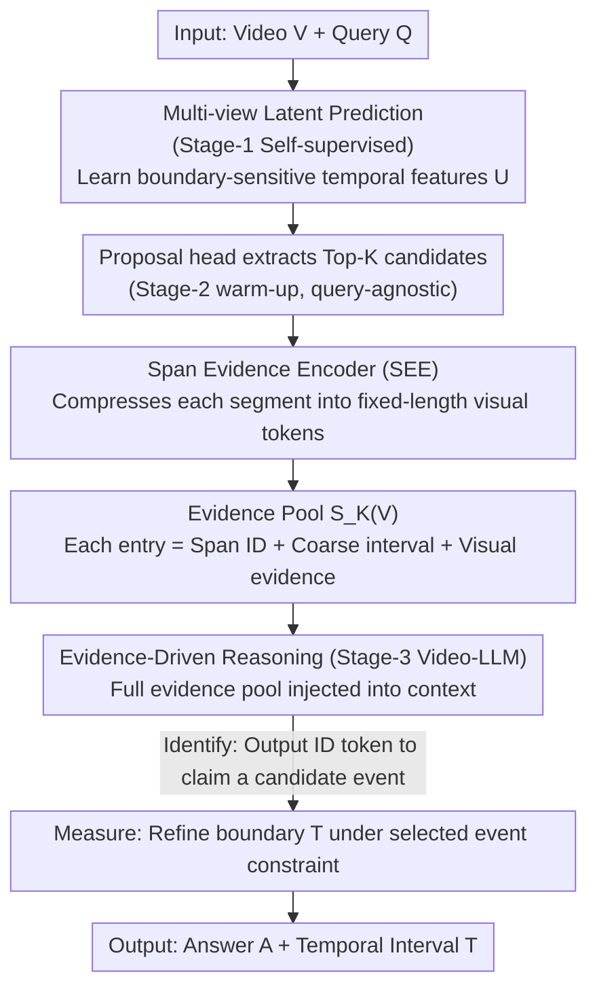

# Foresee-to-Ground: From Predictive Temporal Perception to Evidence-Driven Reasoning

**Conference**: ICML 2026  
**arXiv**: [2605.21973](https://arxiv.org/abs/2605.21973)  
**Code**: To be confirmed  
**Area**: Video Understanding / Multimodal VLM / Video Temporal Grounding  
**Keywords**: Video Temporal Grounding, Video-LLM, Evidence Pool, Identify-then-Measure, Boundary Detection

## TL;DR
Foresee-to-Ground (F2G) reformulates Video Temporal Grounding (VTG) from direct timestamp regression into an "identify-then-measure" two-stage problem—first constructing a candidate event evidence pool via predictive temporal perception and span evidence encoding, then using an LLM to precisely generate boundaries under the constraints of the selected event. This improves Charades-STA R@0.7 by 4.1 points and ActivityNet by 6.7 points.

## Background & Motivation

**Background**: When applying Video-LLMs to VTG, the dominant approach is to directly regress timestamps from flattened visual token sequences, which functions as a black-box mapping between discrete token spaces and continuous time domains.

**Limitations of Prior Work**: Direct timestamp regression faces two core issues:
- **Numerical Vulnerability**: The discrete token representation of LLMs is naturally misaligned with continuous temporal coordinates, leading to unstable timestamp predictions and noisy boundaries.
- **Lack of Verifiability**: Models cannot provide explicit evidence to support their predictions, making it difficult for users to understand why a specific time segment was chosen.

**Key Challenge**: Existing methods attempt to mitigate these issues through timestamp discretization or injecting temporal cues, but they fundamentally operate within the black-box regression framework. They overlook the human cognitive process of temporal grounding—first making an explicit event commitment (identification) and then refining the boundaries (measurement).

**Goal**: To reformulate VTG as a verifiable structured prediction problem, enabling the model to (1) first explicitly select candidate events from an evidence pool (identification); (2) precisely locate boundaries under the constraint of the chosen event hypothesis (measurement).

**Key Insight**: Introduce the human "identify-then-measure" cognitive workflow into the model—constructing an explicit evidence pool within the video scope, representing each candidate segment as a discrete unit that the LLM can reference, thereby binding the model's timestamp generation to a specific event hypothesis.

**Core Idea**: Through a two-part design involving "predictive temporal perception + evidence-driven reasoning," VTG is transformed from unconstrained numerical regression into evidence-supported referential-conditional reasoning.

## Method

### Overall Architecture
F2G models VTG as a three-stage structured prediction:
$$p(A, T, z \mid V, Q, \mathcal{S}_K(V)) = p(z \mid V, Q, \mathcal{S}_K(V)) \cdot p(A, T \mid z, V, Q, \mathcal{S}_K(V))$$
where $V$ is the video, $Q$ is the query, $T = (t^{st}, t^{ed})$ is the predicted temporal interval, $A$ is the answer, and $z \in \{1, \ldots, K\}$ is the index of the candidate segment selected from the evidence pool $\mathcal{S}_K(V)$. The first term handles identification, and the second handles measurement.

The three-stage curriculum:
- Stage-1 (**Predictive Temporal Perception**): Unsupervised pre-training of the temporal module to learn boundary-sensitive features.
- Stage-2 (**Proposal Warm-up**): Supervised training of a lightweight proposal head to extract Top-K candidates and encode local evidence.
- Stage-3 (**Evidence-Driven Reasoning**): Fine-tuning the Video-LLM for supervised "identify-then-measure" two-stage generation.

### Key Designs

**1. Predictive Temporal Perception: Learning boundary-sensitive features via the predictability difference between parts and wholes**

Unstable boundary regression often stems from a lack of explicit representations of "event transitions." This step employs self-supervised pre-training on unlabeled videos: given a temporal feature sequence $X \in \mathbb{R}^{N \times D}$, it constructs a global view (full sequence) and multiple local views (partial sequences), minimizing the latent prediction loss from local to global:

$$\mathcal{L}_{\text{pred}} = \mathbb{E}\left[\sum_{v \in \mathcal{V}} \|\text{sg}(U_g) - \hat{U}_g^{(v)}\|_2^2\right]$$

This forces the shared temporal backbone to encode features that allow global dynamics to be predicted from partial evidence. Crucially, long-range dynamics within a coherent event are relatively predictable, whereas at an event boundary, the same local evidence could correspond to multiple future trajectories, causing the prediction loss to spike. Consequently, the network automatically learns boundary-sensitive features without manual labels. Slice Isotropic Gaussian Regularization (SIGReg) is applied to stabilize the geometry of the latent space and avoid representation collapse.

**2. Span Evidence Encoder (SEE): Compressing variable-length candidates into fixed-length visual evidence tokens for LLM referencing**

Candidate events vary in length, but the LLM requires each candidate to be a referable discrete unit. For each candidate segment $T_k$, SEE first crops the internal features $U_k = \text{Crop}(U, T_k) \in \mathbb{R}^{N_k \times D}$, then uses $M$ learnable query tokens through stacked multi-head cross-attention (Q-Former style) to aggregate them into fixed-length evidence $P_k = \text{MHCAStack}(B, U_k) \in \mathbb{R}^{M \times D}$. Soft aggregation via cross-attention is preferred over simple pooling as it allows query tokens to adaptively select the most discriminative frames within the segment.

**3. Identify-then-Measure: Forcing the LLM to commit to an event before generating boundaries**

Generating timestamps as a black box over the entire video token stream is unstable and non-traceable. F2G injects the entire evidence pool $\mathcal{S}_K(V) = \{(\langle\text{Span}_k\rangle, T_k, P_k)\}_{k=1}^K$ into the LLM context (each entry includes a discrete ID, coarse interval, and visual tokens). The model must first output an ID token to explicitly "claim" a candidate event (identification), then refine the final timestamps conditioned on that ID's evidence (measurement). The three losses $\mathcal{L}_{S3} = \mathcal{L}_{LM} + \alpha \mathcal{L}_{id} + \beta \mathcal{L}_{\text{time}}$ supervise sequence generation, evidence ID prediction, and timestamp refinement. This constrains boundary prediction from "unconstrained regression over the full video" to "local refinement under a specific event hypothesis," significantly improving numerical stability and traceability.

### Loss & Training
- Stage-1: Pre-training on unlabeled videos using multi-view latent prediction and SIGReg.
- Stage-2: Training the proposal head on 70K VTG labels (regression and scoring losses to align proposal quality).
- Stage-3: LoRA fine-tuning of the Video-LLM on 220K instruction-tuning data. The temporal module and proposal head remain trainable at a low learning rate, with a lightweight proposal loss to maintain evidence pool quality.

## Key Experimental Results

### Main Results

| Dataset | Metric | Qwen3-VL (baseline) | +FT | **+F2G-FT** | Gain |
|--------|------|------------------|-----|-----------|------|
| Charades-STA | R@0.7 | 15.9% | 21.6% | **25.7%** | +4.1 |
| Charades-STA | mIoU | 40.4 | 42.9 | **47.2** | +4.3 |
| ActivityNet-Captions | R@0.7 | 17.3% | 21.7% | **28.4%** | +6.7 |
| ActivityNet-Captions | mIoU | 32.2 | 40.8 | **45.7** | +4.9 |
| QVHighlights | mAP | 21.3 | 24.6 | **29.7** | +5.1 |
| QVHighlights | HIT@1 | 32.6% | 36.8% | **45.6%** | +8.8 |

### Ablation Study

| Configuration | Charades-STA R@0.7 | ActivityNet mIoU | Note |
|------|-------------------|------------------|------|
| Full F2G | 25.7% | 45.7 | Complete model |
| w/o SIGReg | 24.1% | 44.2 | Removed geometric regularization, -1.6 |
| w/o Stage-1 | 20.9% | 41.8 | No pre-training, -4.8 |
| w/o ID Reference | 21.5% | 41.1 | Removed ID constraint, -4.2 |
| w/o Visual Evidence | 22.1% | 41.5 | Removed visual tokens from evidence, -3.6 |

### Key Findings
- Stage-1 pre-training and SIGReg are critical for performance; removing them leads to a 4-5 point drop, especially at high IoU thresholds.
- Evidence referencing (ID constraint) provides the largest benefit (~3-4%), as explicit event commitment significantly improves stability.
- Cross-model transfer is stable: applying the same F2G-FT scheme to different backbones like LLaVA or Qwen2.5 yields consistent +3-9% mIoU gains.
- Stability analysis (decoding twice independently): F2G's $|\Delta\text{IoU}|$ distribution is tightly centered at 0, with much lower inference variance than the baseline, proving the effectiveness of the evidence constraint.

## Highlights & Insights
- **Simplicity of Paradigm Shift**: Identify-then-measure aligns with human cognition and naturally solves numerical stability; it is transferable to other perception tasks requiring precise localization (e.g., spatial detection, dense captioning).
- **Ingenuity of Multi-view Latent Prediction**: Learns boundary features via predictability differences between global and local views without explicit boundary labels—an elegant self-supervised signal.
- **Modularity and Transferability**: The three-stage process is decoupled, making it easy to adapt to different Video-LLM backbones (validated on LLaVA and Qwen2.5/3).
- **Low Computational Cost**: Adds only 0.5B parameters (~6% of an 8B model), with inference latency increase < 5% and evidence serialization adding only 100-200 tokens.

## Limitations & Future Work
- The identify-then-measure accuracy is upper-bounded by the quality of the evidence pool—if the Top-K candidates miss the ground truth, the LLM will fail.
- Sensitivity to $K$: Currently fixed at Top-8, which might require adaptation for extremely long videos (hours).
- Cross-domain generalization: Trained on DiDeMo/ActivityNet/VTimeLLM; performance on news or sports remains unknown.
- Future directions: (1) Dynamic/recursive evidence pools for multi-round refinement; (2) Uncertainty estimation for rejection; (3) Incorporating RL with IoU-based rewards for Stage-3 fine-tuning.

## Related Work & Insights
- **vs TimeChat / VTimeLLM**: These methods improve within the direct timestamp regression framework (e.g., injecting temporal cues, discretization); F2G makes inference controllable via evidence constraints.
- **vs Self-supervised Video Representation** (masked reconstruction, predictive learning): Previously focused on transfer learning; F2G innovatively applies predictive pre-training to event discovery in VTG.
- **vs Dense Video Captioning**: Both involve event localization; the evidence pool concept in F2G can be adapted to captioning systems to achieve traceable event descriptions.

## Rating
- Novelty: ⭐⭐⭐⭐ (Identify-then-measure is a sound new perspective; multi-view prediction for boundary learning is also innovative.)
- Experimental Thoroughness: ⭐⭐⭐⭐⭐ (3 VTG benchmarks + cross-backbone validation + comprehensive ablation + stability analysis.)
- Writing Quality: ⭐⭐⭐⭐ (Clear logic, easy-to-understand method, and detailed experimental analysis.)
- Value: ⭐⭐⭐⭐⭐ (High practical value for VTG; F2G is highly general and likely to be adopted/extended by subsequent work.)

<!-- RELATED:START -->

## Related Papers

- [\[CVPR 2026\] A Multi-Agent Perception-Action Alliance for Efficient Long Video Reasoning](../../CVPR2026/video_understanding/a_multi-agent_perception-action_alliance_for_efficient_long_video_reasoning.md)
- [\[CVPR 2025\] ViTED: Video Temporal Evidence Distillation](../../CVPR2025/video_understanding/vited_video_temporal_evidence_distillation.md)
- [\[ICML 2026\] VideoSEAL: Mitigating Evidence Misalignment in Agentic Long Video Understanding by Decoupling Answer Authority](videoseal_mitigating_evidence_misalignment_in_agentic_long_video_understanding_b.md)
- [\[ICML 2026\] SkelHCC: A Hyperbolic CLIP-Driven Cache Adaptation Framework for Skeleton-based One-Shot Action Recognition](skelhcc_a_hyperbolic_clip-driven_cache_adaptation_framework_for_skeleton-based_o.md)
- [\[ACL 2026\] TemporalVLM: Video LLMs for Temporal Reasoning in Long Videos](../../ACL2026/video_understanding/temporalvlm_video_llms_for_temporal_reasoning_in_long_videos.md)

<!-- RELATED:END -->
