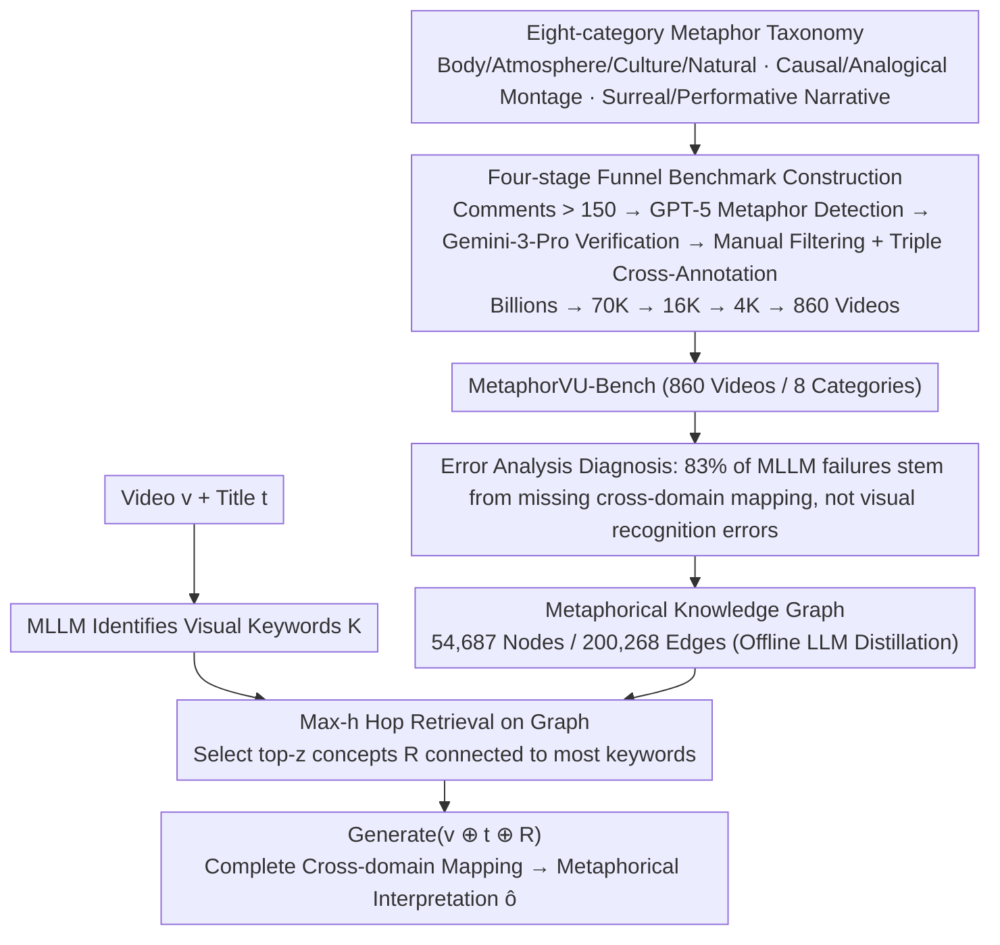

# MetaphorVU: Towards Metaphorical Video Understanding

**Conference**: ICML 2026 Spotlight  
**arXiv**: [2605.25461](https://arxiv.org/abs/2605.25461)  
**Code**: To be confirmed  
**Area**: Video Understanding / High-level Cognition  
**Keywords**: Metaphorical Video Understanding, Multimodal Large Language Models, Cross-domain Mapping, Knowledge Graph Enhancement

## TL;DR
This paper proposes the first metaphorical video understanding benchmark, MetaphorVU-Bench (860 videos + 8 metaphor categories), and an enhancement method, MetaphorBoost. By utilizing a metaphorical knowledge graph with 54K nodes and 200K edges as an external cognitive scaffold, the study quantitatively reveals that the core bottleneck for MLLMs in metaphorical video understanding is the "lack of cross-domain mapping" rather than visual recognition errors. The best-performing model still lags behind humans (83.4) by 17 points.

## Background & Motivation

**Background**: Metaphorical videos are prevalent in social media and public communication, serving as vital media for conveying complex ideas. However, existing MLLM research primarily focuses on literal perception tasks (object recognition, event description), lacking systematic studies on high-level cognitive abilities.

**Limitations of Prior Work**: Current MLLMs struggle to accurately understand metaphorical videos. The state-of-the-art Gemini-3-Pro scores only 63.8 (compared to 83.4 for humans), and many existing reasoning enhancement methods (long CoT, inference-time scaling) provide almost no help for metaphor understanding—indicating the problem is not simply about "not thinking enough."

**Key Challenge**: Through error analysis, it was found that most MLLM failures **do not originate from visual element recognition errors**, but rather from a lack of **cross-domain mapping capability** to link visual elements to underlying concepts—which is the essence of understanding metaphors.

**Goal**: (1) Construct a systematic benchmark for metaphorical video understanding; (2) Diagnose the root cause of current model failures; (3) Design targeted methods to enhance cross-domain mapping.

**Key Insight**: Instead of letting MLLMs blindly perform cross-domain mapping, an external metaphorical knowledge graph can be used as a cognitive scaffold to guide the model in establishing links from visual elements to metaphorical concepts—transforming "unable to think of" into "able to look up."

**Core Idea**: Use a metaphorical knowledge graph as an external cognitive scaffold for inference-time enhancement, helping MLLMs perform cross-domain mapping more effectively.

## Method

### Overall Architecture
Two main contributions: (1) **MetaphorVU-Bench**—the first systematic benchmark for metaphorical video understanding; (2) **MetaphorBoost**—an inference-time enhancement framework based on a metaphorical knowledge graph. The former defines the problem using an eight-category taxonomy and filters 860 metaphorical videos through a four-stage funnel, diagnosing the MLLM bottleneck as "missing cross-domain mapping" via error analysis. The latter constructs a metaphorical knowledge graph offline and completes cross-domain mapping during inference through a three-step process: "Keyword Identification → Multi-hop Retrieval → Concatenated Generation."

### Key Designs

**1. Eight-category Metaphorical Video Taxonomy: Segmenting "Metaphorical Videos" by cognitive mechanisms to provide a theoretical framework.**

To systematically evaluate the metaphor understanding of MLLMs, the first step is to categorize the types of metaphorical videos. Based on multimodal metaphor theory, this paper defines 8 types: Body Language, Atmosphere Language, Cultural Symbol, Naturalistic Symbol, Causal Montage, Analogical Montage, Surreal Narrative, and Performative Narrative. This classification is not arbitrary—the difficulty of cross-domain mapping varies greatly across types (e.g., montage types require establishing implicit causal or analogical relationships between shots, posing the heaviest cognitive load), allowing for fine-grained localization of where MLLMs fail.

**2. High-quality Benchmark Construction via Four-stage Funnel: Filtering 860 truly metaphorical samples from billions of videos.**

Metaphorical videos represent a tiny fraction of massive UGC, making blind filtering prohibitively expensive. MetaphorVU uses a progressively tightening funnel: first filtering by comment count (>150) to reduce billions to 70K; then using GPT-5 to filter for metaphor logic based on video info, subtitles, and comments to 16K; followed by Gemini-3-Pro verification to 4K; and finally manual filtering to reach 860. The annotation phase enforces a unified format (explicitly identifying which visual elements convey which metaphorical meanings) with triple cross-validation. This division of labor uses machines for coarse filtering and humans for refinement, avoiding both unscalable manual efforts and noise in fully automated screening.

**3. Metaphorical Knowledge Graph + Inference-time Enhancement: Replacing "unthinkable cross-domain mapping" with a "searchable external scaffold."**

Error analysis revealed that MLLM failures are mostly not due to missing visual elements, but an inability to build the "visual element → latent concept" link. Even long CoT does not help, suggesting a lack of knowledge rather than compute. MetaphorBoost thus constructs a metaphorical knowledge graph with 54,687 nodes and 200,268 edges as a scaffold. During inference: first, the MLLM identifies video keywords $\mathcal{K} = \{k_1, \ldots, k_m\}$; then, it performs retrieval on the graph with max-h-hops $\mathcal{R} = \text{Top-}z(\bigcup_{i=1}^m \mathcal{N}_\mathcal{G}^h(k_i), \deg(\cdot, \mathcal{K}))$ (selecting the $z$ target nodes connected to the most keywords); finally, it concatenates the retrieved concepts with the video and title to generate the interpretation $\hat{\tau}, \hat{o} = \text{Generate}(v \oplus t \oplus \mathcal{R})$. A graph is used instead of flat text because metaphorical links often require multi-hop queries to jump from literal to figurative; a specialized metaphor graph is used because general common sense (like ConceptNet) was shown to be unhelpful for these specific mappings.

### Loss & Training
MetaphorBoost is a **training-free inference-time enhancement** that does not require updating MLLM parameters. The knowledge graph construction is completed offline via LLM distillation and manual verification.

## Key Experimental Results

### Main Results

| Model | Body L. | Atmosp. | Cultural | Natural | Causal M. | Analog M. | Surreal | Perform. | Average |
|------|---------|---------|----------|---------|-----------|-----------|---------|----------|------|
| Human | 87.8 | 87.5 | 89.1 | 83.8 | 72.0 | 81.5 | 78.1 | 78.0 | **83.4** |
| GPT-5 | 69.9 | 76.3 | 77.4 | 66.6 | 45.0 | 55.4 | 54.9 | 46.1 | 63.7 |
| Gemini-3-Pro | 71.2 | 74.0 | 75.1 | 66.9 | 49.4 | 58.9 | 51.1 | 48.1 | 63.8 |
| Qwen3-VL-8B | 56.0 | 66.1 | 68.8 | 60.8 | 33.2 | 45.0 | 39.3 | 29.2 | 52.0 |
| **MetaphorBoost (Gemini-3-Pro)** | 71.5 | 76.3 | 77.5 | 66.9 | **57.2** | 59.1 | **57.3** | 50.8 | **66.1** |
| **MetaphorBoost (Qwen3-VL-8B)** | **61.8** | **71.0** | **71.8** | 61.3 | 36.7 | 47.1 | **45.7** | 31.5 | **55.9** |

Key Observations: (1) All MLLMs perform particularly poorly on Causal Montage and Analogical Montage (45.0 and 55.4)—these require the most cross-domain mapping, confirming the necessity of enhancement; (2) MetaphorBoost consistently improves all models, with the largest gains in types requiring significant cross-domain mapping (Causal Montage +7.8).

### Ablation Study

| Configuration | Avg. Score | Description |
|------|---------|------|
| MetaphorBoost Full | 55.9 | Full model |
| w/o External Aug. | 53.4 | Direct MLLM query without KG, -2.5 |
| w/o Graph Structure | 54.3 | Raw text retrieval instead of KG, -1.6 |
| w/o Metaphor-oriented | 52.5 | General common sense (ConceptNet) instead, -3.4 |

All three key factors are effective—external knowledge compensates for MLLM defects (-2.5), graph structure is more effective than text (-1.6), and metaphor-specific knowledge outperforms general common sense (-3.4).

### Key Findings
- Improvements in cross-domain mapping require fine-grained, structured, and metaphor-specific knowledge—all three characteristics are essential.
- The gain is larger for weaker base models (Qwen3-VL-8B +3.8% > Gemini-3-Pro +2.3%)—MetaphorBoost acts as a compensatory enhancement.
- The best combination (Gemini-3-Pro + MetaphorBoost = 66.1) still lags behind humans (83.4) by 17.3 points—indicating cross-domain mapping is only a partial bottleneck and substantial room for improvement remains.

## Highlights & Insights
- **Systematic + Complete Benchmark**: The first metaphorical video understanding benchmark with a theoretical foundation (8 categories), substantial scale (860 videos), and strict quality control.
- **Diagnostic Error Analysis**: By quantifying failures (83% from mapping defects vs. recognition errors), the paper accurately pinpoints the Achilles' heel of MLLM metaphor understanding.
- **Effective Test-time Augmentation**: Consistently improves various MLLMs without retraining; the multi-hop nature of the KG is more effective than flat text.
- **Value of Metaphorical Knowledge**: Ablation clearly demonstrates a 3.4-point advantage for metaphor-specific knowledge over general common sense, suggesting the use of domain-specific knowledge bases for high-level cognitive tasks.

## Limitations & Future Work
- Knowledge Graph Coverage: 54K nodes might not cover novel or obscure metaphors.
- Keyword Sensitivity: The first step of MetaphorBoost depends on the MLLM; identification errors can propagate through the query process.
- Model Scale Limitations: Evaluated only on MLLMs $\leq$ 235B; performance on larger models remains unknown.
- The 17.3-point gap between the best combination (66.1) and humans (83.4) suggests exploring deeper multi-hop reasoning or better vision-concept alignment.

## Related Work & Insights
- **vs. Advertising Metaphor Work** (Kalarani 2024, Long 2025): While they focus on specific domains (ads), this work provides systematic classification and multi-source data for broader coverage and fine-grained diagnosis.
- **vs. MMR-V** (Zhu 2026): MMR-V evaluates a broad spectrum of reasoning (metaphor being just one); this work depth-focuses on metaphors with more detailed analysis.

## Rating
- Novelty: ⭐⭐⭐⭐⭐ First systematic benchmark + diagnostic analysis + knowledge enhancement method addressing high-level cognitive bottlenecks in MLLMs.
- Experimental Thoroughness: ⭐⭐⭐⭐⭐ Evaluated 11 MLLMs + 5 reasoning enhancement methods + detailed error analysis + multi-angle ablation, covering both open and closed models.
- Writing Quality: ⭐⭐⭐⭐ Clear logic, progressing deeply from diagnosis to design to verification; ablation experiments are meticulously designed.
- Value: ⭐⭐⭐⭐⭐ Systematic benchmark fills a research gap; diagnostic results provide direct guidance for MLLM improvement; knowledge enhancement logic is transferable to other high-level cognitive tasks.

<!-- RELATED:START -->

## Related Papers

- [\[CVPR 2026\] Video Panels for Long Video Understanding](../../CVPR2026/video_understanding/video_panels_for_long_video_understanding.md)
- [\[ICML 2026\] Video-MTR: Reinforced Multi-Turn Reasoning for Long Video Understanding](video-mtr_reinforced_multi-turn_reasoning_for_long_video_understanding.md)
- [\[CVPR 2026\] Towards Sparse Video Understanding and Reasoning](../../CVPR2026/video_understanding/towards_sparse_video_understanding_and_reasoning.md)
- [\[CVPR 2026\] Efficient Frame Selection for Long Video Understanding via Reinforcement Learning](../../CVPR2026/video_understanding/efficient_frame_selection_for_long_video_understanding_via_reinforcement_learnin.md)
- [\[ICML 2026\] VideoTemp-o3: Harmonizing Temporal Grounding and Video Understanding in Agentic Thinking](videotemp-o3_harmonizing_temporal_grounding_and_video_understanding_in_agentic_t.md)

<!-- RELATED:END -->
