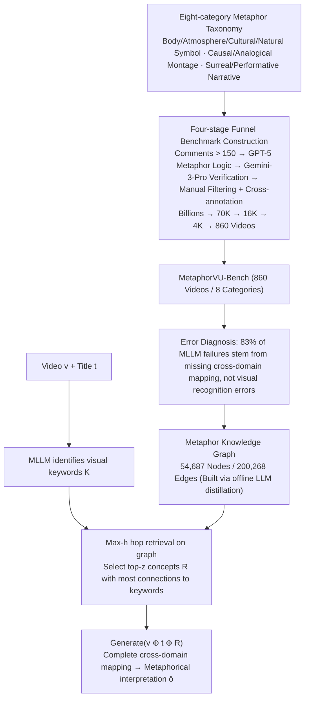

# MetaphorVU: Towards Metaphorical Video Understanding

**Conference**: ICML 2026 Spotlight  
**arXiv**: [2605.25461](https://arxiv.org/abs/2605.25461)  
**Code**: To be confirmed  
**Area**: Video Understanding / High-order Cognition  
**Keywords**: Metaphorical Video Understanding, Multimodal Large Language Models, Cross-domain Mapping, Knowledge Graph Enhancement

## TL;DR
This paper proposes the first metaphorical video understanding benchmark, MetaphorVU-Bench (860 videos + 8-category metaphor taxonomy), and an enhancement method, MetaphorBoost. By utilizing a metaphor knowledge graph with 54K nodes and 200K edges as an external cognitive scaffold, the study quantitatively reveals that the core bottleneck for MLLMs in metaphorical video understanding is the "lack of cross-domain mapping" rather than visual recognition errors. The optimal model still lags behind humans (83.4) by 17 points.

## Background & Motivation

**Background**: Metaphorical videos are prevalent in social media and public communication, serving as vital media for conveying complex ideas. However, existing MLLM research primarily focuses on literal perception tasks (object recognition, event description), lacking systematic studies on high-order cognitive abilities.

**Limitations of Prior Work**: Current MLLMs struggle to accurately understand metaphorical videos. Even the state-of-the-art Gemini-3-Pro scores only 63.8 (compared to 83.4 for humans), and many existing reasoning enhancement methods (long CoT, test-time scaling) provide almost no help for metaphor understanding—indicating the problem is not a lack of "thinking effort."

**Key Challenge**: Error analysis reveals that most MLLM failures **do not stem from visual element recognition errors**, but rather a lack of **cross-domain mapping ability** to link visual elements to underlying concepts—which is the essence of understanding metaphors.

**Goal**: (1) Construct a systematic metaphorical video understanding benchmark; (2) diagnose the root causes of current model failures; (3) design targeted methods to enhance cross-domain mapping.

**Key Insight**: Rather than letting MLLMs blindly perform cross-domain mapping, an external metaphor knowledge graph can serve as a cognitive scaffold to guide the model in establishing links from visual elements to metaphorical concepts—transforming "unthinkable" connections into "searchable" ones.

**Core Idea**: Use a metaphor knowledge graph as an external cognitive scaffold for test-time augmentation to help MLLMs perform cross-domain mapping more effectively.

## Method

### Overall Architecture
Two primary contributions: (1) **MetaphorVU-Bench**—the first systematic metaphorical video understanding benchmark; (2) **MetaphorBoost**—a test-time augmentation framework based on a metaphor knowledge graph. The former defines the problem through an eight-category taxonomy and filters 860 metaphorical videos via a four-stage funnel, diagnosing the MLLM bottleneck as "missing cross-domain mapping" through error analysis. The latter constructs a metaphor knowledge graph offline and completes cross-domain mapping during inference via a three-step process: "Keyword recognition → Multi-hop retrieval → Concatenated generation."

### Key Designs

**1. Eight-category Metaphorical Video Taxonomy: Structuring "Metaphorical Videos" by Cognitive Mechanism**

To systematically evaluate the metaphor understanding of MLLMs, the first step is defining the types of metaphorical videos. Based on multimodal metaphor theory, this paper defines 8 types: Body Language, Atmosphere Language, Cultural Symbol, Naturalistic Symbol, Causal Montage, Analogical Montage, Surreal Narrative, and Performative Narrative. This classification provides a theoretical framework—different types represent varying levels of cross-domain mapping difficulty (e.g., montage requires establishing implicit causal or analogical relationships between shots, imposing the heaviest cognitive load), allowing for fine-grained localization of where MLLMs fail.

**2. High-quality Benchmark Construction via Four-stage Funnel: Filtering 860 Authentic Samples from Billions**

Metaphorical videos represent a tiny fraction of massive UGC, making blind filtering prohibitive. MetaphorVU uses a progressively tightening funnel: first filtering by comment count (> 150) to reduce billions to 70K, then using GPT-5 to judge metaphor logic based on video info, subtitles, and comments to reach 16K. Gemini-3-Pro then validates candidates to 4K, followed by manual filtering to reach 860. The annotation phase enforces a unified format (explicitly identifying which visual elements convey which metaphorical meanings) with three-way cross-verification. This "machine coarse-filtering + human fine-filtering" approach avoids both the unscalability of purely manual efforts and the noise of purely automated ones.

**3. Metaphor Knowledge Graph + Test-time Augmentation: Replacing "Unreachable Mappings" with "Searchable Scaffolds"**

Error analysis shows MLLM failures are rarely due to missed visual elements but rather the inability to build the "visual element → latent concept" cross-domain bridge. Since long-thinking (CoT) does not help, the bottleneck is knowledge, not compute. MetaphorBoost constructs a metaphor knowledge graph (54,687 nodes, 200,268 edges) as an external scaffold. During inference: the MLLM first identifies keywords $\mathcal{K} = \{k_1, \ldots, k_m\}$; then performs max-h-hop retrieval $\mathcal{R} = \text{Top-}z(\bigcup_{i=1}^m \mathcal{N}_\mathcal{G}^h(k_i), \deg(\cdot, \mathcal{K}))$ to find the $z$ nodes most connected to keywords; finally, retrieved concepts are concatenated with the video and title to generate interpretations $\hat{\tau}, \hat{o} = \text{Generate}(v \oplus t \oplus \mathcal{R})$. A graph is used instead of flat text because metaphorical links often require multi-hop jumps from literal to figurative, and a specialized metaphor graph outperformed general knowledge graphs like ConceptNet in ablation studies.

### Loss & Training
MetaphorBoost is a **training-free test-time augmentation** that does not require updating MLLM parameters. The knowledge graph construction is completed offline via LLM distillation and manual verification.

## Key Experimental Results

### Main Results

| Model | Body L. | Atmosp. | Cultural | Natural | Causal M. | Analog M. | Surreal | Perform. | Average |
|-------|---------|---------|----------|---------|-----------|-----------|---------|----------|---------|
| Human | 87.8 | 87.5 | 89.1 | 83.8 | 72.0 | 81.5 | 78.1 | 78.0 | **83.4** |
| GPT-5 | 69.9 | 76.3 | 77.4 | 66.6 | 45.0 | 55.4 | 54.9 | 46.1 | 63.7 |
| Gemini-3-Pro | 71.2 | 74.0 | 75.1 | 66.9 | 49.4 | 58.9 | 51.1 | 48.1 | 63.8 |
| Qwen3-VL-8B | 56.0 | 66.1 | 68.8 | 60.8 | 33.2 | 45.0 | 39.3 | 29.2 | 52.0 |
| **MetaphorBoost (Gemini-3-Pro)** | 71.5 | 76.3 | 77.5 | 66.9 | **57.2** | 59.1 | **57.3** | 50.8 | **66.1** |
| **MetaphorBoost (Qwen3-VL-8B)** | **61.8** | **71.0** | **71.8** | 61.3 | 36.7 | 47.1 | **45.7** | 31.5 | **55.9** |

Key Observations: (1) All MLLMs perform particularly poorly on Causal and Analogical Montage (45.0 and 55.4), which require the most cross-domain mapping, confirming the need for mapping enhancement. (2) MetaphorBoost consistently improves performance across models, with the largest gains in categories requiring heavy cross-domain mapping (Causal Montage +7.8).

### Ablation Study

| Configuration | Average Score | Description |
|---------------|---------------|-------------|
| MetaphorBoost Full | 55.9 | Full model |
| w/o External Augmentation | 53.4 | Direct querying without KG, -2.5 |
| w/o Graph Structure | 54.3 | Raw text retrieval instead of KG, -1.6 |
| w/o Metaphor-oriented | 52.5 | Replaced by general ConceptNet, -3.4 |

All three factors are effective: external knowledge compensates for MLLM deficits (-2.5), the graph structure is more effective than text (-1.6), and metaphor-specific knowledge outperforms general common sense (-3.4).

### Key Findings
- Improvements in cross-domain mapping require fine-grained, structured, and metaphor-specific knowledge—all three characteristics are essential.
- The improvement margin is larger for weaker base models (Qwen3-VL-8B +3.8% > Gemini-3-Pro +2.3%), suggesting MetaphorBoost is a compensatory enhancement.
- Even the best combination (Gemini-3-Pro + MetaphorBoost = 66.1) remains 17.3 points behind humans (83.4), indicating that cross-domain mapping is only a partial bottleneck and substantial room for improvement remains.

## Highlights & Insights
- **Systematic and Comprehensive Benchmark**: The first metaphorical video understanding benchmark features a solid theoretical foundation (8 categories), significant data scale (860 videos), and strict quality control.
- **Diagnostic Error Analysis**: By quantifying failures (83% from mapping defects vs. recognition errors), the study precisely identifies the core issue in MLLM metaphor understanding.
- **Effective Test-time Augmentation**: Provides stable improvements to various MLLMs without retraining; the multi-hop nature of the knowledge graph is more effective than flat text.
- **Value of Metaphorical Knowledge**: Ablations prove metaphor-specific knowledge offers a 3.4-point advantage over general common sense, inspiring the use of domain-specific bases for high-order cognitive tasks.

## Limitations & Future Work
- Knowledge Graph Coverage: 54K nodes may not cover novel or obscure metaphors.
- Keyword Recognition Accuracy: MetaphorBoost's first step relies on the MLLM; recognition errors propagate to retrieval.
- Model Scale Limitations: Only $\leq$ 235B MLLMs were evaluated; performance of larger models remains unknown.
- Gap to Human Performance: The 17.3-point gap suggests exploring deeper multi-hop reasoning or visual-concept alignment.

## Related Work & Insights
- **vs. Ad Metaphor Work** (Kalarani 2024, Long 2025): While prior works focus on specific domains like advertising, this paper covers a broader range with systematic taxonomy and multi-source data while providing fine-grained diagnostics.
- **vs. MMR-V** (Zhu 2026): MMR-V evaluates a broad spectrum of reasoning (metaphor being one subset), whereas this work focuses deeply on metaphors with more detailed analysis.

## Rating
- Novelty: ⭐⭐⭐⭐⭐ First systematic benchmark + diagnostic analysis + knowledge enhancement, addressing high-order cognitive bottlenecks via a tripartite approach.
- Experimental Thoroughness: ⭐⭐⭐⭐⭐ 11 MLLMs + 5 reasoning augmentation methods + detailed error analysis + multi-angle ablations, covering both open and closed models.
- Writing Quality: ⭐⭐⭐⭐ Clear logic, progressing from diagnosis to design to verification; meticulous ablation design.
- Value: ⭐⭐⭐⭐⭐ The systematic benchmark fills a research gap; diagnostic results directly guide MLLM improvements; the knowledge enhancement approach is transferable to other cognitive tasks.

<!-- RELATED:START -->

## Related Papers

- [\[CVPR 2026\] Video Panels for Long Video Understanding](../../CVPR2026/video_understanding/video_panels_for_long_video_understanding.md)
- [\[ICML 2026\] Video-MTR: Reinforced Multi-Turn Reasoning for Long Video Understanding](video-mtr_reinforced_multi-turn_reasoning_for_long_video_understanding.md)
- [\[ICML 2026\] VideoTemp-o3: Harmonizing Temporal Grounding and Video Understanding in Agentic Thinking](videotemp-o3_harmonizing_temporal_grounding_and_video_understanding_in_agentic_t.md)
- [\[CVPR 2026\] InternVideo-Next: Towards World-Understanding Video Models](../../CVPR2026/video_understanding/internvideo-next_towards_world-understanding_video_models.md)
- [\[ICLR 2026\] VUDG: A Dataset for Video Understanding Domain Generalization](../../ICLR2026/video_understanding/vudg_a_dataset_for_video_understanding_domain_generalization.md)

<!-- RELATED:END -->
