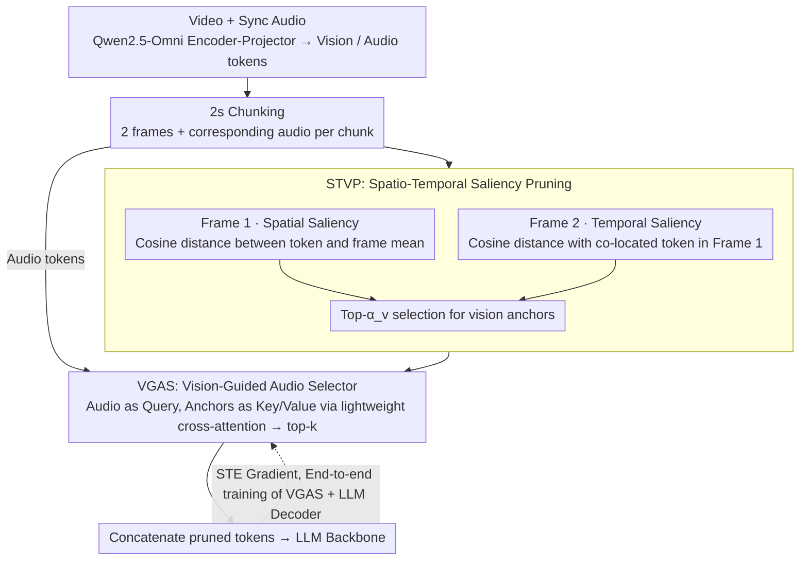

# OmniSIFT: Modality-Asymmetric Token Compression for Efficient Omni-modal Large Language Models

**Conference**: ICML 2026  
**arXiv**: [2602.04804](https://arxiv.org/abs/2602.04804)  
**Code**: https://github.com/dingyue772/OmniSIFT  
**Area**: Multimodal VLM / Video Understanding / Model Compression  
**Keywords**: Omni-LLM, Token Compression, Video-Audio Understanding, Spatio-Temporal Pruning, Vision-Guided

## TL;DR
This paper identifies that existing "modality-symmetric" token compression in Omni-LLMs is suboptimal. It proposes OmniSIFT—a two-stage asymmetric compression framework that first prunes video redundancy via spatio-temporal saliency to obtain "vision anchors," which then guide audio selection. Introducing only 4.85M additional parameters, OmniSIFT consistently outperforms existing compression baselines and even the original model on Qwen2.5-Omni-7B while retaining only 25% of tokens.

## Background & Motivation

**Background**: Omni-LLMs (e.g., Qwen2.5-Omni, GPT-4o, Gemini) unify video, audio, and text into autoregressive LLMs for joint reasoning. However, high-density continuous video frames and high-temporal-resolution audio encoding generate over 20K tokens for a 20-second multimodal clip, causing inference costs to explode.

**Limitations of Prior Work**: While vision-centric MLLM token compression (FastV, VidCom2, TimeChat-Online, etc.) is well-studied, direct transfer to Omni-LLMs is ineffective. Current Omni compression methods fall into two categories: (1) modality-decoupled—compressing audio and video independently, ignoring cross-modal dependencies; (2) modality-symmetric—e.g., OmniZip uses audio attention scores to guide video pruning (hindering FlashAttention compatibility), or EchoingPixels adds 4 LLM decoder layers for global contextualization (high cost, delayed compression). Both treat video and audio as equal-scale information sources.

**Key Challenge**: Human perception of video and audio is inherently asymmetric—video redundancy can be estimated within the visual stream (intra-frame spatial and inter-frame temporal redundancy), but audio saliency is more context-dependent, often requiring visual scenes as semantic anchors (e.g., visible speakers or visually supported events). Treating both modalities symmetrically collapses the compression task into "temporal position selection" while ignoring modality-specific semantic cues.

**Goal**: (1) Enable compression following a vision-guided asymmetric paradigm; (2) maintain lightweight design (extra parameters $\ll$ backbone); (3) maintain compatibility with efficient operators like FlashAttention (not dependent on attention scores).

**Key Insight**: Prune video redundancy first using purely structural signals (cosine distance) to obtain a compact set of "vision anchors," then use these anchors to guide audio token selection. This allows video compression to rely on intra-modal signals while audio compression uses cross-modal conditions.

**Core Idea**: A modality-asymmetric, vision-guided two-stage compression framework—STVP (Spatio-Temporal Video Pruning) performs dual-axis pruning for intra-frame spatial and inter-frame temporal saliency, while VGAS (Vision-Guided Audio Selector) selects audio tokens conditioned on the pruned vision anchors.

## Method

### Overall Architecture
Input: Video $\mathcal{V}$ and synchronous audio $\mathcal{A}$ are mapped by the Qwen2.5-Omni encoder-projector into token sequences $\mathbf{Z}_v \in \mathbb{R}^{N_v \times D}$ and $\mathbf{Z}_a \in \mathbb{R}^{N_a \times D}$. To maintain temporal alignment, tokens are grouped into 2-second chunks $\mathcal{C}_t = [\mathbf{Z}_v^{(t)}; \mathbf{Z}_a^{(t)}]$, each containing 2 visual frames and corresponding audio. OmniSIFT executes two stages serially at the chunk level: (1) STVP prunes visual redundancy to obtain compressed visual sequences $\hat{\mathbf{Z}}_v^{(t)}$; (2) VGAS selects audio tokens from $\mathbf{Z}_a^{(t)}$ using $\hat{\mathbf{Z}}_v^{(t)}$ as a condition. The framework is end-to-end differentiable (using straight-through estimator for top-k selection), optimizing token selection to preserve downstream performance.

### Key Designs

**1. STVP: Spatio-Temporal Dual-Axis Saliency Pruning**

Video tokens contain two types of redundancy: patches similar to the background within the same frame (spatial redundancy) and patches that remain unchanged relative to the previous frame (temporal redundancy). STVP processes the two frames in a 2-second chunk separately. For the first frame $\mathbf{F}_1^{(t)}$, spatial saliency is calculated by mean-pooling the frame representation $\bar{\mathbf{v}}_1^{(t)} = \frac{1}{n_p}\sum_i \mathbf{v}_{1,i}^{(t)}$. Each token's score is its cosine distance from the mean: $s_{1,i}^{(t)} = 1 - \frac{\mathbf{v}_{1,i}^{(t)} \cdot \bar{\mathbf{v}}_1^{(t)}}{\|\mathbf{v}_{1,i}^{(t)}\|\|\bar{\mathbf{v}}_1^{(t)}\|}$, where high scores indicate distinct content from the background. For the second frame $\mathbf{F}_2^{(t)}$, temporal saliency uses positional encoding to compute the cosine distance from the co-located token in the first frame: $s_{2,i}^{(t)} = 1 - \frac{\mathbf{v}_{2,i}^{(t)} \cdot \mathbf{v}_{1,i}^{(t)}}{\|\mathbf{v}_{2,i}^{(t)}\|\|\mathbf{v}_{1,i}^{(t)}\|}$, where high scores highlight "moving" areas. For each frame, top-$\hat{n}_p = \alpha_v n_p$ tokens are selected based on the retention ratio $\alpha_v = 1 - \rho_v$, forming $\hat{\mathbf{Z}}_v^{(t)} = [\hat{\mathbf{F}}_1^{(t)}; \hat{\mathbf{F}}_2^{(t)}]$. Using cosine distance rather than attention scores ensures compatibility with FlashAttention. Separate spatial/temporal criteria prevent interference between the two axes within a single frame.

**2. VGAS: Vision-Guided Audio Token Selection**

This is the core of the asymmetric design. OmniSIFT treats the STVP-pruned visual tokens $\hat{\mathbf{Z}}_v^{(t)}$ as a "pool of visual anchors." A **lightweight cross-attention** layer (8 heads, hidden dimension 512, with an MLP scoring head) computes the saliency of each audio token: audio tokens serve as query $\mathbf{Q}_a$, while visual anchors serve as key $\mathbf{K}_v$ and value $\mathbf{V}_v$. The attention output passes through the scoring head to produce $s_{a,j}^{(t)}$, and top-k tokens are selected based on $\alpha_a$. Thus, audio saliency is entirely conditioned on the visual scene rather than internal audio signals (unlike OmniZip which uses audio attention). This aligns with perceptual science (Koppen 2008, Zhao 2018), which suggests vision often serves as the semantic anchor for audio saliency.

**3. STE Fine-tuning & Lightweight Budget**

Since top-k selection is non-differentiable, OmniSIFT utilizes a straight-through estimator (STE). During the forward pass, a binary mask $m_j$ is generated (1 if in top-k, 0 otherwise), feeding only selected tokens to the LLM. In the backward pass, an identity proxy gradient $\partial m_j/\partial s_{a,j}^{(t)}\approx 1$ allows gradients to flow back to the saliency scores. STVP involves no learnable parameters, as it only computes cosine distances. The 4.85M parameters reside entirely in the VGAS cross-attention and scoring head (less than 0.1% of a 7B backbone). During training, the **LLM decoder and VGAS module are fine-tuned** (learning rate $1\times10^{-5}$, batch size 128). This "lightweight plugin" does not extend the inference path and maintains lower latency than attention-dependent methods like OmniZip.

### Loss & Training
Standard next-token prediction loss is used. With STE handling non-differentiable top-k selection, the **LLM decoder and VGAS module are fine-tuned** (STVP has no learnable parameters) with a learning rate of $1\times10^{-5}$ and batch size of 128. Retention ratios $\rho_v, \rho_a$ are hyperparameters; the paper primarily evaluates 35% and 25% ratios.

## Key Experimental Results

### Main Results
OmniSIFT is compared against OmniZip, Random, and DyCoke baselines and the full-token model across 5 audio-visual benchmarks: WorldSense, OmniVideoBench, VideoMME, video-SALMONN-2, and DailyOmni. Backbones include Qwen2.5-Omni-7B and 3B.

Results for Qwen2.5-Omni-7B at 25% retention:

| Method | Retention | WorldSense ↑ | OmniVideoBench ↑ | VideoMME Avg ↑ | video-SALMONN-2 Total ↓ |
|------|-------|--------------|-------------------|----------------|-------------------------|
| Full Tokens | 100% | 49.7 | 35.6 | 67.6 | 48.1 |
| OmniZip | 25% | 48.1 | 34.1 | 66.0 | 57.2 |
| Random | 25% | 47.1 | 32.6 | 66.1 | 56.9 |
| DyCoke | 25% | 48.1 | 34.1 | 65.9 | 56.3 |
| **Ours** | **25%** | **49.9** | **35.4** | **68.2** | **51.2** |

At 35% retention, Ours achieves WorldSense (50.0), OmniVideoBench (35.6), and VideoMME Avg (68.3), matching or exceeding the full-token baseline (49.7 / 35.6 / 67.6).

### Ablation Study
Comparisons on Qwen2.5-Omni-3B confirm that the performance gains hold at smaller scales:

| Method | Retention | WorldSense ↑ | OmniVideoBench ↑ | video-SALMONN-2 Total ↓ |
|------|-------|--------------|-------------------|-------------------------|
| Full Tokens | 100% | 45.8 | 33.5 | 53.6 |
| OmniZip | 25% | 43.8 | 32.4 | 62.1 |
| **Ours** | **25%** | **45.8** | **33.1** | **58.3** |

Parameter and Latency: Ours introduces only 4.85M parameters and achieves lower inference latency than the training-free OmniZip, due to bypassing attention score computation.

### Key Findings
- **Outperforming full-token models at 25% retention**: On WorldSense and VideoMME, Ours exceeds Full Tokens (49.9 vs 49.7, 68.2 vs 67.6), indicating that many tokens are redundant or noisy; pruning them improves the signal-to-noise ratio.
- **Asymmetric > Symmetric**: The gap between Ours and OmniZip (SOTA symmetric method) is consistent across benchmarks, confirming that vision-guided audio is a superior paradigm.
- **Cross-model Robustness**: Gains are maintained across 7B and 3B backbones, showing scale-invariance.
- **Improved Hallucination Metrics**: video-SALMONN-2 Total (Miss + Hal) scores dropped from 57.2 (OmniZip) to 51.2 (Ours), suggesting that preserving correct cross-modal alignment reduces model hallucinations.

## Highlights & Insights
- **Deriving compression from perceptual science**: Designing asymmetric compression based on human audio-visual processing is a highly effective approach for Omni-LLMs.
- **Avoidance of Attention Score Dependency**: Using cosine distance for saliency ensures FlashAttention compatibility, a valuable engineering choice compared to attention-locked methods like OmniZip.
- **4.85M parameters + Low Latency**: Unlike EchoingPixels (heavy decoder layers) or OmniZip (attention overhead), Ours provides a true "plugin-level" solution.
- **"Less is More"**: The fact that 25% tokens can outperform 100% suggests high token noise in Omni models; future work could explore even more aggressive compression.
- **Split Spatio-Temporal Processing**: Processing frames separately for spatial and temporal criteria is a simple yet effective technique to avoid dual-axis interference.

## Limitations & Future Work
- **Fixed 2s Chunk Granularity**: Tied to Qwen2.5-Omni’s alignment; portability to other models with different chunk sizes would require re-tuning.
- **Fixed 2-Frame Assumption**: In fast-motion long videos, 2 frames may be insufficient; the paper does not address adaptive chunking.
- **Query-Agnostic Budget**: VGAS uses a fixed retention ratio regardless of the query. Task-adaptive, query-guided pruning remains an unexplored but likely superior path.
- **Audio-Guided Vision Scenarios**: In "audio-primary" scenes (e.g., music with a static album cover), whether unidirectional vision guidance remains optimal is worth investigating.
- **Training Data and Generalization**: Stability across new domains or datasets requires further experimentation.

## Related Work & Insights
- **vs. OmniZip (Modality-Symmetric)**: Ours outperforms it on all 5 benchmarks while being FlashAttention compatible.
- **vs. EchoingPixels (Modality-Symmetric)**: Ours uses 4.85M parameters for early compression, offering much better engineering efficiency than adding layers.
- **vs. FASTAV / DyCoke**: These primarily prune during inference; Ours compresses before the LLM input, allowing for independent deployment.
- **vs. Vision-Centric Methods (VidCom2 / TimeChat-Online)**: Ours extends the logic of spatial/temporal redundancy to include audio guidance.

## Rating
- Novelty: ⭐⭐⭐⭐ Clear rejection of the symmetric paradigm; the combination of cosine saliency and vision-guided audio is a novel design for Omni-LLMs.
- Experimental Thoroughness: ⭐⭐⭐⭐ Multiple benchmarks, model sizes, and ratios; parameter/latency analysis provided.
- Writing Quality: ⭐⭐⭐⭐ Logical flow from principles to architecture and experimental evaluation.
- Value: ⭐⭐⭐⭐ High industrial value as a practical plugin with 25% token retention and no performance drop.

<!-- RELATED:START -->

## Related Papers

- [\[CVPR 2026\] Token Reduction via Local and Global Contexts Optimization for Efficient Video Large Language Models](../../CVPR2026/video_understanding/token_reduction_via_local_and_global_contexts_optimization_for_efficient_video_l.md)
- [\[ICLR 2026\] FlashVID: Efficient Video Large Language Models via Training-free Tree-Based Spatiotemporal Token Merging](../../ICLR2026/video_understanding/flashvid_efficient_video_large_language_models_via_training-free_tree-based_spat.md)
- [\[CVPR 2025\] VoCo-LLaMA: Towards Vision Compression with Large Language Models](../../CVPR2025/video_understanding/voco-llama_towards_vision_compression_with_large_language_models.md)
- [\[CVPR 2026\] StreamingTOM: Streaming Token Compression for Efficient Video Understanding](../../CVPR2026/video_understanding/streamingtom_streaming_token_compression_for_efficient_video_understanding.md)
- [\[CVPR 2026\] An Efficient Token Compression Framework for Visual Object Tracking](../../CVPR2026/video_understanding/an_efficient_token_compression_framework_for_visual_object_tracking.md)

<!-- RELATED:END -->
