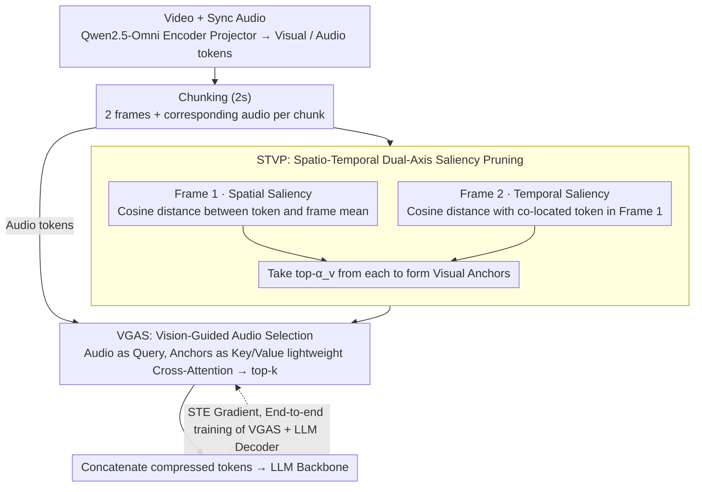

# OmniSIFT: Modality-Asymmetric Token Compression for Efficient Omni-modal Large Language Models

**Conference**: ICML 2026  
**arXiv**: [2602.04804](https://arxiv.org/abs/2602.04804)  
**Code**: https://github.com/dingyue772/OmniSIFT  
**Area**: Multimodal VLM / Video Understanding / Model Compression  
**Keywords**: Omni-LLM, Token Compression, Video-Audio Understanding, Spatio-Temporal Pruning, Vision-Guided

## TL;DR
This paper argues that existing Omni-LLM token compression methods are suboptimal due to their "symmetric" treatment of audio and video. It proposes OmniSIFT—a two-stage asymmetric compression framework that first prunes video redundancy via spatio-temporal saliency to obtain "visual anchors," which then guide audio selection. With only 4.85M additional parameters, it consistently outperforms existing baselines and even the original model on Qwen2.5-Omni-7B while retaining only 25% of tokens.

## Background & Motivation

**Background**: Omni-LLMs (Qwen2.5-Omni, GPT-4o, Gemini) unify video, audio, and text into autoregressive LLMs for joint reasoning. However, video consists of high-density continuous frames, and audio requires high-temporal resolution encoding. A 20-second multimodal clip can generate 20K+ tokens, causing inference costs to explode due to long sequences.

**Limitations of Prior Work**: While extensive token compression research exists for vision-centric MLLMs (FastV, VidCom2, TimeChat-Online, etc.), direct transfer to Omni-LLMs is problematic. Existing Omni compression methods fall into two categories: (1) modality-decoupled—compressing audio and video independently, ignoring cross-modal semantic dependencies; (2) modality-symmetric—OmniZip uses audio attention scores to guide video pruning (relying on attention scores makes it incompatible with FlashAttention), and EchoingPixels adds 4 LLM decoder layers for global cross-modal contextualization (high cost, delayed compression). Both treat audio and video as information sources of equal magnitude.

**Key Challenge**: Human perception of video and audio is inherently asymmetric. Video redundancy can be estimated from within the visual stream (intra-frame spatial and inter-frame temporal redundancy), but audio saliency is more context-dependent, often requiring the visual scene as a semantic anchor (e.g., a visible speaker or a visually supported event). Treating the two modalities symmetrically collapses the compression task into "temporal position selection" while ignoring modality-specific semantic cues.

**Goal**: (1) Establish an asymmetric paradigm for compression following visual guidance; (2) Maintain lightweight overhead (extra parameters ≪ backbone); (3) Ensure compatibility with efficient operators like FlashAttention (independent of attention scores).

**Key Insight**: Prune video redundancy using pure structural signals (cosine distance) to obtain a compact set of "visual anchors," then use these anchors to guide audio token selection. This allows video compression to use intra-modal signals while audio compression utilizes cross-modal conditions, providing clear role differentiation.

**Core Idea**: A modality-asymmetric, vision-guided two-stage compression: STVP (Spatio-Temporal Video Pruning) performs dual-axis pruning for intra-frame spatial and inter-frame temporal saliency, followed by VGAS (Vision-Guided Audio Selector), which uses the pruned visual anchors as conditions to select audio tokens.

## Method

### Overall Architecture
Input: Video $\mathcal{V}$ and synchronized audio $\mathcal{A}$ are mapped by the Qwen2.5-Omni encoder-projector into token sequences $\mathbf{Z}_v \in \mathbb{R}^{N_v \times D}$ and $\mathbf{Z}_a \in \mathbb{R}^{N_a \times D}$. To maintain temporal alignment, video and audio tokens are partitioned into 2-second chunks $\mathcal{C}_t = [\mathbf{Z}_v^{(t)}; \mathbf{Z}_a^{(t)}]$, each containing 2 visual frames and corresponding audio. OmniSIFT executes two stages serially at the chunk level: (1) STVP prunes visual redundancy in each chunk to obtain a compressed visual sequence $\hat{\mathbf{Z}}_v^{(t)}$; (2) VGAS uses $\hat{\mathbf{Z}}_v^{(t)}$ as a condition to select audio tokens from $\mathbf{Z}_a^{(t)}$. The entire framework is end-to-end differentiable (using a straight-through estimator for top-k selection), and training optimizes token selection to preserve downstream performance.

### Key Designs

**1. STVP: Spatio-Temporal Dual-Axis Saliency Pruning**

Video tokens contain two types of redundancy: patches similar to the background in the same frame (spatial redundancy) and patches that remain unchanged across adjacent frames (temporal redundancy). STVP processes the two frames of a 2-second chunk separately. For the first frame $\mathbf{F}_1^{(t)}$, spatial saliency is calculated by first mean-pooling the frame representation $\bar{\mathbf{v}}_1^{(t)} = \frac{1}{n_p}\sum_i \mathbf{v}_{1,i}^{(t)}$. The score for each token is its cosine distance from the mean $s_{1,i}^{(t)} = 1 - \frac{\mathbf{v}_{1,i}^{(t)} \cdot \bar{\mathbf{v}}_1^{(t)}}{\|\mathbf{v}_{1,i}^{(t)}\|\|\bar{\mathbf{v}}_1^{(t)}\|}$; high scores indicate regions most distinct from the background. For the second frame $\mathbf{F}_2^{(t)}$, temporal saliency is calculated using positional encoding correspondence; the score is the cosine distance from the token at the same position in the first frame $s_{2,i}^{(t)} = 1 - \frac{\mathbf{v}_{2,i}^{(t)} \cdot \mathbf{v}_{1,i}^{(t)}}{\|\mathbf{v}_{2,i}^{(t)}\|\|\mathbf{v}_{1,i}^{(t)}\|}$; high scores denote "moving" regions. Tokens are selected according to the visual retention ratio $\alpha_v = 1 - \rho_v$ to form $\hat{\mathbf{Z}}_v^{(t)} = [\hat{\mathbf{F}}_1^{(t)}; \hat{\mathbf{F}}_2^{(t)}]$. Using cosine distance instead of attention scores ensures compatibility with FlashAttention.

**2. VGAS: Vision-Guided Audio Token Selection**

This is the core of the asymmetric design. OmniSIFT treats the visual tokens $\hat{\mathbf{Z}}_v^{(t)}$ retained by STVP as a "visual anchor pool." A **lightweight cross-attention** layer (8 heads, 512 hidden dimensions, with an MLP scoring head) calculates the saliency of each audio token: audio tokens serve as query $\mathbf{Q}_a$, while visual anchors serve as key $\mathbf{K}_v$ and value $\mathbf{V}_v$. The attention output passes through the scoring head to obtain $s_{a,j}^{(t)}$, and the top-k tokens are selected based on ratio $\alpha_a$. Thus, audio saliency is entirely conditional on the visual scene rather than internal audio signals. This is supported by perceptual science, which suggests that audio saliency often depends on visual anchors (e.g., whether a speaker is visible).

**3. Mechanism: STE End-to-End Fine-tuning and Lightweight Parameter Budget**

Since top-k selection is non-differentiable, OmniSIFT utilizes a straight-through estimator (STE). In the forward pass, a 0/1 hard mask $m_j$ is generated (1 if saliency is in top-k, 0 otherwise); only selected tokens are fed to the LLM. In the backward pass, an identity proxy gradient $\partial m_j/\partial s_{a,j}^{(t)}\approx 1$ allows gradients to flow back to the saliency scores, enabling end-to-end training of the STVP + VGAS pipeline. STVP uses only cosine calculations with **no learnable parameters**. The 4.85M extra parameters reside entirely in the VGAS cross-attention and scoring head (<0.1% of the 7B backbone). During training, the **LLM decoder + VGAS module** are fine-tuned (learning rate $1\times10^{-5}$, batch size 128). This "lightweight plugin" does not extend the inference path and maintains lower latency than methods requiring attention score extraction.

### Loss & Training
The standard next-token prediction loss is used. Through STE, the non-differentiable top-k selection is integrated into backpropagation. The LLM decoder and VGAS module are fine-tuned, while STVP requires no learnable parameters. The learning rate is $1\times10^{-5}$ with a batch size of 128. Compression ratios $\rho_v, \rho_a$ are hyperparameters, with the study focusing on 35% and 25% retention levels.

## Key Experimental Results

### Main Results
OmniSIFT was compared against OmniZip, Random, and DyCoke compression baselines, as well as the full token model, across five audio-visual benchmarks: WorldSense, OmniVideoBench, VideoMME, video-SALMONN-2, and DailyOmni.

Comparison of Qwen2.5-Omni-7B at 25% retention:

| Method | Retention | WorldSense ↑ | OmniVideoBench ↑ | VideoMME Avg ↑ | video-SALMONN-2 Total ↓ |
|------|-------|--------------|-------------------|----------------|-------------------------|
| Full Tokens | 100% | 49.7 | 35.6 | 67.6 | 48.1 |
| OmniZip | 25% | 48.1 | 34.1 | 66.0 | 57.2 |
| Random | 25% | 47.1 | 32.6 | 66.1 | 56.9 |
| DyCoke | 25% | 48.1 | 34.1 | 65.9 | 56.3 |
| **OmniSIFT** | **25%** | **49.9** | **35.4** | **68.2** | **51.2** |

At 35% retention, OmniSIFT achieved WorldSense (50.0), OmniVideoBench (35.6), and VideoMME Avg (68.3), matching or exceeding the full token baseline.

### Ablation Study
Results for Qwen2.5-Omni-3B confirm that OmniSIFT's advantages persist in smaller models:

| Method | Retention | WorldSense ↑ | OmniVideoBench ↑ | video-SALMONN-2 Total ↓ |
|------|-------|--------------|-------------------|-------------------------|
| Full Tokens | 100% | 45.8 | 33.5 | 53.6 |
| OmniZip | 25% | 43.8 | 32.4 | 62.1 |
| **OmniSIFT** | **25%** | **45.8** | **33.1** | **58.3** |

OmniSIFT introduces only 4.85M parameters, significantly fewer than methods like EchoingPixels. Inference latency is lower than training-free methods like OmniZip because it avoids attention score extraction.

### Key Findings
- **Superiority at 25% retention**: Outperforming the Full Tokens baseline on WorldSense and VideoMME suggests that many tokens are redundant or noisy; removing them improves the signal-to-noise ratio.
- **Asymmetric > Symmetric**: The performance gap over OmniZip (prev. SOTA for symmetric mode) is consistent across all benchmarks, validating the vision-guided audio paradigm.
- **Cross-model stability**: Gains are consistent across 7B and 3B backbones, indicating scale-invariance.
- **Improved Hallucination Metrics**: On video-SALMONN-2, the Total (Miss + Hal) score dropped from 57.2 (OmniZip) to 51.2 (OmniSIFT), suggesting better audio-visual alignment reduces hallucinations.

## Highlights & Insights
- **Heuristic derived from perception science**: Designing an asymmetric paradigm based on human audio-visual processing is an insightful approach for emergent Omni-LLM research.
- **Attention-score independence**: Using cosine distance for saliency allows compatibility with FlashAttention, a valuable engineering choice.
- **Ultra-lightweight overhead**: Providing a "plugin-level" solution with 4.85M parameters is far more engineering-friendly than adding multiple transformer layers.
- **"Less is more"**: The counter-intuitive result that 25% of tokens can exceed 100% shows significant noise in Omni input sequences.
- **Dual-axis separation**: Processing spatial and temporal saliency in separate frames prevents mutual interference, a simple yet effective trick.

## Limitations & Future Work
- **Fixed 2s chunk granularity**: The framework is hard-coded to Qwen2.5-Omni's alignment; portability to other models with different chunk sizes may require re-tuning.
- **2-frame assumption**: In high-motion long videos, 2 frames per chunk may be insufficient to capture dynamic nuances.
- **Query-agnostic budget**: Retained tokens are independent of the downstream question; task-adaptive query-guided pruning remains an unexplored superior alternative.
- **Audio-centric scenarios**: In cases like music listening with a static album cover, unidirectional visual guidance may not be optimal.
- **Generalization**: The stability across highly diverse domains or new tasks requires further experimental validation.

## Related Work & Insights
- **vs OmniZip (modality-symmetric)**: OmniSIFT outperforms OmniZip across all 5 benchmarks while being FlashAttention-compatible.
- **vs EchoingPixels (modality-symmetric)**: Unlike EP, which adds heavy LLM layers, OmniSIFT implements efficient "pre-compression."
- **vs FASTAV / DyCoke**: These methods prune during inference; OmniSIFT compresses before the LLM input, allowing for independent deployment.
- **vs Vision-centric methods (VidCom2 / TimeChat-Online)**: OmniSIFT extends spatial/temporal redundancy insights specifically into the audio-guided domain.

## Rating
- Novelty: ⭐⭐⭐⭐ The asymmetric approach challenges the symmetric status quo with a vision-guided design.
- Experimental Thoroughness: ⭐⭐⭐⭐ Multi-scale backbones and comprehensive benchmarking; however, lacks a direct comparison with EchoingPixels.
- Writing Quality: ⭐⭐⭐⭐ Clear progression from design principles to architecture and experimental evidence.
- Value: ⭐⭐⭐⭐ Highly practical for deployment due to low parameter count and FlashAttention compatibility.

<!-- RELATED:START -->

## Related Papers

- [\[CVPR 2026\] Token Reduction via Local and Global Contexts Optimization for Efficient Video Large Language Models](../../CVPR2026/video_understanding/token_reduction_via_local_and_global_contexts_optimization_for_efficient_video_l.md)
- [\[ICLR 2026\] FlashVID: Efficient Video Large Language Models via Training-free Tree-Based Spatiotemporal Token Merging](../../ICLR2026/video_understanding/flashvid_efficient_video_large_language_models_via_training-free_tree-based_spat.md)
- [\[CVPR 2026\] StreamingTOM: Streaming Token Compression for Efficient Video Understanding](../../CVPR2026/video_understanding/streamingtom_streaming_token_compression_for_efficient_video_understanding.md)
- [\[CVPR 2025\] VoCo-LLaMA: Towards Vision Compression with Large Language Models](../../CVPR2025/video_understanding/voco-llama_towards_vision_compression_with_large_language_models.md)
- [\[CVPR 2026\] An Efficient Token Compression Framework for Visual Object Tracking](../../CVPR2026/video_understanding/an_efficient_token_compression_framework_for_visual_object_tracking.md)

<!-- RELATED:END -->
